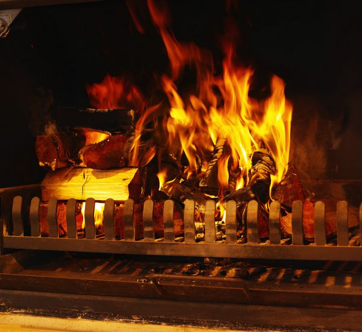

# ＜天权＞诗人和三本书的故事

**窗外的雨还在下，壁炉里的火焰却渐渐熄灭了，房间里开始变得阴冷。诗人靠着火炉，它的头脑中再也没有过去的景象。而窗外和窗内的世界，从来没有这样清晰地，一秒一秒地从他的心头流过，又什么都没有留下。渐渐这条河流从他的耳中流到心中，又完全从心中倾出，流经他的每个骨节，从指间上渗入地板。他发觉，原来连这座房子和整个香樟街都是建造在一条巨大的河流上。他随着河水起起伏伏，渐渐不再感到身体的衰老沉重。**  

# 诗人和三本书的故事

## 文/黄晓丹

 

诗人已经很老了。全身的骨头都在痛。这一生他写了太多的诗，现在写不动了。他曾经与阿根廷国家图书馆馆长通信，因此知道全世界巫婆的地址，最近的一个恰巧离他只有三个街角。他最后一次整理了藏书、给小猫薇安的盘子里添上清水，将自己的手稿塞进手提箱里，去香樟街十七号找巫婆。

关上门的一刹那，他想起已经在这间房子里住了二十年，大部分时候只有他一个人，有时也会有酒吧里认识的姑娘，一年有那么三四次。小猫薇安是三年前的一个雨夜里来的，在此之前，他已经有五六年没能和谁安静地坐在房间里，聊聊天，或什么都不说，不需要调情、不需要上床。小猫薇安是他最好的朋友，在他的一生中，也只有两三个人能和这只猫一样重要。

薇安和这些人从未生活在同一个时间里，能否互相取代，他不知道。

香樟街十七号是一栋出租公寓。二十年前诗人初到此处，寻找住宅时，曾经来过这里，也与管理员打过交道，但并没注意到她还兼任巫婆。毕竟当时诗人还算年轻，还相信诗歌的魔力。

二十年的时间，对公寓管理员来说，并不比午睡长多少，却足以摧毁一个诗人。因此当诗人坐在管理员对面的沙发里开始倾诉时，看起来就像在对一帧二十年前的照片说话。他从自己的家乡说起，童年的大雪、江边的雾凇、一路向南的旅程、走过的无边的国土、有星星或没有星星的晚上、阳光在白纸上的投影、写作时铅笔压迫指节的触痛……但他单单没有提到爱情。

他拿出一本墨绿色羊皮纸封皮的书，说：“所有这些，都写在这里了。”

管理员说：“那么，你要我把它烧掉吗？”

诗人点了点头，管理员就将书扔进了壁炉里。炉火跳跃着变成了墨绿色，散发出樟树的香味。香味轻轻缓缓从屋顶落下，钻进诗人的毛衣。炉火熄灭时，他们听到屋外下起了一阵细雨。

“这场雨落在每一条你走过的路上、和你见过的所有星星、阳光和雾凇上，它们给你的记忆，你都还给它们了。”管理员说。

“就像没有发生过一样吗？”

“不。雨后的世界总会变得更绿一些，从来都是这样的。”

诗人拿出第二本书。这本书比第一本薄很多，但是更为精美，用乳白的细麻布装饰封面，书页侧边镀上了金色。就像一朵包裹了阳光的云。

这次他不再对着管理员倾诉，而是翻开书页，轻声地朗读。音节先是羞涩、迟缓，忽而又变得激烈。从激烈的顶端落下一个圆弧，是无比的温柔甜美。他反复地吟唱，像一颗水珠在圆弧的底部来回滚动，直到静寂无声。长久的停顿后，他试探性地轻轻叩问，他的声音越来越高，直到把那个圆弧击破，一颗水珠从缺口处落下，摔碎，消散在房间里。

诗人倒在沙发里，脸色发白，他把这本书紧紧地按在自己的胸口上，直到和他的身体一样热。过了很久，他积聚起所有力气，艰难地把书递给管理员。

“那么，你要我把它烧掉吗？”管理员问。

“是的。”

“你书中所写的那个人，也将在世界的某一个地方变成一缕青烟。”

“让她去吧。”

炉火跳跃着变成了乳白色，房间里弥漫着一股洗衣剂的香味。诗人的眼前出现了乳白色的细麻布睡裙、纯白色的床单、羊毛一样白皙的地毯、冬天夜里窗子上的霜。她的睫毛、肩头、脚踝……在一团雾中向他走来。

当他听到洗衣机工作的嗡嗡声时，公寓管理员抱着一大叠新洗好的床单站在他的面前，洗衣剂的香味正是从那里散发出来的。

“你听，开始下第二场雨了。”她提醒说。

“这场雨会落到她的身上吗？”

“不会。她的灵魂在消散的时候，变成了这场雨。每个淋过这场雨的姑娘，都会变得有点像她，或者是眼睛，或者是手指。”

“但是我再也不会看见了”，诗人喃喃自语，脸色却变得红润起来。他拿出了第三本书。这本书很薄，内页只有两页，封皮却是由娇黄色的丝绸做成的。与其说这是本书，不如说是用丝绸裹起来的一张乐谱。

没有人能读出这张乐谱，因为它是由猫的脚爪印写成的。它本来是诗人写作时垫在手边的一张丝麻纸，薇安来了之后，常常躺在上面睡觉，陪他度过了很多个写作的夜晚。有一次薇安的爪子上有墨水，在丝麻纸上留下几个小脚印，诗人就为每个小脚印编了一首儿歌，唱给薇安听。薇安睡着了，他还在唱。有几次他就这样唱着睡着在书桌上，半夜醒来，看到薇安把两只爪子都枕在他的手臂上，打着呼噜，仿佛全宇宙只有他们两个存在。

诗人轻轻地抚摩着这本书，他觉得他已经获得了平静，他想把这本书再带回去，回到薇安和他共有的那间房子里去，搂着薇安好好地睡一觉。

“你还记得回家的路吗？”公寓管理员织着毛衣，很担心地看着他。

他发现自己不记得了。

“你还能给它写儿歌吗？”

他发现自己已经不是个诗人了。

“那么，你要我把它烧掉吗？”

诗人不知道怎么回答。于是那本书从他的膝盖上滑落下来，掉进了壁炉里。壁炉里立刻燃烧起嫩黄色跳跃的火焰，一股烤栗子的香味散发出来。窗外下起了第三场雨。

“薇安会死去吗？”

“我不知道。但水晶球说所有淋到这场雨的流浪猫都会遇到一个温柔的主人，就像三年前，薇安遇到你一样。”

窗外的雨还在下，壁炉里的火焰却渐渐熄灭了，房间里开始变得阴冷。诗人靠着火炉，它的头脑中再也没有过去的景象。而窗外和窗内的世界，从来没有这样清晰地，一秒一秒地从他的心头流过，又什么都没有留下。渐渐这条河流从他的耳中流到心中，又完全从心中倾出，流经他的每个骨节，从指间上渗入地板。他发觉，原来连这座房子和整个香樟街都是建造在一条巨大的河流上。他随着河水起起伏伏，渐渐不再感到身体的衰老沉重。

他正想告诉管理员这些，却看到管理员所坐的沙发也漂在了水上。她放下织了一半的毛衣，穿上胶鞋，从橱顶上拿下一把黑伞，看起来像要出门的样子。

她说：“时候到了，我送你去栗树街三号，刚才那里新诞生了一个婴儿，我想他会喜欢获得一个诗人的灵魂。”“我们现在出去，也许还会遇到一只猫。毕竟夜里三点是最好的时候”。

 原文链接：http://www.douban.com/note/199627156/  

（采编：佛冉；责编：麦静）

 
