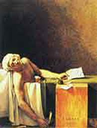
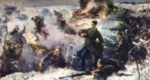

# ＜天权＞谢苗诺夫刑场的冬天

**他忽然感到一种从未有过的力量在他的全身迸发而出，越亲近大地越感到轻松越脱离大地越感到沉重，生命中的轻与重就在于大地与天空的关系上，上帝与魔鬼的战场就在于人的心中。他懂了，他所要做的就是亲近这片大地为这片大地上的冤魂呐喊，用自己的笔去描绘黑暗，悠长的俄罗斯之夜，为了爱与被爱，为了被侮辱与被损害的人们，他决意要站起来，像耶稣一样，像堂吉诃德一样去战斗。**

### 

### 

# 谢苗诺夫刑场的冬天

### 

## 文/ 顾雪泰（山东大学）

### 

### 

起来吧 焕发出你的光芒 耶路撒冷 ————————《圣经》 俄罗斯的冬夜，漫长而残忍。 天空中的冷气与大地上的酷寒煎熬着这片土地上的每一种生物，猎狗在寒风中瑟瑟发抖。被侮辱与被损害的呻吟似乎化为了一道道阴沉的烈风挟裹着冰冷的雪棱，从最东边的符拉迪沃斯托克划向最西方的圣彼得堡。被虚无主义困扰着的灵魂伴随着西伯利亚的酷寒从最北面的摩尔曼斯克刺向黑海沿岸的索契。 冬夜，看不到一丝曙光，没有黎明的预兆。他正在梦中，梦里他穿过拉斯科尼尼科夫曾睡过的“棺材”，昏黄的月光中，看到一把锋利的斧头缓缓地劈了下来，他站在不远处发出了一声叹息，这叹息像是从地狱中传来的一声冷笑，也像是从天国中传来的一阵悲哀。他继续向前走着，不知不觉中似乎来到了卡拉马佐夫的庄园，炫目的阳光下，看到庄园中一个臃肿的身体正在一个妖娆的胴体上无耻的发泄着自己的淫欲，他站在窗外羞耻的闭上了清澈的双眼，他知道，这个庄园不久将变成群魔的狂欢之处，将变成墨菲斯特与撒旦的魔窟。他走着走着，不知走了多远，不知走了多久，一阵叮咚的响声从他的耳畔响起，一群哥萨克式的吆喝使他感到整耳欲聋，他睁开迷离的双眼，在恍惚之中看到了一群鬼魅的影子在煤油灯下闪耀着，显示出各种荒诞可怖的姿态，一股他无所左右的力量将他从布满了血与油污的地上拉起，门，吱吱呀呀的怪叫，风，嘎嘎作响，一辆活的坟墓正在等着他。 车上，他带着沉重的镣铐，面目苍白，默默无语，望着远方。成群的松叶林挂满了肮脏的积雪，几片破瓦房似乎还承载着无数流浪汉们心中那个梦寐以求的家。嘎啦啦，囚笼被打开了，他像是狗一样被粗大的皮鞭驱赶下了活的坟墓，因为他知道真正的坟墓就在不远的前方。还在昏睡的世界偷偷地给了他一瞥，然后继续昏睡下去,灰蒙蒙刑场笼罩在一片惨淡的雾气之中，他望着远方的天空，布满了血丝的眼睛看到了金光灿烂的教堂圆顶，这圆顶不再闪耀着基督的荣光，不再宣读着《圣经》的条文，不再宣扬着众生平等与自由博爱。这圆顶，闪耀的只是冬宫的威严与圣三一教堂的暴政，闪耀的只是地主们的奸诈与官僚们的无耻。他垂下了高贵的头颅，不再望着昏暗的天空，只愿意看着这备受侮辱的大地。 一件白色的死衣挂上了他的双肩，一条白色的长布蒙住了他的双眼，他贪婪的向外望去，他知道这将会是他对这个世界的最后一眼，灰色的一个小小的角落依附在白色的长布上，一瞬间，倏忽不见。 

 十步之外，是生与死的界限，十步之间，是地狱与人间的鸿沟，一群哥萨克士兵早在对面排成队列，黑黝黝的枪口洞开，套在枪口上的皮套早已被放在一旁，哥萨克士兵们腿上枪膛，装上子弹。身旁的鼓点想要将空气击碎，想要将他，陀思妥耶夫斯基，这位俄罗斯的良心彻底的从世界上抹去，这阵鼓点的声响像是匈奴王阿提拉的长鞭跨越千年。 一阵马蹄的喧嚣，一声急促的喧闹，一个狂迷的呼喊：“住手，沙皇圣意，慈悲为怀，从轻发落，改判流放”，鼓点沉寂，万物沉寂，大地沉寂，枪身卸下了子弹，枪口不情愿的被套上了皮套，士兵面无表情的走下刑场，没有一声万岁，没有一声呐喊。但是十步之外的他感到血液重新流动，血液从白变红，眼光从迷离再次变得清澈，他的心中泛起了无数声乌拉的喊叫，乌拉，乌拉，上帝乌拉。死神悄然的离开了谢苗诺夫不曾带走一个魂灵，他眼前的昏暗与惨淡重新蒙上了一层光辉，这光辉既不来自于奥林匹斯山，也不来自于基督天国，而来自于人间。人间的爱，理智与情感使得光辉重新扑在了这片大地上。他倾听着，一阵似有似无的歌声似乎从教堂的圆顶上传了过来，是亨德尔的么？是巴赫的么？是雅那切克的么？歌声渐渐的传来，仿佛上帝的曙光再次普照在了教堂的圆顶上，这歌声来自九霄之外，欢乐的曲调配合着光的洪流浸润了陀思妥耶夫斯基的心田。歌声越发的靠近，一种不祥的预感在他的心中莫名的膨胀，似乎这貌似美妙的歌声中还含有这一丝耐人寻味，他耸了耸双耳想要去捕捉这幻灭的歌，渐渐地，他发现一点端倪。 

 “不对，这歌声怎么混杂了阵阵的哭声，不对，这歌声怎么夹杂了悲惨的呼喊，我的耳朵是怎么了，噢，不，我的听觉，我的视觉怎么陷入了彼得堡，莫斯科，叶卡捷琳堡的贫民窟中，这歌声分明是马尔梅拉多夫撞死在路上的惨叫，这歌声分明是索尼娅在床上备受着一群又一群嫖客时无助的呼喊，这歌声，这歌声分明就是拉斯可可尼科夫的母亲与妹妹无助的绝望。”他的心翻涌着，一团团的雾霭滚滚升起有忽而降下，教堂的圆顶上的金辉再一次蒙上了血腥的气味，在他的身边仿佛有无数的呻吟冲破云霄直抵上苍，越过大地，疾呼苍天，他听到的是弱小而无助的哭泣，他听到的是自嘲自叹的妓女们的惨叫，他听到的是从来没有过笑容的孤独者的独白，他听到的是孩子们的哽咽，抽泣与皮鞭一次又一次嚣张的挥舞的动静。 一切被侮辱的，被欺凌的，被忽视的，被麻木的受苦难者们的声音，那些为了生存意志，为了真理，为了平等自由博爱的殉难者临终的遗嘱，在他的耳边高亢的回旋着，飞舞着，跳耀着，奔腾着。欢乐飞向了上苍，苦难降临了大地,他的双腿失去了知觉倒在了大地上。他忽然感到一种从未有过的力量在他的全身迸发而出，越亲近大地越感到轻松越脱离大地越感到沉重，生命中的轻与重就在于大地与天空的关系上，上帝与魔鬼的战场就在于人的心中。他懂了，他所要做的就是亲近这片大地为这片大地上的冤魂呐喊，用自己的笔去描绘黑暗，悠长的俄罗斯之夜，为了爱与被爱，为了被侮辱与被损害的人们，他决意要站起来，像耶稣一样，像堂吉诃德一样去战斗。 士兵将他粗暴的拉起，他的双手被拉开，就像是千年以前的耶稣，在同死神痛苦地一吻之后又不得不为受难去爱生活。他站了起来，弹走身上的尘埃，望着天空，黄色的嘴角不自然的向外咧开，浮现出卡拉马佐夫式的笑容。 

### 

### 

（采编自投稿邮箱 责编：陈锴）

### 

### 
