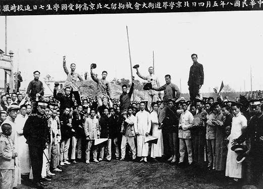
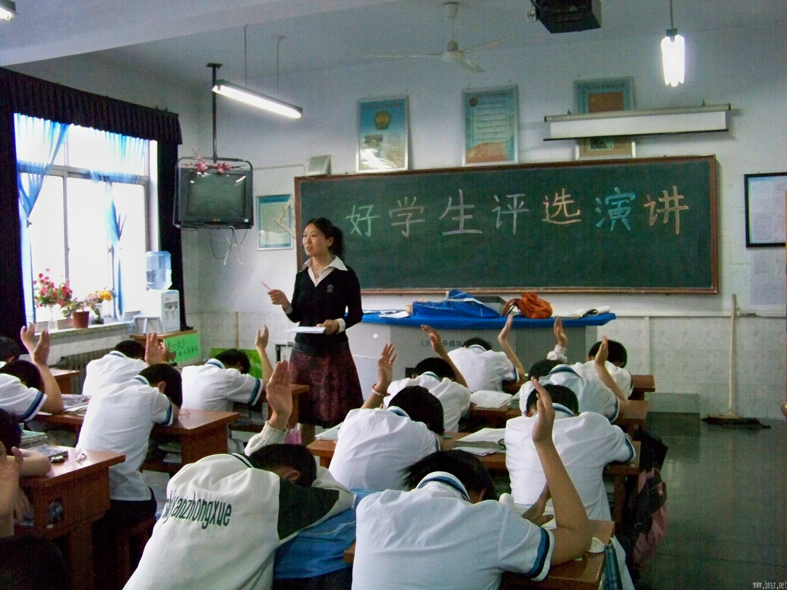

# ＜天权＞象牙塔中的三角地

**我们别无选择，我们只能在寝室呆着，而不能出去玩耍，因为可能随时会有生命的危险。我们唯一能做的就是在键盘的敲击声和鼠标的点击声中混到大学毕业，网上拼凑一下论文，拿着毕业证穿上一元钱租一小时的学士服找个照片后走掉，得到身后的一片赞美之声，身后声声好学生的美誉。这就是我们唯一能做的。**  ** **  

# 象牙塔中的三角地

## 文 / 卞海鹏（北斗撰稿人）

 

孟子说：“所谓故国者，非谓有乔木之谓也，有世臣之谓也。”我现在可以仿照说：“所谓大学者，非谓有大楼之谓也，有大师之谓也。

——梅贻琦于1931年12月4日就职清华大学校长演说

 现在的学生中，知道梅贻琦先生的人，不多了。是因为1949年他去了台湾还是因为重重的学术钳制皆不得而知。梅贻琦先生去台湾后，筹建了台湾新竹的清华大学，仍旧利用的是美国的庚子赔款。那个用美国的庚子赔款建立起了的清华预备专科学校现在到底去了何方？斯人已去，空留下几纸文字，以供后人瞻仰。 庠序之教早已是水中花，国子监早已是水中月，只能杯酒释怀，感伤凭吊。京师大学堂也已经搬了几次地方，水木清华更是海峡两岸一边一个。 五四的热血岁月，早已不知道被什么吹散到了哪个角落里，只留下了历史课本中的半页纸；红色年代的百花齐放，更仅仅是一个政治策略而已，被折腾的知识分子一个个的躲在自己的一亩三分地，不再出声，勉强有口气用来喘息，证明是一个有血有肉的生命。二十几年前的狂热，却以至今不能明说的原因命令坦克车的轰鸣声充满了北京的大街小巷。 

 记得那年奥运圣火在我现在所在的城市传递。人人都想瞻仰一下圣火的热烈，为中华民族百年奥运梦想的实现而感到自豪。圣火传递那天，学校的大街小巷，大门小门，阳门阴窟被层层的老师把关，大有一夫当关，万夫莫开之势。唯一的以“合法”出校的是学校的学生官僚阶级，我们这些草民微末，也就只能是听听阵势，看看新闻的份。好在方法总是有的，世界时本没有路，走的人多了也就有了路。我沿着校园在图书馆后院留在墙上的脚印爬了出去，也体验了一把奥运圣火传递。 老师说过，当年他读大学的时候，同学中谈论的是什么康德，休谟，李泽厚，平常交谈闲聊的言语中充满了本体论，二元论，这样的哲学词语。现在图书馆中的哲学书籍总已落上了一层厚厚的灰尘，不知何人拿起，灰尘迷了眼睛，看不清书上的字。 当代大学生中最多的是“麻派”和“托派”。在哗哗的麻将桌上练就优雅的太极，在一个个字母文中练就出国的硬翅膀。北京大学的言论三角地，现在早已贴满了英语的四级托福雅思培训的海报，一层层的上下摞着。 大学高层的说法总是对的，适应社会的发展。社会的发展就不需要五四了吗？社会进步就不需要学生畅谈时事了吗？ 在他们的思想里，大学只需设施时尚，只需政治课打个到，只需就业率的大大数字。 在他们的思想里，时过境迁后大学生依然只会打条幅，只会闹事，只会静坐，只会绝食。 三角地这些年，你寂寞吗？你冷清吗？你对于身体漂浮着千篇一律的培训厌倦吗？ 可能你也厌倦了吧。可能你也习惯了，我们要与时俱进哪。 其实我也多多少少习惯了。 学校已经没人谈论李泽厚了，大家都在想怎么样一夜成为李泽楷。 学校是一个学习的地方，是精神的神殿，是文化的集散地，是一个社会发展的灯塔，是一个国家科技进步的风向标。 但是时过境迁，物是人非。当今的我们一边在网络上声嘶力竭的要求言论自由，一边却被一个小小的为人民服务的人压的集体噤声。 真相终归是最好的证明，事实是做好的法官。一方面，我们从小高唱我在马路边，捡到一分钱，学习雷锋好榜样，学习历史铮臣的大公无私，面刺君主，天天宣誓诚实守信，遵守法律，做一个对社会有用的人，为构建社会主义贡献自己的一份力量，另一方面，学校却在有重要事情发生时，以关闭网络、大上政治课、封锁学校、保研保博、甚至谈话恐吓来要求指导教育我们为社会作出自己的贡献，发挥自己的光和热。在学术面前，在巍巍庠序面前，学校之道德何在，学校之教育责任何在？ 人在屋檐下，怎能不低头，这是大学教授给我们的。你们教育我们这样，学校教育我们就是应该在事实面前逃避，在正义面前息事宁人集体噤声而不顾及什么做人的原则，什么是人之为人的最基本。 

 我们早已忘了，因为学校要求我们集体噤声，我们都是听话的好孩子，我们不会静坐，不会绝食，更不会呐喊，我们只会等待那些枯燥无味的老师的上课，我们只会在要求必须参加的种种无聊活动中频频热烈鼓掌。我们只会在某某政府领导人的市政纲领中大唱红歌。 我们别无选择，我们只能在寝室呆着，而不能出去玩耍，因为可能随时会有生命的危险。我们唯一能做的就是在键盘的敲击声和鼠标的点击声中混到大学毕业，网上拼凑一下论文，拿着毕业证穿上一元钱租一小时的学士服找个照片后走掉，得到身后的一片赞美之声，身后声声好学生的美誉。这就是我们唯一能做的。 全国的大学，到处建筑声声悦耳，校园掌声雷动。讲师剽窃论文偷成了优秀教授，教授性侵犯女学生侵犯成了著名大师，一个小小的芝麻官就敢骑在大学的头上肆意玩耍拉屎！大学颜面何存？ 大学是在考虑他的声誉，难道一声不吭，秩序良好就能带来好的声誉？难道校园中那些堂而皇之的建筑，能够跻身于世界大学前三甲？难道那些随意拼合剽窃的学术成果就能为中国争得一个真正意义名正言顺的诺贝尔奖？   

(采编：管思聪 责编：管思聪)

 
