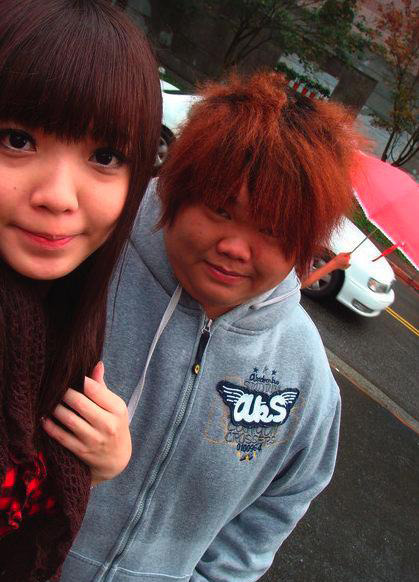
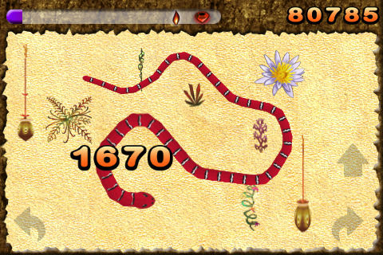

# ＜天权＞跳蛋！跳蛋！

**我害怕的是那条寂寞的长蛇，这条长蛇有几百米长，往往在我最开心的时候，爬到了我的脚边，让我不寒而栗。想要逃走，却发现就像在梦里，既喊不出来，又动不了脚。一位英雄有时候会赶过来，把那蛇一脚踢开。我又能动了。仔细看那英雄，名字叫做色情。 ** ** 跳蛋，跳蛋！ **  

# 跳蛋！跳蛋！

## 文 / 宁（天津科大）

  人渣宁的称号可不是浪得虚名。谁给起的现在已经淡忘，只是无端觉得亲切。人渣是人类的渣滓。我喜欢人类这样宏伟的大概念，也迷恋渣滓这样细致的小概念，“人渣”就是个剧烈的矛盾结合体，配上宁，显得生动有趣。 我一直在寻求一种高雅的恶趣味。本人品性恶劣却不低劣。这表现在能忍受种种屈辱，并以看别人轻视或恶意的眼光为乐。比如这款诺基亚7360经典款，不少人劝我赶紧扔了换新的。按他们的话说，“人都跑了你还留恋个毛。”而我并不介意，因为尽管旧且破，这手机还能用。打电话发短信，于我足矣！前女友分手纪念品什么的我倒无所谓。但随着天津越来越热，春季衣服一件件褪去，某天猛然发现身上从衣服到裤子到鞋居然又全换上她送的。于是我明白，这是夏天，已经到了带上女人游山玩水的时候了。 

 刚好前主管打过电话，祝我儿童节快乐。 “过得怎么样啊，小朋友？” “借您吉言，挺好，就是想您想得厉害。” “哟，嘴还挺甜的，看来长大了！” “本来想叫您一声阿姨，但是考虑到那会严重伤害您脆弱的感情让您难受一阵子，话到嘴边又咽下去了。” 她说：“那什么嘴里吐不出什么。” 接下来，便受邀安排了十一去南京游玩。综合起来就是八字真言：管吃管住，还管娱乐。末了，她问我毕业问题。我长叹一声。 还是没毕业。人家要叫我老毕了。打学校回来的路上，突然想请我的论文导师吃顿饭，毕竟他是唯一和我讨论过学术的人。第二天天津风雨大作，电闪雷鸣，什么盆儿啊钵啊什么的一起响起来。十分钟后雨过天晴，天津出现了百年难遇的蓝天白云，还有晚霞。晚霞中，老师吊儿郎当地淫笑着就过来了。 “恭迎老师吴讳晓龙光临敝店，小店蓬荜生辉，不胜荣幸，诚惶诚恐，之乎者也！” “这又不是你的店。不过大老远让你请客倒挺不好意思的。” “老师言重了！” 酒过三巡菜过五味，我们聊起了大学里的百出的丑态。我说：“那群老师整天呆在办公室里做些苟且之事，去办个补考吧，官腔说得酸倒牙。他们如果到了社会上会不会学乖点，被人家笑掉大牙倒是小事，没有任何生存能力，老板都会笑话他们人事儿不干。” 坐在对面的老师陷入了沉默。我只得停下。实际上我真正害怕的还是乌七八糟的老师会把本来摇摇欲坠的高等教育搞垮，自己还悠然自得，浑然不知。他们从大学毕业到留校到现在，也只是不断为社会培养渣滓，输送渣滓。我更害怕他们到死都不明白他们自己本身就是残渣，不学无数的残渣，勾心斗角的残渣，对人类没有任何贡献的残渣。我真的害怕他们永远不知道。 酒足饭饱，外面很凉爽。路上，我跟老师滔滔不绝地讲我爱天津。“我爱天津，尤其爱天津的夜晚。很干净，很迷人。华灯初上的那一瞬间简直如美女脱衣，一下子就露出了五彩斑斓的情趣内裤。尽管我没穿过，压根儿就没碰过情趣内裤，不过我觉得即使那么美。而最美的要数天津站旁的海河岸边。这华丽的景象往往使我的精神达到高潮。不过肉体上我更想念孙思奇，就是我的天津同学。如果能在津河夜景之下尽情做爱野合，死而无憾。”老师也醉醺醺的，不知道在想些什么，不过听得挺尽兴。我们走到了亚洲第一高楼楼底下。那大厦叫做“津塔”，远远看去像是一只高耸入云的粗糙老玉米。倘若要看到塔顶，脖子和腰要向后弯成一个不可思议的角度。 津塔底下刚好有我一个学生。最近带的学生挺多，挣钱也不少，能够糊口，外加买一辆夏利。夏利和法拉利只有一字之差，所以差不多。在某个学生家里，我为小男孩做了一个以泡沫为主板的灯泡电扇串联电路，又用铁夹和别针做了一个开关，把孩子喜欢得上蹿下跳。他母亲还抱怨晚上一直没睡觉，玩到没电为止。殊不知，我暗地里用剩下的东西做了一枚跳蛋。正版海宝小风扇，小铁珠外加双面胶。“海蓝色尽显奢华，海宝形象清新可爱，震动性极佳，品位更是一流。”若用在女人娇柔的，嫩得出水的阴蒂上，一定对爱情有妙不可言之功效（前提是翻开阴蒂包皮）。 正在我准备思考处女的阴蒂和处女的嘴唇哪个更适合“红艳水润如一颗樱桃”这样的比喻时，两个声音在我脑海中回响了。 

 一个是正义的道德卫士的声音，他告诫我别在这条淫靡的道路上越走越远，要想一些正事，比如快点完成《时间机器》，给祖国和人民一个交代。还劝我乖乖地把硬盘上那一百多部交给他保管。另一个声音是引人堕落的恶魔，他让我不要停，继续写下去，还得写出更露骨更引人入胜的文章，扰乱社会的贞操观加剧社会动荡，别向这个操蛋的世界投降。“没有特点的人生，不如去死。”他这样说。很可惜同时还劝我乖乖地把硬盘上那一百多部交出来，让他去传播。“我这是为了你好！” 我不会听任何人的。写下去就写下去。因为我是人渣宁，性开放的先驱，鼓吹贞操无用论，同时也在为破除自己的处男之身而不懈奋斗着。 如何把这美丽的跳蛋送出去呢？总不能一见到自己心仪的女生就急不可耐地脱下裤子掏出鸡巴然后口口声声说“我爱你”吧，还猴急猴急地要插进去？必须得下一点功夫。白天领她去逛街，买好多衣服，在夕阳中坐摩天轮说点山盟海誓，晚餐要去高档西餐厅，点鹅肝酱焗牛肉，甜点得是帕玛奶酪冰激凌，然后一起进旅馆，吃一两只芒果，批判一下浮躁的社会风气，或者近现代中国的文人骚客。说到动情处不禁吻她一下，半推半就之间就除去了她的所有衣服，包括内裤。然后从口袋里掏出卡通海宝跳蛋，说“我亲手为你做了这个，亲爱的，试试看吧！”女孩开始反抗，说这么粗，插进去会撕裂的啊。后来终于还是湿了，在剧烈的海宝剧烈震动中，女孩儿达到了高潮，就可以收起来离开了。 走在大街上，白腿越来越多。姑娘们脱了丝袜，自信满满地行走，博得男人的眼光。我喜欢看美腿的姑娘脱丝袜，也喜欢看美腿的姑娘手淫，甚至喜欢看美腿的姑娘撒尿。总之姑娘干什么都好，只要是美腿的。短裤短裙也在忘我地把男人的眼光往上拉，再往上拉，让男人们幻想里面有没有穿丁字裤？或者是纯白的棉内裤？或者里面塞着一只粉蓝色的跳蛋？闪闪发光？而遥控器就在她们的包包里？可惜了，我可不是那种爱幻想的色狼。我什么都联想不到，我只在乎她们聪明与否。如果美腿美女是一个笨蛋，我宁愿去看另外一个，或者去吃饭。 不过我还记得以前那个漂亮的六岁姑娘，聪明极了。那天我俩在河边散步，我拉着她的手，问她喜欢童话不。她说喜欢。我猛地拉了一下手，喊道，快看，那座魔幻黑暗城堡！她盯着我的眼睛，甜甜地笑，长睫毛一动不动，又垂了下去。突然她拉了一下我的手，问，那是什么？我说，那是跨越了魔幻黑暗护城河的魔幻黑暗桥！“那个呢？”“那是魔幻黑暗大魔王的手下，邪恶的魔幻黑暗塔吊！”“那个呢？”我一看她，她忽闪着大眼睛等我回答呢。“额，那是魔幻黑暗UBC咖啡馆，魔幻黑暗大魔王晚上七点准时在这里品尝黑暗料理。”我俩笑得都不行了。 

 孩子最害怕的是缺少爱。我记得小时候家里穷，没有什么玩具，我很少有高兴的时候。一天妈妈问我想不想玩，我说不想，不过她还是出去给我买了一张贴纸，里面小蜜蜂的形象我现在还能记得。我不高兴，因为图画不好看，像小女孩玩的。但是妈妈还是自己一个人高兴地玩着，还贴得到处都是，最后我也忍不住了，一起往下撕，那天非常高兴。 我多么希望自己能写出以上的文字，或者一直写这样的文字，直到我为生活忙碌的母亲知道我有多么爱她！ 我也希望自己活在大革命时期的法国，那时的穷人也过着帝王般的生活，那时的处女还是很金贵的。那时候，我也可以这么说“对不起，今天不开门，维克多雨果大人出新书了，我得去书店排队，再从书商手里买旧货的话，我就抬不起头了。” 几个月后，当我向那个小姑娘道别的时候，她刚要进教室上课。站在门口，我静静看着她，千言万语居然一句话都说不出来，只是一直念叨着，马上就要走了啊，不多看我几眼么？突然她走过来拉住我的手，问我，“polo，你还记得以前说的魔幻黑暗城堡吗？”我说，记得呀！以后想玩就来我办公室，叔叔阿姨都给你讲故事。于是她就回教室，还跟小朋友讲那次黑暗魔幻之旅。 你应该知道，外地人在天津这样的大城市往往迷路。迷路的时候，就会被蛇缠住。霓虹闪烁的夜晚，那些蛇就倾巢出动，慢慢滋生出来困住你的心脏，让你感觉喘不过气来。有时候那是一条巨大的森蚺，巨大的压迫力使你丧失斗志，有时候那是一条金蟒，引诱你走向金钱的坟墓，有时候那是一条五彩斑斓的毒蛇，钻进你的大脑，劝说你去尝一尝那刺激的东西。有时候最不起眼的灰蛇出现了，告诉你，可以自杀了。 

 这些我都不怕。我害怕的是那条寂寞的长蛇，这条长蛇有几百米长，往往在我最开心的时候，爬到了我的脚边，让我不寒而栗。想要逃走，却发现就像在梦里，既喊不出来，又动不了脚。一位英雄有时候会赶过来，把那蛇一脚踢开。我又能动了。仔细看那英雄，名字叫做色情。 该结束了。观世音大师曾经这样说过： 我若向刀山，刀山自摧折。 我若向火汤，火汤自枯竭。 我若向地狱，地狱自消灭。 我若向恶鬼，饿鬼自饱满。 我若向修罗，恶心自调伏。 我若向畜生，自得大智慧。 我曾赞叹观音的自信力，但我不敢去做。恐怕如果我向了刀山，会被剐得体无完肤，我若向了火汤，会化成脓水一滩，我若向了畜生，会变得像它们一样愚笨。所以还是享受属于自己的挫折，不骄不躁地前进下去罢。  

（采编/责编：黄理罡）

 
