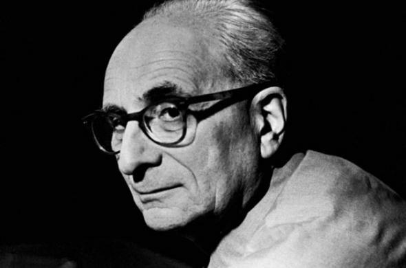

# ＜天权＞那些自恋狂做不到的事

**列维·斯特劳斯的叙述始终不紧不慢气定神闲，“用一种无所畏惧的语调，用一种遇到任何情况、哪怕天塌下来也不改变的冷静态度”。即使经历了战乱、反犹、1968年欧洲学潮等大灾难，大变故，他仍对世界保持孩童般的惊奇感，而叙述时的冷静，恰恰是以此为依托的：只有习惯于细微处发现世界的人，才不会对所谓反常与大事件，显露出一惊一乍的夸张。** 

#  那些自恋狂做不到的事

## 文/ 苏格猫底小姐（北京大学）

 

这些粗糙的文字是给三船水老师的，是他第一次把文化人类学介绍给我，为此我感激不尽。以下纯属小女子浅薄见识，让老师见笑了。

“我不会服侍我不相信的东西，不管那是我的家、我的祖国或我的教会；我要尽可能自由地、完整地以某种生命或艺术的模式来表达我自己，用我容许自己使用的仅有的武器——沉默、放逐、隐瞒——来自我防卫。”

——乔伊斯《一个青年艺术家的肖像》

现代人类学的奠基人博亚斯(Franz Boas)是一次在午餐会上倒在列维·斯特劳斯(Claude Levi-Strauss)的怀抱里死去的，他临死前最后一句话是“我有了关于亲属关系的新理论……”当然，没有人知道他的新理论究竟是什么，因为他话音未落就停止了心跳。知识分子里着实很难找出一个像列维那么高寿的，他虽然经历了两次战争，目睹了这个世界上种种腐败和丑陋，但他并不怨恨，也不诅咒。“那是因为他看懂这个世界了。”（三船水老师言）人们说如果你想学人类学，就要读《忧郁的热带》，如果你想放弃了，就要再读《忧郁的热带》，因为列维优雅深邃，温情幽默的文字能够打动你，鼓励你。曾一度觉得他是最平易近人的哲学家：既会一本正经讲长篇大论，又会古灵精怪说八卦逸事。开篇第一句话，他便使了一招欲擒故纵，他说“我讨厌旅行，最恨探险家”。

像所有可以被称为知识分子的人一样，列维绝望。他没有写过一句乐观的句子，他从不赞美上帝，从不褒奖人类。在《一小杯朗姆酒里》里他说人类学其实可以改叫熵类学。熵（entropy）指的是混乱的程度，言下之意是研究人类的学问无异于研究混乱（混乱的定义为“最高层次的解体”）的学问。人类世界诞生于混乱，在混乱中运行，最终将毁灭于混乱。“每一处景观初看之下都只是一片混乱，一个人可以自由选择赋予它任何自己想要的意义。”

列维和他的同辈加缪很像：他们的文字是冷漠甚至冷酷的，但看似冰冷的文字下面却涌动着一股狂热的力量，在内心深处积聚着对人类苦难至诚的同情，他们都不约而同地极力压抑这种同情。加缪把人类的生存处境贬低到猪狗不如的地步：荒谬。他嘲笑人们对正义、公正和幸福的追求不过是一场自说自话的闹剧，为此，他和完美主义者萨特闹翻了（巧了，列维和萨特也是势不两立的）。

但在加缪老了以后，他内心积郁已久的同情终于爆发出来，阿尔及利亚内战时，他积极投身到和平运动当中，用自己荒谬的行为，来纠正这个世界的荒谬。西西弗日复一日把注定要滚落下山的石头推上山顶的行为固然荒谬犯傻，但他心甘情愿犯傻，这就是快乐。

做一个知识分子的痛苦不易理解。他们有安提戈涅情结，把对这个世界的理想上升为做人的原则。可是，理想不及物，它没有精确的方向。如果它是改造世界的利器，它所指的方向却是理想主义者本身。而只有真正的知识分子，才会明知前面路途的艰险而毅然前往。为了踏上虚幻的福地，逐一死于大地的荒凉。只有真正的知识分子才做得到这一点：存在，就是为了让这个孱弱的世界不安、就是要鄙视不断诱奸人的思想的国家体制。对这个腐朽的世界表示永久性的蔑视。他们因绝望而书写，却因书写而愈加绝望。但是他们内心里对世界的热爱与他们绝望同样不可摧毁。否则，加缪怎么会冒死参加抵抗运动？

一般能称得上大师的人，都有些共同的奥秘，其中一个很重要的是对细节的关注，他们能捕捉各种被泛泛之辈忽略的琐碎现象。且看列维所认为的奇迹——是“在一个隐蔽的缝隙的两边，并生出两种不同种属的绿色植物，靠得非常近，而它们各自选择了最适合自己的土壤”，“在岩石上发现两个菊石的遗迹，看到它们微妙的不对称的纹理，这些纹理证明了这两块菊石之间存在几万年的时间差距，在这个时刻，时间与空间合为一体”。这是对于我们生活的世界最本真的关注。正是这些真实纯粹的细节，显示出写作者内心深处对世界的希望。

列维·斯特劳斯的叙述始终不紧不慢气定神闲，“用一种无所畏惧的语调，用一种遇到任何情况、哪怕天塌下来也不改变的冷静态度”。即使经历了战乱、反犹、1968年欧洲学潮等大灾难，大变故，他仍对世界保持孩童般的惊奇感，而叙述时的冷静，恰恰是以此为依托的：只有习惯于细微处发现世界的人，才不会对所谓反常与大事件，显露出一惊一乍的夸张。

人类学不是猎奇——尽管它的研究对象是异文化。需知“异文化”不等于“异常文化”。人类学家在一个社区中所要观察的往往是那些甚至被当地人所忽略的现象，而恰恰是这些现象，呈现了一个地方社会生活的真实面貌。而那些看来不同寻常的事，虽然很容易引起注意，但未必是当地人生活中最重要的部分。要把握无甚特别的细节，没有极度真诚谦卑的态度，没有冷静犀利的眼光，是做不到的。急功近利从来不可能孕育真正的知识，因此没有甘于清贫，宁静致远的淡泊之心，亦不会成大才。结庐在人境，而无车马喧。不争一年得失，但看十年功过。这，只有真学者，真知识分子才能做到。而一个真学者，必须相信他所做的工作。那些为争功名，把知识当权力而去著书立说的人是做不到的。那些贫瘠到说着自己也不相信的话却还骄傲地以为拥有着什么的人，则更不必去考虑了。

如果从纯粹学术的层面来看，列维·斯特劳斯的理论有很多值得商榷的地方，但，又有谁的理论不是呢？毕竟，语词有限，而人类的生活世界是无尽的，且时刻在改变着。再怎样完善的理论，也不可能呈现这个世界的所有方面，而只能择其一面加以凝固。一种理论只能是一种解释世界的方式，作为对人类生活世界的重构，它到达不了生活本身那块幽秘深远的最后禁地。

 

（采编：陈锴；责编：陈锴）

 
