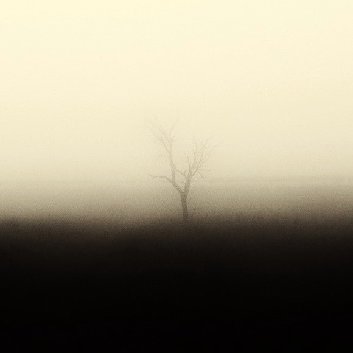
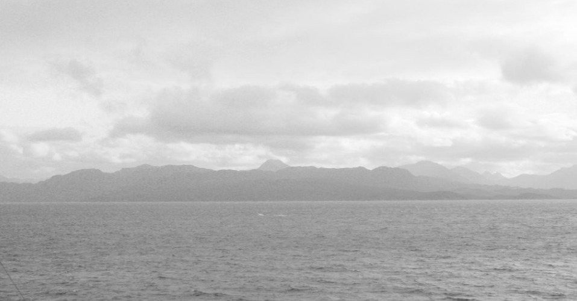
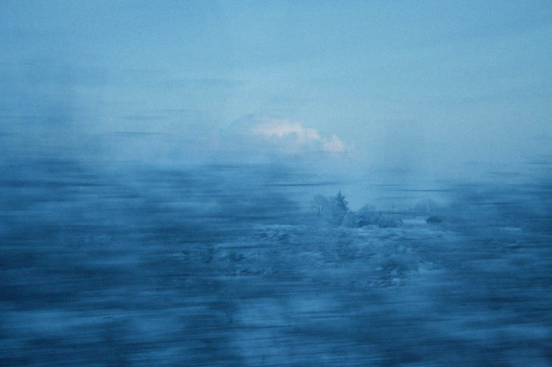
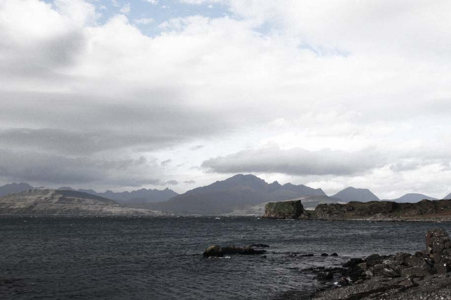

# ＜天权＞里面

**大地伸展双臂，一下紧抱怀中的海。海吓了一跳，颤抖了一下。这一下引发了海啸。海啸冲上大地，带走了一切。树。动物。还有人。大地之上，顷刻间荒芜了。**  

# 里面

## 文/林大师（Acadia University）

 

大地在很小的时候就失去了母亲。那时候世界什么都没有。大地在孤独中度过了童年。在不同密度的岩石摩擦的时候，他疼痛的哀嚎没有人听到。那些喀斯特地貌开始形成的时候，他恨不得把内脏都掏出来扔到天上。但是他什么都不能做。大地如此深沉。疼痛是他唯一的朋友。黑暗中的日子里，大地撕开自己的身体。渴望那些疼痛的体液离开自己。尽管很多体液滋出来，第二天大地的疼痛依旧。那时候，直到他懂事的那一天，他才第一次把那个在他心里填充一切空间的那个想法说出来。他说，他希望死掉。

那时的世界，无有万物。

听到了他话的，只有熔。

熔生在大地的肚子里。但熔不爱他。熔的世界一片黑暗。他用尽自己的呐喊，燃尽自己的泪水。最后终于在黑暗中发现了火。那天，黑暗第一次亮了。熔第一次看到这个世界。没有任何的美好。这里单调，沉闷，压抑，熔开始感到绝望。于是他再一次掏出火焰。火焰跳跃，燃烧，带给熔快感。火焰本身就是熔的一部分，但同时也有自己的意识。火焰不会说话。 但他什么都明白。火焰看出了熔的绝望，便一边在他身上燃烧，安慰他，一边默默地开始刨开周围的岩石。火让岩石迸裂，溶化，然后它们会成为熔新的身体。火溺爱着他的主人。在大地的体内，冰冷的岩石开始了迸裂。

海。

从光明中来。

她的心是蓝色的。

海没有身体。她的整个心都在那里。她没有身体。

海。她的世界充满了自由。她迅速地移动。眼睛看着自己。眼睛看着天。她经常哭泣。那是快乐的哭。她太幸福了。流出的泪水又融入她的身体。她喜欢太阳。在太阳下，海慵懒地翻滚。胸膛汇入腰身。乳房变成肩膀。她想伸出手看看自己。但每次都失败。她抬起手，手就流下来，汇入她的眼。她抬起腿，腿就流下去，变成屁股。她快乐，美丽，却也孤独。海遨游了世界的南北，却只发现了冰。变成冰就失去了自由。海赶紧游回来。

她开始向东方探索。

直到她发现了大地。

大地，像他的名字一样。此时已经很大了。他每天都在忙碌。那些令人厌恶的剧痛已经随着年龄的增长慢慢减退。此时，他正在自己的皮肤上忙碌，从其他地方搬运巨石和泥土到平原上，创造山脉。他巨硕的双手插入泥土，创造盆地。海从远远的地方看见他。便停在了那里。在海面前，在她的心里，出现了一座小岛。岛上是她从没见过的泥土。泥土上还有精致的树林。海从没见过这些。她没见过任何有形的东西。她被这岛屿的精致震撼了。她喜欢地哭出来。泪水涌向岛屿，就成了浪。

海望着远处正在移动山脉的大地。海又注视着面前的这个作品。

下一刻。

海便爱上了大地。

海做出了决定。她要流到大地的心里去。她要永远在那儿。为此，她整天游荡在岸边，希望大地可以注意她。可大地如此忙碌。他一刻不停地创造。在平原上把他认为可爱的和疯狂的景观创造出来。他幻想着这世上将有一种微小的生灵。虽然微小，但极有灵性。以至于他们可以在无数年后游历于这些景观的时候，将能感受到创造者当时的心境。

出于自恋。

他的身体将承载自己全部的美好。

有一天，大地正在创造悬崖。突然一股温柔的液体抱住他的腿。大地吃一惊：他从没感受过温柔！他的坚硬瞬间被击碎了。到我怀里来。一个铜铃般的声音响起。你是谁。大地的声音在颤抖。是我。我是海。那我是谁。你是地。大地。海耐心地缠绕着大地的身体。到我怀里来。大地再也不能运动。他被这巨大的温柔击碎了。他呆呆地站在那里，任凭海水抚弄，润湿他干涸的躯体。为什么。我一点力气都没有了。大地说。那就闭上眼。相信我。只相信我。把你给我。大地塌陷了。碎石与泥土迸裂到海里。巨大的碎块在海中形成群岛。海水漫上来，以那种温度。直到所有群岛都被淹没在她的心中。大地躺着，松懈着他的身体。海压在他身上。蜷缩在他怀里。

大地说：这就是我的家么。

海说：不。这是爱。

那块悬崖。

她漫长的头发将化作浪。

在海的深处，剧烈的震动劈开了海底的土地。在大地最松懈的地方，火钻出来。他的燃烧在这一瞬间达到巅峰。从没有如此巨量的氧气涌入他的体内。火狂妄呼啸，在爆炸中几百倍扩大了自己的身体。接着，熔出现了。熔在大地身体的里穿梭了亿年，压抑着他对黑暗的狠。此时的光明震撼了他。他感知到这陌生的美好，海水的温柔又带给他无限的快感。嘶叫！嘶叫！旋转！像蠕虫一样往外钻！熔黝黑粘稠的身体开始一坨坨堆积到海中。

那是火山。那是熔在黑暗的角落里强奸海的证明。火是他的生殖器。熔把自己的身体洒在海上。火就从这里伸出来，以热情的名义插入海中。海发出呻吟。她从没感受过这种热烈。这种残暴。疼痛对她如此陌生。以至于那新鲜感让她渴望。海的声音鼓励了熔。他再次发力，力图把自己全部的身体都插入海中。

熔生于痛苦，也着迷于创造痛苦。

海的心巨大。她的渴望也巨大。大地的深沉与庞大是她所寻。此时却发洗自己在熔的强暴与施虐中竞达到高潮。她旋转起自己的身体，让每一片无知的水域都来到这疼痛面前，戴上它的烙印。受享疼痛中轻腻的快慰。

熔什么都不说。海中的火山再一次达到了喷发的巅峰。来自大地最深处的熔，纵容着火焰。

蒸发所有的液体。

带着海，到超越感知的极致。

当海醒来的时候，她正躺在大地的怀里。

大地创造出山脉，为了把海的每一份心留住。大地还用巨大的手臂挖掘深坑，为了让海休息。大地之上如此寂静，什么都没发生。大地依偎在海身旁，很久很久。

海睁开眼睛：那是什么。

那是我。

不，我是说你身上那些绿色的小东西。它们还在风中摇晃呢。

那些是树。大地说。

树是什么。海看望着大地。

树就是我们的孩子。大地说，你进入我的身体。树就长出来。

它们真可爱。海缓缓转向大地：它们太可爱了。我真想吃了它们！

大地伸出巨大的手，从自己的身上拔出树，送到海蓝色的心里。

真好吃。海说。

以后我会做很多树给你吃。大地说。

海点点头。水漫过丘陵。树被水带走，流向大河。

那是什么。海说。

那是我。

不。我是说你身上那些淘气的小玩意儿。有的四条腿，有的两条腿。

那些是动物和人。大地说。

动物是什么。人又是什么。

动物是我的孩子。人是你的孩子。大地说。

为什么人是我的孩子？海说。

大地指着蹲在河边喝水的人说：他们喝了你的水，便懂了爱。他们就是你的孩子。

这太可爱了。海出神望着大地：可爱得让我想吃了他们！

大地伸展双臂，一下紧抱怀中的海。海吓了一跳，颤抖了一下。这一下引发了海啸。海啸冲上大地，带走了一切。树。动物。还有人。大地之上，顷刻间荒芜了。

熔来了。他从深处开始了吞噬大地的过程。过程将持续很久。但最终，大地将不复存在。精致化为灰烬。火水横流。熔将完成他的复仇。

大地知道。他的板块压抑着颤抖，开始摩擦。滚滚雷声从深处传来。

那是什么。海问。

那是我给你的诗。

 作者人人主页地址： http://www.renren.com/profile.do?id=234146417  

（采编：应鹏华；责编：麦静）

 
