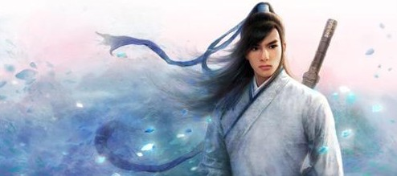
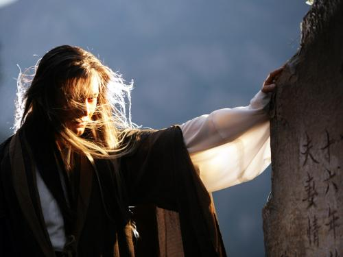
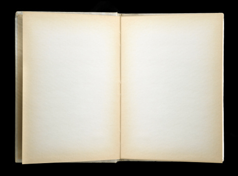

# ＜天权＞金庸小说结尾浅话

**《天龙八部》的结尾也透露了这样一种思想，不存在绝对的完美与否，一切惟心所造，道法自然。而究竟谁才是呵善惩恶的天龙八部或是谁才是天龙八部去呵与惩的对象，仅仅只要让其停留在只是一个问题而已的地步上，没有深化的必要，一旦深化，恰恰同小说的主题与宗旨相悖了。设计这样的一种结局，则完成了对全书处处流露与闪耀着佛理的智慧与佛性的光辉的基本特色的强调与再体现。**  

# 金庸小说结尾浅话

## 文/谷卿（暨南大学）

 

每每读金庸的小说，到了末尾，总要偏爱地多读几遍，难以释手。而再想读却恰逢时间仓促的时候，也总会首先翻到它的结尾去再次享受与感受一番。虽然是已经烂熟了的文字和内容，重又读来却仍能够感觉到其新的韵味。这大概也就是文学的魅力罢。

1955年金庸31岁时发表了他武侠小说创作生涯的处女之作《书剑恩仇录》，之后又有《碧血剑》、《射雕英雄传》和《神雕侠侣》相继出炉。这四部作品的结尾并没能脱掉民国时期乃至宋元明清古代旧体小说话本的窠臼，多以“诗曰”、“诗云”或对仗工整的联语结束全篇。如《书剑恩仇录》陈家洛题香冢之铭文(具体内容与相关按语见作者《新派武侠小说管窥》一文，此不赘述)；《碧血剑》末尾的“正是：万里霜烟回绿鬓十年兵甲误苍生”；《射雕》的“正是：兵火有余烬，贫村才数家。无人争晓渡，斜月下寒沙!”；还有《神雕侠侣》的“正是：秋风清，秋月明，落叶聚还散，寒鸦栖复惊。相思相见知何日，此时此夜难为情。”

显然，金氏在早期的作品当中偏重于学习和借鉴传统的手法，而且在他之前的武侠小说作家基本在描写与表述形式上走的都是近乎传统的路子。尤其以梁羽生为著，他的旧体诗词曲和古文功底相当深厚，这个特色处处体现与运用在他的小说中。不过之后，金庸通过《雪山飞狐》和《飞狐外传》的过渡，其小说结尾就开始写得有些柔美动人及至具有些真正的大师气概来。

试看《倚天屠龙记》，《倚》最后写到张无忌写完给杨逍的信后，正呆呆出神，“手中笔不肯放下”，赵敏见状，对张无忌说起先前他曾允诺为她做三件事情，其中两件均已办到，这第三件事，就是要张无忌为她画眉。她道：“……还有第三件事，你可不能言而无信。我的眉毛太淡，你给我画一画。”张无忌笑着正要作答，哪知“窗外有人格格轻笑”，来人却是周芷若，她言道：“无忌哥哥，你可也曾答允了我做一件事啊。”她见张无忌面现惊异之态，又笑道：这件事“这时候我还想不到。哪一日你要和这赵家妹子拜堂成亲，只怕我便想到了。”此时张无忌“回头向赵敏瞧了一眼，又回头向周芷若瞧了一眼，霎时之间百感交集，也不知是喜是忧，手一颤，一枝笔掉在桌上。”全书至此而止。想那张无忌答应为赵敏做的三件事，先头两件听来平平无甚奇处，要做的到却是难上加难。张无忌更不知第三件事又是否会像前两件一般的状况，正自“吃一惊，道：‘你……你……你又有什么古灵精怪的事要我做……’”，此时的赵敏却“嫣然一笑”，提出了要他为自己画眉的小要求。这个结果使得张无忌与读者都出乎意料了，而张无忌更多了欣喜之情。画眉之事肇始自汉代张敞为妻描眉，恰可显现夫妻间相爱相敬。《汉书·张敞传》有载：“（京兆尹张敞）常为妇画眉，长安中传张京兆画眉妩。有司以奏敞，上问之，对曰：‘臣闻闺房之内，夫妇之私，有过于画眉者’。上爱其能，弗备责也”。这一小小活动，也都历来常为诗人词客所吟咏和钟爱，屡屡借之以抒意。唐人骆宾王有“不能京兆画蛾眉，翻向成都骋驺引”；宋人范成大有“只烦将到妆台下，试比何如京兆画”；清人孔尚任有“天子多情爱沈郎，当年也是画眉张”。金庸施其慧眼，选中了画眉这一活动，可谓匠心良苦。张无忌这一画是为赵敏画，也是为作者画，为读者画。但之后读者并没有阅读到关于张无忌画眉的动作描写，周芷若却来了一个无甚恶意的阻挠。她提醒张无忌的话是有深意的，因为之前张无忌“帮”赵敏做的第二件事就是作罢他自己与周芷若的婚事，而周此刻又说她要张无忌为她做的事“这时候还想不到。哪一日要和赵家妹子拜堂成亲，只怕便想到了。”这话说的极有趣极巧妙，恐怕傻哥张无忌又将犯难了。但书中也并没有交待张无忌是如何来作答应付的，仅仅结束于对他心理奥妙感受的描写，最后“手一颤，一枝笔掉在桌上。”于是故事就有一种还没有完结的味道，似乎还会有很多事情将要发生。事实也正是如此，故事并没有就此完结。然而真正重要的内容已经在前面(也同样是在最后这一回)提到并点明，即张无忌最终选择的还是赵敏，这是极其明确的，所以其它再要发生的任何事都不重要了，金庸将它们统统放置在了最后一个句号的后面。则这样看来，张无忌手中的这枝笔就掉得更妙了，就掉得性格化了，也仍是辅助显现他懦弱和仁慈忠厚甚至有些呆讷的性格的。这几段文字完全将小说中所有读者感到的关于武林中邪狭暴戾之气荡除涤尽，读来令人品之良久，犹感余韵未歇，不可谓不是一个极致的美。

同《倚天屠龙记》一样，《笑傲江湖》的末了也运用了男女主人公对话的手段，有宏大叙事完毕以后的对轻松欢快的情趣描写之意，但却没有《倚》结尾的艺术效果高。文末写令狐冲与任盈盈见到与马猴绑在一起的劳德诺，任盈盈告诉令狐冲劳因为练《辟邪剑谱》失去一身功夫，被任我行置诸黑木崖。为惩罚他害死了令狐冲绰号“六猴”的六师弟陆大友，任盈盈便将他与两只大马猴铐在一块儿。讲到此，任盈盈“伸手过去，扣住令狐冲的手腕，叹道：‘想不到我任盈盈竟然也和一只大马猴终身锁在一起，再也分不开了。’说罢嫣然一笑，娇柔无限。”这俏皮的情语写得实在很美，话语一毕，小说亦随之结束，的确是优美且利落的不俗手笔。

写在《射雕》三部曲之后的《白马啸西风》和《越女剑》却不多有金氏其它作品的风格，却显得绵软凄柔。我一直视这两部作品为中篇武侠散文，其情节内容处处动人。这里也谈谈它们的末尾。

《白马啸西风》在文末写到苏普带着汉族姑娘李文秀去找哈萨克族铁延部最有智慧的老人哈卜拉姆，提出汉人是否可以与哈萨克人通婚的问题，但书中并未作出正面回答，只写道：“可是哈卜拉姆再聪明，再有学问，有一件事却是他不能解答的，因为包罗万象的《可兰经》上也没有答案，如果你深深爱着的人，却深深地爱上了别人，有什么法子?”金庸曾在《侠客行》末尾安排主人翁石破天发问：“我爹爹是谁?我妈妈是谁?”然而“梅芳姑既然自尽，这许多疑问，那是谁也无法回答了”。在这里，又是金庸借小说提出的一个无法回答的问题，这个问题却又不同于《侠客行》中的问题，它是完全可以独立于小说之外的，会被人们永永远远地问下去，就如同《神雕侠侣》中李莫愁屡次吟唱的元好问的词“问世间，情是何物，只教生死相许”一样，都是社会存在的关于情爱现象的深刻问题，其内涵是难以言明和概括的，那么“回答”，则更是不可能做到的了。但也正是由于这些问题的提出，小说的深度才更获增重。书的末尾还不忘提及李文秀之外的另一位重要角色，就是开头背上被背着的李文秀的父亲流下的鲜血染红一大片的白马：“白马带着她一步步地回到中原。白马已经老了，只能慢慢地走，但终是能回到中原的。江南有杨柳、桃花，有燕子、金鱼……汉人中有的是英俊勇武的少年，倜傥潇洒的少年……但这个美丽的姑娘就像古高昌国人那样固执：‘那都是很好很好的，可是我偏不喜欢。’”在这里，主人公倔强的性格竟由重重美景引出并衬托，这种效果是绝妙的，既完成了全书柔美散文式基调收篇的谱写，又表达了作者对李文秀性格的肯定与赞颂。或者可以说，作者并没有想表达这种肯定与赞颂，只是读者在阅读的过程中极为自然地感受到了作者的态度。

在《越女剑》的文末，当范蠡明白了剑术奇精的少女阿青喜欢上了自己，并知道她将要杀死和自己在一起的西施时，心中既不愿卫士们向阿青动手，又不忍见西施被阿青杀死，后来他对西施说他们两人“就这样一起死了”，“那也好得很”。等到阿青“右手竹棒的尖端指住了西施的心口”时，阿青“凝视着西施的容光，脸上的杀气渐渐消失，变成了失望和沮丧，再变成了惊奇、羡慕，变成了崇敬，喃喃地说：‘天……天下竟有这……这样美女，范蠡，她……她比你说的还……还要美!’”阿青说罢之后，并没有对西施下杀手，而是“纤腰扭处，一声清啸，已然破窗而出。”这时候，范蠡屏退卫士，作出了要与西施泛舟太湖，过上庶民生活的决定，“西施眼中闪出无比快乐的光芒。忽然之间，微微蹙起眉头，伸手捧着心口。”原来阿青刚才那一棒虽没能戳中西施，但棒端发出的劲气已刺伤了她的心脉。全书结束于一句话：“两千年来人们都知道：‘西子捧心’是人间最美丽的形象。”金庸于此处妙用经典，能为自己所依据的经典作出依据，而经典、传统、戏说、传言、秘闻、野史正是金庸小说内容的重要组成部分，金氏小说可以说都是这些元素综合后形成的有机体，其小说的文化背景也因之复杂化。尤其难能可贵的是，金庸没有用晦涩索然的文言言事叙理，却以优美的白话说典，说出的故事是那样真实而又虚空，如在身畔而又幻若云影。这种若即若离亦真亦幻的美，正是小说用笔的奇巧之处。

《天龙八部》自来被认为是金庸武侠小说颠峰之作(金庸创作《天龙八部》期间，于1965年赴欧漫游，倪匡曾代笔)，全书最末一句是关于慕容复扮皇帝发痴时的描写：“……众人悄悄退去。但见慕容复在土坟上南面而坐，口中兀自喃喃不休。”这一回目题作“教单于折箭六军辟易奋英雄怒”，显然，主要描写对象还是萧峰，最后方叙及段誉王语嫣回大理，此时如若直接描写段誉登上帝位，及至治下清明，政通人和之类，就显得俗气而且易使读者感觉到作者在结尾处未能留下精妙可谈之处了。书中写到段王二人正要去天龙寺拜见伯父与枯荣大师的时候，听见孩子的吵闹声：“陛下陛下，我已拜了你，怎么还不给糖吃?”众人听见此声，正感到奇怪，这里怎么会有人认得皇帝。原来是阿碧用糖引着众小儿拜慕容复为皇帝，哄他开心。慕容复其时“神智已乱，富贵梦越做越深”，引得王语嫣“心下凄然”。段誉此时看阿碧“瞧着慕容复的眼色中柔情无限，而慕容复也是一副志得意满之态，心中登时一凛：‘各有各的缘法，慕容兄与阿碧如此，我觉得他们可怜，其实他们心中，焉知不是心满意足?我又何必多事?’”便打消了本拟“招呼阿碧与慕容复回去大理，妥为安顿”的打算。《天龙八部》作为金庸中晚期作品，正宣扬了形成于作者思想中一种佛家的理念，布施、持戒、忍辱、精进、禅定、智慧在三位主要人物的言行作为之间尽现。(实际上《天龙八部》书名即取自佛门之语，乃是与二十天一样护持惠善的诸天及龙神之名号，即天、龙、夜叉、乾闼婆、阿修罗、迦楼罗、紧那罗、摩睺罗迦八部众神)慕容复从头至尾的遭遇，正是“无常”与“盛者必衰”之显现。从段誉的思量中，我们也能够感觉到他的理解与宽恕之心，这的确也是智慧的，设身处地地来考虑旁人的事，自然能够感受得更为真切。而对于猛者遂灭与骄者难久的表达，金庸运用了一种看似不完美的结果，体现了一种佛家的完美(同样，萧峰的自尽也是如此，正是一种“我不入地狱谁入地狱”和“地狱不空誓不成佛”的高度自我牺牲的志士情怀，体现了释家的“菩萨心”与“大悲心”)，但是通过段誉的思虑，又将一种我们所以为的“不完美”上升到了“事实上的完美”，但细细思考之下，事实却又仍然并不是完美的。这就如同善恶问题一样，绝对的大善与大恶是罕有的，只不过是善恶在人身上表现程度的大小轻重不同而已。《天龙八部》的结尾也透露了这样一种思想，不存在绝对的完美与否，一切惟心所造，道法自然。而究竟谁才是呵善惩恶的天龙八部或是谁才是天龙八部去呵与惩的对象，仅仅只要让其停留在只是一个问题而已的地步上，没有深化的必要，一旦深化，恰恰同小说的主题与宗旨相悖了。设计这样的一种结局，则完成了对全书处处流露与闪耀着佛理的智慧与佛性的光辉的基本特色的强调与再体现。

小说的结尾可以在很大程度上对内容与主题进行更进一步地传达与表现，一个好的结尾不仅能起到延伸拓展情节的作用，而且能为读者们带来美的享受，品之实可感到“余音袅袅，不绝如缕”。金庸武侠小说尤其是较优秀的小说的结尾都是值得阅读者与鉴赏者去细细体味与品咂的，有如叶叶花笺连递，清雅脱俗，让人感到阅读的乐事即不过于此了。

 

（采编：黄理罡；责编：黄理罡）

 
