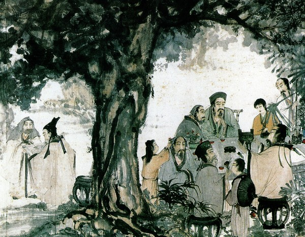

# ＜天权＞铜雀台

**古人习惯把祥瑞（其时就是符号）变成实实在在的东西，然后又把实际变成符号，变成一种情调、一种感情，进而融入到后人的血液里。铜雀台就是这样一种符号，后人对这个符号，一如黍离麦秀、朱雀桥乌衣巷式的感今悼古，一如幽州台式的追慕向往。过去的，总让人觉得是好的，是令人追忆与渴望追回的，但时间的沙漏，调过来转过去，看似还是那样，但几多风尘，都已经被埋没了。**

 

# **铜雀台**

## **文/刘晓亮（北方学院）**

 

弗洛伊德的《梦的解析》在世界范围内都可以算得上一本名著。那年我和她去海淀图书城乱转，看到什么都想买，她竟然买了本插图版《梦的解析》，原因是她老是做一些奇怪的梦，像玄幻小说，而且是连载。希图借这本书来找到朦胧的答案，只是买回去以后，大多也就浏览了一下里面那“毕加索式”的插图，而至于弗氏的高深理论，却只字没有印入脑海。

对于梦，人们总有种好奇的心，于是从古人周公开始，就展开了这个寻梦、解梦之旅。而史上那些神乎其神的人、或者能够契于竹简的事，也总有人习惯把梦搬出来作为一个堂皇而且迷幻的借口做一比附。比如先民始祖的诞生、孔丘之母的感梦而孕、文王梦里的虎等等等。到了曹操这里，也是因为舜母的一个梦，而造了铜雀台。

有人说铜雀台这名字是曹操给起的，谈到历史，我总会想起胡适的那句“历史是妓女”的论定，或许这些公婆都有理的看法，真的很难做出最终的不刊之论。所以，对于过去的东西，我什么都可以相信，又什么都不太信。

铜雀台也有写作铜爵台的，陆机的《吊魏武帝文》里就有“吾婕妤妓人，皆着铜爵台堂上施八尺床，穗帐，朝晡上脯糒之属”的答语。爵，古通雀，是一种赤黑色的鸟。《易·中孚》上说：“我有好爵，吾与尔靡之。”

铜雀台是个好地方，它不比商纣的鹿台，也不必唐皇的华清宫，这是一个可以跟齐国的稷下学宫、汉时孝王的梁园、灵帝时的鸿都门而比肩彪炳于青史的地方。对于曹操，从“山不厌高，海不厌深；周公吐哺，天下归心”的豪言壮语中让我体会到了一个乱世枭雄的胸襟；从对《孙子兵法》的注中让我对这个军事家伸起了大拇指；从“挟天子以令诸侯”、“青梅煮酒论英雄”，我又看到了一个政治家的高瞻远瞩；而因为铜雀台，我又看到了一个文学家的伟大诱惑力。

那日，铜雀台落成，文武百官，纷至沓来，歌舞美酒中，最让人侧目的还是那流传下来的篇篇佳作。曹操也像贾政考贾宝玉一样，让自己的儿子在青天白日下，驰骋自己的才情。对于古人，如果他又是一个杰出的人，总会有后人把一些超于常人的事情比附到这个杰人或神人身上。我们一直认为《七步诗》是曹植写的，因为一个人能在七步之内吟出一首漂亮的诗，这足见他的才华。但也有人辩论，说这不是曹植写的。曹丕想要害曹植，尽可以不用这一伎俩。真伪我不去管，但我想要说的是，曹植的确有才，但曹丕也并不是没才。但后人一遇到曹植这个名字，总会习以为常的认为他有那凌波微步的神功，在诗国的天地里，是个肆意遨游的人。我们看新《三国》里的曹植，一副轻狂潇洒的样子，在铜雀台上的倚马千言，真的是得尽了风流；而相反，曹丕却走了后门，事先知道了题目，又找人代写了两份现成的考卷，真可谓卑鄙、龌龊。虽然曹植的赋写的的确很好，大气、豪迈，甚合曹操的心思：

从明后以嬉游兮，登层台以娱情。见太府之广开兮，观圣德之所营。

建高门之嵯峨兮，浮双阕乎太清。立中天之华观兮，连飞阁乎西城。

临漳水之长流兮，望园果之滋荣。立双台于左右兮，有玉龙与金凤。

连二桥于东西兮，若长空之蝃蝀。俯皇都之宏丽兮，瞰云霞之浮动。

欣群才之来萃兮，协飞熊之吉梦。仰春风之和穆兮，听百鸟之悲鸣。

云天垣其既立兮，家愿得乎获逞。扬仁化于宇宙兮，尽肃恭于上京。

惟桓文之为盛兮，岂足方乎圣明？休矣！差矣！惠泽远扬。

翼佐我皇家兮，宁彼四方。同天地之规量兮，齐日月之辉光。

永尊贵而无极兮，等年寿于东皇。御龙旂以遨游兮，回鸾驾而周章。

思化及乎四海兮，嘉物阜而民康。愿斯台之永固兮，乐终古而未央!

但曹丕的“飞阁崛其特起，层楼严以承天”也并不差到那里啊！而且，一个能够写出《典论》的人，写一篇颂赞的赋，是绝对无须借刀的。这也见出了小说家对于历史这个“妓女”的蹂躏，更是多么的暴戾恣睢、不顾颜面了。

铜雀台对于其时的人来说，不止是一处歌舞游乐的场所，更是如幽州台一样，那里散发着诱惑的气息，引得文人雅士，从四面八方涌到了那个台上。三曹自不在话下，邺下文人集团的主干分子——七子——则都是闻到了这里的熏风。由是，那一首首传颂千古的佳制，也随着这座台上的香风，吹遍了九州。曹操的《登台赋》、王粲的《登楼赋》、曹丕的《典论》、曹植的《洛神赋》、蔡文姬的《悲愤诗》等，这些大都是在铜雀台上写的。

古人习惯把祥瑞（其时就是符号）变成实实在在的东西，然后又把实际变成符号，变成一种情调、一种感情，进而融入到后人的血液里。铜雀台就是这样一种符号，后人对这个符号，一如黍离麦秀、朱雀桥乌衣巷式的感今悼古，一如幽州台式的追慕向往。过

去的，总让人觉得是好的，是令人追忆与渴望追回的，但时间的沙漏，调过来转过去，看似还是那样，但几多风尘，都已经被埋没了。

凭吊也好，追念也罢，总之铜雀台赢得了自己的黄卷，这个功劳，我愿意加在曹操的履历簿上。 

人们似乎都记住了杜牧的那句“东风不与周郎便，铜雀春深锁二乔”，但我更欣赏温飞卿拜谒陈琳墓时，“情动于中而行于言”的那四联感触：

曾于青史见遗文，今日飘蓬过此坟。

词客有灵应识我，霸才无主始怜君。

石麟埋没藏春草，铜雀荒凉对暮云。

莫怪临风共惆怅，欲将书剑学从军。

风尘远去，往景成空。铜雀春深，没有锁住二乔，倒是锁住了我的梦。

 

（采编：安镜轩 责编：黄理罡）

 
