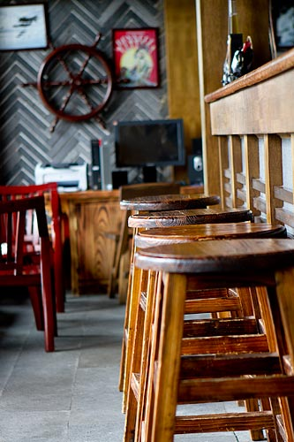

# ＜天权＞阿九！阿九！

**不倒翁软绵绵地推开杯子，摊在椅子上，瞳孔有点扩散了，就像海滩上一条缺水的鱼，喘着粗气，眼前那万花筒晃啊晃，一会儿是隔壁那烤鸭的一张猴子脸，一会儿是一只带着金戒指的晃了两下的短粗手，一会儿是各种色泽的酒桶在面前摇啊摇，慢慢流成彩色的河，自己就像个一身红的新郎官，顺着这河舒舒服服地往下划，一个大胸大屁股的女人坐在礁石上，不倒翁伸着这手淌着哈喇子，忽然一个白色的巨浪pia地砸到脸上，不倒翁看清楚了那是自己婆娘那张像水煮螃蟹一样通红的大脸，不倒翁傻笑着，嘀咕了几个字，还没说完，脸上又挨了个巴掌。**  

# 阿九！阿九！

## 文/汪海鸣（上海戏剧学院）

 

如果你真的熟悉这座城的夜晚，熟悉每一条落着梧桐叶子或者临着河水和小楼房的街道，或者吹嘘自己酒量惊人，千杯不倒，那你一定听说过阿九，你一定在某个下着雪的节日或者月色荒僻的晚秋，预谋已久或者漫不经心地出现在阿九里。

你或者野心勃勃地叫上一帮狐朋狗友，或者失魂落魄地误打误撞，兴奋地等着或者一个不小心，在某个被所有纪念日遗忘的一晚，看见一个枯瘦的说不上什么年纪的怪异的男人出现在柜台后，既不收钱，也不倒酒，面前放着一个漂亮的酒瓶子，干什么？喝酒！这时候你要是问他是谁，估计没人会搭理你。

你连九爷都不知道？来阿九瞎凑什么热闹？看着，老九要喝酒了！今天您赶上的还不是一般的场子，柜台外边坐着的号称“不倒翁”，说是不倒翁，不过是前街卖肉的一汉子，肉钱被婆娘收了个干净，好赌成性，一听说阿九来了，就火急火燎地过来。

过来干什么？和九爷喝酒啊，黄白红绿，一样九杯，喝完单全免，天亮前不醉，看见九爷手里那宝贝瓶子没，您的了！拿回家供着吧。

人群早就分成了敌对的两大阵营，前街上做生意的那可都站在不倒翁这边，有专门来打气儿的，平常喝酒谁见不倒翁倒下过，您总觉得他醉了，可他晃两下还能给您唱一出戏，词儿都不带忘的，那可是前街的老酒鬼，几岁时上街一手拎着酱油瓶一手拎着帮老爷子打的散酒就开始喝着玩儿了，醉的时候比清醒的时候多，喝上半夜不耽误第二天早市卖肉，您拿回去看，要前腿肉不给你割后腿，要一斤不少你一两，两眼滴溜溜转，逢人就说酒比血的保质期长，自己这血管里淌着的是酒，肯定长命百岁！

这些个街上酒友一见老九一个个大嘴咧的像皮鞋开胶似的，不倒翁这不是玩儿来了么，这么个人喝不过还用回去混么？自然不缺唱反调来看笑话的，酒量不可貌相，然而这句话都有些底气不足，无论从哪个角度来看，面前这个干瘦苍白的老九，都没长着一张能喝的脸。

酒就一桶一桶在旁边开口放着，看着，黄的是那一口闷，喘口气可不行，嘿，这汉子是有备而来啊，一恍眼，杯子三百六十度轮一圈，看看什么是爽快！不倒翁舔舔胡子上的黄色泡沫，九个空杯子，没话说！

继续倒！白的是那七步倒，七步写诗的那是曹操他儿子，你喝了就七步倒的份儿——别先吹，只见他血红的小眼睛滑稽地一挤，发出吧嗒吧嗒的动物饮水的巨大的声响。几杯下去就皱皱眉头！好，有两下子！七步倒有什么稀罕，老子现在往前街上溜达一圈都没问题！九个数，给我记着！

换！红的是那小染娘，上不上脸你都得接着这红盖头，一杯下去，牙齿染得血红，整张脸像吹了气的大红气球，摇两下，脖子一松，那脸可就飞了。两三杯下肚，整张皮连带着脚趾头，您就看着这血管一根根像着了火的蛇一样，从里到外，慢慢浸透了红，当真像扔进了染缸里。四五杯下去，不倒翁变大姑娘啦，前街做生意的都拍板起哄着，嫂子没来呢您这脸红什么啊！去去去，不倒翁把杯子重重往桌子上一摔，拎起油渍斑斑的袖口往嘴上胡乱一抹，说倒！酒还没倒上，自己先一个趔趄倒在了椅子上。

诶您别在这美人关上躺着啊！起来！就剩最后九杯了！

绿的名儿别嫌俗，就叫孟婆汤，喝完该记着的一个忘不了，您不倒翁这回没福气了。

酒就是平平常常的酒，可你就是喝不过老九。家家酒吧都有这镇宅宝，阿九的镇宅宝就是阿九。

哈哈哈哈，不倒翁您赶紧歇着回家给嫂子倒洗脚水去吧，就这样还想喝得过九爷？您且看着诶！

老九这边自发组织的亲友团，开始还不忘跟这帮子野人起哄，慢慢儿就瞪着眼张着嘴不吭声了。不倒翁带来的人一边倒全坐到老九这边了。见过这样喝酒的么？等等，那杯子里装着的是酒么？黄色的那是柠檬汁也酸不溜秋地得挤一下眼吧，红色的就是葡萄汁儿至少也把您这刷白的嘴唇儿染红了吧，白的哟那就是白开水还不冷不热的，您老爷子就是坐那喝茶这会儿也该去方便一下吧，敢情您那胃有个眼儿直直就出来了？

老九早年就放出话儿来了，您什么时候把他灌醉了，阿九就关门大吉啦。当然您现在还坐在阿九里，所以至今没有人喝倒过阿九。图个开心吧，甭指望了，阿九是谁，是酒神！

倒……倒！第几杯了这是！不倒翁软绵绵地推开杯子，摊在椅子上，瞳孔有点扩散了，就像海滩上一条缺水的鱼，喘着粗气，眼前那万花筒晃啊晃，一会儿是隔壁那烤鸭的一张猴子脸，一会儿是一只带着金戒指的晃了两下的短粗手，一会儿是各种色泽的酒桶在面前摇啊摇，慢慢流成彩色的河，自己就像个一身红的新郎官，顺着这河舒舒服服地往下划，一个大胸大屁股的女人坐在礁石上，不倒翁伸着这手淌着哈喇子，忽然一个白色的巨浪pia地砸到脸上，不倒翁看清楚了那是自己婆娘那张像水煮螃蟹一样通红的大脸，不倒翁傻笑着，嘀咕了几个字，还没说完，脸上又挨了个巴掌。

收完钱的小酒保后来说不倒翁被领回去时还念叨着小染娘，他婆娘不知道那是店里他没喝完的酒，还以为是个野女人呢。

阿九呢？在人群最喧闹的时候，早就不见了，他们都说老九还是阿九时，没这么能喝，不仅如此，还是个一杯倒的爷，他们还说也许是因为那瓶子有蹊跷，一个人怎么能喝不醉呢？但那是另一个故事了。

 

（采编：楼杭丹；责编：应鹏华）

 
