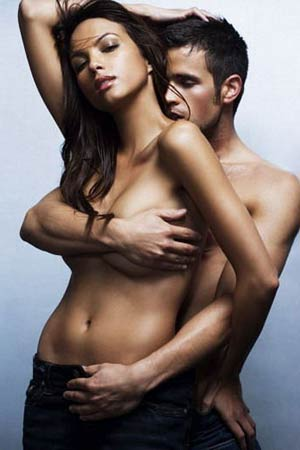

# ＜天权＞隆胸时期的性爱

**小柏要关六扇门，原本就已经要累个半死，更何况现在身上还要拖着这么一团喘着粗气的肉乎东西？这坨东西还时不时地来一拱，把小柏弄了好几个踉跄。小柏关上最后一个门板，全身都湿透了。她只记得，门板缓缓合上的最后一瞬，她从门缝里最后看到的，是光头小弟水果摊上大个头扎乎乎的蓝绿色榴莲和旁边一个奶黄色的电话机。门刚一合上，陶少爷就带着小柏一块儿歪倒在了白米堆里。**  

# 隆胸时期的性爱

## 文/覃仙球（国立政治大学）

那一年，镇子流行起了激素隆胸。一夜之间镇上所有的小女生的乳房都像超级城市里的摩天大楼一般耸入云端。原本她们胸部都平坦，可以在上面开卡丁车，但是突然间，小学四年级女生的乳房都足以和菜市场卖香菇猫耳朵的黄妈相媲美。内衣店的大号内衣一抢而光，肥硕的女店主菲姐只好去港口跟渔民批发了大量弹性上佳的鲸鱼须回来，用鲸鱼须和军需厂生产的尼龙面料缝制大号胸罩。后来一批原先只卖儿童内衣的店干脆就关门了。这年头还有谁穿儿童内衣啊？

镇上女学生的流失率很高，未满12岁的女生都辍学去邻镇当奶妈了，在校的女生也偷偷去当了兼职奶妈，她们的身价跟着乳房尺寸一路看涨——但其实她们奶的并不只是孩子。做全职奶妈的女生每个星期去市中心的奢侈品店买一个包包，做兼职的每个月也能买一个，她们走在大街上，自信心比市中心来回晃动的彩色激光还要势不可挡，把超级城市里自命清高的婆娘们气得住进了医院，出院后走起路来双腿就像蛋糕铺里过夜的葱花甜面圈，七扭八歪。

小柏是镇上唯一不隆胸的女孩子。不隆胸，并不是说她的乳房生来硕大，或者说，她认为自己的乳房尺寸惊人。恰恰相反，她的乳房很小，就和刚上市的水蜜桃差不多，而且她也觉得，自己的胸部确实是有点迷你。但是她并不认为胸部小有什么不好：在一堆大乳房里面，小乳房显得多么地清秀啊。这么说来，小柏不隆胸，也只是为了炫耀她那一点不可救药的小个性和虚荣心罢了。

这个自作聪明的虚荣心让她吃了天大的苦头。在南方的小镇，那些庸俗的城镇小市民哪里会理解小柏自以为是的另类？私营公司肥头大耳的老板们，宁可让小学刚毕业的大乳房女生给自己当秘书，也不愿意聘请一个乳房贫瘠的大学毕业生。渐渐的，小柏的父母也开始责备小柏为什么当初不隆胸。小柏一怒之下，就去给米商陶老板的米店看大门了——大乳房的女人倒干不了这份差事。因为乳房太大了，两手合不拢，晚上不好关门。到最后，小柏总算没有成为一个让人耻笑的小乳房待业青年。

这并不是意味着小柏没有其他的烦恼了：由于乳房的规格已经跟不上镇上的潮流，小柏无法买到合适的内衣。以菲姐为首的传统内衣店老板都纷纷改行，成为生产大号鲸鱼须尼龙胸罩的手工业者了。那些胸罩——说起来都让人害臊——光是一只就已经可以完全遮盖住小柏的上半身。况且她也买不起：一副胸罩卖150美元！亏她们卖得出去！小柏一想起来就忍不住在心里破口大骂。无奈之下，小柏干脆就不穿内衣了。反正她也不长着拳头般大小的乳头，不穿内衣照样很美观，走路也不会动不动就重心失调，把自己晃倒了。这样，大学刚毕业的小柏就成了镇上最特立独行的女孩子。

小柏的工作清闲。她每天就只需要坐在米店收购大米的浮亭前面，无限量地发呆。浮亭，你们知道是什么吗？就是类似于几千年前古代神殿的建筑：六根或八根方形的大柱子，支撑着一整块钢筋水泥浇筑的天花板。这样四面透风的半露天建筑就叫做浮亭。在南方的小镇，这样的浮亭是必不可少的。到了赶集的日子，镇上的居民就把商品都摆到浮亭里：铠甲，苏打水，弹簧秤，乳腐，氮肥，电子感光器，复古风的衣柜，牲畜，大朵花的纱布衣服，刀具，老鼠药，白棉花被子……所以平日空旷安静的浮亭，到了赶集日就会格外拥挤。在隆胸风潮之后，就愈加拥挤了，连浮亭里的光线都恨不得被挤到外面的大街上。但是大街上也是花花绿绿熙熙攘攘的人。要是这时突然下一场高浓度酸雨，赶集的人一定不是被雨淋死，就是被式样不同的羊皮靴踩死。

小柏就每天坐在专属于陶老板的浮亭前，无所事事地打发日子。除了看卖水果的光头小弟在七彩遮阳伞下面打苍蝇和咬指甲，只能看负责收米的婆娘们辛勤地劳作：称米，匀米，扫米，抬米。南方的婆娘们注定要一辈子为大米卖命。年纪摆在那里，婆娘们也多半不穿内衣，弯腰扫米或者抬米时，长长的干瘪乳房就自然而然地垂吊下来，小柏从她们宽阔的领口窥进去，很是心惊肉跳。当然也有原本就很小的，那就是萎缩得坦荡荡一片了。隆胸是新生代的时髦玩意儿，对上了年纪的婆姨们没有太大吸引力，她们也舍不得花那份钱。

如果不是陶少爷那天玩腻了大乳房女孩儿，突然鬼迷心窍地来和小柏做爱，小柏怕是只能这样看一辈子大门了。

那天下午收米的生意做得不是很好，婆姨们闲坐了一天，也都有些意兴阑珊，早早就拾掇了家什，赶回家给做饭，饭后架起大铁机器，还能给内衣生产商们多加工几副大号胸罩。这些婆姨都是生了儿子的苦命——若是生了女儿，在家里享福都来不及，哪里还用得着这般加班加点挣活计？就这样，还不到下午五点光景，浮亭里就只剩下小柏一个人了。 小柏百无聊赖地坐了一阵，觉得挺没意思，就站起身，决定关门——这浮亭是陶老板包下来收米的，自然在每一根柱子之间都装上了铁板门。小柏一天的工作，其实就只有关门这一道工序。坐了一天，小柏也有些无精打采了。她慢吞吞地收好椅子，把所有属于陶老板的东西都搬回浮亭里，就开始慢慢挪动门板。——这时，一个人影从门边闪了进来。

小柏略微吃惊地停下来，抬眼看住了那人。原来是陶少爷，人称傻大少。整日就知道往大乳房女孩儿堆里扎。陶老板生下这么一个儿子，也算是对得起他了。陶少爷倒不做什么混帐事——如果玩女人不算混账事。他只是随随便便就跟一个大乳房女人粘上了，然后往女人的乳沟里拼命塞钱而已。谁也不知道他粘了多少个大乳房女人。镇上的长舌婆娘们说到他，总免不了说些这样的刻薄话：这孱头，一见奶大的女人就两眼发直。也不知道他娘小时候拿什么喂的他。

小柏心有点儿慌。但是她也并不知道自己心慌什么。她又不是没听说过陶少爷的嗜好。要是陶少爷看上了她，倒算是她的福分了——至少不用再看着别人的高级时装就心头发热。正好陶少爷也在饶有兴趣地打量她。她只好在心里问了一句：这傻大少，来这里做什么？

正想着，陶少爷冷不丁来了一句：你就是小柏？ 小柏没料到他会问这么一句，吓了一跳，马上就觉得自己真是滑稽。又不是处女了。她敷衍地回答：嗯。就继续挪铁门板。

陶少爷又来了一句：你真的没隆胸？这句话听起来比较严肃了，声音也大了许多。

小柏猛然停下来，愤怒地瞪了他一眼。

没隆胸怎么了？女人就该举着大乳房等男人来摸？小柏气咻咻地回了这一句，转过身奋力推起门板来。她本来想说“你”而不是“男人”的，霎时间又怕被他炒了，只好临时换了个词。

陶少爷倒没有生气。他本来就是个不折不扣的浑球。你想让浑球生气，还不如直接砸死他来得痛快。陶少爷顿时对这个小胸部的女孩儿产生了浓厚的兴趣，紧接着下一秒，这兴趣就变成了性欲。他在脑子里迷迷糊糊地想：和奶小的女人做爱，倒也新鲜。这一来小柏倒是天降横福了。

陶少爷想着就自动往小柏身上靠。一边靠还一边猝不及防勃起了，撑得西装裤裆部的缝线劈啪作响。这浑球，玩女人也就只有这么个本事儿。小柏只觉得突然四下热乎乎地密不透风起来，回头一看原来是陶少爷的身体已经贴过来了。小柏当下一惊：哎哟，难道他真要操我？但她转瞬间就冷静下来了。她也不是什么没有见过大世面的处女，还用得着怕被陶少爷操？况且被他操还有不少好处可捞，小柏求之不得。这么一想小柏就把手从门板上移开了，身体偏过来对着陶少爷，正色问道：你真想睡我？

陶少爷一看小柏问得直接，头昏脑胀，更是兴奋不已，喘着气话都说不出来，赤红脸就往小柏脖子上凑。真是急色鬼！小柏忍不住厌恶而鄙夷地暗暗啐了一口。又不是八辈子没见过女人了。一天操好几百回还心急火燎成这样。真是屁大的出息！

小柏故作娇嗔地把陶少爷推开，说：先让我把门关好。光天白日地做爱，也不怕别人看了笑话。你先坐着等我。

陶少爷哪里肯依，缠着小柏的身体死死不撒手，小柏走到哪儿他就黏到哪儿。小柏要关六扇门，原本就已经要累个半死，更何况现在身上还要拖着这么一团喘着粗气的肉乎东西？这坨东西还时不时地来一拱，把小柏弄了好几个踉跄。小柏关上最后一个门板，全身都湿透了。她只记得，门板缓缓合上的最后一瞬，她从门缝里最后看到的，是光头小弟水果摊上大个头扎乎乎的蓝绿色榴莲和旁边一个奶黄色的电话机。门刚一合上，陶少爷就带着小柏一块儿歪倒在了白米堆里。

小柏无可奈何地想，也罢也罢，就任由他摆布好了。反正也是他家的米。

陶少爷是急脾气，三两下就把小柏衣服脱光了。一脱完，陶少爷更加兴奋地叫起来：你真白！比那些大奶女人白多啦！他的眼睛已经和性器官同时充血，看起来像两只红剌剌的海参，注满了有毒的液体。于是，他眼中的小柏就变成了这个样子：一道堆覆在绿豆西米露顶端的手打鲜奶油，细细滑滑，上边还点缀着两粒嫩红的圆润小樱桃——这就是小柏的乳头了。陶少爷像捋鸡毛一样脱光了自己的衣服，庞大的身体依次暴露在混着尘雾状米糠的朦胧空气中，面积极为庞大。

小柏躺在米堆里漫不经心地扫描着陶少爷的身体。毫无疑问，他的身体和他这么一个纵欲无度的名声是相当匹配的：高大而结实，像一匹冷血无情的种马。他的性器官，变成了一个好斗的海洋软体动物，亢奋不已，同时在地心引力的作用下，一起一落地点头哈腰，看起来可笑极了。

但是小柏还来不及笑出声，陶少爷就已经以一个跳水运动员的姿势猛然扑倒了下来。小柏瞬时觉得自己被一块高空坠落的金属狠狠压扁了，胸口一阵气闷，几乎昏死过去。幸好身下的一堆大米作了缓冲垫。小柏一睁眼睛发现自己竟然还活着，感到十分地惊奇和不解。但此时陶少爷已经开始了爱抚的程序。他的两只手掌在小柏的身体上胡揽一通，却达到了章鱼的效果，使劲地搅动着小柏这一块新鲜的白奶油。奇怪的是小柏尚未接收到任何快感，他在那边厢已经是大口喘气连声呻吟起来。这么说来，这爱抚也只是间接爱抚他自己而已，小柏根本没得到半点好处。小柏怀疑，把这点经验推广到所有的男女关系中，也是可行的。

爱抚也只是例行公事。眼看自己硬得差不多了，陶少爷便撑起身体，毫不费力地拎起小柏细细的两条腿，像撕鸡一样张开它们，对准了，吱地一声就滑进了小柏的身体，开始做起周而复始的机械运动。陶少爷一进入小柏的身体，就觉得里面暖融融的，不由得失声怪叫了起来：你在里面开油坊了吧，怎么又暖又滑的？虽然这么说，但小柏注意观察到，陶少爷进入她的一瞬间，又是挤眉弄眼又是咬牙切齿的，五官全挤成一团，看起来无比地狰狞和痛苦，和以前每一个进入她的男人都一样。既然做爱这么难受，干吗还隔三差五地老做？男人这种奇怪的动物习性，真是让小柏伤透了脑筋。

随着陶少爷旷日持久的摇动，小柏渐渐升起了倦意。她不知为什么突然觉得渴得很。嘴巴里干旱得似乎长满了毛茸茸的苔藓类植物，一张嘴就呼出腥涩的味儿来。幸好陶少爷没有吻她嘴巴。小柏有点暗自庆幸地想。她有点担心陶少爷，摇了那么久，不累么，还要提着她的腿。不过陈陈相因的干渴让她中断了为陶少爷无用的操心。她脑袋开始发晕了。她看见陶少爷发动机一样的身体被金煌煌的光晕包裹住，那光晕持续地跳跃扩散，把整个浮亭都映得黄澄澄的，陶少爷的脸背着光，看不清楚，黑糊糊的一片，但是他的背后又飞出来许多叽叽喳喳厉声尖叫着的星星，那些高频率的声音就跟着星星的银色光芒一闪一闪，锐利得似乎掉下来就可以把她眼球刺出一个个小孔。那些星星喧嚣地飞来飞去，不可避免地发生相互碰撞，于是就破碎开了，纷纷洒洒地坠下来，同时荧荧地哭泣。她从来没有见过这么热闹的星空，真是舍不得太仓促地穿越它们，然后把整个银幕关闭掉。

陶少爷只觉得自己全身都泡在小柏暖融融的管道里。他沉浸在这股暖流里，一而再再而三地激荡起一圈圈的滚烫水花来。他觉得自己的性器官快要摩擦熔化。他又紧张又渴盼地加热它，迫不及待地想让它尽快到达熔点，最后变成一炉液体金属，一点点地滴落下来。——这时，小柏使劲晃了晃腿。陶少爷停下来，像烧开的热水壶一样喘着问她：怎么了？

小柏不好意思地说：今晚要去吃夜宵，想趁现在涂脚趾甲……不好意思……

陶少爷侧着脑袋想了几秒钟，就答应了，把性器官抽出来。小柏灵巧地鱼跃而起，一溜烟跑去手袋里拿了瓶草莓红色的指甲油，又一溜烟跑回来，在原处躺好，张开腿，让陶少爷重新进入她的身体。

陶少爷正要重新启动，小柏又发话了：你可不可以……暂时动作轻一点？怕把趾甲涂坏了……小柏的脸都臊红了。但是我们知道，像陶少爷种浑球，在做爱的时候，对女性都是百依百顺的。所以陶少爷很配合地拉起了慢车，顺便积蓄后力。

小柏翘起了鱼尾巴一样小小的脚，细心地在趾甲上面涂抹颜色。她在小拇趾上涂一个完满的草莓红，在无名趾上涂一副胸罩，在中趾涂一片三叶草，在食趾涂一朵四色堇，到了大拇趾时，就可以涂一整朵太阳花啦！小柏一晃一晃地居然精细无比地完成了这个工作。终于，她放下指甲油，对已经摇得昏昏欲睡的陶少爷做出了一个准许的眼色。

休息够了的陶少爷开始冲刺啦！他的胸腔发出了类似于直升飞机螺旋桨高速转动时的噗噗声，而他的脸部肌肉又紧紧绷直，在小柏看来无比地可笑。她拼命地忍住笑，看陶少爷在越来越快的节奏中，踩上摇滚乐队劲爆华丽的紧凑鼓点，他的身体在手舞足蹈的狂欢中逐渐下降，如同一只贴着海面即将停落的大型海鸟，轻盈地，切实地，最终完全覆盖住了小柏微微放射着水光的身体，头埋在了小柏两只小巧的乳房之间，同时发出了兽类低沉的嘶吼声。

这时小柏的指甲油也彻底晾干了。她穿上衣服，就和小姐妹一起去夜市吃夜宵了。陶少爷躺在自家的米堆里无限满足地沉沉睡去，面容平和美好，完全不像一个只会做爱的浑球。如果他在梦中见到了小柏小巧玲珑的乳房，那我只能说，可能他是真的爱上小柏了。

从此，陶少爷就每天不停断地来浮亭找小柏做爱。按理说，到这里就应该已经是一个完美的结局了。但是后来小柏突然跑去了超级城市当应召女郎，再也不回到镇上来了，如此一来，整个故事的美好就遭到了破坏。

事情是这样的：陶少爷果然在小柏身上拼命地砸钱，为了尽快把汹涌而来的钱花完，小柏只好老去市中心的高级时装店买衣服。最后那次，一个小个子秃顶男人突然对她说，要不要去做应召女郎？小柏想了想，反正都是被操收钱，当应召女郎就不用再忍受陶少爷这个蠢货，便答应了。从此，在超级城市的一家高级俱乐部，就多了一个乳房很小的女孩子，她最擅长的绝活是在乳尖上顶着两个小碗大跳高难度的艳舞。超级城市里的男人们哪里见过这样鲜辣刺激的场面？最后这个小乳房的女孩子就成为公认的超级舞娘啦！我们知道，在超级城市里住的都是一些高品位的男人。只有高品位的男人才能欣赏到小乳房的美好。那些只会在镇子上追逐奶牛的男人，怎么会明白这一点呢？

于2006年夏天，有感于蔡依林而作

（采编：佛冉 责编：黄理罡）
