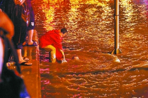
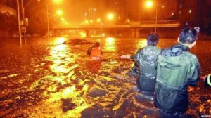

# ＜天权＞难以取悦的女朋友

**我的爷爷是北平人，一直住在这里，已经不知道多少年了。听我爷爷说，我家的祖上，是跟着明成祖进的北京城，还在国姓爷手下当过随从，对北平异常的熟悉。北平这个名字，还是当年刘伯温定下来的。北方属水，龙卷黑水。为了治水，刘伯温定下平字。北平北平，自是治水之意。可是后来，共党占领了北平，竟然把名字改掉了，成了北京。从那天起，安稳了几百年的水龙，也开始蠢蠢欲动了。**

# 难以取悦的女朋友

## 刘晓恺（北京大学）

 

“今天，雨真大啊。”被困在火车站天桥的我，跟一旁的人有一句没一句地闲聊着。

身边的人是天桥的老人了，不知道在这里经历过多少的风雨。他的身前的小桌上，挂着一个手机贴膜的牌子。桌子上，放着许多各色各样的膜，凌乱中又十分地整齐。而头上，是一把大黑伞。那种黑色很奇妙，是一种撩人的黑。在这个雨夜，华灯之下，带来一种奇妙的宁静。

“大概你也没见过几场这么大的雨吧。”我掏出一支烟，给自己点上，然后躲进了他的黑伞。伞很大，不但能遮住我们两个人，还挡住了桌子。

“我小时候见过一场，不过也是几十年前的事情了。”他长得很沧桑，但应该也是个二三十岁的小伙子。长期的天桥生活，已经在他身上留下了过多的印记。转身看了我一眼，他没有多说什么。但手中的活一直没有停下，还在给手里那只手机包膜。

“这么大的雨你都有生意，真不错。”我深深吸了一口烟，望着外面的大雨，随口问道。心中想的，却是怎么才能赶到地铁，什么时候能到家洗个热水澡。看了一眼，是一部Nokia 5230，当年的街机。Nokia的手机是以结实耐用著称的，为什么还有人会在这种天气来贴膜？还是一个全包的。

“做完这次，我也就能退休了。”他还是没有停，手指灵巧地翻动着，给手机穿上了衣服。

“退休？”我一下愣住了。轻轻弹了一下烟灰，接着问，“为什么？”

“看这雨也要下一阵，要不要听听我的故事？”他终于抬起头，看着我，眼眸里有一种让人无法拒绝的深邃。我望望外面的大雨，猛吸了一口烟，点了点头。

接下来，就是他给我讲的故事了。

我的故事，要从23年前说起了。但那只是我的故事，并不完整。如果你想听的话，是要从我的爷爷开始说起。

我的爷爷，是戴笠手下的人，而且是直属。他一直在北平，从事着谍报工作。后来，北平沦陷，戴笠的组织也被叛徒和内奸破坏，整个北平局损失殆尽。最后的他们，只有三个人活了下来。其中有一个，就是我的爷爷。

我的爷爷是北平人，一直住在这里，已经不知道多少年了。听我爷爷说，我家的祖上，是跟着明成祖进的北京城，还在国姓爷手下当过随从，对北平异常的熟悉。北平这个名字，还是当年刘伯温定下来的。北方属水，龙卷黑水。为了治水，刘伯温定下平字。北平北平，自是治水之意。可是后来，共党占领了北平，竟然把名字改掉了，成了北京。从那天起，安稳了几百年的水龙，也开始蠢蠢欲动了。

虽然组织已经没有了，但是我的爷爷并没有放弃。他知道，无论共产党嘴上说的多么好听，最终还是会站在人民的对立面。所以，他想仿照给人民以武力推翻政权希望的人权法案第二修正案，给人民以希望。

爷爷没有猜错。共党在僭越政权之后，采用的是给人民以绝望的方式来维护统治的。世界上只有一个东西比绝望更强大，也是唯一能战胜绝望的东西，那，就是希望。而这，正是爷爷给我们留下来的。

你问这个希望是什么？你有没有看过悲惨世界？雨果写的。里面有一句话你应该有印象吧，“一个城市的良心是下水道”。是的，冉阿让救助在街头与专制政府对抗而受伤的马吕斯，从下水道逃走。下水道，就是这个城市最后的希望。

你可能觉得可笑，但你知道吗，一个城市的下水道，完全是另外一个世界。在地上，共党的军队和警察，无时不在监视着你。但下水道，却是一个共党没有触及的地方。他们的势力，并没有伸到那里。法国革命中起义者利用巴黎下水道进军和转移，西班牙内战中人民阵线利用了马德里的下水道，华沙起义也使用了下水道。下水道是人民对抗专制暴政斗争的庇护所，是人民的希望，是最后的火源。

当年戴笠组织剩下的三个人，一个是我爷爷，一个是梁思成，还有一个，是林徽因。不要那么惊讶，他们是有着一颗纯粹的爱国之心的人，而且也是有影响力的人。1950年，梁思成提议重修北京的排水系统，为的就是给未来的人民一丝希望。而我的爷爷，也组织了一批工程人员，准备在土共的鼻子底下，做一番事业。只可惜，不知道为什么，土共似乎知道了我们的计划。当时是丁关根亲自动手，把北京城的下水道分成了五份，每份之间都不相通，彻底堵了起来。还派了金岳霖来监视他们。

没错，林就是被金逼到了绝路上，才不得不为土共修了英雄纪念碑。当时金就把监视总部安排到了林的隔壁，可想而知给了林多么大的精神压力。但好在梁思成帮助林设计了那根长柱，把北京城的龙脉钉死了。这也是他们为国家做的最后一件事了。

你大概也能猜到了，为什么北京城每年下大雨都会被淹。记得23年前，我爷爷去世了。临终前，他把这个秘密告诉了我。但隔墙有耳，这个秘密不知道为什么被土共知道了。大概他们早就知道了爷爷的身份了吧。于是他们想调动军队，把下水道彻底封死。但怎么调集军队进京呢？那个故事你应该知道的。

后来，下水道已经支离破碎，每年北京也一定会被淹没。今天，恐怕已经到了极限了。而我的同志们，也都死的差不多了。这些5230，本来是他们开凿下水道的工具。现在，也没有用了。明天报道，应该会死9个人吧。他们是我最后的同志了，恐怕也活不过这次大雨了。

希望的火，真的要全灭了，就像你的烟一样。我也累了，已经支撑不下去了。就这样吧。

说完这些，他把头深深地低了下去，不再说话。他手中的5230，已经包好了膜，在雨中，也能正常使用了。三防的Nokia，才是最可怕的。我把烟头向远处扔去，拿出自己的伞来，对他说：“我也应该回去了，谢谢你的故事。这盒烟送给你了，留着作个纪念吧。”

说完，我撑开伞，走回了雨中。掏出手机，打了一个电话，告诉对面的人说，这次大雨会淹死十个人。明天早上的报纸，要快点排好。

我用的，也是Nokia 5230。外面，包着一层厚厚的膜。

 

（采编：黄理罡 ；责编：黄理罡）

 
