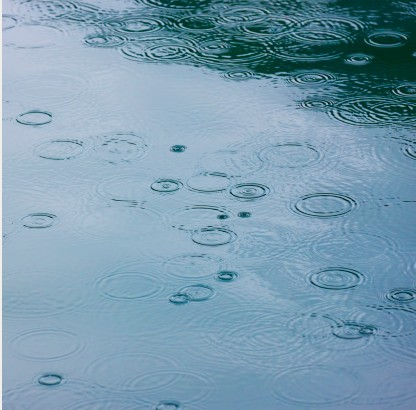
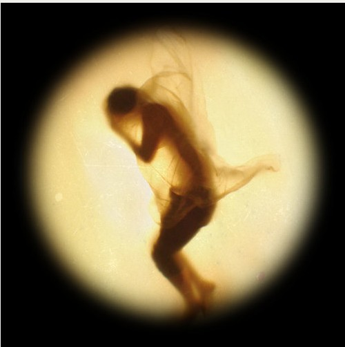

# ＜天权＞雨

**我揉了揉双眼，那个第一次见到菲的下午，阳光依旧灼热，却更像是水中灯光的拙劣模仿，我期待着那个尤物慢慢变得清晰，也期待一个崭新的世界。干燥或是潮湿，苦闷还是焦虑都将被彻彻底底的纯粹无聊冲淡，就像是爱情终究比不过日复一日的做爱，重复的行为就是永恒。可惜我看不见眼前的一切，这个崭新的世界在街头和水中诞生，我却成为了一个难产的婴儿，在瘦弱的妈妈的肚子里存在于另一片汪洋大海。**  

# 雨

## 文/钟倍尓（清华大学）

 

#### 1.

我所在的这个城市已经整整下了三年的雨了。

还记得要开始下雨的那天下午，我和菲像往常一样躺在我们租来的房子里，阳光透过窗帘的缝隙将斑斑点点的花纹染在菲的乳房上。

“好漂亮的一头母豹子。”我一边用手围绕着那些原点画圈圈，一边拿起一根烟点燃。

“我们有多久没出去了？”菲躺在那里纹丝不动，让我想起冬眠的蚊子。

“不知道。”

“我们出去吧。”菲说道。

“去哪呢？菲，这样的对话我们已经重复过很多次了。”我有点不耐烦，因为我知道，再这之后她一定会回到哪个老话题。

果不出其然。

“你这样永远不可能娶我。”菲将我的手打开，我于是翻了个身。炎热的夏天，像是两只蚊子躺在干瘪的床上互相想要吸取对方的养分。

“又不是我不想上班，现在天气那么热，店里一天来一个人已经很好了，我不是在这陪你嘛。”我更加不耐烦了。

菲是一个大学生，她学的是中文。我对这个一点都不懂，我只记得我爸以前对我说过，千万别找学艺术的和学文学的女朋友，那就好像是找了一个月球上的女人，你是永远搞不懂她的。这句话是我成长过程中认识的第二个真理，第一个则是：干货在夏天的时候是非常难卖的。而我呢，恰巧就是一个卖干货的家伙。我并不知道是所谓的作家们为了体验穷苦人民的生活还是因为她身边的男人们太相同了，我只记得那一次她来我的店里买干鱼的时候，那一声响亮的：“我要买干鱼！”瞬间侵入了我的午觉，梦中我正在一个少女的身体上游荡，干鱼突然开始游动并侵占了一切能被占据的空间。

“要多少？”我从席子上爬起来。

菲笑了笑，对我说：“你看，你露点了。”

我这才注意到游离于背心之外的那一红色小点，赶忙把衣服拉好，这时候，我揉了揉自己的眼睛。模糊的世界如同婴儿从混沌的肚子里爬出来的那一刻，清晰的展现开来。

站在我对面的可真他妈是个尤物。我心里想着。

那一天，菲要了很多的干鱼，不仅仅是干鱼，还有干肉干菜，还有，我的干涸很久的心。后来，她每天都要来，好像很自然的成为了这个小店的一部分，在炎热干燥的城市里的干货店的两把藤椅上，有一天菲正如往常一样的坐在那里，看我嘴里叼着香烟整理干货。她捋着自己的头发，对我说：“贝尔，做我男朋友吧。”

现在我身旁躺着的就是这个家伙，我原以为她这样的女人只是一时的冲动而喜欢上我，学文学的女大学生，那也许只有在梦里出现过吧。可是她现在就躺在旁边，为我们的将来而发愁。菲总喜欢和我说她喜欢的作家们，还有诗歌，但那些我一点都不了解的东西比起以前石库门邻居小丽时常穿着的黑色丝袜和那高耸入云的双峰可是差了远了。可菲总是对我说她喜欢我不懂的时候的傻傻的样子，还说喜欢我的木讷和直白。

“这时代的男人像你这么单纯的太少了，连做爱也是那么单纯，好喜欢你呢贝尔。”这是菲对我说的最多的一句话。

“啊，贝尔，你烟灰掉我手上了！”菲的叫喊打断了我的神游。

“你怎么那么不注意啊。”她坐了起来，开始寻找自己的内衣。

“不好意思。”我说道。

突然间我开始想起我们的以后，我是个很少会考虑以后的人，似乎就如同一个断了的铁轨，思绪在行驶到某个部位的时候就落入了深渊。可是菲穿衣服的时候突然让我开始幻想我们的未来。我不知道我们的最后是否会象我同小丽一样，若是回忆起来只剩下这间破烂的散发着鱼腥味的小屋子和无休止的做爱。

我有些害怕，我们的确有很多天没有出去过了，很多很多天。这让我开始讨厌起这个炎热的季节，城市里的每一个地方都充斥着焦虑，夜晚降临，倦怠了一天的人们开始纷纷回家，看着同样焦虑的妻子的面容，听着小孩在那吵闹，还有烦躁不堪的油烟机定点在那里转动着——城市上空的傍晚的味道，甚至比白天公交车的汗味还要难闻。只是我已经很久没有闻到过了。

烟都已经烧到了过滤嘴，菲仍旧缓慢的穿着内衣。

“我们出去吧。随便走走好了，坐上一辆公交车，就像我们刚认识的那样，什么也别管。”我说道。

菲终于将头转向了我，露出了她美丽的牙齿，说道：“然后我们还可以跟踪别人，你不是最喜欢干这事情了吗？”

我从背后抱住她，轻轻的咬着胸罩带子。

“贝尔，快起床啦，我们走吧。”菲说道。

我穿上了衣服，心想这一刻迟早是要来临的，瞥见落日的那一刻，阳光直直的刺在眼睛上面，而不是透过那层因干燥而开裂的玻璃和红色窗帘。空气中也看不到任何盘旋在屋里的尘埃，还有鲜活的树枝和那些上班的人。“这一刻迟早是要来临的。”在之前的很多天里，我无数次对自己说着这句话，总有天要出门的，那么着急干什么呢？但这一刻真的来临的时候，我还是非常的兴奋，我想菲也是，仿佛我们的出门意味着我们的婚姻，我们的爱情的复燃。曾经，我们都将他寄希望于这座小屋子里，但现在，它一定在外面的美丽的世界中。

我冲了把澡，认真的刮了刮胡子，穿上一件白色的T恤，上面印着贾母许的头像。我和菲都喜欢这个无聊的家伙，因为他的片子实在太无聊了。

“好了吗宝贝，我已经准备好了。”我说道。

“有没有感觉像是……像是我们要回到地球上去？好像前些日子里，我们都在一个另外的星球，只有夜晚而没有阳光，戴着面罩，那么不自然的呼吸着。”菲深吸了一口气，脸上露出便秘者常有的表情。“唔，真难受。宝贝，快点穿上鞋子，我们出门吧！”

我穿上了鞋子，关了门，锁上，按下电梯按钮。菲一直抱着我，我觉得无比幸福。电梯门开了又关上，我按下了那个“一”的按钮，我们都开心的像是小孩子一样。电梯门开了，我的脚踏出了公寓楼房的门，一滴水滴了下来，天空开始下雨了。

#### 2.

没有人想到这场雨会下那么久。

刚下雨的时候，所有人的心情都激动万分，我坐在店里的藤椅上看着路人的表情，欢愉和幸福随着雨滴落在大地上，孩子们脱去衣服在雨里奔跑，街上也鲜有撑雨伞的人。疲劳和倦怠像是惧怕阳光的生物，都悄悄的缩入洞中开始他们漫长的冬眠。雨就是希望和一切，我躺在床上听着收音机播音员的声音：“我市喜迎大雨，据专家报道，这场雨会持续一个星期……”

然而一个星期后，雨并未停止。我坐在老地方，路人的面容也产生了变化。就像那句诗里面里说的：幸福只是一瞬间的事情，而苦难是永恒。人们的脸色比在阳光下更为苍白了，不知道是天阴着的缘故还是撑着的雨伞使他们的眼睛永远躲藏在阴影里，隔壁卖饮料的一对老夫妇也开始愁眉苦脸，而我的干货店却异常火爆起来。存了整个夏天的干货在一个星期就被卖的精光，人们似乎开始渴望一切干燥的东西，不仅仅是我的干货，那些干燥剂的生产家也都变的有钱了。我很奇怪两周前的那个世界，欲望在一瞬间转了过来，但这样也对，老天爷可是公平的，总有下雨的时候也总有天晴的时候。我打开收音机，里面传来主持人颓靡的声音“专家很难预测这场雨将何时结束，我市有关部门已做好一切预防洪涝的准备……”

雨还是下着，街上很快就恢复了原样，人们依旧要工作，城市依旧倦怠着。只是不再是干燥的焦虑，而是湿漉漉的苦闷。我想我终于明白了这两个词的意思，焦虑是太阳，而苦闷是雨天。一个月后，很多人开始习惯下雨了，好像人们根本忘记了天晴时候的样子。而奢侈品店里也卖起了各种防雨的披风和鞋子，我望着眼前的菲，她正穿着今秋最流行的一款套鞋，笑嘻嘻的对我说：“嘿，这双鞋好看吗？前几天刚出喔。”

我不懂奢侈品，我只知道这东西很贵，至于为什么那么贵，就同我永远不能理解诗歌为什么是美的一样。为什么要把简单的语言说的那么晦涩呢？

不过我仍旧对菲说：“很好看，我很喜欢。”

“你这几天都不来找我。”菲嘟着嘴，眼睛仍旧盯着那一双鞋子。

“我这几天忙的很呢，从来没有这么忙过，照这样子下去我很快就会成富翁了。”我笑着对菲说道。

“多好呀，我们家的小贝尔就要变成富翁咯。”菲亲了我一口。

“我和你说说我接下来的计划。”我对菲说道，“我的一个发小，就是上次和你说过的阿兰还记得吗？”

“是以前偷窥女厕所被校长发现的那个？”菲问道，她蹲下去用手细细抚摸着她的鞋子，就像我抚摸着她的乳房一样，“多美啊，你看，雨滴在上面就像珍珠，让我想起那个那个……谁的诗。哎呀，记性越来越差了，这样子可过不了考试呀。”

“是，他在偷看女生上厕所的时候校长就在他后面站着，然后就被开除了。后来，他去西北的一个城市打工，现在听说还做的不错呢。现在我们这一直下雨，干货卖的很火热，但是却缺乏做干货的条件。我准备将鱼和肉运过去，在那里晾干再运回来。你觉得这样可以吗？”

“成本会很高吧？”菲的嘴都快吻到那双鞋子上了。

“没错，但是其他干货店库存的几乎都要卖完了，现在没有办法做干货，只有这个办法了，而且之后干货一定会变贵，你说不是吗？”

菲点了点头，终于抬起头来，说道：“宝贝你做什么我都支持你。”

菲对我的不关心就好比我对她的不关心一样，我也不知道为什么我们会在一起。那天下午，我们就坐在那两把藤椅上，无所事事。收音机里的声音似乎已对这天气变得淡漠了，一切照旧，相声和广告还有无聊的笑话永远是城市的基调。我想起开始下雨的那天，当我怀着从未有过的幸福踏出门的那一刹那，雨滴了下来，瞬间带回了我的沮丧和无聊。我们回到了家中，没有出门。

菲走了以后，我给阿兰打了一个电话。

“喂，是阿兰吗？”

“你是谁？”

“我是贝尔，还记得吗？”

“啊！贝尔啊，好久不联系好久不联系，怎么啦，最近怎样？”

“很好，我还在卖干鱼呢，你怎么样？”

阿兰在电话里告诉我他刚从监狱里出来，进去的原因就和他当时被学校踢出来的原因一样，只是这次他还录了像。他在电话里说：“贝尔，你说呢，人生不就是进进出出吗？和做爱一个样。”

我反复思考着这句话，越发觉得有理了。打完电话，我确定了两件事情。第一，能说出这么具有哲理的话的人是可以做合作的。第二，我突然有了做爱的冲动，菲的身体开始重新出现在我的脑海里。

阿兰欣然同意我的计划，挂了之后我立刻打电话给了菲。

“菲，我很想你，我想来找你，你在哪里呢？”

电话里传来很轻的声音：“我在上课呢，晚点再说吧。”

晚上我并没有接到她的电话，我想也许学文学的女生就像一只鸟，永远无拘无束也永远不可能知道它在想些什么。菲总是突然出现在我的店里，也总是在我想要寻找她的时候消失。她抱怨我们待在屋里什么也做不了，然而我们每次出去，都想不出应该做什么。她对我读诗就好比我对她兴致勃勃的解释干鱼的品种一样，以至于后来我想既然我无法理解我们为何能在一起，那想那多么干什么呢。只是我心里还是稍稍的许了个愿，我希望这雨能一直下，总有天这只叫菲的小鸟的翅膀会被打湿，总有天它会飞不起来的。

看来老天爷是眷顾着我的，雨果然一直在下，菲也终于停了下来，只不过，她不再停留在我的生活里了。她的离去简单的就像是我们在一起的生活，那几天由于我将旧的干货都卖的差不多了，而阿兰还没将晒好的运过来，因而我都无所事事的，好像又回到了那个下雨前的夏天。

“贝尔，我们待家里好久了呢，厌倦了都。”菲躺在我的身边望了望墙上挂着的时钟，说道：“你看都一点了，快起来吧。”

我突然间被时钟玻璃的反光吸引住了，我看着我和菲的裸体散射在时间的刻度上，而那一层薄薄的玻璃不仅映射着我们，也抽离了我们。这不是一面镜子，我无法确定自己，那反光，那印着刻度的脸颊，更像是另外一个世界的东西。

菲见我没有反应，使劲推了推我的身子，叫道：“你在看什么啦，我们出去好不好啊？”

“出去干嘛呢？成天下着雨，也没什么好干的，我很快就有钱了，你父母也会同意我们结婚的吧。”我望着我的嘴唇在时钟玻璃的反光里蠕动，一瞬间，秒针就如宝剑一样将我的脸割成了两半。

“你根本不懂我。”菲说道。

“嗯，我从来都没有懂过你。”我说的是实话。

“你说的是真的吗？”菲说道。

“我都不知道你为什么会喜欢我。”我说道。

“因为你单纯啊，我不是老和你说嘛。”菲说道。

“和我一起不无聊嘛？”我问。

“所以才叫你出去的。”菲说。

“出不出去都一样，在这里无聊，在外面也是。你不觉得嘛，晴天无聊，雨天也是，好像什么都会变，只有无聊不会，所以，你如果不能习惯无聊，那就没办法了。”我也惊讶自己说出这样的话来。

“哪个女人教你的？”菲开始穿内衣了。

“没人教我的。”我说的是实话。

“你知道吗，我不喜欢你说这样的话，这样的话是根本不可能从你这样的嘴里说出来的。”菲这次穿衣的速度很快，在我印象中似乎没有哪次是这么快的，“就像你这样的人是永远不可能变得有钱的。”她关门前和我说。

再一次遇到菲的时候已经过了很久很久，那应该是这个城市下雨的第一千零九十天。还有五天，就整整三年了。

#### 3.

菲离开我以后，我竟然开始变得有钱起来。

阿兰的确是一个好的生意人，我想老天爷是真的公平的，阿兰聪明但阿兰好色，人总有优点也总有致命的缺点。而也许我的优点就是我永远不知道我的优点是什么。

我并没有怎么想念菲，我本来就不期许什么，那样也就不会有失望了。曾经石库门的邻居小丽又回到了我的身边，她是听说了我变得有钱之后来找我的。那时候我已经不住在原来的地方，我在市中心的一个高层的顶楼买了房子，那个房子很漂亮也很大，不过里面的家具都是我原来的家具，我依旧喜欢坐在那两把藤椅上，望着窗外。只是现在窗外的人变得很小，我也看不清他们的表情了。

我想我还是知道我和小丽在一起的优点。我们都是很简单的人，因而能把复杂的事情变得越来越单纯，我们不会象那些有知识的人，为了爱情而苦恼。我知道我喜欢和小丽做爱，我喜欢她的乳房和双腿，我也知道小丽喜欢和我做爱，因为每次做爱之后她除了收获我的身体之外还能带走很多钞票。

好像世界又变得无聊而可爱了，小丽躺在我的身下正激烈的摇摆着，她半张着的眼睛就像是我们初吻时一般，那是我们15岁的一个秋天晚上，暗黄的街灯上结满了蜘蛛网，秋风呼的一吹，叶子就落了下来。我不由自主的亲吻了上去，裹着我的凉意瞬间被体温和在不知不觉中已然翘起的乳房驱散了。那一整个秋天好像都在吹着秋风，叶子自然落了一地，我的嘴唇也落在了小丽身体的每一个角落。

想到这些，我就同白痴一样的笑了起来。我们的回忆终于不再是那间充斥着鱼腥味的破屋子和两具不断扭动着的躯体了。

小丽有些生气，以为我在嘲笑着她做爱时的表情。

“你笑什么啊。”小丽停了下来，把我从身边推开。

我并没因此而不快，从床边桌子上的烟盒里掏出了两根烟，给小丽和自己点上。

“我想到我们的初吻和初恋，我们两个的所有的第一次都是给了对方，多么难得。”

“这有什么好笑的。”

“开心呗。”

“你就是个傻子。”小丽说，“还做不做爱了？不做我就走了啊。”

我想到我们的第一次做爱，那是在一条公园的船上。公园早就关了门，我同小丽亲吻着，慢慢褪去她的校服和胸衣。天渐渐黑了，有树林声在耳语，我是个紧张的小男孩儿，怎么也找不到那个埋藏在更深的树林中的那个宝藏。风的声音从细语变为了回响，就同一首歌曲的高潮，水波荡漾开去，船也摇摆的越来越猛烈，就在船头翘起的那刻，我听到了“啊”的一声少女的尖叫。

“走了啊，你自己在那笑吧。”小丽从我的抽屉里拿出了几张钞票，头也不回的走了。

小丽就这么来了又去，虽然每次停留的时间不长，但是总比菲的来无影去无踪好的多了。我知道我们的关系一定会很长久，至少比小丽的美腿要更长，比我们每次做爱的时间要更久。我想也许这就是爱情，每次看着她我就想起那个青春时代，兴许那时的感情才算的上单纯呢，连做爱也是那么的单纯。

然而有一天，小丽还是走了。她走的时候没有露出一点的异样，只是她没有象以前那样拿了钱而合上我的抽屉。我对单纯的爱情的回忆和幻象却就此合上了。抽屉不再沉重，打开它就象风吹落叶一般——我的钞票已经不那么多了。

我这才发现的老办法不再有用。人们发明了干货机，就是把新鲜的鱼放到机器里，一会儿就变干了。我想起了阿兰，于是立刻给他打了电话。

“阿兰，我们这样不行了，成本太高，都亏本了。现在人们都用干货机做干货，我们该怎么办啊？”

“干我屁事呢？原来那个主意是你出的，现在不行了那就再想办法咯。”

“喂，我让你赚了那么多钱，你就他妈这样的和我说话？”我很愤怒。

“贝尔，你怎么那么笨呢？不是早和你说了嘛，人生就是进进出出，干货也是一样的嘛。现在有了干货机，进去一下再出来一下，多方便，哪有人还把东西运那么远再运回来呢？”

我挂了电话，突然才意识到我的愚笨，为什么我没有想到这点呢？可是似乎一切都晚了，我连买干货机的钱都没有了。而小丽不再出现，我们的最后一次做爱又是发生在什么时候呢？我记不起来，因为每一次都同这天气一样，毫无变化又似乎不可能结束。然而我和小丽结束了，就同我和菲一样。但是雨还在下，这是第一千零九十天，还有五天就是整整三年了。

也就是在这一天的时候，我在街上遇到了菲。

那个时候，街道早就被淹没了。奢侈品店里出现了各种昂贵的潜水工具，人们已经习惯戴着潜水面具穿着脚蹼生活在水里。

“唉？这不是贝尔吗？”菲先认出了我。

我仔细打量着菲，无论这世界和衣服如何改变，她似乎永远穿着最新款的，即使是氧气面罩也是如此。

我们找了家高档的水下咖啡馆。

“菲，我现在有钱了。”我对菲说，一边拿起密封的咖啡杯，用吸管吸了一口。

“我才不信呢。”菲说。

“要不要去看看我的房子，我在市中心最高的楼层里买了间屋。”我一定不会告诉她我快要破产了，我想我会在带她看好我的屋子后就将这房子卖了，然后远走高飞，离开这个城市。

“哈哈，你这个傻瓜。”菲大笑起来，许多气泡从她的嘴里冒出，“现在早不流行在高楼里生活啦，你知道现在哪最贵吗？唉，贝尔不是我说你，要是你不把原来底楼的干货店卖了，那现在可发大财了，现在最贵的不是高楼，而是底楼！富人们都喜欢住在水里，只有你们这些穷人啊，才喜欢住高层呢。”

菲说的好像是真的，因为上一次我在路上碰到我原先隔壁卖水果的那对老夫妇时，老太婆对我说：“这不是贝尔吗？听说你发财了哟，可惜啊，老天爷是公平的，你说，它让你卖干鱼发了财，却因此让你买了高层的房子，现在多不值钱呀。老伴，你说是吗？”那老头子使劲的点头，一边吐着气泡，一边说：“是是，老天爷都是公平的，老天爷都是公平的，老天爷都是公平的……”

我突然感到很难受，有一种感觉想要我脱离这个世界。可是又有什么办法呢？我和菲告别以后，就去了售楼中心询问了我目前房子的价格。售货员是个漂亮的女孩，她望了望我破旧的潜水面罩，告诉我房子的价钱连原来的十分之一都不到了。

我高层原来的邻居们都早早的搬离了那栋楼，有钱的都往下钻，而钱不够的也尽量往靠下的楼层买。他们都说着：“总有天水会淹没我家的！”

#### 4.

这个城市终于下了整整三年的雨了。时钟没有变化，仍旧不知疲倦的走着。

我回到我的房间。我坐在那老藤椅上，我觉得应该想些什么，可是我的脑子就是这么的不好用。收音机里播报着今天的天气情况：据专家称，今天适宜水下活动，感冒指数为一颗星……

我想念菲，也想念小丽，我想念曾经的无聊，因为现在占据我内心的是苦闷了。我突然发现我和那些街上的人开始一样，只是似乎他们苦闷久了，就不再苦闷了，而我呢，我是第一次被无聊给抛弃，我意识到我应该象那些苦闷的人常作的事情一样，回到街上，在街上苦闷的走着，兴许走着走着，无聊又会回来的。

只是我从我的房间里已经看不见街上的人们了。汪洋一片，作为废墟的高楼孤零零的像我的阳具一般，不再有人关心他们。菲和小丽，仍旧好好的存在于这个世界的某个地方，只是我看不到他们，就像我看不见真正的这个世界一样，只有汪洋一片。有一只鸟儿突然飞过，水波荡漾开去。

我穿上了鞋子，关了门，锁上，按下电梯按钮。我突然觉得无比幸福。电梯门开了又关上，电梯的提示音响了：“为了您的安全，请戴好氧气面罩再出门。”我按了下“一”。电梯门开了，我的脚踏出了公寓楼房的门。

菲的那句话突然在我耳边回响着：“有没有感觉像是……像是我们要回到地球上去？好像前些日子里，我们都在一个另外的星球，只有夜晚而没有阳光，戴着面罩，那么不自然的呼吸着。”

我终于脱下了氧气面罩，我开始被柔情的水拥抱着，就象菲曾经抱着我的那样，只是这一次，她侵占了我的一切空间，从身体的每个毛孔钻入。

我揉了揉双眼，那个第一次见到菲的下午，阳光依旧灼热，却更像是水中灯光的拙劣模仿，我期待着那个尤物慢慢变得清晰，也期待一个崭新的世界。干燥或是潮湿，苦闷还是焦虑都将被彻彻底底的纯粹无聊冲淡，就像是爱情终究比不过日复一日的做爱，重复的行为就是永恒。

可惜我看不见眼前的一切，这个崭新的世界在街头和水中诞生，我却成为了一个难产的婴儿，在瘦弱的妈妈的肚子里存在于另一片汪洋大海。

完。

 

（采编：何凌昊；责编：尹桑）

 
