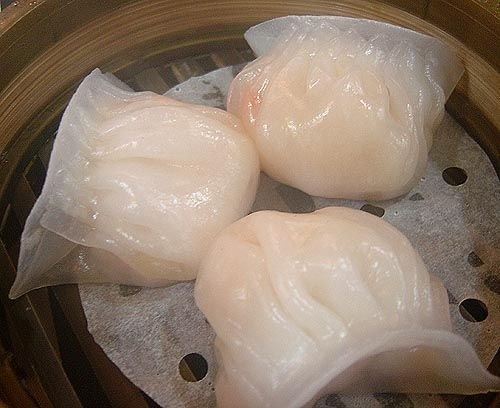

# ＜天权＞食于闽南

**食不厌精，脍不厌细。既有闽南人细腻性格的体现，亦是阔达海洋文明传来的西方餐点的影响——薄薄酥肉片，入口先酥后嫩，千回百转，烹前却须调味腌渍，反复琢磨。食为闽南风物之体现，山海风物亦集于此，发于食。山之彼端为海，海滨之上帆网纷飞，鱼虾鳞浪；海之穷尽为岸，岸旁小村清酒蒸蛤，此为闽南。**  

# 食于闽南

## 文/黄锴骥(重庆大学)

 

山之尽而水现，水至终则海阔。食于闽南，似点睛之于画龙，可谓是闽南文化的精髓。初秋清早，闽南大地的雨清清淡淡，三三两两。“不入游园哪知春色如许…良辰美景奈何天，却付与这般断壁残垣…”，雨雾中，估摸着是位年轻时名震省城的大家，告老之后回到这座不显山不露水的小城，偶尔唱唱曲儿，心满意足地老去。

好容易觅得一张木桌坐下，随手擦干雨水，一碗飘着葱花儿的锅边糊，一盘热气腾腾的卤味，点一屉剔透的虾饺，豆浆碗里泡着油条，稠得像是化不开的云，尔后才是人声鼎沸。闽南人的食，多时也如同这一桌一碗，一木一人，清清淡淡，而又包含某种浓烈。街边卖着蚵仔煎的阿嬷，将食材在在锅上铺开，尔后翻转，油声吡啵，笑着问你可要辣椒，手里已经麻利将金黄色的蚵仔煎装好，淋上蒜蓉，乍一看无奇，咬一口，才知内里馈赠有几多丰厚。

今遇亲朋搬迁，碱面浇上卤汁，香菜旁伴五香，虾笋蛋鱼韭菜蒜，人生能得几回“闻”？晚间好友良缘喜宴，鱼虾蟹蜇五花八门，飞禽走兽一应俱全，或淡如江东鲈鱼，或烈如干煸蛰头，食色俱全，津门大开。又或今夜下班回家，进门便见桌上热气蒸腾，香气中浓白的骨汤，蒸灼焖炒的海鲜，粉润剔透的牛肉，一碗白饭，以及热气后父母欣喜的脸庞。

八山一水一分田。大川无言，成其坚忍而含蓄，傍海而起，汪洋则阔其精神。河谷厚土里捧起大米谷粒，海场滩涂里捞起鱼虾，清明润饼，端午龙粽，中秋博饼，冬至汤圆。“春啖汤锅秋吃蟹，夏有荔枝后龙眼”，路旁四季常青，家中各时瓜果，各个时令饮食均有独到之处，另辟蹊径未尝不可登大雅之堂。

食不厌精，脍不厌细。既有闽南人细腻性格的体现，亦是阔达海洋文明传来的西方餐点的影响——薄薄酥肉片，入口先酥后嫩，千回百转，烹前却须调味腌渍，反复琢磨。食为闽南风物之体现，山海风物亦集于此，发于食。山之彼端为海，海滨之上帆网纷飞，鱼虾鳞浪；海之穷尽为岸，岸旁小村清酒蒸蛤，此为闽南。

（采编：楼杭丹；责编：应鹏华）

 
