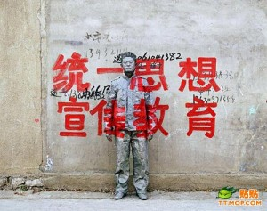

# ＜天权＞饮料与知识分子

**有一些知识分子是值得我们颂扬的，他们不为私人的名利权欲而狗苟蝇营，庸庸碌碌；他们有理想和追求，对社会做出实质性的贡献，服务大众，实现自我。他们是果汁一样的营养性知识分子。这是非常超然和理想的境界，遗憾的是，这样的人太少，以至于他们不足于作为一个知识分子群体而被讨论。值得注意的是，有相当多的伪营养性知识分子，如同兑了色素的假果汁一样，犹在危害世人。**

### 

### 

# 饮料与知识分子

### 

## 文/ 冯庆（南京大学）

### 

### 

罗兰·巴特在《神话集》中说：“酒有杀伤力，象外科手术，能使事物蜕变并遏止生命；而牛奶则象整容术，能将东西联在一起，封好，使之恢复原样。”这句话使人联想起“岗位型知识分子”和“流浪型知识分子”的分类。“酒”显然对应的是“流浪型知识分子”（“波西米亚”、“游牧民”、“大地上的异乡者”……），而“奶”则是岗位型知识分子（“布尔乔亚”、“自耕农”、“修身齐家治国平天下”……）。这些二元对立范畴的列举只是为了说明这种分类有其丰富的传统意识形态上的话语渊源。事实上在多元化的今天，这样的分类已经远远不能涵盖五花八门的“the intellectuals”了。萨义德那本薄薄的《知识分子论》正摆在我的手边，但似乎已经不能再用来解答二十一世纪的问题。零散而丰富的文化碎片，无所不在的媒体神话，君临天下的世界化资本帝国主义，光怪陆离的景观时代——知识分子的气质已经开始被这样的环境造就得越来越复杂。我们常常自矜为脑力工作者，却不得不为自己等同于体力工作者的劳动强度和微薄报酬而伤叹和愤怒；我们渴望登高一呼，但是在走上街头之后却发现人人都只低头盯着自己的手机屏幕，哪怕你死命哭上三天三夜，也没有人会多加理睬，最多扔一两枚硬币，以示我们的社会充满良心。按迪尔凯姆的说法，如果过高地自我估计的社会人得到的回报离预期相差太远，往往就会在心理上表现出普遍失范，甚至自杀（广义地讲，还包括颓废、自弃、走向虚无主义）。自诩精英却受到庸众的待遇，这是我们愤怒并做出奇怪举止的终极根源。再也没有比我们的大学生更精于愤慨和抱怨的群体了，他们自认为是崇高的拥簇，是伟大的知识分子，是天之骄子，是香醇的红酒，是昂贵的茶叶，但现实却是，不管被倒进什么容器中，他们都散发出廉价的奶香或者碳酸气泡。他们的确需要找准自己的位置。 葛兰西在《狱中札记》中关于“传统知识分子”（traditional intellectuals）和“有机知识分子”（organic intellectuals）的分类，已经不适用于二十一世纪了，但不是说并没有参考价值。传统知识分子包括教师、神职人员、官僚等职业稳定、有终身任职甚至世袭可能的智力劳动者。如果要用一种饮料作为符号来对这一类人进行一种轻松的换喻，作为中国人，我会选择用“茶”。茶是一种古老的饮料，如这一类传统知识分子一样古老，甚至一部专门讨论饮茶之道的著作可以得到被尊称为“茶经”的殊荣，而陆羽也因为其在饮茶之道上的哲学贡献而被尊为“茶圣”。已经无法考据是茶成就了陆羽，还是陆羽成就了茶，这两者似乎同一化为一种“道”的能指符号，进而融入古代士大夫的消费生活之中。茶是一种“雅”的饮料，通常和最纯正的儒家文化联系在一起，也就和中国千年来的官本位文化联系在一起。逢年过节，送酒送烟都俗，拎两盒高级茶，事儿定成。茶能润肺，能清热，能止渴，能消炎，能清肠，可谓最健康的饮料，但毕竟内含咖啡因，短期饮用，轻身健气，长期沉溺，伤心伤神。中国传统的一套就像茶一样，宜于一段时间里的修身养性，但不能长饮，否则夜不能寐，左思右想，神游太玄，顾不得后院失火，屋梁生蠹。中国传统知识分子讲究修身，要温良恭俭让，这就是长期喝茶喝出来的温柔清凉的茶性，传统知识分子人人是谦谦君子的模样，也因此接近了虚伪和乡愿。喝茶的伪君子最多，毕竟真正的温柔清凉的境界，并不是喝喝茶就喝得成的。于是官道如茶，不能像水一般清，不能像酒一般浊，半清不浊，半有半无，中庸之大境。如今的公务员考试，选拔出来的知识分子精英，也大致也有些“半清半浊”，或者更可以说是“清浊不分”的。传统的威力巨大，街头巷尾都在喝茶，街头巷尾都在做官老爷梦。做了官的，当了喉舌的，也绝没有不喝茶的。这一类知识分子，都是中国社会的顶层，正如喝茶需要有长辈来循循善诱，授以茶中真谛一样，做这一类知识分子，也是需要爷爷爸爸的庇佑的。一般人喝喝沱茶乌龙茶也就罢了，大红袍之类，不要妄想。 有机知识分子指的是在工业和后工业时代的环境中，经过学院培养，拥有专业技术的新式知识分子，他们是社会的有机组成部分，是社会化大生产的零部件。专业技工、医生、律师、编辑、高层管理人员和警官，都在这一类人中。他们喝咖啡。咖啡是一种殖民意味浓厚的饮料，殖民者在殖民地发现咖啡豆，并将其引入其他殖民地进行栽培，做成商品出售到另一些其他的殖民地，让被殖民者的味觉发生变异，连价值观也随之改变。咖啡是一种资本主义意味浓厚的饮料，办公室里加班工作的白领喝咖啡，城市里的休闲场所也一定少不了咖啡馆，咖啡是城市中四处奔忙的螺丝钉们的营养剂，保证他们有足够的精力去接受剥削。喝咖啡是小资产阶级情调不可或缺的情节，咖啡馆是窃窃私语传递秘密信息的中转站。有机知识分子的专业才能与社会无法有一丝一毫的疏离，他们必然会成为高薪收入者，也是最不愿意起来反抗的人。无数的中国青年经过长期的考试规训，渐渐学会放弃气节和理想，只是为了换得一种长期的喝咖啡的生活秩序。咖啡是苦涩的，而所谓成功人士——有机知识分子——白领骨干精英们的人生，则是典型的苦中作乐，通过出卖心力，换取符号消费品，成功地担当了大资本家爬上金钱王座的垫脚石。咖啡讲究火候、品种和搭配，有机知识分子讲究生活质量，讲究精雕细作，日常生活一定要审美化、名牌化，穿衣一定要名牌，吃饭一定要西餐厅，哪怕他们一生中最开心的日子，其实是穿着十元一件大甩卖和初恋情人在街口吃大排档渡过的。咖啡好喝，喝多了就是失眠症，就是神经衰弱，就是现代病。 

 葛兰西的时代其实早就有了流浪型知识分子，但是并未被他纳入考虑范围之内。爱伦坡、王尔德、波德莱尔……他们继承十九世纪初的浪漫派传统，要过惊世骇俗的生活，在第二次科技革命时期建立起来的帝国时代大城市之中幽灵一般颓废、逡巡和搜索。他们是自我放纵者，也是真理探寻者。他们是精神的真正贵族，就像昂贵的红酒一般，纯正而鲜艳甘香。中国曾几何时也曾有过这样的人，他们在文化圈中昙花一现，随即消失无踪，或是被同化，或是被歼灭。他们喜欢喝酒，酒能带来迷幻的作用，能够让人充满信心，也能够让人干出清醒时不敢干的事。酒神的力量是无穷的，浪漫派与酒的关系渊源颇深，在尼采那里，酒之力得到最大限度的发挥，同时看到的是压抑与异化最为严重的时代。中国文人好饮酒，但也分幸福之酒与孤愤之酒。庙堂之酒甘如醴醪，江湖之酒苦若秋风，被放逐、被排挤在主流意识形态之外的文人是最精通饮酒之道的，阮籍、李白、杜甫等等，莫非如此。鲁迅那篇有名的《药与酒》很能说明这其中的凄美与仓惶：饮酒之后莫非装疯装睡，是一种逃避的好方法，也是一种抒情的合理性的赋予。但酒最终带给人类的是毁灭，酒一样的知识分子亦逃避不了自我颠覆的命运。爱伦坡死于饮酒过度引发的脑溢血，波德莱尔则是中风瘫痪（在酒和鸦片的双重作用下），至于李白之捞月骑鲸，则显然遭到了美化。杜甫一首“潦倒新停浊酒杯”，颇能让这一种奇幻浪漫的文人生命散发出凄凉悲哀的宿命色彩。二十一世纪这样的知识分子越来越少，只因为世故与冷淡已经成为时代的主流风尚，激情如火不会在这个社会中获得好下场。 酒的对立面是奶。这里的奶已经不仅仅是“岗位型知识分子”所能概括的了。咖啡与奶常常在一起出现，但从来都是喝咖啡时放奶，没有喝奶时放咖啡的道理。如果说咖啡象征的精英阶层是大资本家和大官僚的陪衬的话，那么由奶象征的小市民阶层则只是咖啡精英阶层的陪衬。中国的大学是奶牛场，产出大量廉价而纯净的牛奶，任由社会加工为其他制品。大部分学生最喜爱的饮料是奶，因为他们期待成为一种自我满足的小市民。奶能够让他们在体格上增高和丰满，并使得他们获得一种象征意义上的快感——尽管在身份和财富上他们低人一等。奶是柔滑温顺的，是具有凝聚力和愈合力的，正如小市民阶层的知识分子，凡事都渴望以和为贵，以换取一个安宁的自我发展空间，实现他们平凡的生存梦想。奶是营养的象征，小市民知识分子“有奶便是娘”，是唯利是图的、注重眼前实利而不带任何超脱幻想而活的人群，他们洁白无瑕的生命容不下半点逾越界限和掺杂异色，因此他们的头脑也渐渐洁白无瑕起来。奶要原汁原味的才最好喝，小市民知识分子的生活也是原汁原味地庸庸碌碌，他们在机关和单位的最基层辛勤工作着，他们接受金钱雇佣、健康向上地打拼着。他们单纯而自然，他们认为自己很自由很独立。但事实上是，奶制品不能放置太久，不然便会发臭。庸俗的选秀节目的赞助商是奶制品生产厂家，虚伪的广告让最没有个性的成为最有个性；邪恶的商业欺诈和健康隐患也随着奶粉生产者的现相而浮出水面，时代的浮躁一览无余。单纯而庸碌的生活也不能存在太久，现实的残酷终将让牛奶般的生存散发出腐败气息。 比奶更能忍让的是水。纯净的水，不带半点瑕疵的水，是天下智者的最爱。泰勒斯喜欢水，老子喜欢水，胡适喜欢水，王蒙也喜欢水。比茶更淡，比酒更纯，就是上善，就是水。水对应的是和善的改良主义者，他们强调进步，强调百川入海，但不喜欢火一般的犯上作乱。他们喜欢辩证法，喜欢用时间来证明一切。假如时间不能证明，他们便走向智慧的极端，即虚无主义。水能洗涤一切杂质，让事物复归创世之初的原样，也因此容易让人产生虚无飘渺的生活态度，把一切都引入相对极境。人们身边总有一些知识分子是逆来顺受的，他们有惊世骇俗的智慧，但藏拙不出，他们有孤芳自赏的气节，却人前低眉。如果儒佛二家尚有茶的温暖和滋润，则道家文化带来的启发则是水的冰冷和虚无。大都市中的犬儒知识分子普遍存在于象牙塔内，他们清楚地知道时代的症结，却微笑不语，沐日光于大桶之中，没有半点登高一呼的勇气。他们齐形物，他们逍遥游，他们是大宗师，他们悠然于人间世。但我要说，他们在浪费粮食。喝水虽可清肠洗胃，但带不来半点营养。这样的知识分子，有等于无。 

 亚知识分子，即网络“知识分子”，那些“百度学派”和虚拟精英们，以及左右民众思维方式的庸俗文艺工作者们，对应的是碳酸饮料。这一批人能否算得上“知识分子”，尚属待定。他们的学识和能力统统是未知的，他们有的只是发出声音的自由，就跟碳酸饮料一样，发出响声，冒出气泡，但本质上不过是兑了食用香精的糖水。碳酸饮料给人带来一时的爽快，就像网络给人带来排泄和消遣的快感一样。人类在网络上可以自由地角色扮演，满足一时的虚荣心，就跟喝可乐汽水一样，有时只是为了味觉上的刺激。网络通俗文化和碳酸饮料都是时代潮流，一切夸张、虚拟、解构和伪个性都能被贴上先锋的标签，化作符号商品出售。碳酸气不断往外喷出，网络上的硝烟也愈加浓烈。可口可乐和百事不可一世，网络文人和写手亦是如此，说白了，任何碳酸气糖水放在空气中几个小时之后，都只有被倒掉的命运。速朽是网络知识分子的唯一可能。 有一些知识分子是值得我们颂扬的，他们不为私人的名利权欲而狗苟蝇营，庸庸碌碌；他们有理想和追求，对社会做出实质性的贡献，服务大众，实现自我。他们是果汁一样的营养性知识分子。这是非常超然和理想的境界，遗憾的是，这样的人太少，以至于他们不足于作为一个知识分子群体而被讨论。值得注意的是，有相当多的伪营养性知识分子，如同兑了色素的假果汁一样，犹在危害世人。 

### 

### 

（采编：陈锴 责编：陈锴）

### 

### 
