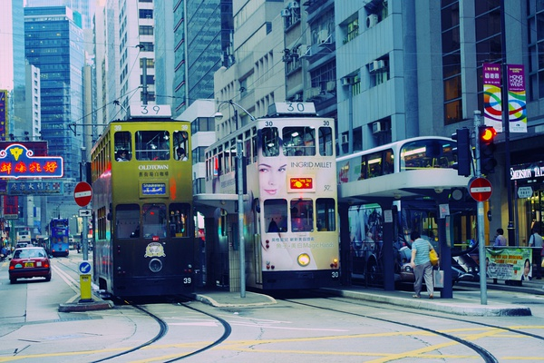
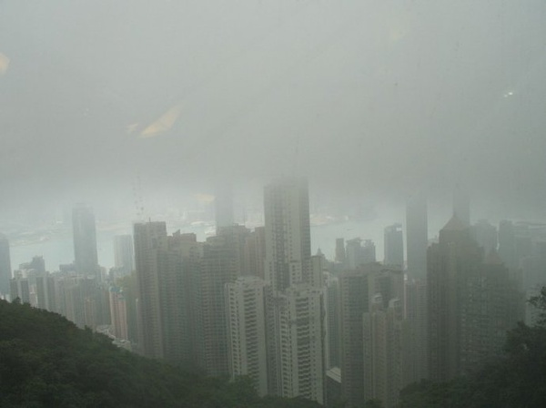
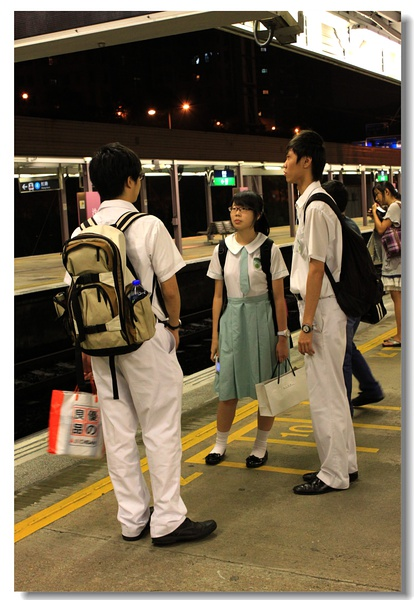

# ＜天权＞香港客（上）

**一个香港女说，“恋爱，中学就玩烦了，现在要谈也是找个女的”。我惊愕。她见状解释道：“不试试，你怎么知道自己的取向？”然后我想起了香港中学的一条校规：“禁止援交”****——我记得我中学那会，大陆还在禁止早恋呢。**

** **

****

# 

# 香港客（上）

##  文/肖开荣（香港大学）

**前言**

美国有本杂志叫做《New Yorker》，中文翻译成了“纽约客”而不是“纽约人”。看着三个字，我不禁猜想，是不是译者想说：在纽约的人，都只是暂时歇脚的旅客呢？ 那么身居香港的我，是不是也只能算一个“香港客”呢？想起三年前一个人拎着两个大箱子来，三年后一个人拎着两个箱子走，了无挂碍——我之于香港，也只是一个客人吧。只是三年时间，究竟是不短的，几篇文字，也算作客人的纪念吧。 

**一．香港人** 记得港大文学院办过一个征文比赛，题目为《我心目中的香港人》。我一度想写几句，拿起笔却迟迟下不了手。什么才是一个典型的香港人呢？我不知道。你让我写北京人，上海人，昆明人，保山人，腾冲人，我可以不假思索，洋洋洒洒：典型的北京人嘛，就是吊儿郎当，神奇抖擞，笑嘻嘻地扯着嗓门大骂，“你丫傻逼吧？”一股京味儿扑面而来；典型的上海人嘛，男的一般穿着窄脚裤，纯色粉红衬衫，声音细细的，而女的呢，就叽叽喳喳，礼貌地和你家长里短，只不过，如果不恰巧遇到另外一个上海人，她会马上忘了正在进行的对话，调到上海频道开始“侬XX&……&*%%哇”。 可是香港人呢？ 是舍堂里穿着丑啦吧唧的Hall T和拖鞋，在楼道里神情亢奋，声嘶力竭地demo cheer的楼友？ 还是旺角服装货店里，带着浓重香港口音，用普通话、英语等多种语言向你推销LV包的小贩 还是中环十字路口，穿着精致，站在红灯前，瞟一眼手表，眉宇间流露出一丝含蓄的不耐烦的白领？ 我觉得典型的香港人应该有一副潮汕人的面孔：脸嘴小小的，五官不像北方人一样舒展，皮肤有的黑黑的，愈发显得瘦，而眼睛却是鬼灵灵的精亮。 

然而，我对香港人的了解，也只停留在外表上了。和香港人的交往经历，就像没有计划好的长跑，一开始兴奋地猛冲，然后上气不接下气，接着跑一步走两步，最后索性一屁股坐下来不跑了。说是语言隔阂，文化差异，其实都不然，最根本的还是懒。大陆的学生多了，就围成了一个封闭的温室，自给自足，和外面的大生态隔离开来。等到朋友圈饱和了，自己也懒得再“嗨呀嗨呀”（编者注：音即粤语“喺吖喺吖”，意为是啊是啊）。于是就像鬼魂一样在楼里飘，他们看不到我们，我们也看不到他们。 也许这就是香港：一个路边的旅馆，旅客们交钱，拿钥匙，睡觉，然后匆匆离开。房东不会贴给你个告示，要你参加军训，班会，学生节，团支部活动，党组织生活。就连你毕业的时候，也是一个人穿着毕业袍，打了半天电话，终于找到一个人帮你照相。 你不理香港，香港也不理你。 **二．香港恋** 香港随处可见的是便利店。白灯光，大空调，琳琅满目。不用说话，抄起一罐可乐，递到收银台，“五文母该”（编者注：音即粤语“五蚊唔该”，意为五块，谢谢），懒得抬头，掏出八达通，“滴”一声，然后叩开拉环，转身而去。 香港，一个购物天堂，什么都方便，什么都能买到，除了爱情。 香港大学里好像极少人恋爱，走草地从来不怕踩到野鸳鸯。不过香港的草地像盆景，池塘像鱼缸，蚊子青蛙可以在里面野合，但不指望人能在里面干什么。港大学制奇特，内地委培一年，屁股还没热，收拾行李滚蛋；交换一年半载，周围都是白皮鬼佬抽大麻；上学三个月，五六门课，期中考， project， presentation若干，好容易考完试，暑假四个月，各回各家，各找各妈。大陆生性别比例失调，女多男少，香港人却是早恋后遗症，性冷淡。大街上，中学校服两两拉手，还以为是兄妹。长头发突然偎依到短头发肩上，然后相视良久，甜蜜一笑，烂调子的日剧的情节。然而，到了大学，脱了校服，穿得花枝招展，却反而变成了兄弟连，尼姑庵：一个hall里的大仙领着一群男女，发疯了的在校园里做task，若有其事，兄弟情义，姐妹感情，感天动地，一男一女却好像绝了迹。一个香港女说，“恋爱，中学就玩烦了，现在要谈也是找个女的”。我惊愕。她见状解释道：“不试试，你怎么知道自己的取向？”然后我想起了香港中学的一条校规：“禁止援交”——我记得我中学那会，大陆还在禁止早恋呢。 

香港人忙，下班七点八点是神仙，九点十点算正常，十一二点算加班，一点两点骂骂娘，三点四点洗个澡继续干。于是，每天下班累得半死的香港人，是不是都在想，哪天也可以走进便利店，抄起一罐爱情，无糖，无咖啡因，递到收银台，“五文母该”，懒得抬头，掏出八达通，“滴”一声，然后叩开拉环，一饮而尽。

（未完待续）
