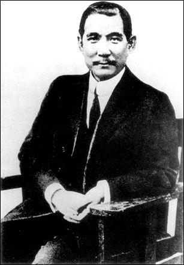
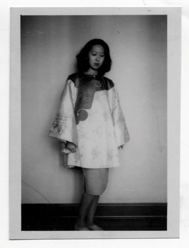
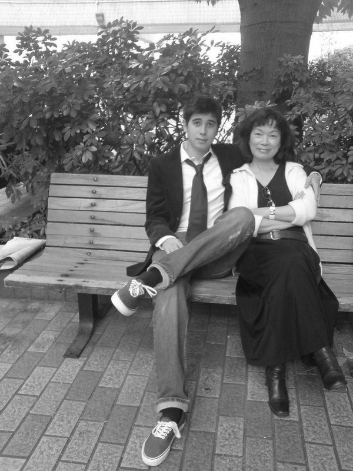
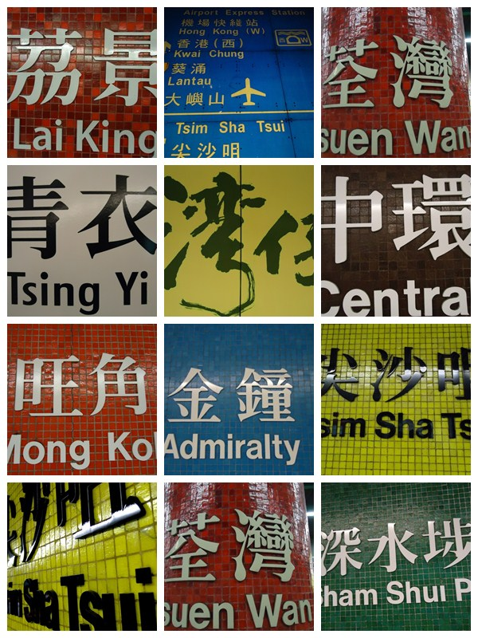

# ＜天权＞香港客（下）

**在那个天翻地覆的大时代，一批又一批的难民，革命者，富商，穷学生，涌了这个小岛上，他们之中，有被清廷通缉的孙中山，有拖着大箱子的张爱玲，有穿着马褂的朱光潜，有困顿的陈寅恪，还有马英九的父亲……香港，到底收留了多少亚细亚的孤儿？**

** **

# 香港客

## 文/肖开荣（香港大学）

 五．香港史 香港的历史，是香港客的历史。 在那个天翻地覆的大时代，一批又一批的难民，革命者，富商，穷学生，涌了这个小岛上，他们之中，有被清廷通缉的孙中山，有拖着大箱子的张爱玲，有穿着马褂的朱光潜，有困顿的陈寅恪，还有马英九的父亲……香港，到底收留了多少亚细亚的孤儿？ 在这个小岛上，孙中山剪掉了他的辫子。因为密谋革命，他被港府驱逐，辗转到英国，却险些被清廷暗杀，幸得港大恩师康黎得全力营救。孙中山把这次经历写成书，不料声名大噪，成了中国革命的代表人物。若干年后，孙回到港大，在陆佑堂发表演说：“我之革命思想，完全得之于香港”。如今那本《伦敦蒙难记》，还静静地躺在港大的图书馆里。导演陈德森看到了，于是有了《十月围城》。 

在这个小岛上，瘦弱的张爱玲，拖着大皮箱，走进了港大的校门。在那个棕榈依依，红砖白墙的主楼里，和今天的文学院学生一样，伴随她的，是叶芝的诗歌，莎翁的戏剧，梵高的向日葵。然而，骨子里她却是东方的：“一个女人，倘若得不到异性的爱，就也得不到同性的尊重，女人就是这点贱”—— 一部《倾城之恋》，把那些旗袍袭袭，胭脂点点的民国女子，写成了绝笔。今天，港大文学院还珍藏着她满是A的成绩单：二十多岁的她，是多么的才华横溢！张爱玲懂女人，更懂男人。她的小说在上海大卖，比丈夫胡兰成收入还多。可她却故意向胡要一些钱，买了一个包，高高兴兴地跨在肩上。当胡被认作汉奸后，她依然不离不弃，她说，“因为懂得，所以慈悲”。甚至当胡兰成一次次背叛她的感情时，她还在天真地幻想：“死生契阔，与子成悦；执子之手，与子偕老。”可惜，她把胡当成了范柳源，胡却只把她看作是葛薇龙。胡兰成的《今生今世》里，张只是他爱的八分之一。即便如此，《色戒》里的王佳芝，望着挚爱的易先生，还是喊出了那句“快走”。于是，这个旧式女子的执着与愚钝，她未尽的半生缘，就成了这个城市最凄美的《传奇》。 

在这个小岛上，温厚老实的金庸，遇到了疯疯癫癫的倪匡。就在湾仔谢斐道的某个小屋里，琴棋书画，烟酒饭茶，刀光剑影，快意恩仇。金庸出游欧洲，拜托倪匡代笔连载中的《天龙八部》。当他回来后，倪匡却摊开双手，坏笑着说：“啊，对不起，阿紫的眼睛被我弄瞎了！因为我实在太讨厌她了。”金庸听后无可奈何。多少年后，金庸准备重新修改他的小说，他一本正经地问：“倪匡，我想将你写的那一段删去，不知你是否见怪？”倪匡却大声嚷嚷：“见怪，见怪，大大的见怪！”没想到，小说里引人入胜的情节，就在市井小巷里埋下伏笔，在困顿书生的你来我往中变成铅字，是不是今天想起来，还不无温暖？ 在这个小岛上，张五常招来了在文革中获罪十年的杨小凯，想让他接替港大经济系的系主任。然而，住在港大的柏立基学院杨小凯，却夜夜噩梦：“大概是离大陆太近了，总想起监狱那些不堪回首的日子”。杨小凯离开了香港，不久，也离开了人世——就在他被提名诺贝尔经济学奖后。他走之前，给香港留下一本《牛鬼蛇神录》，记录了监狱里的文革历史。他说：“对经济学的贡献，可能几十年后就会被后人赶上，然而这本书的影响，几代之后都不会磨没……” 这个小岛的历史，讲到今天，还没有讲完。杨小凯住过的柏立基学院，又迎来一位客人，她叫龙应台。在自由的空气里，《大江大海一九四九》吸足了养分，酝酿了穿越历史的张力：“所有的颠沛流离，最后都由大江走向了大海”。这些小人物的故事，这些失败者的回忆，让我们看见了一代人“隐忍不言的伤”，看到了“百万雄师过大江”的豪气背后，也有“一将功成万骨枯”的悲凉。于是我们不再叫嚣，不再张狂，而是学会去倾听，去理解海峡那边的声音。然后在某一天，不经意的，在港大拥挤的星巴克里，你会遇到一位面容温和的阿姨，还有她帅气的儿子。过了半天，你恍然大悟：哦！龙应台！ 

香港，一不小心，你就和历史撞了个满怀。 六．香港情 温哥华是一杯白开水，香港是一杯伏特加。每个初到香港的客人，都会被这口烈酒，呛得眼泪直流。 你一定抱怨过，拥挤的餐馆，门外排队半个钟，勉强和陌生人拼上台，汤还没喝完，有人已经站在旁边，虎狼一般，盯着你屁股下的凳子，顿时你如坐针毡。 你一定抱怨过，狭窄的街道，人流裹挟着你，鞋带散了也不敢弯腰，只能踮着脚一跳一跳，终于到了宽点的路面，刚蹲下，“轰！”大巴擦身而过，一股煤烟，你在原地，头皮发麻。 你一定抱怨过：凌晨的楼道，突然爆发出兴奋的嚎叫，紧接着“哒哒哒”，一阵拖鞋的追赶，“蹦！”房门砸上，有人成功逃脱，有人懊恼不堪，然后传来长长地一声：“屌……”——典型的港式懒音，你揉一揉浮肿的眼睛，塞上硬邦邦的耳塞，继续睡觉。 于是你发誓：毕业后一定要离开这个鬼地方。 

誓言居然兑现了，你拖着个大箱子，在机场等候，准备去往一个寒冷的冬天。验票姐姐说，你的行李超重了——怎么会超重呢？三年的记忆真的那么沉么？你开始扔掉那些旧东西：Ocamp的笔记本，一块三的红包，歪歪扭扭的劲过春联，削好的素描铅笔……回忆啊，文艺啊，那些无用的小情绪，在理直气壮的锅碗瓢盆前，一言不发。看着那些散落一地的铅笔，你突然又舍不得了，于是又拾了起来，又称，还超，又扔……最后的最后，柜台前留下了两跺课本，一堆衣服。 那个沉甸甸的箱子，随你一路飘洋过海，来到了温哥华。那沉甸甸的，是对香港的情吗？ 那是一种什么样的感觉？你说不出来。那个让你不堪忍受的城市，等到离开了，居然有一点点怀念。你看到《玻璃之城》里的港生和韵文，你想起，红瓦白墙的主楼里，是不是还在周而复始地上演着，美丽又残缺的爱情？你想起，天星小轮划过的维港，霓虹灯的倒影，在海上摇晃，像不像在你身边，却无法企及的幸福？你想起，坐在公车上，望着被大厦切割成碎片的天空，玻璃上映出的云，你等待的，是不是玻璃里的幻像？ 走过了那么多地方，你发现，只有香港，才是让你大爱大恨的城市。你也许并不适合这里，你甚至讨厌这里的闷热和匆忙，只是somehow，你选择了她，你后悔你挣扎你逃跑，然后你发现，你最快乐的记忆，最美好的青春，居然都是她的了。 香港，我爱你恨你，是因为我离不开你。 （全文完）
