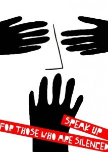

# ＜天权＞魏晋风流与现世惶恐

**最近总是忍不住想起民国时旧茶馆里柱子上贴的有点发黄的“勿谈国事”，客人高声些，掌柜的就会弓着身过来竖个手指在嘴上，指指柱子上的字条。我回家很少说时事了，老头总会在我刚说了几句的时候就喝令我住嘴。才当真是“刚开头却又煞了尾”，无趣得很。论坛里整顿的公告挂了几个月还没有结果，有些帖子被删了又传上，传完了又删掉。总觉得老电影里的那句“最近风声有点紧”就在耳边。这个时候开始无限缅怀魏晋名士的清谈了，书生意气，志气相投。**

### 

### 

# 魏晋风流与现世惶恐

### 

## 文/ 杨云滇（浙江大学）

### 

### 

这是一个很自我的题目，因为我一直对于“魏晋风流”这种风骨有发自内心的向往。可能或曰小资，或曰理想主义。面对现世，种种事实，种种无奈，总是让人忍不住怀念古老的文人优雅的姿态。 任何一个时期任何一个年代其实都逃不脱对于当时政治的恐惧。文人好清谈，是历朝历代都有的传统，只不过是程度深浅不同而已。生逢乱世，往往要么文人凋敝，要么文化极为鼎盛。民国时期极为有名的那句“莫谈国事”其实是任何时候都有道理的，当权者永远会在自己把握的尺度内限制文人的言语。就像司马昭一直纵容嵇康，任他任上酗酒，任他改变行政模式，但是唯独不允许他触及自己的底线，一封《与山巨源绝交书》彻底激怒了司马昭，这一封信，仿佛投入微波中的巨石，一石激起千层浪，司马昭已经可以预见这一风险可能会引起多少酸腐文人的反应，可能会造成多大的争议，不满的情绪很容易就一触即发。尤其是三千太学生请愿，无异于火上浇油。这个很容易联想到五四运动，“巴黎和会”谈判的失败，最后造成了全国大学生的游行抗议，直接导致了中国近代文化的变革。段祺瑞被太多方势力制衡，这种无能与无力纵容了五四运动的爆发，但是司马昭不会。何晏是不该带头吃“五石散”的，越吃越精神，越精神越多嘴，随后竹林七贤接班清谈，且一齐喝酒，嵇康还独个儿坚决吃药，结果被鲁迅先生一语道破了天机：加夏侯玄在内吃药的三个都被杀，只喝酒的阮籍混过去了。所以说，嵇康的死是必然，再放肆再自由的年代，都逃不开。他靠五石散把清谈引向了自身的极致，没办法不死。 

 这些是我很久以后才想明白的。现世安稳其实是一句很实在很有用的话，“苟全性命于乱世，不求闻达于诸侯”，诸葛亮这句话说的很虚伪——鬼知道他为了出山卯了多少劲。但是，生逢汉末、三国、魏晋乱世，其实这句话是对的，所谓“看死卫玠”貌似很无辜，其实也是和卫玠自身的才脱不开关系，大隐者如何会找来众人围观彻夜清谈呢。 可是，我想任何一个时候，文人都保留着对于魏晋风流执着的追求。不以物喜，不以己悲的大家姿态，王徽之“乘兴而去，尽兴而返”的悠然洒脱，阮籍哭兵家女孩的对于美丽丝毫不做作的赞美。那是个不做作不虚伪的年代，也是一个过分做做过分虚伪的年代。谢安在得知子侄辈在淝水大败苻坚后，只是轻描淡写地说了一句“小儿辈大破贼”，仍继续下棋，这被时人认为是“雅量”。《晋书•谢安传》此段之后，加了一句：“既罢，还内，过户限，心喜甚，不觉屐齿之折，其矫情镇物如此。”但是他们对于生活的追求已经远远超出了生活本身，要达到的只是一种生活的姿态，看中的更多的是生活的意趣而非生活的结果。那种不虚伪不做作和过分的虚伪和过分的做作都是那个时代特有的产物，后世与现世都没有了。李白轻狂时，狠狠地说，“人生在世不称意，明朝散发弄扁舟”。出郭入将的失败，才使得意气风发的诗人放下如此的狠话，多了点潇洒，却没有魏晋风流的飘逸与自在了。 以前学《兰亭集序》，对流觞曲水吟诗作赋很是感喟，后来台湾人造了一个流觞曲水，每年也会办一次诗会，多多少少是对那种风流气韵的缅怀。《兰亭集序》号称是“天下第一行书”，我的书法老师是个很优雅的人，喜欢《山居秋暝》，喜欢《兰亭集序》，书法界一直有争议颜真卿的《祭侄文稿》才是“天下第一行书”，他曾经给我讲过他同另一个书法协会的朋友争论到底是《兰亭集序》和《祭侄文稿》哪个才应当称作“天下第一行书”。《祭侄文稿》是在极度悲愤的情绪下书写，顾不得笔墨的工拙，字随书家情绪起伏，纯是精神和平时工力的自然流露。大气豪放，而《兰亭集序》则是小情态中写下的文章，酒气微醺时，通篇气息淡和空灵、潇洒自然；用笔遒媚飘逸；手法既平和又奇崛，大小参差 ，既有精心安排艺术匠心，又没有做作雕琢的痕迹。更优雅，更柔媚些。孰好孰劣，这个争不得。但是从这场论战中，可以看出来魏晋时期的风流史其他朝代不能比的。颜真卿是将才，文笔大气，没有风流意态。南北朝以后，也很难有那种优雅姿态了。《兰亭集序》最感物兴怀的正是“死生亦大矣”的悲剧主题，即从宇宙永恒、人生短暂中兴感到个体悲剧人生的价值所在。人生有限而天地无限，而认识到此中意义并不是“一死生”即泯灭生命的意义，而是要在这短暂的人生中把握世界与人生的意义，珍惜这瞬间的快乐。如同刘伶的：“天生刘伶,以酒为名,一饮一斛, 五斗解酲。”现世快乐，意态风流，老庄的虚无思想在魏晋被放大并且和儒家思想相结合，入世出世都宠辱不惊。 现世惶恐，是我个人的问题了。我对于现世充满了恐惧。总觉得有隐形的“勿谈国事”在身边环绕。这两年国进民退时惶恐，办证件时各种繁琐步骤不同机构惶恐，地震时惶恐，火山喷发时惶恐，看守所又死人时惶恐，网友被跨省追捕时惶恐，看见西北污染的照片惶恐，又有了拆迁信息时惶恐。现世和往世已经截然不同了，我们要承担的太多，家庭，事业，社会责任，因为要面对的太多所以恐惧的也太多。小时候父亲看《水浒传》看得意趣盎然，忽然要母亲煮酱牛肉，切了大块吃。吃过了又失望了，无论如何，都没有书里二斤牛肉一坛白酒的痛快感觉。我成长的每个阶段都忍不住会想到这个片段，每次感觉都不同，现在想来，就和向秀写《思旧赋》没什么差别，“刚开了头，就煞了尾”，以前的竹林，早已经物是人非，现实的压力（司马昭）在那里，再怎么怀念也没有当年的情味在哪里了。所谓风流意态，不但要有那样清逸的心，总还是要有一个清明的环境。魏晋时代的门阀制度盛行，其实也是文化上的乐事。 再怎么大块吃肉大碗喝酒，都已经物是人非了，你我都不是忍者，都没有背着一把大刀走天涯的洒脱，更没有路见不平的勇气。我第一次读《水浒传》的时候也读的心里直痒痒，闹着跟母亲说想吃大块酱牛肉，母亲当时忍不住笑，怎么爷俩一个样。我这才知道原来父亲也有过这么一出的。可见，这种潇洒不羁的生活，其实是深埋在每个人心中的一个梦想，也仅止于梦想。魏晋风流的事，可以看，可以听，却独独不能艳羡，再怎么艳羡，都是到不了的。 “蓬莱文章建安骨，中间小谢又清发。俱怀逸兴壮思飞，欲上青天揽明月。”现在没有这样的情态了，因为太多不想说，也有太多说不得。裴遐在镇东将军周馥处饮酒，周馥的司马行酒，裴正与人围棋，没有及时饮酒，生气的司马把裴从坐榻上拽下摔倒在地。裴回到坐榻上举止如常，照旧下棋。过后王夷甫问他如何能够神色不变，他说：“只是当时光线暗看不出罢了。”很少有人能保有这样的雅量了，这种安闲的态度，才是现世所最缺乏的。 古人常说“世风日下，人心不古”，每朝每代都这样说，我一直很奇怪，这样的话岂不是一代不如一代了。可是现在看来，的确如此了，谁都不可能及上那时的十分之一。有一次一早爬起来上厕所，随手抓了身边一本杂志，蹲着的时候翻到一个讲去庙里参禅的文章，一味的做作，好像容不得半点尘世味道。我禁不住好笑，这个大雅之人真是被我给弄得俗到家了。后来狠狠地写了篇东西讽刺了一痛。当下的人，一味的附庸风雅，全没有了魏晋时的洒脱。史湘云说的好：“是真名士自风流。”“假风流”“最可厌”了，现世的人，全没有那种割腥啖膻的豪气，只留下衣冠楚楚文质彬彬了。 最近总是忍不住想起民国时旧茶馆里柱子上贴的有点发黄的“勿谈国事”，客人高声些，掌柜的就会弓着身过来竖个手指在嘴上，指指柱子上的字条。我回家很少说时事了，老头总会在我刚说了几句的时候就喝令我住嘴。才当真是“刚开头却又煞了尾”，无趣得很。论坛里整顿的公告挂了几个月还没有结果，有些帖子被删了又传上，传完了又删掉。总觉得老电影里的那句“最近风声有点紧”就在耳边。这个时候开始无限缅怀魏晋名士的清谈了，书生意气，志气相投。 

 最近看五四方面的文章，觉得民国当真有些小魏晋的味道。那个时候的学者成果出的多，政治的干预少，大家多，文化交流也多。彼此间不设防，沈从文追张兆和这样的雅事也多。不觉得那时候的沈从文有多抑郁，也没搞什么服装史的研究。 王国维说：“盖人心之动，无不束缚于一己之利害，独美之为物，使人忘一己之利害，而入高尚纯洁之域。”这千百年来一成不变的，只有美了。现世恐惧，只是关注善得多了一些，想美少了一些。一心向善不若一心向美，一个可能假慈悲，而另一个才是真风流。 

### 

### 

（采编：陈锴 责编：陈锴）

### 

### 
