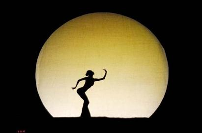
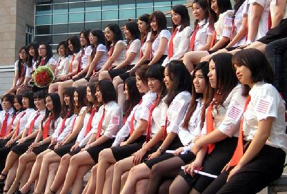

# ＜天权＞黄真伊的时调是我的美容SPA——读黄真伊时调二首

**在我的爱人面前，我又何必是那个巾帼不让须眉的女子，一定要在气势上和我的男人比高低。我有内在所有的力量笃定，我是平等的站在我的爱人面前，所以我不需要一种三八节妇女干部的形象。我满心欢喜的站在我的爱人面前告诉他我所有的思念和柔情。我用我的娇羞告诉我我远方的爱人，我企盼与你夜夜梦中相逢，你坐着梦来找我时，我正好坐着梦去找你；我的爱人啊，下一次做梦时，我们能不能约好同时出发，以便可以在中途相逢，不要再互相扑空？**

### 

### 

# 黄真伊的时调是我的美容SPA——读黄真伊时调二首

### 

## 文/ 林静（华侨大学）

### 

### 

时调一《相思梦》 相思相见只凭梦，侬访欢时欢访侬。 愿使遥遥他夜梦，一时同作路中逢。 时调二《冬至漫长夜》 截取冬之夜半强，春风被里屈幡仓，有灯无月朗来夕，曲曲铺舒寸寸长 

 她，黄真伊，朝鲜中宗时期女诗人，黄真伊，别名真娘，艺名明月，号称朝鲜的李清照。 对她的了解，最多如此。我不知道她在半岛南北的形象何如，我实在不知道该怎么描述这一个我只从韩剧和百度百科上认识的女人。 可觉得我想说点什么，她留下的诗歌时调寥寥几首，每一首我都认真的用美工笔抄写，每一首我也都可以像小时候背诵唐诗三百首一样对待。她的诗歌不是李清照，也不是柳如是，她就是明月。这轮明月的魅力，好比韩剧里女子说夜晚对着月亮吮吸，这个吃月亮的仪式可以让人变美。她的诗歌她的美是万古长的，在每一个抄写她诗歌的晚上，就是朝鲜女子吃月亮的仪式。 明月，确实是足够清冷孤独也足够柔情温润的艺名。在中国的诗句里总是和思念有关，无论思念的是故乡还是故乡温柔的女子，明月，也是这早春的样景。正是春寒料峭的时候，春天里最好的一段，还没有阳光灿烂，更多是湿重的苍白雾气，以及清冷的孤独。而韩国的电视剧中，明月却更多和女性的温柔美有关。除了吃月亮变漂亮的美容仪式，电视剧里对于明月这个艺名的赞美更在于暗夜里的温柔。人生犹如地球自转一样，白昼和黑夜缺一不可。谁的人生都不是美好的，可是即便如此，生活再怎么艰苦，我们的心也不要受伤。在暗夜里，我们可以学着虽然不够光明却足够温柔的那轮明月，勇敢地带着那一点点光明活下去，相信黎明会到来。 李清照她不是明月是最耀眼的启明星。她秉着女儿的姿态却不乏男儿的大气。她是一个士大夫家庭里被宠爱的大家闺秀，不仅可以划着小船嬉戏藕花深处也体面的跟着家人到街头观赏花灯，她的胸怀的是高远豪迈的理想抱负，生当为人杰死亦为鬼雄。 明月是黄真伊，不是李清照，她是这个美丽的蓝色星球上唯一的黄真伊，不应该被称为朝鲜李清照。她不是光明前耀目的启明星李清照，她是温柔的明月。就像是明月照亮了四方，黄真伊也用她美丽的诗歌和精湛的才艺，慰藉了几百年来疲惫的人们。 当李清照的“三杯两盏淡酒”无法抵御那漫长夜里的刺骨的寒风，朝鲜半岛“夜更深，旷野中，明月满空”，而黄真伊却可以透过诗歌，和爱人在梦里相逢：“相思相见只凭梦，侬访欢时欢访侬。愿使遥遥他夜梦，一时同作路中逢。”  在我的爱人面前，我又何必是那个巾帼不让须眉的女子，一定要在气势上和我的男人比高低。我有内在所有的力量笃定，我是平等的站在我的爱人面前，所以我不需要一种三八节妇女干部的形象。我满心欢喜的站在我的爱人面前告诉他我所有的思念和柔情。我用我的娇羞告诉我我远方的爱人，我企盼与你夜夜梦中相逢，你坐着梦来找我时，我正好坐着梦去找你；我的爱人啊，下一次做梦时，我们能不能约好同时出发，以便可以在中途相逢，不要再互相扑空？ 当李清照“此情无计可消除，才下眉头，却上心头”的时候，黄真伊“截取冬之夜半强，春风被里屈幡仓，有灯无月朗来夕，曲曲铺舒寸寸长”。 是怎么样的黄真伊，你把时间变成空间，要剪下一段冬夜储存起来？冬至，一年中昼最短，夜最长，那个漫漫长夜，爱人啊，我实在独眠难熬。我要把那漫长的冬至剪下三更，轻轻德卷起来，放在温香如春风的被子底下，在没有月亮的夜晚我亮起灯火，便是我爱人的回来。那个时候，我就把这剪下来的卷曲了的夜三更，一寸寸摊开，延长这个春宵。 最近我对自己说，真的没必要用那种风风火火的豪迈证明我比男人更加强大。有一种女性的强大是笃定的，是温香如玉的。想起小时候的爱美的女孩子总是受到老师家长的批判，只有文静的坐在一边读课文的女孩子才是让他们喜爱的。那种带着三道杆妇女干部型的女孩，更是学生中的楷模。 可惜那个时候听着“只想着打扮的女孩不是好女孩”，心里却无比迷恋在镜子前打扮的母亲露出的陶醉笑容。什么外表美比如心灵美的教诲早就忘在一边，为什么外表和心灵不可以一起美。有时我想，也许是从那个时候就自我陶醉在爱美的人生道路上，喜欢那种镜子前的陶醉感。 

 我不算是一个激进的女权主义者，我笃定女人要独立也要温柔。和女性朋友谈及男人、爱情和婚姻的时候难免听见过于激进的声音。可是事实上我见到爱情的时候一定会被男人身上的气息迷惑，我会学着黄真伊写诗给对方，没有你这个男人的话，我的世界是暗淡无光的。只有男人的魅力可以打败我的愚蠢，而爱情是就是我最了不起的美容SPA。 如今，长大后的我在21世纪前十年的中国，我看见满街是女文青女强人拜金女和剩女。我多希望我可以把我在21世纪那么多个的冬至的夜剪下，到16世纪春天的风流乡松都去，在一个明月照耀的夜晚，把看见你的寸寸时光都曲曲铺展在我的月夜里。 当然，这些我无法做到。那么，我就把黄真伊的诗歌一字一字抄写下，就像是研制最美的化妆品美肤品。在每一个晚上拿一点出来，这是我一个人的美容SPA，自斟自饮。 

### 

### 

（采编：黄洁萍；责编：陈锴）

### 

### 
