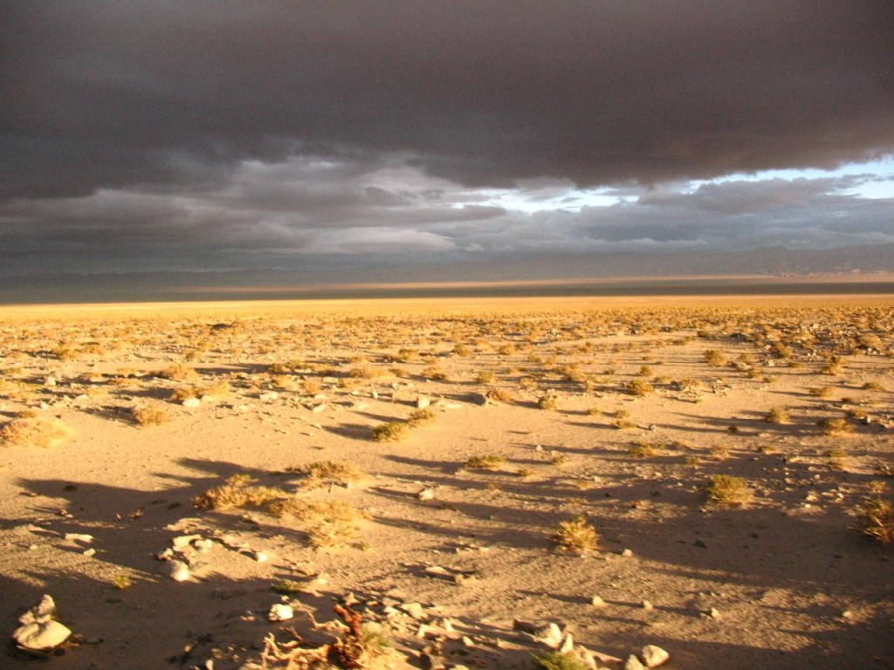

# ＜天权＞黑匣子——幸运儿

**别走，来我这里，大幕拉开，最后一章的序曲已经上演，别走，来我身边，马戏团正在排练，掌声，或者长鞭** 

# 黑匣子——幸运儿

## 文/汪海鸣（上海戏剧学院）

 

你真幸运，

这么早就找到听你说话的人，

而我坐在这里，灯光已经凉透了，

风也把腐烂的纸张吹散，

字句堵在喉咙里发酵成酒，

我把自己说醉了，火也已经枯萎成灰，

无法消化的意象将胃囊挤爆，

血液是被荒弃的岩溶尸体

被你的冷漠浸染成泥

当我的身体爆炸时——

瞳仁里的绿色还在生长

那是一只南美洲的鸽子，

把我左边的眼球灼瞎，

偷换成了未成熟的种子，

所有泪腺里的水源

都牺牲给这热带雨林基因的度餍

自左眼开始感染，并且蔓延

我死后肺才开始呼吸

那片噤默的嘴唇才有了魔力

那时血管是大提琴的最后一根琴弦

瘟疫一样渗进你心脏最后一处防线

我跌落的手指还捏着融化的糖果

滚到你脚边 抓着你 摇尾乞怜

别走，来我这里

大幕拉开

最后一章的序曲已经上演

别走，来我身边

马戏团正在排练，

掌声，或者长鞭

你真幸运，

这么早就找到听得懂你说话的人，

而我被定在十字架上，

周身装饰着的滚烫的血管

终于像失去攀附的藤蔓

自第一个黑眼圈开始

时间把最后一滴蜜糖吸干

这场景吓走了你。

你只记得路过一间黑色的人骨教堂。

你不愿打开躲在骷髅里的宝藏。

南极北极也会有太阳

而我这个逐日的人，却被日灼伤

瞎了所有的方向。

教堂高塔最后的提醒

是骷髅里橙红的灯

这是最后的骨头

燃尽了我将永不超生

你真幸运，

你走的路上有这么多声音

而被流放到蛮荒之地的

却是我这个无辜的罪人

（采编：应鹏华；责编：麦静）

 
