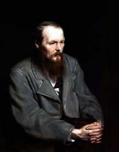
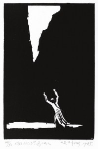

# ＜天权＞黑暗与黑暗的出口

**这也是为何鲁迅在读到但丁的炼狱中那些担着很重的石头、一松手便会压烂自己的鬼魂时，会突然觉得那样疲乏，再不能向天国读去：他实在已是为中国肩了太久的黑暗；甚至，在生命的最后一年，在说完对陀思妥耶夫斯基的复杂态度之后，鲁迅又于文末写道：“只有中庸的人，固然并无坠入地狱的危险，但也恐怕进不了天国的罢。”**

# 黑暗与黑暗的出口

## 文/夏小雨（复旦大学）

在鲁迅与周作人向外界公开的个人阅读史中，陀思妥耶夫斯基无疑都是其中殊为重要的一环。鲁迅曾在多个场合一再称陀思妥耶夫斯基为“人的灵魂的伟大的审问者”，“残酷的天才”等等；而周作人亦认为陀思妥耶夫斯基是“伟大的人道主义作家”，认为其作品“几乎无一不是惊心动魄之作”，认为他对于人性中“堕落”与“无耻”的展陈，总能够“使读者发起一种思想，觉得书中人物与我们同是一样的人”。概言之，两人对陀氏评价的重心均指向了其文学对于人性的探勘之深；并且，陀氏对于人性的解剖，在他们看来，并不是将人性中的恶外在化、对象化、客体化的过程，而实在是以一己之躯自觉地承负全人类的罪恶，并将之内在化为存在最基本的真实：在陀氏笔下，在鲁迅与周作人的理解中，内在的罪恶既是民族性的一部分，也是普遍人性与自身本性的一部分。

对于人性内在的恶采取如此的态度，其实是极难得的。周作人曾在讲演中指出，与俄国文学以“陈列丑恶”进而达致“忏悔”不同，中国文学素来缺乏谴责的精神，故而对于社会和个人的黑暗，其嘴脸往往不是在“攻讦别人的阴私”便是在“炫耀好汉的行径”（<文学上的俄国与中国>1920）；而在论及日本文学现状时，周作人也曾有类似的表述：“天外描写黑暗，有点好奇心在内；荷风只认定人间确有兽性，要写人生，自不能不写这黑暗。这是两人不同的点，也就是两人优劣的点。”（<日本近三十年小说之发达>1918）换言之，在周作人看来，但凡是人生的、现世的文学，便必须以哀矜勿喜的态度，直面此中在所难逃的黑暗与兽性。

或许没有人比鲁迅更懂得这种黑暗与兽性了。<狂人日记>（1918）作为中国现代小说的起点，即使其“史”的正当性一再受到质疑，<狂人日记>本身依然具有深刻的历史隐喻性：此后的中国现当代文学，将在不同的时代环境下，以各不相同的表现方式，一再回到这个黑暗与兽性的起点，并对文末的问诘给出自己或肯定或否定或同样无言的答复。更何况，<狂人日记>本身也是鲁迅自身“阴暗面”的写照。

鲁迅曾说：“我的小说都是些阴暗的东西。我曾一时倾慕过陀思妥夫斯基等人，今后我的小说大约也仍是些阴暗的东西。”这既可理解为他从陀氏的作品中受到了“阴暗”的指示与影响，也可视作正是鲁迅自身所固有的阴暗，使他能够藉由他人的作品从而识别出自身的黑暗。这种在阅读接受的过程中所激发起的精神共鸣，正可用来佐证鲁迅评价陀思妥耶夫斯基作品时所言：“凡是人的灵魂的伟大的审问者，同时也一定是伟大的犯人。”

与鲁迅一样，周作人也曾锐感到俄国文学里从民歌到诗文一以贯之的“阴暗悲凉”的气味（<文学上的俄国与中国>）；并且，正是在对于人性阴暗的审问上，周作人与鲁迅达到了同一个地方：在<诅咒>（1927）一文中，周作人曾怒斥“中国民族的十足野蛮堕落的恶根性”正在于“最好淫杀，最凶残而又最卑怯的”，并道：“这实在是一个奴性天成的族类，凶残而卑怯，他们所需要者是压制与被压制，他们只知道奉能杀人及杀人给他们看的强人为主子”；在其<北沿沟通信>中，周作人更是受勒庞影响，指出“我是不相信群众的，群众就只是暴君与顺民的平均罢了，”——“暴君”与“顺民”，即可看作“凶残”与“卑怯”的另一种说法。而如此种种，均不禁让我们想起鲁迅早在<狂人日记>（1918）中便曾有过十分类似的表述：

“狮子式的凶心，兔子的怯弱，狐狸的狡猾。”

在两人各自的审问下，国民的恶根性均展现为一种凶与怯的共存——这两者看似是截然对立的性格盔甲，其本质却是一样的奴性：正是恐惧以及在恐惧中所暴露出的人性固有的自私，使得国人在受虐—施虐的格局中，一再屈服于神道设教的威逼利诱；其陈陈相因的黑暗与颠扑不破的动力系统，让周作人同鲁迅一样，不得不一再经历着思想者的悲观与绝望。

故而，周作人从俄国文学中读到的“阴暗悲凉”实在也是折射了他最深层的精神气质。这是一种对一切事物的不信任感：无论是革命或宗教，群众或知识精英，甚至自己。或许对于周作人而言，唯一值得信托的便是所谓“人间的理性”（<日本的新村>）：它既是“人间”的，所以不论周作人对于群众抱着怎样深的疑惧，他仍是舍身饲虎般地想要通过教育，通过“国民的理性”，教化那些恰是作为理性对立面的群众（<乡村与道教思想>）。这未尝不是一种宗教化的救世情怀；但它也是“理性”的，正是“理性”本身使他自道对于任何宗教都不能有所“信心”，并在1924年之后，甚至将宗教所漫与的“功用”也一并视为“迷妄”（<知堂回想录•小河与新村下>）。因此，与陀氏基督徒式的救赎与忏悔不同，周作人所面对的，乃是理性作茧自缚般的悖论与困境。这或许正是他所说的“伟大的捕风”。实在是，一个纯粹的理性主义者与现世主义者，怎可能不悲观？

那么周作人可曾尝试着为自己的悲观寻找过慰藉？陀思妥耶夫斯基又是否给予了他这样的慰藉？我们注意到，在将人性推向最深的黑暗的同时，陀思妥耶夫斯基更是以宗教宽容为之设下了光明的出口。但问题是，周作人既然不能信受宗教，他的慰藉又在哪里？

周作人从陀思妥耶夫斯基的文字中最终读出了“对于人类的爱与同情”（<文学上的俄国与中国>）。他是将“爱”看作黑暗的出路，并进而试图以“无我爱”与“爱之福音”代替暴力革命。然而反讽的是，周作人的普世爱似仅是给予想象中的“人类”的，当面对现实的人时，他总不免因其丑恶而戒惧地将之斥为“非人”——试图以抽象的爱完成宗教解放、政治解放与人的解放，但面对具体的苦难时，却不能从自己身上分出哪怕一点真实的爱，这不禁让人想起费尔巴哈的伟大道路；也让人想起马克思的有力批判。

而与周作人在20年代中期之后渐渐转移对俄国文学的关注不同（莫非他真是信仰了“爱”，出离了黑暗？），鲁迅对陀氏的关注是贯穿生命始终的：鲁迅虽然早年也曾说起过那种“自己牺牲于后起的新人”的“无我的爱”，但最终，他认识到陀氏作品中那种“太伟大的忍从”到底仍是“虚伪”。<陀思妥夫斯基的事>发表于1936年初，即鲁迅生命的最后一年。在该文中，他指出，“在中国，没有俄国的基督”，故而我们不能熟悉这样的忍从，甚至，这样一种以忍从来泯灭压迫与被压迫的界限的做法，对于“同类”而言，未始不是一种恶。在两人对陀思妥耶夫斯基的接受与理解上，鲁迅显然走得更久也更远：这是他比周作人更能直面黑暗、更能担负绝望的一点，也或许是更悲观的一点。

这也是为何鲁迅在读到但丁的炼狱中那些担着很重的石头、一松手便会压烂自己的鬼魂时，会突然觉得那样疲乏，再不能向天国读去：他实在已是为中国肩了太久的黑暗；甚至，在生命的最后一年，在说完对陀思妥耶夫斯基的复杂态度之后，鲁迅又于文末写道：“只有中庸的人，固然并无坠入地狱的危险，但也恐怕进不了天国的罢。”

鲁迅竟自况为“中庸的人”，这是反讽，是自嘲，抑或是对这个世界有过最深的认识之后的孤独与清醒？这又与周作人自诩的“中庸”有何异同？其间太复杂的语意与心境，我们无从领会；但至少，在某种意义上，鲁迅与周作人都曾经历过黑暗、深渊、地狱，都曾一度被视作黑暗的出口、人间的“长庚”与“启明”，并最终都是悲观自省到不可能有足够的“信心”闯进天堂的人：正是在这个意义上，他们都是，并只能是，人间的智者。

（责编：应鹏华）
