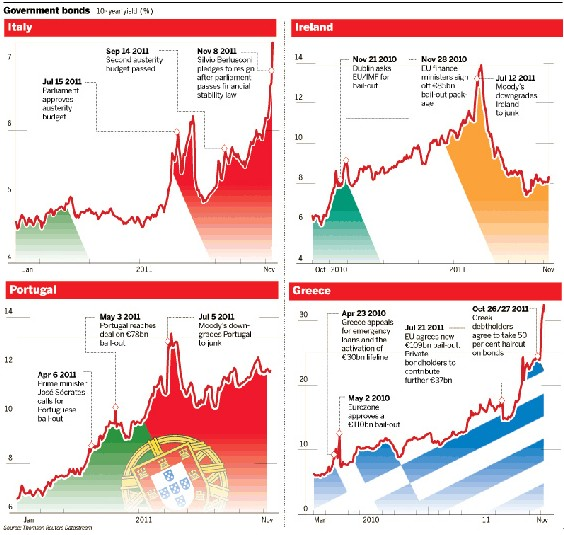
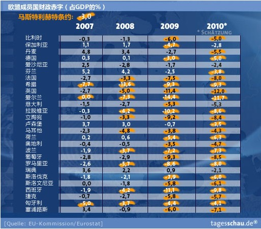
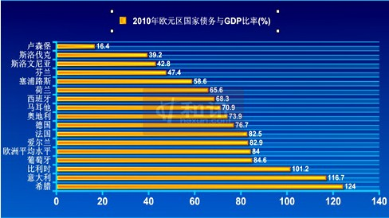

# ＜天枢＞Farewell，Euro

**欧债危机的解决方案设计得非常精巧，若能够得到贯彻实施，的确可以起到在主权债务有序违约时保护银行业的目的。问题的关键在于，钱，到底谁来承受违约所带来的损失？**

 

# **Farewell****，****Euro**

## 文/刘枭（中国人民大学）

  【上】 

欧债危机走到今天，恐怕出乎很多人的预料。虽众人皆知“欧猪五国”——葡萄牙（P）、爱尔兰（I）、意大利（I）、希腊（G）以及西班牙（S）——的麻烦不小，并大多认识到欧债危机的本质和关键所在，但可能也只有少数人意识到问题的严重性，提前预判到危机会沿着墨菲定律的路径发展。这厢希腊的问题还没有得出具体可执行方案，那边意大利又火烧眉毛，国债收益率突破7%的危险边界。欧债最新的进展是，希腊任命帕帕季莫斯为临时政府的总理，把希望寄托在非选举而来的技术性官僚上（帕帕季莫斯是前欧洲央行官员，凭他与欧洲央行的关系，对希腊继续获助有裨益），意大利参议院与下议院则相继批准了包括新的财政紧缩措施在内的预算案，老贝辞职，将成立新的临时政府，推进经济改革。

最新的进展让市场对欧债的情绪不再那么悲观——当11月9日意大利国债收益率破7%时，欧元区面临生死危机（语出欧盟主席范龙佩）。目前，在包括欧洲央行等方面的努力下，欧债的风险已有所缓释，市场回暖，再加上美国数据好转，欧美股市连续两个交易日回升，多已收复意大利出事之前的位置。

** ****但事态的发展会从此一马平川？个人观点，那可未必。目前来看，欧债危机似乎仍是一个无解的难题。**

观察10月26日二次峰会及其延长会议上最终通过的救援方案——**希腊减记****50%****；银行增资核心资本充足率****9%****，约需补充资本金千亿欧元**；

**EFSF****以****“****几倍****”****杠杆扩容到万亿。操作方法是，利用****EFSF****发行的特殊债券置换欧洲银行业手中所持有的高风险主权债券，将欧洲银行业与主权债务危机尽可能隔离开来，然后，对这批主权债券进行重组与减记，通过一系列操作，降低欧猪国家资产负债表的压力，同时保护银行业资产不至于受到因信心崩溃（而非债务重组本身）所带来的冲击。**

** ****从原理上看，欧债危机的解决方案意在将银行业所面临的主权债务违约风险部分转嫁到以欧元区全体成员国信用为支持的****EFSF****上，重点是保护银行业及市场信心，而非尽可能避免欧猪国家的违约。**须知，在危机中，最可怕的并非违约本身，而是市场信心的崩溃。一旦银行业直面欧债危机，由于商业银行的信用远远比不上以欧元区全体成员国支持的EFSF的信用，这将导致储户挤兑，争相把自己的存款从银行取出，使得本可以承受的损失被无限放大，甚至造成银行破产。在现代金融业高度发达的背景下，大型银行的破产将导致市场冻结，流动性枯竭，对经济造成不可逆的重创——危机时银行流动性的枯竭被认为是造成1929年大萧条危机长时间持续的主要原因，也是目前美联储QE及QE2的理论基础所在。

欧债危机的解决方案设计得非常精巧，若能够得到贯彻实施，的确可以起到在主权债务有序违约时保护银行业的目的。**问题的关键在于，钱，到底谁来承受违约所带来的损失？**

从方案来看，欧债的损失应由私人银行业与EFSF共同承担。私人银行业自身是要承受部分损失的，这也是他们咎由自取——谁让他们手持那么多高风险债券？这笔损失可通过增加核心资本金来缓冲。**那么，****EFSF****的损失由谁埋单？**

这与EFSF资金的构成有关。如同一家公司的资本可分为股本（自有资金）与债务，**EFSF****的资金也可分为本金与借款两部分。**欧盟二次峰会上所谈到的以“几倍”杠杆扩容，说的正是需要借多少钱的问题。**对于****EFSF****来说，自有资金由欧元区成员国依****GDP****总量为权重筹集，意味着德国出大头；而在借钱问题上，由于欧洲实在没钱，德国也坚决不允许欧洲央行直接向****EFSF****贷款，承担最后贷款人的义务，这笔钱只能眼巴巴地看着日本，以及一些新兴市场国家，当然也包括中国****——****法国总统萨克齐在二次峰会后紧急致电胡，****EFSF****总裁雷格林与****IMF****总裁拉加德紧急访华，为的都是借钱的事儿。**

** ****先看本金。**德国出大头，而手持欧猪债券最多的却是法国银行业，这也意味着，德国在以纳税人的钱救法国的银行。从另一个角度看，亦即法国讹德国。也难怪德国民众对此怨声载道。幸好当政的默克尔脑子清醒，反对派与德国媒体也比较配合，德国议会于今年9月29日通过了EFSF从2500亿扩容至4400亿（注意，这里是补充本金，而不是借钱）的议案。然而，一旦意大利风险爆发，4400亿的EFSF本金规模显然不足以应付这个庞大的经济体。据估算，未来三年意大利至少需要6500亿欧元资金才能确保债务安全，但因对希腊、爱尔兰与葡萄牙的救助，目前欧洲金融稳定基金剩余的资金仅2700亿欧元。

** ****再看借钱部分。**明知EFSF的成立就是为承担损失，单纯从经济利益出发，谁愿意肉包子打狗？我曾一度认为，由于欧盟是中国最大的贸易伙伴国，一荣俱荣，一损俱损，从经济利益出发理应伸出援手。但事情似乎并没有这么简单。有高手曾反诘道，如果中国仅出于经济利益，为保住外需援助欧洲，那不如干脆由政府掏钱买东西扔海里，这让人一时语塞——如果不是出于政治利益的考虑，中国是否愿意出手尚难揣摩——这可能也是上层声音各异的原因，以经济援助为筹码换政治利益，还未谈妥。再加上最近欧洲市场动荡，投资者纷纷逃离，EFSF负责人雷格林表示，很难将火力增至1万亿欧元，这将让欧元区领导人的期望落空。

** ****观察****EFSF****纠结的资金来源，不难得出一个结论，这看似精巧的设计很可能面临没钱的尴尬。一旦意大利也向****EFSF****伸手，救援计划本身就将面临破产，遑论帮助欧猪国家走出债务危机。**无怪乎11月初举行的欧元区财长会议仍然没有得出详细的方案——巧妇难为无米之炊，更何况还是一群貌合神离的政客。更为可虑的是，**无论欧债危机能否解决，欧洲经济深度衰退都难以避免，特别在因债务危机必须进行财政紧缩的条件下，因这将进一步伤害经济增长。也就意味着，包括意大利在内的欧猪国家，凭自身能力走出债务危机的可能性实在微乎其微，最终可能必须依赖外界的帮助。**

这简直就是个悖论！

由此可见，欧债危机似乎仍是一个无解难题。若债务风险爆发，欧元将直面生死存亡的命题——无论是将希腊等国踢出欧元区，还是德国重新组建新的核心欧元区，甚或欧元区完全解体，都将意味着现有的欧元体系难以为继，将对欧元区各国的经济造成深重的打击。**根据瑞银分析师的计算，欧元解体第一年的成本可能占外围国家****GDP ****的****40 - 50%****，核心国家****GDP****的****20 - 25%****，合计数万亿欧元。**相比之下，成功的救援似乎更便宜。加上已花费在救援上的资金一起，重组欧洲银行资本，以及欧洲央行任何潜在的损失，总额也仍然只是以千亿计。

但事实俱在，即使大家明知与欧元破产相比，成功的救援会更加经济，后者却总因为重重的阻力而难以成行。这不得不说是一种悲哀，或者，也是种必然？因拯救欧元区不仅仅涉及到成本收益的比较，更涉及到欧元区政治利益的博弈，**涉及到欧元深层次的矛盾。**关注欧债的人可能都听说过如下的说法：欧债危机是欧元区财政与货币体系不兼容的必然结果，解决的思路不外乎财政匹配货币，建立统一的欧洲财政部，发行欧洲债券，加强财政纪律，抑或是货币匹配财政，也就是欧元解体。仔细思考，却并非如此简单。

 【下】 

** ****欧债危机是欧元区财政与货币体系不兼容的必然结果，解决的思路不外乎财政匹配货币，建立统一的欧洲财政部，发行欧洲债券，加强财政纪律，抑或是货币匹配财政，也就是欧元解体。**

在此，需要**进一步明确财政与货币体系不兼容的机理**：货币体系的统一使得欧元区内各成员国都可以以较低的成本融资，在财政体系分散，**马斯特里赫特条约**对成员国约束力几无的条件下，各国政党有激励通过向选民承诺高福利换取执政地位，并在国内生产力并不足以支持高福利的情况下，采取发国债融资的方式借钱消费，最终导致债台高筑，酿成欧债危机。

值得注意的是上文中提到的马斯特里赫特条约。该条约于1991年在荷兰签订，为欧共体建立政治联盟和经济与货币联盟确立了目标与步骤，是欧洲联盟成立的基础。其中最重要的条款是，**欧元区各成员国须将财政赤字控制在****GDP****的****3%****以下，将国债****/GDP****占比保持在****60%****以下。**然而，**由于欧洲财政纪律松散，也没有事先制定可执行的退出机制，缺乏可置信威胁，该条约的执行力基本可以忽略，满足条件的成员国寥寥无几，就连德法两国都超越了警戒线**：

赤字占GDP的比率控制在3%以下基本上是笑谈，只有保加利亚、爱莎尼亚与瑞典达标。

国债占GDP比率控制在60%以下，达标的只有卢森堡、斯洛伐克、斯洛文尼亚、芬兰与塞浦路斯。

马斯特里赫特条约惨不忍睹的执行情况使得欧元区退出机制基本得不到正式讨论——**若不符合条约规定的成员国都应该被踢出去，欧元区恐怕剩不了几个国家。**因此，许多评论都指出，一旦欧元区核心国开始讨论退出机制，市场对欧元的信心将被打至冰点，故即使传言满天飞，德法等国领导人也坚决否认任何有关核心欧元区及退出机制的讨论，至少在提高条约标准之前将一直如此。

从财政与货币体系不兼容的推论来看，欧元区的未来无非两个方向——要么财政匹配货币，建立有实权的统一的欧洲财政部，加强财政纪律；要么货币匹配财政，成立更小的约束力更强的核心欧元区，甚或干脆解散。货币匹配财政的选项即是文题中所意指欧元解体的命题，而若希望从长期论证这种趋势，需要进一步分析，为何统一的欧洲财政部将是一个不可能完成的任务。

** ****首先横亘在欧洲财政部面前的是各成员国的主权问题。**

货币与财政皆为国家的主权，加入欧元区和建立统一的欧洲财政部，不论以哪种方式建立，都意味着主权的让渡。货币主权与财政主权的让渡还有着较大的区别：加入欧元区的好处是显而易见的，能在短期内降低融资成本，为成员国带来可观的资本流入，促进消费，拉动经济增长，弊端则更多地体现在长期，如遭遇经济危机时，不能以货币主动贬值的方式增加出口；建立欧洲财政部，让渡财政主权则恰恰相反，好处体现在长期，有利于经济平稳发展，弊端则在眼前，无法随意开空头支票增加政府开支，甚至还要因为其他国家经济的不景气而勒紧自身的腰包。

可以这样形容，对于穷国而言，货币主权的让渡意味着能以更低的成本借更多的钱，何乐而不为？财政主权的让渡则是分摊成本的行为，谁让谁二逼。而在目前各成员国已加入欧元区，且并无确切退出机制时，强化欧洲财政的提议将遭到各成员国一票否决权的威胁——若某成员国因各种原因不愿意让渡财政主权，欧元区其他国家也只能干瞪眼，毫无其他办法。2011年10月11日，斯洛伐克蕞尔之国因反对派的阻挠未通过EFSF扩容（即前文中所述将EFSF本金由2500亿欧元补充到4400亿欧元的议案），让市场惊出一身冷汗，即是这种一票否决权的先例。斯洛伐克最终于10月13日批准了EFSF扩容协议，但却以政府提前举行大选为前提。这则先例表明，一旦强化欧洲财政的提议遭遇各成员国一票否决的威胁，这很可能成为各成员国内政议程劫持的筹码，在欧盟内部，也会成为弱国讹诈强国的利器。

更重要的，EFSF的扩容只是各成员国的一项财政安排，议会通过即可。但若动议让渡财政主权，如同加入欧元区让渡货币主权一样，则非进行全民公投不行——瑞典就因全民公投未通过而拒绝加入欧元区。至于让渡财政主权，想想希腊公投闹剧带给市场的震动即能明白，当需要各国承担成本时，这种直接民主有多么地不靠谱，况且还是十七国都要进行，且都具有一票否决权。

财政主权的让渡将是欧洲财政部所必须啃下的骨头。

** ****其次，欧洲财政部本身就是一个两边不讨好的存在。**

假使在各成员国的共同努力下，欧洲真的能建立起统一的财政部，又能如何？随之而来的便是领导权之争——到底由哪国人担任欧洲财政部长，财政部里又是谁说话分量最重？参考与之类似的IMF的架构，不难推想，德国势必将成为欧洲财政部的主导，但这会带来新的问题。

对于强国而言，统一的欧洲财政意味着强国需要补贴其他弱国，换言之，这将是弱国讹诈强国的好机会，即使强国的政府英明神武愿当冤大头，民众的情绪恐怕也不会太稳定；反观弱国，就一定愿意统一财政么？那也未必。弱国可能更在意本国在欧洲财政部的话语权，凭什么事事由德国做主？即使弱国政府愿意忍气吞声，民众估计也会群情激昂。欧债危机期间，《证券市场周刊》记者亲赴希腊，见证了当地的民怨沸腾，其中有段话让我印象深刻：

“面对高企的失业率以及政府的增税、下调养老金等政策，希腊国有部门的员工感到愤怒，不仅是因为他们的日常生活受到极大的冲击，他们还认为，这是德、法利用欧盟一体化对希腊的‘巧取豪夺’，政府无能，只会贱卖国有资产。

相当多希腊人认为，是欧盟利用很低的利息借钱给希腊用以购买德、法生产的产品，钱都被他们赚走了；他们明知希腊财力不够，还借钱给希腊，是故意引希腊上套。欧盟的救助计划，实际上是在救助那些债权机构主要是欧洲的各大银行及基金，所以希腊就不该还钱。”（见《[有些话，是怎么说都能说得通的](http://rrurl.cn/5P4OcS)》）

从上述分析中不难看出，即使欧洲财政部的想法得以成行，也是一个两边不讨好的存在。可以推想的是，欧洲财政部运作的成本将非常高昂，各国财政官员们将整天忙碌于无谓的争吵与内耗。毕竟这可是钱袋子，旁落在他人手中，总会心有不甘。到时候，时下欧元区各成员国之间的矛盾就将演变成为欧洲财政部与成员国之间的矛盾——类似的矛盾我们简直太熟悉了，分税制改革，中央与地方的博弈是分析中国经济发展最基本的框架。

** ****第三，谈谈欧盟的架构。**（由于笔者并非研究政治及法律出身，这部分内容恐怕会出现认识上的偏差，还请高人不吝指出）

谈及欧债危机时，一个经典的比较是：假如出问题的不是希腊，而是美国的某个州，比如佛罗里达——佛罗里达州债务危机会闹到希腊债务危机的地步吗？答案显然是否定的。这需要归功于美国的联邦政体，联邦政府与议会拥有最高权威，且因美国总统与议会议员直接由选民选举而来，无形中加强了普通民众对联邦政府及议会权威的认可，体现为美利坚合众国的凝聚力和向心力。

反观欧盟，欧盟的架构稀里糊涂，欧盟主席并非直接选举而来，而是通过各成员国的政治协商任命；欧盟议会倒是直选，但其职能相当有限，主要是考察欧盟成员国的人权状况、监狱虐待与酷刑事件等。这种架构安排是欧盟各种政治妥协的产物，弱化了欧盟及欧洲议会在民众心中的权威，使得欧盟不像美国那样具有凝聚力和向心力。

这种复杂的架构安排也使得欧盟发展到现在，逐渐演变成如下的混乱局面：民众与本国政府之间缺乏信任——如希腊，成员国政府之间互不待见——如德国V.S.希腊&意大利，成员国政府与欧盟之间不咬弦——马斯特里赫特条约形同虚设即是最好的证明。

矛盾重重下，即使欧洲的一体化在语境中份属政治正确的议题，最终还不是纸上谈兵？在中国，深化改革还政治正确嘞！

** ****第四，聊聊欧洲的历史。**

欧洲大陆自古以来就没有大一统的传统，一直处于封建诸侯割据的状态，即使生猛如拿破仑，强势如希特勒，也无法完成统一欧洲的夙愿。我虽不甚明了为何欧洲会一直处于分裂状态，但仅从历史所呈现的结局看，昔日超卓之人尚且无法完成的事情，在今人手中，恐怕也是希望渺茫。

**倘若欧洲财政部的设想只是一个不可能完成的任务，依照本文的推论，恐怕真的要跟欧元说永别了。即使不在眼前，即使这次能勉强过关，也难改最终的结局，除非事情出现更加本质性的变化。****If not****。****Whatever****。****Farewell****，****Euro****。******

 【后记】 

末了。不妨猜想一下欧债危机的最终结局。这是一个开放的命题。

大胆猜测一下，最可能的结局为，欧元区分裂为南北两块，北部欧元区以德国为核心，带着北欧和东欧诸国在牛逼的道路上一路狂奔；南部以法国和意大利为核心，货币大幅贬值，减轻债务压力，在傻逼的道路上蹒跚前行——为何把法国划到南部？法国银行业持有那么多欧猪主权债券，这怨不得谁。

对于南部诸国而言，不论欧元的未来如何，只有当这些国家的民众愿意接受更低的生活水平，努力工作，增加储蓄，才有机会走出债务危机与经济衰退的阴影。

比较泰国、韩国、日本与欧猪国家，不难发现彼此的差距。泰国与韩国在经历东南亚金融危机的沉重打击后，凭着民众的辛勤劳动，在21世纪的第一个十年中就已基本走出了金融危机的阴影，欣欣向荣；更不用说久经罹难的日本，这个单一民族国家的在二战、经济危机及大地震中所体现出来的韧性让人叹服。地震后，由于福岛核电站泄漏所引起的能源危机（全国54座核电站中的44座因故障或检修不得不停止运转），日本全国被迫于盛夏季节拉闸限电，终于平稳渡过最艰难的用电高峰期。若换在希腊，估计又是一场声势浩大的全国性游行吧。

这段时间，拜欧洲事故频发所赐，我一直在思考一个问题：政治与政治家在一国发展中所扮演的角色到底是什么，为何鲜见经济学家从政，政治上层建筑又因何位于经济基础之上？记得曼昆在其《经济学原理》某版中曾言及其担任总统经济顾问委员会主席时的心力交瘁，每提出一项政策，都要经过白宫办公室的重重修改，从语言包装，到舆论宣传，再到试探各方反应等等，凡此种种流程走下来，经济学家所提出的政策建议往往面目全非。这种案牍劳形也是他决心辞去政务的主要原因，回归校园才是他心之所系。

曼昆是当今公认的大经济学家，其经济学素养无可挑剔，但显然，空凭经济学素养，难以在政坛施展开手脚，他并没有很好地适应从经济学家到总统首席经济顾问这惊险的一跃。由此看来，运用经济学理论分析政策得失，与在实战中制定并执行经济政策并不完全一致。为何？仔细思度，这可能和抽象理论与具体实践的分野有关——经济理论往往会为了推导的流畅与结论的美感简化许多条件，把现实约束抽象成一个个假设；但在具体实践中并非如此，除了考虑经济上的成本和收益，还需顾及实践的可能性及执行的力度等。换言之，经济学家思考的主要内容是，如果**不**这样做，结果会如何？而政治家们则需要更加具体而微地做各种各样的决策，思考该怎样布局，又如何权衡各利益相关者，如何治人。这也意味着，那些在经济上看似可行的事情，一旦付诸实践，可能往往难以落实。

故对于经济学家而言，能基于国情对经济利益进行得失比较，判明经济发展的大势和规律，已可称得上优秀；而对于政治家，也许并不需要太高的经济智商，这方面只要知人善任，从善如流即可，但一定要有魄力，有行动力，能联合各方势力，敢于承担责任（风险），最关键一点，能服人，能拢得住局面，让利益各方向心力大于离心力——现实中的很多事情，只有彼此间各退一步，才能最终各取所需，实现共赢。政治，实则一门妥协的艺术。

由此来看，做一名优秀的政治家，要比做一名优秀的经济学家更加来之不易，故鲜见经济学家从政。然而，当我们以更广阔的视野观察政治家们在舞台上的表演，却往往能够发现另一桩让人惊讶的事情——即使是那些杰出的政治/军事家们，也必须臣服于某种规律，顺势则成，逆势则衰，不以个人意志为转移，即使再长袖善舞，鼓舞人心，再勤奋，武力再强，也挡不住大势所趋。凯恩斯洞见，那些讲究实际的人自以为完全不受知识界的影响，其实他们通常是某位经济学家的奴隶。这也就意味着，如果我们秉承着这种研究大趋势的态度去看待政治事件的发生，对舞台上各路人马的走秀自然会有更加深刻的见解。

观察欧洲。

个人看来，欧洲大陆当政者的舞台上，能称得上政治家的只有德国总理默克尔，法国总统萨科齐基本上是个机会主义分子，哪边风大往哪边倒，立不住什么招牌，意大利前总理贝卢斯科尼则是一个标准的意大利人，热衷于享受生活，开性爱Party，无心政务。但即使是默克尔，近来国内选举的节节败退也表明，她已实在拢不住局面——在与 @wuyagege 的沟通中，我了解到，默克尔的败退并非由于欧债议题，症结在于废核。事实上，默克尔所领导的基民盟，以及由前任财政部长施坦因布吕克领导的主要反对党社民党，二者在选举中不相上下，支持率并未有显著的变化。变化的是基民盟的主要盟友自民党，及社民党的主要盟友绿党，后者因福岛核电站泄露，德国废核议题，支持率扶摇直上，反观前者，则不断出岔，最近更竖起了反对救援欧债的大旗，成为德国国内反对救援的一面旗帜。

考虑到自民党属于执政联盟，高举反对救援旗帜无异于给默克尔难看，这从另一个侧面也反映了默克尔的困境——连执政联盟的小弟都拢不住，更别提带领欧洲走向统一了。

至于希腊与意大利双双自欧洲央行空降的两位新任总理，帕帕季莫斯（希腊）与蒙蒂（意大利），这种非民选由议会任命的政府首脑，除了应急救章，争取“三驾马车”（指欧洲央行、IMF与欧盟）的续命，又能有什么指望呢？正如上文所言，一名政治家最基本的素质是能笼络人心，团结一切可以团结的力量，空降的官员国内政治斗争经验欠缺，也乏同盟和根基，只凭欧洲央行经济学家的身份，为两国续命尚可，而带领各方团结一致共谋大业，还是洗洗睡了吧。一个类比是中共历史上的王明和博古，同样是空降，会有不同的结局？

至于经济增长，我反复强调的一个观点是，不论欧债危机能否安然度过，欧洲都将面临痛苦的深度衰退——欧债爆发与治理欧债都是降杠杆过程，从各国经验来看，这往往伴随着资产价格的下降，财富的缩水，与经济至少是中期的不景气——最近的例子是美国，次贷危机后，美国家庭和银行业都正经历漫长而痛苦的降杠杆过程，这是目前美国经济恢复不畅的主要原因。以学术一些的话形容，欧美所经历的是一场资产负债表的衰退。

最后，解释下降杠杆。杠杆就是借钱。熟悉货币发行机制的朋友肯定了解，货币的发行可通过信贷扩张倍增，这被称为乘数效应。信贷就是借钱，换言之是杠杆的主要方式。反之，降杠杆就是还钱，而且是以自有资金而非再融资还钱，这意味着信贷投放的缩水，流动性放缓，也意味着经济增长的减慢。经济周期就是在一轮又一轮的增杠杆——降杠杆之中不断轮回，现在看来，降杠杆方才刚刚开始，新周期的启动，漫长而又苦闷。

 

（采编：管思聪 责编：管思聪）

 
