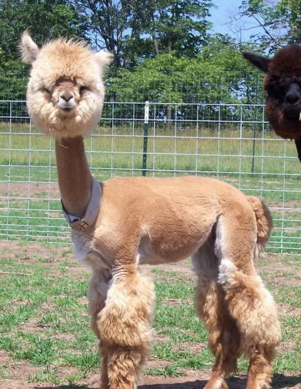
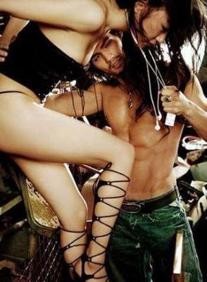

# ＜天枢＞SM的国度——穷矮丑与高富帅的故事

**在这种语境下，每一个M的梦想就是咸鱼翻身的成为S，而得以虐别人，成功的标志，就是有随心所欲的把别人的尊严践踏在脚下的权力。在这种语境下，M们对自己下贱卑微的地位虽然心怀不满，但也觉得理所当然，认为解决问题的方式就是让自己成为S，从此只管虐人，不必被人虐。** 

#  SM的国度——穷矮丑与高富帅的故事

## 文/ 莫婷（厦门大学）

 

刚看到一个帖子，题目大意为“穷矮丑永远战胜不了高富帅”。这貌似是一个深得男生心的故事，因为看到已经不止一个男生分享了，讲的是一个集万千杯具于一身的穷矮丑（第一人称“我”），被一个集万千宠爱与邪恶于一身的高富帅大学室友各种欺负，欺负的内容集中在高富帅奇迹般的泡到穷矮丑心仪却永远得不到的种种女人。这些美艳异常的女人个个势利无情，对待高富帅像春天般的温暖，对“我”这个穷矮丑严冬般的冷酷，集放荡与欺骗于一身，又名曰“黑木耳”。有的黑木耳曾经也是纯洁好骗易推倒的天使，还不懂得嫌弃穷矮丑的“我”，但高富帅一出现，天使们就着了魔似的纷纷折翼了，比少林方丈给失足妇女开光还灵验。只剩“我”感叹命运的不公，既生穷矮丑，何生高富帅。

这种穷尽人类所有阴暗扭曲的受害妄想症的意淫文章本质上相当于不入流的怨妇肥皂剧，就是那种讲一个无可挑剔的良家妇女，把自己的青春无怨无悔的献给自己夫君，可那个死男人后来升官发财就无情无义，全然不顾善良隐忍堪称完美的结发妻子任劳任怨的奉献，着了魔似的被半路杀出来的富于心计奸诈狠毒的小狐狸精勾了魂，执意抛弃家庭以及无辜的孩子，而良家妇女却依旧任劳任怨把儿子拉扯大，后来儿子有了出息成了大官，成了远近闻名的孝子（孝顺的内容包括与良心被狗吃的父亲决裂，并把他和狐狸精后妈逼得无路可走），最后，高潮来了，良家妇女最后和战乱时期被迫分开最终衣锦还乡的初恋情人（道德模范好男人，一辈子默默爱着她，终生未娶）在一起，同时那对忘恩负义的狗男女在穷困潦倒中得梅毒死了。家庭妇女观众们往往一边看一边斜着眼睛瞪着身边老伴，明察秋毫地试图从老伴身上搜寻狐狸精遗留的DNA片段，剧终，心满意足的抹抹眼泪，换台了。

这个穷矮丑与高富帅的故事，自然也会顺着这种套路发展。故事实在太长，但我仍然翻到了穷矮丑的“我”有一天终于时来运转，得到了一大笔钱！然后！高潮的报复阶段来了！“我”虽矮丑但已暴富，就一个一个的找出那些曾经冷酷无情的黑木耳，狠命的作践报复，欣赏她们在自己的金钱面前奴颜婢膝的样子。故事太长我就没看下去了，反正大概就是这个样子，患有受害妄想症的作者决意要把自己往绝对苦逼的死里整了。

这种把自己想象的无限悲惨可怜无辜，别人都占尽一切优势死命欺负自己的肥皂剧故事，本身的价值也就是供百无聊赖缺乏安全感的家庭妇女打发无聊发泄情绪。但，穷矮丑的复仇故事让我想起了天上人间的传说。传闻天上人间的服务员是跪着进包间服务的，这种服务方式深得客户欢迎。有个煤老板就对记者说，他从前也是卑躬屈膝的苦过来的，现在发达了，享受到这种待遇感到心里很满足。同理，在意淫出来的穷矮丑与高富帅的世界中，游戏规则就是穷矮丑扮演受虐者M，高富帅扮演施虐者S。穷矮丑默默忍受着自己与生俱来的M地位，打落了牙往肚子里咽，朝思暮想终有一天自己也能成为虐人的S。终于有一天穷矮丑咸鱼翻身，大批量占有了朝思暮想的美女们，开始了虐落魄高富帅的征途。这里的美女们和武侠小说中的众女性角色一样，美艳风情种类俱全，可以满足男人对各种类型女人的想象，但和真实世界中的女性相差甚远。与武侠小说中围绕在主角身边的各类痴情女性们不同的是，穷矮丑与高富帅的世界中，女性不但被当做完全的客体，穷矮丑与高富帅争夺的战利品，而且还被纳入了SM的语境。相对于穷矮丑，她们就是高跟鞋踩在穷矮丑脸上的S，穷矮丑只能对着她们抛弃的内衣SY；相对于高富帅，她们就是被高富帅压在身下的泄欲工具M，心甘情愿的犯贱。

在这种语境下，每一个M的梦想就是咸鱼翻身的成为S，而得以虐别人，成功的标志，就是有随心所欲的把别人的尊严践踏在脚下的权力。在这种语境下，M们对自己下贱卑微的地位虽然心怀不满，但也觉得理所当然，认为解决问题的方式就是让自己成为S，从此只管虐人，不必被人虐。中国人从来浸泡在M推翻S的王朝然后自己成为S享受虐人快乐的历史循环中，自然对华盛顿的所作所为大为惊叹，曰：“华盛顿，异人也。起事勇於胜广，割据雄於曹刘。既已提三尺剑，开疆万里，乃不僭位号，不传子孙，而创为推举之法，几於天下为公，骎骎乎三代之遗意。其治国崇让善俗，不尚武功，亦迥与诸国异。余尝见其画像，气貌雄毅绝伦。呜呼！可不谓人杰矣哉。米利坚合众国之为国，幅员万里，不设王侯之号，不循世袭之规，公器付之公论,创古今未有之局，一何奇也！泰西古今人物，能不以华盛顿为称首哉!”（徐继畬《瀛环志略》）。大意就是，这哥们跟陈胜吴广曹操刘备一样拼死拼活，打天下成功后却不愿成为S享受虐人快感，图个啥？而不料，美利坚之建国者，那群被传统社会放逐的人们，决意跳出SM的怪圈，建立制度与精神之新大陆。

穷矮丑与高富帅的故事受到追捧，甚至是一些自称草泥马的人，不由让我怀疑其中有些人是否真的理解自由平等的含义（当然我也同意贫富鸿沟扩大社会板结化阶层矛盾激发也许是此类故事受欢迎的原因），竟然对SM为主旋律的故事产生共鸣。

追求自由，不应只是因为自己受到束缚，追求平等，不应只是因为自己受到不公正待遇。认为自己正在追求自由与平等时，应记得后面还有一个词——博爱。只有懂得尊重别人与自尊的精神，才能保证自己抗争胜利后不至于成为自己曾经强烈反对的东西，这样，才能跳出SM的怪圈，建设真正自由平等的新大陆。自由平等成为现代法治的共识，博爱却常常被纳入道德范畴而被忽略，或者说仅仅作为一个美好的理想，无法设计到制度法律中。确实，博爱无法也不应当纳入法律制度的考虑中，很多试图规范公民道德的强制性法律往往苍白无力，甚至引起反效果。但是，缺乏精神土壤的情况下，想真正实现自由平等，也许举步维艰，或许，一有闪失，就堕落回SM国度。想当年，垬也是喊着自由平等建立没有压迫的社会的口号起来的，但是，垬的统治者是个帝王思想很严重的人，从他的思想和行事理念就可看出，而这个渴望自由平等的国度，却是习惯于等级划分缺乏个人尊重的土地。有这样的一群人，在这样的社会土壤中，终究还是实现不了自由平等。基于博爱而出的自尊与尊重他人的精神——不管是个人行为上，还是制度理念上——是不至于滑落回SM国度的精神保障。

这样看来，美国在建国的当年，确实比中国具备博爱的土壤。美国的先驱者，是被英国放逐的清教徒，还有一批被社会压迫的底层人士。本来在基督教的理念中，就是上帝面前人人平等，每个人都有一颗上帝所珍视的灵魂，都是上帝喜悦的孩子，没有高低贵贱之分，既然自己是上帝所喜悦的，当然自己也必须自尊自重。加上来到北美土地开垦的人们，都是一些饱受压迫之苦的人们，深知不平等不自由的苦衷，所以决意弃绝高低贵贱之分，实现真正的自由平等。而在中国传统中，等级森严是有序社会的保障，人的社会意义大于自然意义，比如说，“孝”这个概念，是基于人的身份地位而定义的，你身在这个地位，就必须恭敬服帖（这也是我为什么反感孝道之类东西的原因），而不像西方基督教文明语境下的那样，把子女对父母的感情归入爱的范畴，而爱的意义在基督教理念中相当于自然（他们认为神就是爱，神就是自然），是一种很广阔很理想化的理念。中国这种等级传统，经过时间变迁和庸俗化，最终造就了SM畸形社会。

我向来很不喜欢见到有人自贬尊严。以前在某一篇文章中表达过我对自贬尊严的乞讨方式的反感，结果被一些人说成不懂得穷人痛苦的养尊处优的大小姐，实在是鸡同鸭讲。我的意思是，当一个社会对自贬尊严或损害他人尊严见怪不怪的时候，这个社会就是畸形的。我不相信，一个接受了SM游戏规则而自贬尊严的人，一旦自己有幸成为了凌驾众人之上的S，不会自然而然的去作威作福损害他人尊严。那些看着自贬尊严者而见怪不怪不痛不痒的旁观者，不敢武断的说他们默认了SM的游戏规则，但至少可以说不会对建设自由平等的社会有帮助。

我主张并信奉博爱，却对陈光标这样的慈善家不待见。最近他在贵州毕节开演唱会，宣传凡事现场听完他演唱会的人都能获得一头猪，一只羊以及农机具，曲目有《没有共产党就没有新中国》这种强调老百姓要对垬感恩的歌曲（被西方腐朽思想洗脑的我认为应该是垬感激老百姓当年瞎了眼选择了它），《我是你的光标》这种让我无语的歌曲（怎么不叫《我是你的灯塔》，或《我是你的太阳》=。=），等等。在我看来，慈善行为的目的和行为方式同样重要，任何慈善不得以贬损接受慈善的人的人格尊严的方式作出，其中包括不得附带任何与慈善目的无关的控制他人自由意愿的条件。比如，要是我以捐助对象高喊三声“皇军万岁”作为施“恩惠”的条件，这场景是不是很荒谬。我想起那张著名的照片，陈光标要求群众一齐高举他捐的百元大钞，把他簇拥在中间拍照，除了笑容满面的他，照片中的人们面色阴沉。这张照片仿佛是接受捐助的人们被迫宣称“看，我们得到了陈光标的恩惠！”微博上对陈光标的态度有支持有质疑，质疑者很多是看不惯陈光标的炫耀和排场，支持者认为炫耀和排场都不重要，关键是老百姓得到了实惠。但在我看来，陈光标的做法，很有可能严重摧毁接受捐助者的自尊，从而为巩固SM社会贡献了一臂之力。如果陈光标把接受捐助者视为和自己一样平等的有尊严的人，也不至于演出那样的闹剧。本来接受捐助者客观上处于弱势，行善者应当低调谦和照顾受捐助者的感受，若是真的想为他们好的话。

如果我们这个国家还有人把忍气吞声接受凌辱视为常理，把过上作威作福占尽好处的日子作为奋斗理想，弃绝自尊，也不愿尊重他人，缺乏人格平等意识，那么就注定在SM的维度中沉沦，在穷矮丑与高富帅的游戏中玩儿蛋去吧。

 

（采编：王也；责编：陈锴）

 
