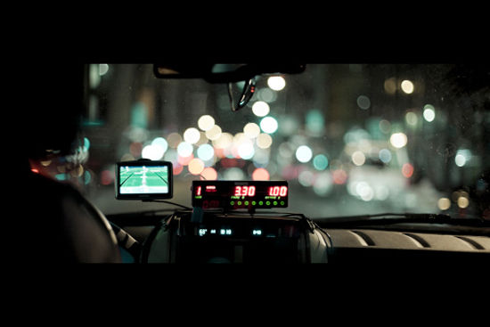
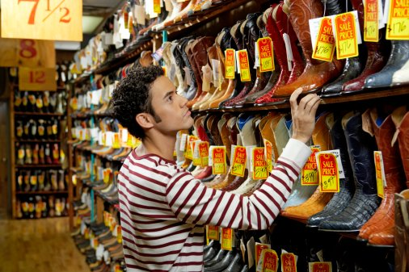

# ＜天枢＞“涨价论”是错的？

**理论上能涨价出清的市场，往往会因为现实条件的限制而突然增加出成本来，而这些成本在黑板经济学的模型中，往往并不存在，但却会切实影响交易行为。大而化之的“涨价论”缺乏对事实及约束的观察，也是在这个意义上，我认为所有未能提供约束说明的“涨价论”都是不值一提的。**  

# “涨价论”是错的？

## 文/李华芳(上海金融与法律研究院研究员)

 

北京暴雨事件的各种争议里，有一个问题被反复提及，就是在暴雨中出租车要不要涨价的问题。有一些“涨价派”朋友对坚持自由主义立场但批评涨价非常不理解，这篇文章将解释为什么“涨价论”在这里是错的，以及为什么坚持自由主义立场与批评涨价论是并行不悖的。

就真实世界的经济学而言，研究的出发点“假设”要符合真实世界（Real）的情况，并且最好还“易于处理（Manageable）”。为什么不仅要易于处理，还要真实呢？周其仁曾介绍过科斯的看法。在科斯看来，这种为了易于处理而放弃真实的倾向，已经导致如下不良倾向：“当经济学家们发现他们不能分析真实世界里发生的事情的时候，他们就用一个他们把握得了的想象世界来替代”。所以当北京的出租车在暴雨时没有大规模涨价时，他们不去探究为什么没涨价、是什么约束了涨价、这些约束哪一些是不符合市场规律由政府强加的，哪一些则是自发秩序的扩展带来的，而是直接用一个“应该涨价”建构了“并不存在的完全竞争的市场”。

在上述关于约束的问题没有了解清楚之前，他们真的确定如果允许出租车涨价，就会提高客流与出租车的市场出清程度吗？ ****

 **不存在的市场**

让我们将约束条件慢慢拆分出来，一个一个进行分析。灾害天气，恶劣天气和一般天气是不同的。灾害的要害在于不确定性，无法用概率测算。7·21暴雨灾害，我将之定义为灾害天气。

为什么这么区分很要紧呢？因为这涉及到对等车的人到底是属于灾民还是属于顾客的区分。如果等车的人属于受灾人群，那么采用“价高者得”的经济分析是否依旧合适呢？对待受灾人群，是无法简单应用价高者得的做法的。

伦理上遇到的挑战我们就不说了，比如该让领导先走还是让下面有人出价最高的先救？即便从经济的角度去考虑，依旧无法得出此时应该采用价高者得的结论，因为在这种情况下采用“价高者得”的技术成本非常高，迫切希望活下来的人可以谎报一个高价，但即便其无法支付在要立即做出救还是不救决策的情况下，是难以考核的。且不说还有其他各种复杂的未预见的问题，极端来讲，诸如有一万现金但喉咙受损的人可能不及一个身无分文但发出求救声的人，后者更容易被发现定位从而得到及时的救援。当然，这里最关键的是说，没有市场。因为受灾者和救援者并不处于平等的关系，违反了市场“平等主体之间自愿交易”的原则。因此将7·21暴雨灾害当成普通的天气甚至恶劣天气一样来讨论，可能并不是很合适，因为这里并没有市场存在，在主体不平等的情况下，发现价格以及讨价还价要么因为耗时太久要么因为交易费用太高而无法实现。

 **政府管制**

假定上述分析已经明白展示了在北京7·21暴雨灾害中应用简单涨价论的不合时宜性，那么下面要讨论的是在何种条件下“涨价论”可能是对的。“涨价论”者认为允许司机临时涨价，这将有助于司机权衡出车风险和涨价收益，从而在结果上增加了更多的出车量，也就有利于恶劣天气中等车的市民。这时候乘客并不是灾民，而且司机可以基于概率考虑出车风险。这样最不能忍受在恶劣天气中等待的乘客出价最高，司机赚得多，出车多，更多人获益，是个多方共赢的局面，这也是持“涨价论”者考虑到的一个特殊情况：即恶劣天气条件下，出租车市场竞争程度高，那么涨价论或许是站得住脚的。

北京出租车市场的竞争程度可能不如纽约或者上海，但如果说北京的出租车市场就是个完全垄断的市场，恐怕也是不合适的。在这种情况下，当然应该继续反对政府对出租车牌照的数量管制，不过我支持这种反对数量管制的理由是从长远看竞争将会提供出租车服务的质量和安全性，从而节省了在安全管制上的成本。简单来说就是与其花钱打击黑车，认为较难保障服务品质和安全，不如放开数量管制让黑车合法化，加入到为人民服务的队伍中来。况且这还有助于减少黑车帮派之间为争夺地盘而产生的冲突，也有助于减少执法者与黑车帮之间的猫捉老鼠的成本，促进和谐社会。

但这里的确存在另一种形式的政府管制，及在恶劣天气条件下，出租车也不得单车与乘客议价。出租车之所以不是单车议价，而是一般由出租车公司或行业协会统一定价的理由其实也是为了节省每一次议价的成本。但具体到北京而言，还需要考虑政府管制的影响。因为按照《北京市出租汽车管理条例》的相关规定，出租车是不能擅自议价的，违反此项规定，乘客可以投诉。不过事实上存在出租车自行议价拉客的现象，表明这类违法规定的行为还是值得冒一定风险的。这可能与出租车的多头管理方式有关，根据第三条的规定：工商行政、税务、物价、劳动、公安、公安交通、技术监督、旅游等管理机关，按照各自的职责，依法对出租汽车进行管理。这么多婆家就难免出现到底谁去管的问题，扯皮和推诿是免不了的，所以这也给出租车冒险违反规定提供了机会。

 **现实局限**

不过我们发现在恶劣天气条件下，出租车司机有两类不同的司机行为。一类是仍旧采用不涨价，在候车点接送乘客；另一类是不在指定候车点不按计价器与乘客议价。需要承认的是，在恶劣天气中，这两类情况都是存在的。

那么问题是同样的出租车司机为什么选择了如此截然不同的行为呢？甚至同一个司机上午还在街角议价拉客下午就去了排队点候车，尽管一整天都是恶劣天气呢？为什么会形成两个并存但不同的市场？这才是要分析的关键所在。实质是这两种行为对应的是对预期的成本和收益的不同判断。在候车点，节省的是寻找乘客的时间；而在街角增加的单独议价的预期收益。所以这两种情况并存。之所以大量司机依旧选择候车点，主要是一来街角竞争激烈，二来受到出租车公司管理制度的限制。当然，我们在上面已经提到公司管理的限制主要也是因为政府管制而来。

所以这里的困难还是现实中的可操作性问题。如果你考察北京机场及火车站等地的出租车候车点，就会发现是建筑物本身的限制导致了愿意出高价的乘客，也不一定能轻松排到前面去。意愿和实际的约束之间存在不可逾越的障碍。而即便是出租车愿意叫高价，也很难及时传达给拥挤的乘客，从而这些乘客能按照出价高低自动迅速排列起来。这不是电脑上的股价排序，少量内存就能完成出清交易。所以高价成交和黑车成交都发生在人数较少的时候，而不适用于广大的乘客群。也就是说，理论上能涨价出清的市场，往往会因为现实条件的限制而突然增加出成本来，而这些成本在黑板经济学的模型中，往往并不存在，但却会切实影响交易行为。

常识背后往往有极其深刻的经济学道理，不细查其约束条件，就很难理解何以人类会发展出各种形式的组织和机制来应对复杂而多变的世界。若将特定约束下的“涨价论”泛化为万能药，就背离了科斯关于真实世界的经济学的分析思路。而大而化之的“涨价论”正缺乏对事实及约束的观察，也是在这个意义上，我认为所有未能提供约束说明的“涨价论”都是不值一提的。

 

（采编：彭程；责编：马特、佛冉）

 
