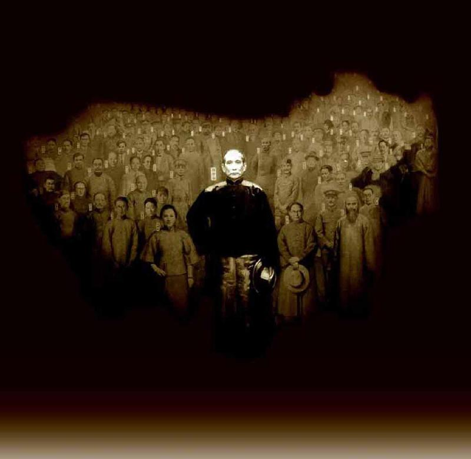
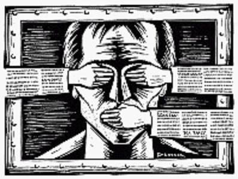
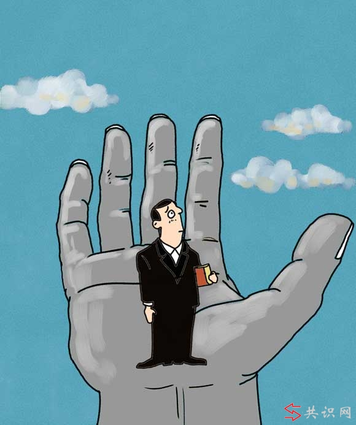

# ＜天枢＞一名“美分”的自白：向体制妥协是最好的选择

**认真想想，我们在网上声张正义，针砭时弊，这些只能做平时消遣所用，真到了影响自己前途的关键时刻，你有没有胆气发表你平时在网络上的言论？比如你想当干部，就要入党，你能在入党申请书上写我党的坏话？比如你想拿到体制内的科研经费你能不给体制歌功颂德？比如你想升迁，你能不讨好党委？入学研究生的考试，你能在政治科考试里像往常一样大骂体制？**  

# 一名“美分”的自白：

# 向体制妥协是最好的选择

## 文/兰天（浙江大学）

 

前言：一直以来我都很推崇美国的三权分立制度，也不乏对本国制度的贬低，一直被五毛们骂为美分。但从去年南京大屠杀纪念日写过一篇极具争议的[《写给那些爱国者——如果日本灭掉中国，你们敢纪念南京大屠杀》](/?p=17364)之后，快半年没有写关于政治的文章了，也越来越少对政治吐槽了。最近有朋友问我怎么了，是不是准备向体制妥协了。我想或许你们猜对了。

 一、体制是绕不开的话题。体制需不需要改变？ 

我们的体制有没有问题，作为一名美分，我的回答是毫无疑问的，我们总是从自己或者别人口中听到“这是体制问题”。我们已经说腻了也厌倦这个话题，我也曾为能不能绕开体制这个话题做点事情而纠结很久，但是朋友刘三山[《年末》](/?p=17874)中举的一段例子让我茅塞顿开：

足球，应该不是“体制问题”了，这必须是“体质问题”。你总不能说是一党专政，缺乏法治导致足球落后的吧？那么我们从其他周边入手吧，提高球员技战术水平，发展商业联赛，培养群众基础，选拔青少年苗子……但是继续走下去又出现困局，譬如，青少年培养断链，为了出成绩虚报年龄就是一大问题。是又要解决虚报年龄的问题，但这涉及到许多地方体育官员的利益，为了出成绩，虚报年龄是最有效的捷径。那么再下去就是举国体育制度和缩小体育部门管理范畴的问题了。好吧……那个，我们先不动这一块，尝试从其他方面入手，解决我们国家的足球水平落后的问题如何？于是一块一块分析下去，最后，能采用的只有请外教临时恶补，以及哀求球迷要对国家队有信心这几个方案了。

听起来像开玩笑，但这就是在我们国家目前为了解决问题的基本分析方法：方法一最有效，会不会影响体制？----会。----那么就方案二吧，比较有效，会不会影响体制？----也会。……好吧只剩方案九十九了，基本不能解决什么问题，会不会影响体制？----不会。----那就这个方案了！敲定！

再比如，公布官员财产问题，有人说西方官员公布财产是他们开放文化决定了，我们中华文化讲究保护隐私，“笑不露齿”。但是同属于中华文化的台湾、香港都公布了官员财产，而我国当局总是逃避此话题，你能说这不是体制问题？那你见过哪个国家反腐败的方法不是司法独立，也不是官员财产实名制，却是成天让官员看电影学习红头文件讲道德唱红歌的？

温家宝总理也多次强调必须推进政治改革，先不论他是不是真心诚意地说这些话，至少他如此对外宣传，说明高层也认为推进政治改革是正确的应该的。但至于做不做，能不能改革成功，这就是这就跟下来我会谈到改革的阻力问题。

无论你愿不愿意，体制带来的问题是无法回避的。体制需要改变，这是此文的立论基础。

 二、对个人而言，在中国，知识分子不向体制妥协就是葬送自己的前途。 

记得初入大学时，我十分积极地写了一篇关于政体选择的邮件给我很喜欢的一名教授（我想他不会愿意我透露他的姓名，所以就不写了），后来这个邮件石沉大海，刚开始我还以为他不屑于看我一个本科生的文章或者觉得我这篇文章不值一评。谁知后来，有一次我有机会与他面对面单独交流，他突然问我：“你还记得一年前你发给我的一封关于政体选择的邮件吗？我没有回你，你现在还是坚持那种观点吗？”我回答：“内心还是坚持，但是尽量不去发表议论了。这些事情，我无法改变，只有适应。”老师笑了笑：“呵呵，你终于成熟了！其实我是认同你的观点的，但是作为学者、教授，谈论这些问题是很危险的，贺卫方水平高不高？影响力大不大？省领导不喜欢他的言论，他不是照样来不了浙大被流放到石河子？你作为学生也一样，以后心里知道就可以，不要多说了，在中国，永远祸从口出！如果你不向体制低头，不写体制的好话，你连毕业论文都通不过。”

是啊，认真想想，我们在网上声张正义，针砭时弊，这些只能做平时消遣所用，真到了影响自己前途的关键时刻，你有没有胆气发表你平时在网络上的言论？比如你想当干部，就要入党，你能在入党申请书上写我党的坏话？比如你想拿到体制内的科研经费你能不给体制歌功颂德？比如你想升迁，你能不讨好党委？入学研究生的考试，你能在政治科考试里像往常一样大骂体制？

你不是在网络上总把胡适的名言“争你们自己的自由便是为国家争自由，争你们自己的人格便是为国家争国格。自由平等的国家不是靠一群奴隶建立起来的”挂在嘴边，到了真正关系到自身重大利益的时刻又有几人能以胡适的这句名言来要求自己？

有人说我们可以学那些作为我们偶像的公知啊，但是，你可以去认真研究他们发展的轨迹，当今中国，有名的异议公知，哪一个不是隐忍谄媚地获得名望地位、家庭幸福、生活无忧以后才开始发表异议的？秦晖、朱学勤、茅于轼、张千帆、贺卫方等等，几乎都是爬到高位才开始显露异议本色。李承鹏，写足球评论出名以后才开始批判当局，即使是韩寒也是在08年以后才开始把重心放在了时事评论上。

我并不认为内心存在异议而表面拍我党马屁，如此表里不一有什么可耻。向体制隐身拍马屁拿到的东西，本应该就是我们的。比如教育的机会，我们考研究生，有人会说党给了我们在大学深造的机会，难道研究生的拨款经费难道不是来自于我们爸妈向体制的纳税？我们不该享受吗？但我们又必须在政治科目中谄媚写下一些可能违心的话。所以，有时候我们必须学会隐忍地拿回属于我们自己的东西。

一个人自己要和主流社会对抗。无论这种抗争的数量规模有多大，都不足以威胁社会的权威机构，枪摆在那里，个人的独立活动永远无法和有组织的权威机构的暴力相抗衡。空椅子的悲剧已经深刻地告诉了我们这点。

历史的经验证明，不仅个人的行为要颠覆国家不容易，就是一些组织要颠覆国家也不大容易，不论这个组织的成员有多穷，情绪上有多不满。一个社会中，政府一般是最强大的暴力的拥有者，一般的组织与政府对抗也会付出惨重的代价。20多年前那场有组织的运动也告诉了我们这点。

向体制妥协，从个人角度讲，是我们为了自己的前途不得已的选择。向这个体制妥协，是为了让自己成长得更强大，或许到我们这个群体强大到一定程度就能向这个体制叫板了。

 三、暴力革命的可能性——“穷则思变”不仅因为“穷”，更因为他要“致富”。 

有人论证中国必然会发生暴力革命时，总拿中国贫富矛盾、阶级矛盾加剧作为第一论据，中国穷人自古有穷则思变的说法。麦克纳马拉也说过：“暴力与经济落后之间有着无可争辩的关系，此点毋庸置疑。”

有人调侃，投胎是门技术活，生在中国是选择了hard模式，确实如此，我想说如果生在印度那才是quite hard模式。对印度稍有了解的朋友，应该知道印度普遍存在的种姓制度使印度的阶级差距比中国大10倍不止，种姓继承，子子孙孙不能换种姓。印度高种姓与低种姓几乎不能通婚，而首陀罗除了维持生计的生活资料外，无权积累私人财产，高种姓有权夺取首陀罗的一切。种姓层级最高的婆罗门不及人口的4%，却占有七成的司法权及接近半数的国会席次。就算在天灾时，贱民亦饱受歧视，得不到最基本的援助，2008年8月，印度比哈省的阿拉里亚发生水灾，然而由于阿拉里亚为贱民的集中地，灾民得不到地方政府的任何协助，令大量灾民死于水灾当中。如此残酷不公的种姓制度却并没有得到太多的反对。现在依然牢牢控制这印度社会。

在英国统治时期，印度发生政治暴力最普遍的是那些经济高度发达的邦里；独立以后，暴力冲突仍然比较集中在实现了工业化的地区和城市。对于贫穷和地位低下，忍受而不反抗的痛苦有一个限度吗？或者没有一个限度吗？今天印度农村和城市贫民窟里低种姓许多人默默忍受的悲惨之极的生活条件大概表明：没有这样一个限度。

中国人有这个限度吗？从历史来看，改朝换代固然有陈胜吴广等农民起义的激发，但最终夺权无一例外是达官贵人或者异国统治者。自古以来的忠君的儒家教育让中国人缺乏反抗意识，知足常乐，只要还有一口饭就不会造反。何况我国目前免了农业税、补助农民，况且他们文化程度不高缺乏反抗意识，更不可能发生反抗。

有一句话很形象，在微博上，看到大家对政府的不满，你会觉得明天就会革命了，但你走到菜市场，看着一片祥和，你会觉得一百年都不会变天。毕竟强拆、黑煤窑这些危及生存的事情是发生在少数人身上，有一口饭吃的中国老百姓就会当温顺的绵羊，和谐号死难者，肯定有对京珠高速大火漠不关心的；京珠的死难者中，肯定有对上海胶州路大火漠不关心的；胶州路的死难者中，肯定大多数人对汶川豆腐渣难童漠然的；汶川难童家长，又有几个人对克拉玛依大火表示过愤慨的……中国人就是这样，铁勾勾住嘴，刀子架在脖子，才会开始叫。

同样，亨廷顿在《变化社会中的政治秩序》在提出，贫困与落后，动乱与暴力，这两者之间的表面关系乃是一种假象。如果一个国家出现动乱，那并非因为它们“贫穷”，而是因为他们想“致富”。而几千年的封建教育以及我党的洗脑宣传，让很多从六七十年代走过来的人（目前社会的主流）没有这种“致富”欲望。他们总是说：“现在已经不错了，国家在慢慢改变，你没有经历过文革啊……那才是惨烈，做人要知足。”是啊，我没经历过文革，但是经历过文革成了你们的光荣了吗？但这种心理是可以理解的。如果我们跑1000米，别人顺利摘走了第一，但我们被绊倒再起来跑落后挺多，也总是这样自我安慰：“谁叫我绊倒了呢，跑成这样不错了。”

印度、中国这些贫富差距巨大、严重不公的国家没有动乱，而利比亚、叙利亚这些相对富裕的国家发生了政变动乱，穷人要和主流社会发生对抗，不仅仅是因为穷；贫穷可能是对抗的必要条件，但却不是充分条件。他还需要“致富”的强烈欲望，这里的“富”不仅包括物质上的富足，也包括精神上的“富”即是改变“现存的秩序”的动力——人权、民主、宪政。这显然是目前占据我国主流社会话语权的中年、老年人们所缺乏的。

 四、激进改革后的后果。 

杨小凯99年发表的《经济改革和宪政转轨》发现小国政府间的竞争有利于宪政转轨，“在西欧，试验各种制度，扩散、模仿、转轨到成功的制度的一个重大推动力量是西欧的政治不统一”这个论点已被历史证明，通俗来说就是船小好调头，而大国的改革（印度、中国、俄罗斯），必然牵一发而动全身，任何一点点纰漏可能就会形成巨大的错误。并且俄罗斯的前车之鉴可以看出，我们现在所争取的利益也不能通过激进改革获得。

苏联解体之后，俄罗斯以放开物价、大规模快速彻底私有化为主要内容的“休克疗法”式激进改革，每人发放1万卢布购买私有化债券，最后导致接着发生持续恶性通货膨胀。企业的经营者和有钱人乘机廉价收买，私有化证券以极快的速度向他们手中集中。最终导致苏联庞大的国有资产被别列佐夫斯基的西伯利亚石油集团为首的七人集团瓜分。而老百姓的生活水平急剧下降直到普京上台才有所好转。

当然俄罗斯的改革的艰难不仅来自于休克疗法。杨小凯说“由于俄罗斯缺乏法治传统，俄罗斯的转轨也许要比17世纪的美国转轨和19世纪的法国转轨更加困难。法国从旧王朝到新宪政秩序的转轨花了一个世纪，俄罗斯是一个庞大的内陆国家，且有着更不利于转轨的历史。许多学者把俄罗斯不佳的转轨绩效归咎于法律执行不力”。

而俄罗斯曾经遇到的苦难，我们同样有，甚至更加严重。目前我们大部分官员（特别是高官）的子女要么继续从政要么从商，其余大部分都已移民国外，一旦他们不能承受的激进改革出现，完全可以带走大量财产跑路到大洋彼岸，享受富足的生活。既然我们要建立民主自由尊重私权的国家，自然不能像当年打土豪分田地一样分掉别人的合法私有财产。私有化的快速进行，留在国内的权贵更可以通过已占有的优势将国有资产瓜分为私有资产。如此老百姓将如当年的俄罗斯人一样独自承受不堪设想的后果。

当然有人会说这是改革必有的阵痛。我不否认改革必有阵痛，但，如果面对一个被掏空了的国家，剩下十多亿平民老百姓，我们拿什么建立起来我们拿什么发展国家？拿什么建立希望的社会保障体系？

德国哲学家赫尔德陈阐述一种稳定社会的“置换战略”：“在需要的时候，可以把政治和经济问题的糟糕的后果分散给最软弱无力的集团。”他认为如果民选政府要确保现有秩序的最平稳延续的可能性，那么，他们除了安抚那些最强有力、最能有效调动资源的人以外，几乎别无选择。中国的弱势集团当然是农民，可过去，他们已经承受了大量“糟糕的后果”，如果搞民主政治，他们还要承担这样的后果吗？那我们改革的初衷也是什么？

我们不能空有改革激情而疏于理性思考，我们应该勇于改革旧体制，但不能全然忽视了广大民众在改革中的利益，彻底同昨天决裂并不是改革的最终目的。

 五、历史上成功的改革从来都是妥协的结果。 

梭伦改革是雅典城邦乃至整个古希腊历史上最重要的社会政治改革之一，它为雅典城邦的振兴与富强开辟了道路，奠定了城邦民主政治的基础。其在经济领域中颁布的解负令中，不同意平民平分贵族财产的要求，但首先照顾平民的利益：废除奴隶的公私债务和债务奴隶制。其次，为了减轻贵族的强烈反抗，稳定社会秩序，梭伦改革也保留了贵族的利益，使贵族继续保持经济优势，例如允许保留贵族世袭的地产，也就是那些不是通过高利贷手段获得抵押的土地。在政治领域，首先，对平民作出一定让步，用法律保障平民获得了参政议政的机会，打破了贵族对政权的垄断地位。其次，贵族的政治利益通过财产等级制度、四百人议事会的名额分配，仍然得到最大程度的保护。正如梭伦在诗中就写到：“我拿着一只大盾，保护两方，不让任何一方不公正地占据优势”，“我所给予人民的适可而止”，“我也不使”“有钱有势的人”“遭受不当的损失”。

即使以严刑峻法著称的商鞅变法其中也有少许的妥协精神。没有用一纸命令推开改革，而是弄了个“徙木为信”的开锣戏，先让百姓相信政府的信用。面对有人利用太子阻挡变革，商鞅做了退让，处罚了太子的老师，这才保证了变法的成功。 评价改革的成功，不应片面认为带有妥协就是一次不彻底的改革，一次失败的改革，没有妥协就没有改革的成功。历史的进步是在妥协中完成的，历史上的成功改革亦然如此。

 六、向体制妥协以求“增量改革”或许是一条出路 

上文我已经论述过既得利益集团不会放弃他们的固有利益（无论他们的积累是否合理合法），如果改革触及到他们的固有利益，他们必会极力反对，以破坏改革，而且如果激进改革到他们不能容忍的地步，他们更有比我们普通老百姓多得多的退路。他们的固有利益我们是很难触碰的。即使触碰了，我们也可能因为自己内部的分配不均造成更大的麻烦。

当你不能改变，你就得适应。这种不合理的状况已经是固有存在的事实，我们必须在尊重事实的前提下进行改革。

或许我们可以妥协寻求增量改革。增量改革意味着什么？我不触动你过去存量，而是加入新增的量，通过整个社会结构、事业结构、产业结构某一领域里边的构造，使得整体上、结构上得到适应社会需求的某种改变。妥协让那些既得利益者相对来说，对这样一种变化对这样一种发展，不持反对态度。至少不会拼命地去阻碍这样一种社会变化的发生。如果你直接剥夺他的利益，他一定会对你进行殊死反抗。你计算下来你会发现，可能对剥夺他利益本身来得痛快淋漓，但是你付出的社会代价也许很大。

比如我们年轻人推崇的20多年前的那张运动，那种无所顾忌明明白白地追求自由民主的情怀让我们心驰神往。可惜它最后被无情扼杀了，因此我们也付出了巨大的代价，直观一点，党委进驻高校是因此事，大学生就读必须军训也是因为此事。80年代的社会风气、政治气氛比现在自由许多，这是公认的。或许如果没有那场运动，没有那么激进地触碰到当权者的既得利益，而是选择保留我们的利益从增量的变化当中，使这个社会能够在现代化的路上，能够往前以一种相对比较快的速度往前走。像温水煮青蛙，就像一片一片切香肠。那么，现在中国可能会开明许多。

人大教授喻国明曾说在中国任何经济意义上的改革，都是某种程度上的政治改革。政治是什么？政治不过是利益分配。而经济的任何改革，其实也是一种用经济的这种形式，来体现的政治的改革。我国是从过去的全能政府，变成有限责任政府。政府的权利不断逐渐向民间、向社会、向个人释放，这就是改革，改革开放三十年以来的一个真相。而这样一种权利释放的本身，事实上就是一种政治体制的一种改革。当然政治改革不只如此，还有司法改革，监督体制改革等等。

观察中国的变化不只要看他的现状如何，更重要的是看变化方向是否正确，哪怕再小的一点进步，它也是向着正确的方向发展，今天是一点小变化明天一点小变化，积累在一起，就是大变化。

道格拉斯•诺斯证明了意识形态对于长期经济政治结构变迁的意义。“促使一些群体不再按有关成本与收益的简单的、享乐主义的和个人的计算来行事。这是各种主要意识形态的中心问题，因为无论是维持现存的秩序，还是推翻现存的秩序，离开上述行为都是不可能的。”

如今网络的普遍，众多不公事件暴露在人们眼球下，让我们能够对于过去很多的洗脑教育以及愚忠思想进行反思，越来越多的年轻人，都或多或少地接触到也认同民主自由的思想，解决了上述“致富”思想的问题，或许到了我们这一代掌握国家话语权的时候，才是真是到了变天的时候。

 

（采稿：徐海星，编辑：何凌昊，责编：黄理罡）

