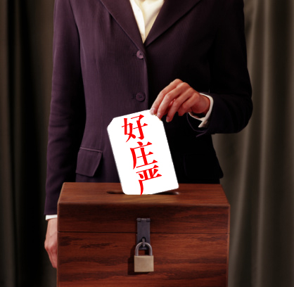

# ＜天枢＞一场行为艺术的胜利——献给厦大人大代表选举

**在当下这种选举制度下，投票是一件很伤感的事情。你若不去投票，那是放弃自己被宪法赋予的权利，你若是去规规矩矩的二选一，那你就是在助纣为虐，用自己的权利和尊严为那个侵犯你权利和尊严的人涂脂抹粉，就像在被强奸后还给强奸犯递上一粒伟哥。**  

# 一场行为艺术的胜利——献给厦大人大代表选举

## 文/ 冯诚（University of Leicester）

 

谨以此文向厦大和复旦的那部分同学敬礼。

今天看到厦门人大代表选举，厦大两个选区都因大量的票投给“好庄严”和“苍井空”，而导致没有任何一个候选人得票过半而不得不重投，让我再次被母校感动了。我想起我大一时参加的那次人大代表选举，那会我还在漳州校区，两个候选人一个是时任校区办副主任的谢银辉，另一个是本部资产后勤处的一个骆姓的老师。当时的我年幼无知，很有一种主人翁精神，积极参与这次人生中第一次选举，认真浏览各种校区的宣传栏，只见一步步的形式也都在走，开始也有很多候选人，貌似还有学生（虽然好像多为学生干部），也貌似有民主评议，学生代表投票之类的活动，但我这个的选举忠实粉丝也都没有在校区内感受到任何的选举活动，只见公告海报一张张贴出，候选人陆续减少，最后被告知，就他俩了，二选一吧！我意识到，选举即便在高校，也都是一个封闭的暗室里的游戏，于是，我就在想应该怎样投出我那人生中第一张选票，来表达我的意愿。

投票前一两天，我想到了合适的办法，就是今天厦大复旦等同学们的做法。那天有位室友睡觉起不来，就委托我去投票，在得到了室友“你随便选”的许可之后，身怀两张选票的我，郑重的在两张选票上分别写上了“胡锦涛”和“周杰伦”的名字。那会，我和松岛枫还不是太熟，否则，我会写上枫姐姐的。投完票后，大多数同学还是对这种处女体验还是很好奇的，纷纷询问别人投了谁，当然，都是这么问的“你投了那个姓谢的还是姓骆的？”更朴实的一种问法是“你投了那个两个字的还是三个字的？”也有同学问我，在得到了我的“荒诞”答案后，同学们的反应一般是“你这是干嘛？投出去也是没用的嘛！”我笑笑，心想，“你投出去的正常的票就有用了？就算是你‘支持’的那个候选人当选了，跟你有关系么？”

5年前的那次投票，有“谣言”说当时校区各级部门给学生干部开会，要求大家动员同学们投谢银辉，因为那是校区的领导，你懂得。。前两天看到校内上有流出的QQ截图，计算机系的某学生干部发动员投票的通知，说“一个是我们院的某某某，另一个是物机的院长，所以投谁根本就不是一个问题，你懂得。。”可见，5年过去了，这些学校里的官僚和学生干部的思想境界丝毫没有进步。但是显然厦大同学们的政治觉悟已经今非昔比。五年前只是个别人无关痛痒的投出废票表达对虚假选举的抗议（因为那次谢银辉同志还是顺利当选了），今天已经是一种集体意识的觉醒，并且实实在在的起到了作用。厦大的学生一向以温和包容理性著称，民粹思想在这里基本没有土壤，同学们很少会被极端的热血的言论所煽动，这次集体行为艺术的表达则体现出当代厦大同学们的思想境界。这让我既惭愧，又骄傲。

在当下这种选举制度下，投票是一件很伤感的事情。你若不去投票，那是放弃自己被宪法赋予的权利，你若是去规规矩矩的二选一，那你就是在助纣为虐，用自己的权利和尊严为那个侵犯你权利和尊严的人涂脂抹粉，就像在被强奸后还给强奸犯递上一粒伟哥。不要觉得这一句比喻很粗俗，更粗俗的是你的行为，真的很贱。我只是指出这种行为的本质，并非是在骂这样做的人，因为几代人的奴化教育，让很多国人如同行尸走肉丧失了正常公民应有权利意识，这是很可悲的。那么，如果你严格以宪法为准绳，跟他较真呢？恭喜你，你离“阴谋颠覆政府罪”不远了。那么你唯一能做的抗议，也是也许唯一能有效果的抗议，就是尊重选举法，在选票上郑重的填上自己更加熟悉的人的名字，比如苍井空或者陈冠希。

看到一些同学不理解为什么很多同学投出“好庄严”“苍井空”这样的“废票”，认为这种行为是不珍惜他们长期以来期盼的民主权利。这种说法是很幼稚的。珍不珍惜首先得真以真正拥有了为前提，一个小学生谈珍惜自己的青春，一个处男谈珍惜自己的女人，一个中国人谈珍惜自己的民主权利，都是荒唐的，你没资格珍惜。那些人的逻辑是，至少那两个人谁能当选，选民有绝对的决定权，这也是一定程度上的民主。但问题是，这两个人谁当选，真的和你有关系么？你投出的那一票，真的会对你自己的生活哪怕产生一丁点的影响么？民主权利不是简简单单的给你一个玩“二选一游戏”的权利，而是能让每一个合法选民拥有公开直接表达自己政治意愿的权利。前期一切工作都在暗室里完成，最后天上掉下来两个候选人，你被告知，他们两个你要从中选出一个来代表你，去监督政府，去为你的利益提议案，去为你服务。而这两个人没有和你见过一次面，聊过一次天，没有问过你有什么需求，没有给过你任何的承诺，你不知道他们俩有什么本质的区别，谁更能代表自己的利益，为自己说话，你也不知道他们当选以后会做什么，是会为自己谋福利还是伤害自己。甚至，你连他们的脸都不认识，名字都记不住。这个时候，让你二选一，你犀利糊涂的选了，就是行使自己的民主权利了？在这种情况下，他俩你无论选谁，都是对自己的不负责任，也是对自己公民权的践踏，以及对我国“人民代表大会制度”的嘲笑，所谓的人民代表，人民自己都不认识，不是很讽刺么？在这种情况下，你所拥有的不是自由，不是权利，只是被限制的被强迫的无从选择的做一个为强权涂脂抹粉工具的卖身契。你把这种当需要被珍惜的民主权利，就好像来到一家只提供扁食和馄饨的餐厅，你却觉得自己吃到了自助餐，自欺欺人。

更过分的是，他们夺走了你的权利，却还要你自己的皮囊上街画押，声称是你自己选择的。你自己的固有权利，被人悄悄的剥夺，没人和你商量，却板上钉钉的替你做了主，你不觉得屈辱，反而觉得自己得到了主人的待遇，你不想着要回本属于自己的东西，还要配合强盗自愿献身，这叫什么？翻遍字典，恐怕没有比“奴性”更贴切的解释了。

我还见到一种说法，说美国总统也是二选一，选民也没那么多选择权。这种说法耍小聪明却不学无术。且不说总统职位和议员（人大代表）职位在性质上完全不同。世界上没有几个国家的议员（人大代表）把自己的这个身份当做一个荣誉或者一个官职的，也没有几个国家的议员（人大代表）是可以不用下选区，见选民，倾听民意，宣扬自己的政治观点，为选民提供承诺的。就说美国总统的选举，最后那俩哥们在竞争的时候，无一不是带着鲜明的政治主张，拼命去尽可能多的讨好选民的。别人的候选人没有我们这么傲慢，没有我们这么不称职，别人选民在投票的时候，既是把票投给个人，也是投给那个人背后所代表的鲜明的政治主张，总之，投票是为了更好的让自己获益，那两个人谁当上谁落选，很可能会在一定程度上影响到投出选票人的生活。这些，我们有么？类比是一种很好的修辞方法，但类比时一定要考虑类比的双方是否在要论证的问题上本质相通，否则，只是哗众取宠的废话。

很多人说，体制恶心是恶心，可是，又能怎么做呢？我认为，行为艺术是一种好方式。不进入体制，不与体制合作，不代表不能利用体制。行为艺术就是这样的一种方式，它利用体制的空间，反对体制的邪恶，甘地的非暴力不合作本质上就是这样一种行为艺术，美国黑人拒坐公交车就是一种行为艺术，而今天把“苍井空”“陈冠希”“好庄严”选成人大代表也是这样一种行为艺术。一张张选票看似荒诞，却用最嘻哈的态度表达出最坚定的声音，我们已经开始觉醒，我们不愿继续被愚弄。更重要的是，这可以让身边原本无意识的人，渐渐地知道，你生活在一个怎样的国度，你拥有怎样的地位，作为公民，你本该拥有怎样的权利，你该怎样做。

有人说，行为艺术有用么？当一场行为艺术变成全民的行为艺术时，它就会有用的。

 

（采编：陈锴；责编：陈锴）

 
