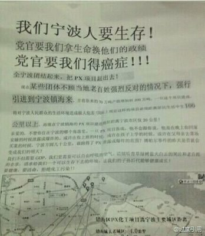
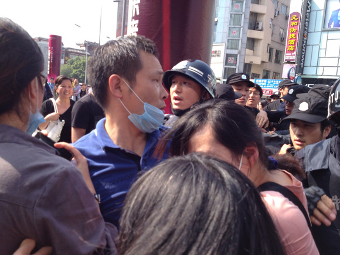
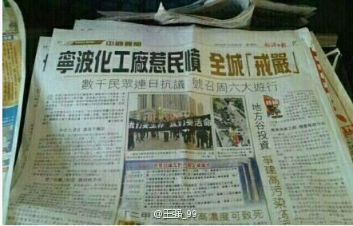
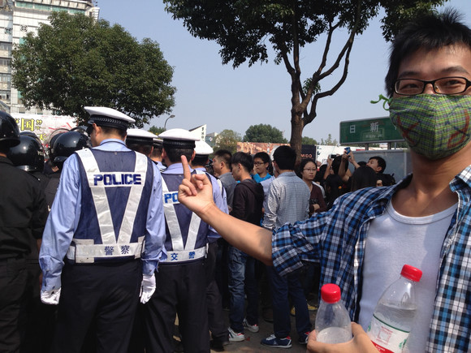

# ＜天枢＞一座城市的幸福不需要催泪弹开路

**这一次它终于要暴露在中国的灯光下，接受一场题为“幸福”的考试。人民有权利知道真相，人民有权利决定自己的土地上是否要建设一个可能危及城市未来的化工项目，人民有权利采取和平的方式表达自己的立场。PX项目的生死与宁波人们在表达立场上受到的待遇，是体现这座城市是否能够无愧幸福美誉的关键点，也决定了我再次碰到他人给我“宁波是个好地方”的评价时，是否能够理直气壮地坦然接受。**  

# 一座城市的幸福不需要催泪弹开路

## 文/王钟的（中国人民大学）

 

我眼中的宁波，一直是一座幸福感极高的城市。

十八岁之后出门求学，面临的是地铁一号线熙熙攘攘的人流，外地人不能在北京参加高考的纠纷，没有户口，买不了房子也买不了车的烦恼。而在我的家乡，尽管交通也愈来愈拥挤，但是很多家庭都能拥有自己的私家车；尽管没有北京如此美妙的北大清华录取率，但是率先实现了免费的义务教育和高中教育；尽管也有很多外地人，但是却没有一道死死的户口门槛。

在北京，在山东，在河北，在广东，在湖南，在青海，在云南，在我这四年多来去过的很多省份，当我常常谈起家乡的名字时，都会引来一声赞叹：“宁波是个好地方。”我不知道他们眼中的“好”是什么，也许是这里经济活力强，也许是这里老百姓富庶，也许是这里是江南水乡。但是对我来说，宁波的“好”就在于这里是生我养我的地方，我无法改变我是宁波人的身份，并因此感到幸福。

当我知道环境危害性存在不确定性的PX项目要被引入宁波的消息，我脑海里翻起的画面是厦门、启东、什邡、大连等地的人们为了自己的幸福与健康走上街头，与身着迷彩绿和黑色制服的另一些人们展开对峙。我常常想，宁波是一个温婉的城市，是一个会过日子的城市，以至于我总是为了这种温婉批评它。哀其不幸，怒气不争，大概就是出门之后我对这座城市的评价。除了每年时不时登陆的台风给这座城市带来几番风雨，这座城市的一切风平浪静。这座城市没有与其经济地位相对称的媒体，没有扎根本地的知名大学，从城市的历史看，这座城市的光耀大多属于游子，而它本身总像躲在长三角南岸的小姑娘，尽管美丽，尽管知书达理，却从来没有在中国的舞台上获得属于自己的灯光。

但是我的确低估了家乡人们的爆发力了。正如这一次它终于要暴露在中国的灯光下，接受一场题为“幸福”的考试。人民有权利知道真相，人民有权利决定自己的土地上是否要建设一个可能危及城市未来的化工项目，人民有权利采取和平的方式表达自己的立场。在此之前，宁波的官方人士一直孜孜不倦地宣传我们取得的“文明城市”、“卫生城市”等头衔，但是这些头衔与普通的老百姓并无关系，仅有的一点关系就是在检查组来临时搞几场全城突击运动，配合配合领导们的政绩工程而已。但是今天，PX项目的生死与宁波人们在表达立场上受到的待遇，则是体现这座城市是否能够无愧幸福美誉的关键点，也决定了我再次碰到他人给我“宁波是个好地方”的评价时，是否能够理直气壮地坦然接受。

远在千里之外的我，多少是为了这座自己生活了十八年的城市正在发生的每一件事情感到震惊的。尽管我是学新闻的，我也曾经亲眼看到过类似的画面，但是今天那些出现在新闻上的画面，真真切切地发生在我家门口的地方，看到排成一列列的武警作为国家机器的代表阻止人民表达立场，居然看到警方也对自己服务的老百姓抛出催泪弹的时候，我甚至感到一种深深的耻辱。这种耻辱并非因为我在千里之外遭遇了什么，而是因为一座城市的幸福幻觉竟然可能因为几颗催泪弹在一夜之间荡然无存。从此之后，我要对我生长的地方打上深深的问号。没错，它依旧是一座可爱的城市，但是它不过是中国的许多城市里面比较可爱的一座而已，面对强权与暴力，面对公权对私权的侵犯，面对长官意志和政绩工程，仍然无能为力。这些事情不仅仅发生在今天，其实在昨天也有，也许在明天仍然不可避免，但是因为镇海的PX，让每一个在外地的宁波人和每一个爱宁波的人们失望。

镇海区的公安很快在网上表态，说“过激行为根本无助于事情的解决”。我弄不清楚究竟是哪一方存在过激行为，因为“过激”一词的解释权并没有放在我手中。至今我仍然存有一张宁波的身份证，很可能毕业之后，我的户口仍然会回到宁波，那个时候，我依旧会因为我是一个幸福的宁波人而骄傲。但是我眼中的幸福宁波，不是通过催泪弹换来的些许稳定，不是通过几句给市民戴上几顶“过激”的帽子就能了事。这座城市真正幸福起来的时候，是“过激”的解释权回归市民的时候，是每一个人都能了解自己身边发生事情的真相的时候，是城市的警察局里不用配备催泪弹的时候。

2012/10/26

 

（采编：彭程；责编：佛冉）

 
