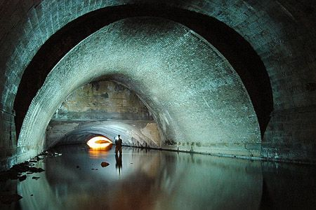
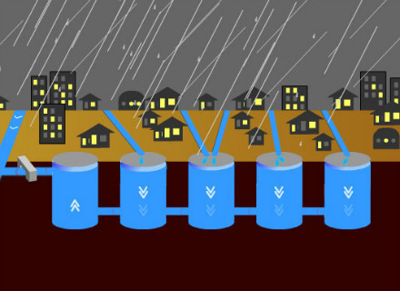

# ＜天枢＞下水道里的现代文明

**人们建设现代排水系统的出发点几乎无一例外都是出于公共卫生和文明程度的考虑，在这过程中人们的驱动力与其说是公共事务管理和内涝造成的经济损失，还不如说是一种羞耻感。因为，如果把城市比作一个人，那么在现代化狂飙突进的时代，城市里污水横流不仅威胁肌体健康，而且是其不文明的突出标志，防涝只不过是下水道附带应有的功能罢了。**  

# 下水道里的现代文明

## 文/维舟(上海)

 

公共政治学上有句名言：“公共管理就像下水道，一般只在发臭之后才会引起人们的注意。”但有的时候，下水道即使不发臭，也会引起注意——尤其当一场暴雨引发城市内涝，竟造成77人死亡和百亿元经济损失的悲剧之后，人们不免要追问：为何没有一个应当在此时发挥作用的排水系统？

排水管线看起来是件小事，而且由于它通常深埋地下，平时也不在人们视野之内（当然更无法作为形象工程），但城市下水道正如家中的排水管和马桶一样，在这看似不起眼的地方有时却能决定生活的质量并表明其现代化程度。

无论中外，前现代的城市基本上都是没有下水道的，流经城市的天然河道、护城河，以及地表渗漏和露天蒸发就是唯一的排水方式。当时的城市选址大多地势便利（近水但又非洼地），城市不大，天然的河道、水洼、池塘通常未遭人工改变，而路面又未硬化（代价则是雨天路面极为泥泞），连房屋的墙体也都能渗水，因此古代城市即便没有下水道，通常倒也很少发生内涝。从当时的城市环境来看，更大的问题并非排涝，而是露天的污水引发的传染病。

各国城市发展的历程表明，下水道系统的建设与现代化是同步的，都是为了逐渐使污物、污水等象征着排泄功能的城市系统能有效运作的同时隐蔽化，改变此前那种暴露的、可见的做法。然而在现代化过程中，人们通常最先关注的却常常是其它方面，在向现代城市转型的过程中，自然排放以及使用人力来清理露天堆放的垃圾、人畜粪便、污水的传统办法往往仍在起作用。

上海早期的租界侨民坐船去郊区旅行时，不论他们到哪里，一路上几乎不可避免地要碰见粪船、粪坑、粪勺和挑粪夫。上海晚至光绪年间才砌筑阴沟，又拖了三四十年，直到1923年城市人口暴增至230万时才开始安装下水道中心系统，而建设这些工程的动因仍是公共卫生的考虑，城市内涝那倒还在其次，尤其因为当时上海市内还有足够多的小河浜（尽管很脏）尚未填平。日本也一样，德川时代依靠人工进行粪便收集和污水处理十分成功，讽刺的是，正因为其成功，导致“马桶和下水道在日本的现代化反而延迟了”（《近世日本的日常生活》）。至今不少日本城市饱受现代下水道系统缺失之苦，即便是东京，虽然1884年即已开始修建下水道，但直到数十年前仍习惯于将河道视为一个开放的下水道，由于满是垃圾的脏水不时会淹没那些处于低地的房子和工厂，1960-70年代人们便将这些河道填平，结果又导致了严重的城市内涝，这才不得不开始考虑建设大型骨干排水管网。

对北京这样的城市来说，问题就更难了。现代北京城可追溯至明初的规划，而当时担心的主要问题并不是“涝”，却是“旱”。作为一个北方城市，古代北京历来患苦的是水源匮乏、水质咸苦两大问题，这才有刘伯温将北京筑成“哪吒城”的传说，因为哪吒不仅护国降魔，还有降龙祈雨的法力。像大多数前现代城市一样，北京直至清末仍无一寸下水管道（故宫的排水其实是靠地下渗漏，与城市下水道系统也是两回事），全靠城内几条河流排放污水，而供水则靠井水；人们都只求自家小院清净，胡同常被当作垃圾场、便所和下水沟。除了附近的永定河偶尔泛滥，北京由于城市本身雨水不多，历史上很少受水患困扰，直到1949年后，主政者考虑的重点都是供水而非排水，因而建国之初就修了官厅、密云两大水库，之后还耗费巨资南水北调，但却没想过要给北京修巨大的骨干排水管网。

平心而论，北京并非孤例。北方虽然天然河道相对较少，但由于地下水位很低（清代即已有人指出，江南掘地五尺见泉，而北方掘井常深达数丈），下雨时很快渗漏，近代之前的北方城市普遍不重视下水道建设（青岛或许是唯一例外）。像石家庄直到1940年代，“广大居民和绝大多数工厂、商店的污水、废水没有相应的排放渠道，根本无法处理，城市的雨水、污水只得积存于市内低洼之地，任其就地渗漏或蒸发”（《近代石家庄城市化研究，1901-1949》）。北京之所以问题尤为严重，不止因为它历史欠账太多、天然河道和湖泊湿地又太少，也是因为它如今是巨型城市，地面硬化范围更大，因而造成的内涝更严重，并不表明其他一些城市的下水道建设就比它好到哪里去。

一百年前，美国学者Franklin H. King曾说：“奇怪的是迄今为止，在东方的所有国家，包括日本、中国和朝鲜那些古老的大城市，都没有看见过西方国家目前正使用的下水道排污系统。”这说起来其实一点都不奇怪。一个干净、隐蔽、高效的供水排水系统，无论在哪里，本身都是现代化的产物与可靠标志。美国人Albert Shaw于1888年去欧洲旅行，发现游客们虽然常陶醉于欧洲历史，但实际上欧洲最好的东西是新的——他指出五十年前在英国没有地下排水系统，也缺乏其他许多公共服务设施。除了汉堡外，德国大城市的现代供水、排水系统都直到1870年代后才出现，但德国人以其高效，在三十年内就使过去以肮脏著称的城市（如柏林）变成了干净和高效的典范。这在当时给就学于德国的美国人留下深刻印象，因为当时的芝加哥等美国城市也以污水横流闻名。

这里需要再强调一次：人们建设现代排水系统的出发点几乎无一例外都是出于公共卫生和文明程度的考虑，在这过程中人们的驱动力与其说是公共事务管理和内涝造成的经济损失，还不如说是一种羞耻感。因为，如果把城市比作一个人，那么在现代化狂飙突进的时代，城市里污水横流不仅威胁肌体健康，而且是其不文明的突出标志，防涝只不过是下水道附带应有的功能罢了。并不奇怪，现代发达国家的城市大体上都较为整洁（这意味着污物和污水的处理都高效且隐蔽化了），因为这与现代性、效率、现代城市管理体系息息相关，是整体性的提升，极少有哪个发展中的大城市能在尚未整体现代化的情况下单独做到这一点。

现代城市的发展，使这一问题的解决愈加迫切。由于城市的扩展常常使天然河道被填塞、而越来越多的地面硬化后无法渗漏，与此同时现代城市却又制造了传统城市无法想像的大量污水——例如仅广州一个城市的污水排放量就占广东全省的五分之一。事情往往如此：都是要等到事态足够严重、造成够震撼的损失之后，痛定思痛之后人们才不情愿地去面对它，进而试图解决它，而往往此时却已积重难返，这一幕，在环境污染和气候变化问题上我们早已见了不止一次。

从这一意义上说，北京的这场暴雨也不失为人们转变观念的一个契机。作为一座古老的城市，北京下水道系统的缺失比新建设的城市更难解决，其历史问题积累的时间更长，而要变换思路却更困难——历史上的北京长期苦于少水，一直认为公共卫生远比排涝重要、供水远比排水重要，但如今，积压下来的问题都暴露出来了。它已成为这座城市的短板：一个不能解决下水道问题的城市，是无法被称为“国际化大都市”的，就像一个再美轮美奂的房间，如果没有抽水马桶也是令人无法忍受的。正如《马桶的历史：管子工如何拯救文明》一书中所言，一个洁净高效的供水排水系统，“是区分成功和不成功、舒服和不舒服、特权和非特权的标准。几千年来，一直如此。”

 源地址： [http://www.douban.com/note/228428779/](http://www.douban.com/note/228428779/)  

（采编：杨成；责编：何凌昊、马特）

 
