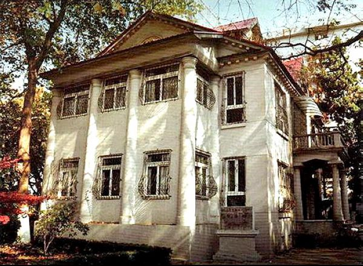
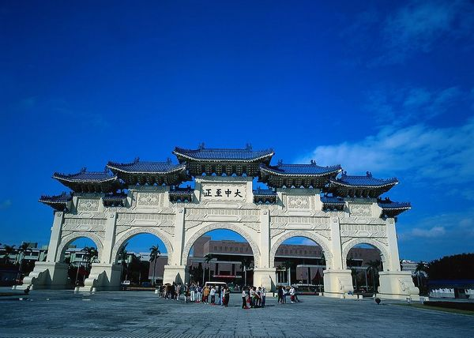

# ＜天枢＞两个民国

**我看到了弘一法师和丰子恺的“世寿所许，定当遵嘱”，看到了陈寅恪为学术用瞎的眼睛，看到了梁思成在建国初期为北京城描绘的富于远见的蓝图。光阴流转，风流总被雨打风吹去，斯人斯景难再相遇，但是，他们在我的心目中却共同组成了另一个有关民国的意象。和那个积弊难返，国祚衰微的民国相比，它是光明，普世而坚定的，宛如黑暗中的点点烛光，照着这个民族不至迷路。星光璀璨的学人学者，无疑是那时中国最美的收获，也是最为可傲的民国资本。新的思潮，新的气象，在沉沉欲睡的天空下，撕出一片启蒙的火光来。这个民国，我没法不爱。对比起很多万马齐喑道路以目的时代，这份爱便更多了一分。**  

# 两个民国

## 文/逍庭（东南大学）

 1 

在我自幼所受的教育里，49年之前是和苦难划等号的。困顿愚昧的人民，江河日下的国力，就如班级里最不讨喜的孩子，羸弱空虚，人人可欺。而随着网络的普及，舆情的转变只在瞬间，一夜之间，大批民国粉涌现出来，遍地开花。仿佛那个叫民国的孩子一夜之间变了面孔。屌丝化身高帅富，前一刻他还蓬头垢面地吸着鼻涕，旋踵之间就变得油光可鉴，仪表万方了。

胡适说，历史是任人打扮的小姑娘。中国人也历来信奉成王败寇的千古金律，史书是胜利者的功绩册，也是失败者的受辱书。像春秋时代的董狐那样不受外在阻碍，直笔著史的人在历史长河中廖若残星。然而，在官方钦定的历史诠释之外，往往也并存着各种民间对于前朝的叙事与想象。借古讽今，指桑骂槐一直是种喜闻乐见的群众活动。克罗齐说，一切历史都是当代史，对于中国人来说，尤其如是。

一样的民国，不一样的解读。变化的不是历史，而是人心。就像那句有名的偈语：“不是风动，不是幡动，仁者心动。” 世间诸事的变动，大抵如此。

 2 

这两天，冯小刚在上海电影节上的锋芒言论又引来争议。有人指这是为新片炒作的伎俩。我不作诛心之论，但对于冯导的这部新作《温故1942》还是有些许期待的。这份期待不是源于投资的巨大或者卡司的阵容，而是来自于刘震云——这个还带着浓郁乡音，一脸农民相的河南作家。他的原著之前读的时候几度掩面，这该是怎样的一副苦难画卷，犹如漫长的等不来天光的黑暗，活着就是在无尽的地狱里爬行。没有希望，没有救赎，没有明天。

我看过一些当时国外记者拍摄的逃荒中人的照片。照片上的中国人拥有黝黑而干涸的面孔，因为过度缺乏食物而浮肿的四肢，还有那触目惊心的眼神，就像抛弃了世上所有的情感，只是机械性地张着，为行尸走肉的躯体添一轮眼白，惟有饥饿的胃还在警醒着肉体的存在。背景是荒芜的土地，枯竭的河床，人立在其中尖锐而突兀。上天不仁，以万物为刍狗。人的处境与动物相较。甚至都更为悲惨。

这，就是1942年流民千里，饿殍遍地的民国。她承载了千年难言的伤楚，带着一双无神而疲惫的眼睛。

 3 

原来上海台有个名为大师的电视栏目，主要介绍的是一些近现代以来的学者名士。我很喜欢那个男声的旁白，不铿锵但有力，叩问着一颗颗伟大而寂寞的心灵。就像消融的溪水，汩汩地在岁月的底子上流淌过去。

我看到了弘一法师和丰子恺的“世寿所许，定当遵嘱”，看到了陈寅恪为学术用瞎的眼睛，看到了梁思成在建国初期为北京城描绘的富于远见的蓝图。光阴流转，风流总被雨打风吹去，斯人斯景难再相遇，但是，他们在我的心目中却共同组成了另一个有关民国的意象。和那个积弊难返，国祚衰微的民国相比，它是光明，普世而坚定的，宛如黑暗中的点点烛光，照着这个民族不至迷路。

星光璀璨的学人学者，无疑是那时中国最美的收获，也是最为可傲的民国资本。新的思潮，新的气象，在沉沉欲睡的天空下，撕出一片启蒙的火光来。

这个民国，我没法不爱。对比起很多万马齐喑道路以目的时代，这份爱便更多了一分。

 4 

最近，韩寒和蒋方舟都去了趟台湾，除了被太平洋的微风吹拂之外，还非常有默契不约而同地丢失了东西，在所失财物失而复得之后，二人扶正了惊讶的下颌，大笔一挥，对台湾人的素质大加赞赏，韩寒更是上升了理论高度，我们的传统被台湾保留，我们的文化在宝岛得以延续，于是他们谦和儒雅，彬彬有礼，反观这边，自己打断了文化的脊梁，于是我们的粗鄙冷漠不守规矩也是应有之义了。

这个讲法不是韩和蒋的独创。早在他们之前，已有很多版本的中华文明归属论在网上风行。归结起来，就是民国为正统，是华夏血脉的嫡长子。而之后的另一个中国，则是一个不切实际的空想产物在我们土地上的错误投影罢了。所以，中国的道统，与我们关联不大，历史的承继，更多的也是由对岸完成。

对于我们曾经疯狂年代里的焚书坑儒，实在没有理由辩解什么。赤裸的真相就在那里摆着，眼睛瞧不见的恐怕有ED的嫌疑。但这并非全部重点。我还是很疑惑，所谓的台湾人情味里，源于中华传统的占几何？传统文化与知信守礼是必然的联系么？是不是在这个辩题里面，一旦祭出孔孟之道，就代表了至高无上的文化优势。

我看过柏杨的《丑陋的中国人》和龙应台的《野火集》。在这两本书里，我并未领略到台湾同胞的优异品质，倒是看到了一副副相似的情景。黑心的商贩，肮脏的环境，自私的人性，以及在公众场合的诸多恶习。

鲁迅在谈到他去日本留学的见闻，用“刚健的清洁感”来形容日本人。他们的视洁如癖给鲁迅留下了很深的印象。时至今日，东瀛仍以它的清洁而闻名。一个族群的习性，并不会从虚无中诞生，也绝不可以轻易从群体记忆里消除。

那些逃难途中的中国人，那些充当看客的中国人，那些等着人血做药引的中国人，都曾结结实实地生活在这片土地上。而我们，正是这些中国人的子孙。身上流淌着他们的血脉。背负着他们的传承。

儒家统治了几千年，其间，中国人的本性并未大变过。那个饥饿的阴影，其实一直都盘旋在我们上空。由此相伴的精明与市侩，也一直沿袭了下来。鲁迅谓之劣根性的东西，不知道怎么到了韩寒这里，就凭空消失了。彷佛我们一直是按照高贵而小清新的路数走过来的，大陆的种种怪现状皆是红教乱华，毁了传统所致。而祖宗们，自然是极好的。接盘了祖宗的民国，更是碧玉无暇，岂是半路杀出的共党可比。

在韩寒的博文发表之后，大陆网友击节叫好，倒是台湾人觉得马屁不受用。他们反对把台湾和中华传统文化划等号。除了老蒋为了抗衡文革所做的振兴国学的努力之外，台湾还有日式妥帖，美式民主以及各族群的融合，这才造就了如今台湾的面貌。 单靠儒家和所谓的传统文化救不了台湾，老蒋提倡其传统文化的时候其实正是最集权最黑暗的时候。而真正的改变，是在老蒋死了之后才发生的。制度的建设，群众的觉醒，权力的制衡等等，这才使现代台湾形象得以真正改观。

我觉得这是更合理的解读。祖宗的东西有好也有坏。把好的一面无限夸大，而忽略坏的一面的危害，实在是一叶障目，盲人摸象之举。

过度的粉饰民国，粉饰传统的一厢情愿，可休矣。

 5 

我还是喜欢民国的，我不止一次地表达过对于民国文学的喜爱。那是崭新的文字，无拘无束，天性自由。

但我到底没有学会爱屋及乌的本事。星火再辉煌，也依然抵不过黑夜的魅影。梅花再肆意，也温暖不了心中的寒意。那些流民无助的眼睛，我始终无法直视。

网络的争吵让民国模糊了面孔，而我所需要的，只是定下心神，描摹下自己最喜欢的那张脸。

（采编：何凌昊；责编：何凌昊）

 
