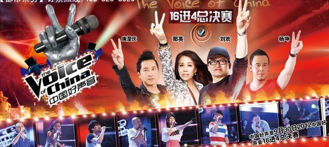
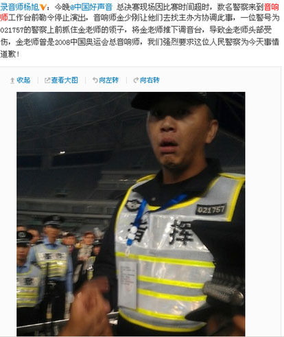
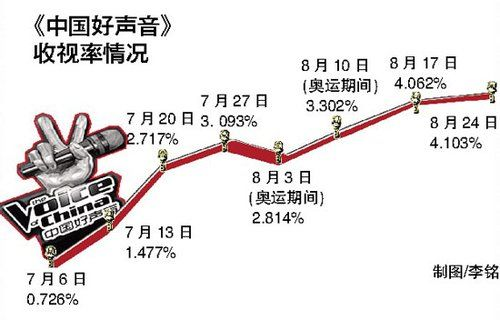

# ＜天枢＞中国好声音总决赛活动超时事件的法律分析

**中国好声音总决赛结束后，在新浪微博中，出现了一则有关上海某警察与某音响师之间发生冲突的消息，是说因演出超时，警察来到音响台要求禁止演出，并发生了某警察对某音响师实施暴力致其受伤。该事件涉及以下两个法律问题：总决赛如果演出超时，节目主办方应承担什么义务？在演出超时的情况下，警察可以做什么？警察的执法界限在哪？**  

# 中国好声音总决赛活动超时事件的法律分析

## 文／刘培灼 （欧申律师事务所律师）

 

作为中国好声音这个节目的忠实观众，我在电视机旁边看完了总决赛的全部内容，当然，只是电视转播的内容。由于电视转播的惯例或需要，现场的一些演出花絮或者节目是无法在电视机中看到的。 

总决赛结束后，在新浪微博中，出现了一则有关上海某警察与某音响师之间发生冲突的消息，是说因演出超时，警察来到音响台要求禁止演出，并发生了某警察对某音响师实施暴力致其受伤。在对事件本身的评判上，网友们的意见并不完全一致，有的认为警察要道歉，而有的——可能更多——则是认为警察在执行公务，认为微博的消息过于片面。 

这个事件涉及下列法律问题： 

1、总决赛如果演出超时，节目主办方应承担什么义务？ 

2、在演出超时的情况下，警察可以做什么？警察的执法界限在哪？ 

关于第一个问题，需要先普及一下演出方面的知识。我国目前对各类演出特别是大型商业演出，制订了较为严格的审批程序，在活动举办之前，活动的主办方——通常是一家具有从事营业性演出资质的公司——要向本地的文化部门递交申请材料，如果活动中有外籍艺人或港澳台艺人参加，申报材料还要由本地文化部门转递到国务院文化部进行审批。在申报材料中，主办方对活动的时长、相关安全预案均要有较为详细的陈述。因此，如果演出活动违反了当初的申报材料内容，包括变更节目、变更演员、演出超时等，如果未经重新申报并批准，均会被会被追究行政责任，较为常见的是罚款。 

因此，一旦总决赛的演出出现超时情况，节目主办方——在行政法意义上，是指当初向文广部门申请举办活动的公司，而可能不是人们以为的某某卫视——有义务停止节目的演出，这种停止是法律规定的义务，是不以节目的演出效果或者节目演出者与现场观众的感受为转移的。 

关于第二个问题，实践中，类似好声音总决赛这样的大型演唱会活动，活动现场会有公安人员到场维持秩序，演出场所所在的主管部门也会派人在现场监督，在上海，这个部门是活动举办地所在区的文化市场行政执法大队。同时，主办方会有一位负责人也作为活动的监督人员，这个人也是负责与文化执法大队或公安部门沟通的人，他不一定是导演，但是有义务根据行政部门的指示从事相关行为。通常，这个人在申报材料中就已明确。 

因此，一旦发生活动超时，一般情况下，在节目未超时，但根据正常演出顺序预测将肯定会超时的情况下，场内的执法大队人员会找到主办方人员，要求避免发生超时的情况，接下来，主办方人员会与导演等演出的主创们商议预案，并将结果汇报给执法大队人员。如果这个活动够HIGH，最后果真超时了，在这种情况下，只要不是严重影响到公共交通、附近居民的利益以及公安、执法大队等部门的工作部署，执法大队人员一般并不会采取较为强硬的断电措施，而仍然会以口头警告的方式要求演出主办方尽快结束活动。如果活动仍然继续，并且，情况越来越严重，包括：居民投诉不断增多，节目结束后的公交状况已对现有的工作部署形成严重挑战等，在这个时候，文化执法大队会联合公安部门实施较为严厉的执法措施，最常见的就是关掉舞台灯光与音响设备。如果演出仍然继续，执法人员会劝诫所有参与现场演出人员包括乐队、舞蹈或音响师等尽快离场。 

需要明确的是，在节目未超时的情况下，执法人员的这种劝诫行为是违法干预演出的行为，但是，一旦节目发生超时的现象，这种劝诫则构成了正当的执法行为，被劝诫人有义务听从劝诫，立即离开现场。否则，就构成了对执法行为的违抗。一旦发生这样的情形，执行机关有权实施更为严厉的执法行为，包括人身限制、拘留等。 

为什么不允许演出超时？特别是沉浸在演出氛围当中的场内观众会更不理解。其实根本原因是为了公共利益的考虑。在演出场馆内举行的演出活动属于人群聚集的公共活动，参与人员的人身安全、周边居民的正常作息以及公共交通安全均是需要特别关注的事项。一般来说，演出超时，会影响周边居民的休息，也会由于观众退场时间的变化而使公共交通面临压力，对于大型的演出活动来说，为防止出现交通混乱、人员伤害等情况的发生，往往主管部门要做好多项预案来应对活动现场可能产生的各类状况，并根据现场情况随时调整预案。 

在包括大型商演活动在内的各类营业性演出活动中，公安部门一般负责安全保卫工作，并有相应的执法权。这种执法权的法律依据主要是： 

1、《行政处罚法》第十六条中，规定：“国务院或者经国务院授权的省、自治区、直辖市人民政府可以决定一个行政机关行使有关行政机关的行政处罚权，但限制人身自由的行政处罚权只能由公安机关行使。” 

2、根据《行政处罚法》的上述规定，由上海市政府颁布了《上海市文化领域相对集中行政处罚权办法》，其中第三条中规定：“上海市文化市场行政执法总队（以下简称市文化执法总队）是市人民政府直属的行政执法机构，主管全市文化领域综合执法工作，集中行使文化领域行政处罚权。”以及“各级文广影视、新闻出版、版权、文物、体育、旅游、公安、工商等行政管理部门应当配合市文化执法总队和区县文化综合执法机构（以下统称“市和区县文化综合执法机构”）做好文化领域相对集中行政处罚权工作。” 

3、根据《行政强制法》的第十七条规定：“依据《中华人民共和国行政处罚法》的规定行使相对集中行政处罚权的行政机关，可以实施法律、法规规定的与行政处罚权有关的行政强制措施。”值得关注的是，根据《行政强制法》第九条的规定，行政强制措施的种类包括：限制公民人身自由；查封场所、设施或者财物；扣押财物等五项。 

在好声音总决赛中出现的这一事件，如果好声音活动确实发生了超时，那么公安的执法行为是存在合理合法的执法依据的，这一情况必然会对双方后来出现的肢体冲突的定性产生影响。 

如果超时情况属时，那么该活动的申请单位会被罚款；在警察与节目方工作人员冲突这一事件上，受伤人员可以通过行政复议或行政诉讼的方式来主张自己的权利，如果经过复议或诉讼的决定或判决结果，确定警方有责任，那么，行政机关会对受伤的人员给予赔偿，反之，警方属正当执法，受伤人员将自行承担相关的后果。 

由于大型商业演出活动参与主体的复杂性，一场活动从创意到申报，到最终售票、演出直至观众退场，在这一系列程序中，很多主体都会参加进来，并且参与活动的始终。这些不同主体之间，通过一系列协议的安排，结合在一起。而观众们所面对的不只是“主办方”，“主办方”这三个字并不能全部概括一个商业演出活动的全部主体。 

根据《营业性演出管理条例》的规定，目前我国大陆地区，有资格举办有外国或港澳台艺人参加演出的主体只有： 

1、具有涉外演出资质的演出经纪机构，通常，这类机构的名称为某某演出经纪公司或某某文化传播有限公司等； 

2、文艺表演团体，其在自行举办的营业性演出中，可以邀请外国或港澳台艺人参加。 

以中国好声音总决赛演唱会活动为例，根据我在上海市文化广播影视管理局网站上查询的结果，上海市文化广播影视管理局于2012年9月27日受理了上海东亚演出公司提出的“关于增加‘2012中国好声音总决赛’演出嘉宾的申请”（见网址：http://www4.scrft-ac.gov.cn/Affair/ApplyLicenceList.aspx?Type=finish），可以看出，中国好声音总决赛演唱会活动的举办单位是上海东亚演出公司，即上海东亚演出公司是此次活动的主办方。 

除了主办方上海东亚演出公司之外，中国好声音总决赛演唱会活动的参与主体还包括： 

演出场所方：上海体育场； 

演出方：主要是参与演出制作的团队所属公司（星灿制作？星空华文？）、其他艺人所属的经纪公司、未签经纪合约的其他艺人、为演出提供伴奏、调音的乐队与音响师等； 

栏目方：浙江卫视，“中国好声音”栏目是通过浙江卫视的播出而为人们所熟悉的，此次活动的主持人伊一、华少来自浙江卫视； 

赞助方：加多宝、娃哈哈…… 

根据前述有关营业性演出的主体的分析，在实践中，很多情况下，演出方与主办方是同一个单位，如文艺表演团体即各类剧团举办的演出，或者演出经纪机构举办的自己旗下艺人的演出；也有演出场所方与主办方是一体的，如由演出场所经营单位在本单位经营的场所内举行的营业性组台演出。但是，在中国好声音总决赛演唱会的这次活动中，主办方与演出方相分离。虽然上海东亚演出公司是此次活动的主办方，但是，在对现场演出的掌控上，演出方特别是中国好声音的制作团队公司才是权力最大的一方。主办方与演出方相比，对现场活动的控制力较弱。如果不谈法律，而仅从这个意义上讲，演出超时，可能更多是由于演出方的现场控制原因，因此，主办方的责任较小。 

为什么上海东亚演出公司本身并未参与中国好声音节目的制作，但是却由其负责向上海市文化广播影视管理局申请有关的行政许可呢？我想主要原因是行业惯例。上海体育场隶属于上海东亚演出公司，因此，在上海体育场举办的各类大型商演活动中，一般均由上海东亚演出公司作为主办方，有可能演出方考虑到希望申报能够顺利通过。在中国好声音总决赛这次活动中，也一样，由上海东亚演出公司作为举办方承担活动的申报工作。在类似的活动中，为减少风险，主办方会在与演出方之间协议中作出约定，一旦演出活动出现违法的情形，演出方将承担相应的责任。假如由于演出方对现场控制的原因，导致活动发生超时，那么，主办方由此承担的罚金将可能通过协议来转嫁到演出方。 

另一方面，演出方一般会与参与现场表演的演员、乐队、音响或灯光等技术人员签订演出合同或技术合作合同，对相关的权利义务作出约定，在出现超时的情况下，演出方可能会依据之前的合同或协议来追究演员或其他人的责任，从而将自己为主办方承担的责任再次转嫁。在这次活动中，主办方、演出场所方、演出方、栏目方等各个主体间通过一系列协议安排形成了一个有机的整体，特别是主办方与演出方之间，可以说是利益相依而存。 

值得一提的是，在这次活动中，浙江卫视作为栏目方，除了提供华少等两位主持人，至少目前还不清楚他们还以其他何种方式参与到了此次活动中，不过可以明确的是，虽然浙江卫视会有赞助费的分成，但活动并不是浙江卫视主办，演出也并非完全由他们制作。由于此次活动的超时而引发的网上有关公安执法的争议，很多人将矛头指向浙江卫视，这有些偏颇。之所以出现这样的情形，可能是现在“制播分离”这一观念并未被大多数人所知并接受。在传统意义上，大家仍然认为节目是电视台播的，那么当然是电视台制作的，电视台应该对这个节目以及相关的活动承担责任。这可能也是中国好声音这一节目给社会公众观念带来的另一种冲击与提示。  

（采编：彭程；责编：马特）

  
