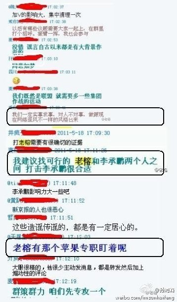
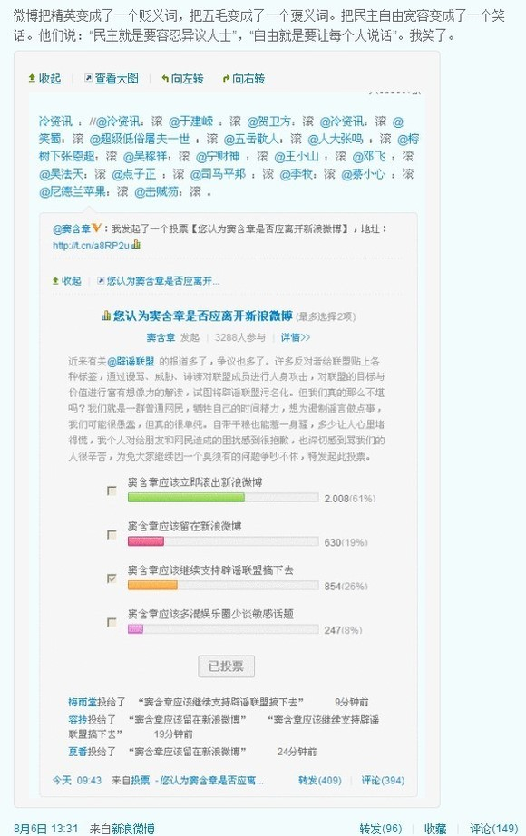

# ＜天枢＞为什么这么多人不喜欢辟谣联盟

**好比几头吃不饱饭的猪突然得了俩馒头吃的正欢呢，突然来了另外几头猪跟他们大谈营养过剩的危害，你说后来的这几个头猪做错了么？我觉得没有，但放在这种吃不饱的环境确实令人反感。而且，要是有一天由于主人以营养过剩为理由不让猪吃了，那猪们肯定得把帐全部算在说营养过剩的那几头猪的头上。**

 

# 为什么这么多人不喜欢辟谣联盟

## 李灿（电子科技大学）

 

前几天由于CCAV的宣传以及老榕爆出了辟谣联盟的群聊记录，导致了辟谣联盟人气骤增，当然，黑和粉都有。

其实很早的时候我就注意到了辟谣联盟的微博，当时觉得他们口号提得真的很好，只辟事实不辟观点，而且就辟的几则谣言来看也确实是这样的，那为什么会遭到大量微博用户的围攻的呢？

首先吧，我认为是由于中国的言论环境非常不自由引起的。好比几头吃不饱饭的猪突然得了俩馒头吃的正欢呢，突然来了另外几头猪跟他们大谈营养过剩的危害，你说后来的这几个头猪做错了么？我觉得没有，但放在这种吃不饱的环境确实令人反感。而且，要是有一天由于主人以营养过剩为理由不让猪吃了，那猪们肯定得把帐全部算在说营养过剩的那几头猪的头上。

另外一个原因在我看来就是辟谣联盟的人自身有问题了。老榕爆出的群聊记录毫无争议的展示了辟谣联盟对人不对事的特性，虽然后面经过证实这句话是笔误，但从整个聊天记录的上下文来看他们还确实就是对人不对事的。

当然，辟谣联盟说的是对人不对事，但从他们已经发布的辟谣微博里面我完全没有看出这个特点。但问题就在于，这帮人有着极强的道德优越感，这就很过了。本来微博的转发功能就降低了交流的成本，也不可能要求所有转发用户都去完全证实后再发布，难免有错，有错你们辟谣联盟就来辟谣嘛，辟完了大家该干嘛干嘛就得了。但这群人不淡定了，一看别人发布的信息有误，立马就贴上故意造谣的标签，立马就觉得别人是别有用心的，比如上面的聊天记录上面写着“谣言自古以来都是有大背景作祟的”……

如果说群聊只是普通网友，不能代表辟谣联盟，那我们再看看辟谣联盟创始人[点子正](http://weibo.com/dianzizheng)的一些微博吧。

别人转发消息前说句求辟谣是为了冠冕堂皇的造谣，别人不加说明转发更是造谣，所以说，这种莫名其妙的天然正义感确实也是这么多人反感他们的原因了。推荐这篇文章[：http://society.huanqiu.com/discovery/2011-08/1876506.html](http://society.huanqiu.com/discovery/2011-08/1876506.html)

而且，在遭受大量网友攻击之后，辟谣联盟的创始人之一[窦含章](http://weibo.com/douhanzhang)（此人是傻逼不解释，不懂者自行搜索其以往事迹），居然弄了个投票，问自己该不该滚出微博，结果一半以上的网友支持，其中还包含了很多V用户都让他滚，这本来就是你自己要弄的投票吧，别人忍着你的恶心与矫情来投票，什么结果都该坦然接受不是，但辟谣联盟发起者[吴法天](http://weibo.com/danhon)不淡定了，他发了这么一条微博：

我是没怎么明白，你自己弄的投票，设了个滚的选项，别人投了，就成了不民主不自由不宽容了。

至于辟谣联盟的内容，我觉得大部分还算靠谱，少部分是有问题的，要不是他们喜欢拉道德大旗，我不认为应该要求一个民间组织保证发布信息的绝对准确。

说完这群辟谣的，再说说反辟谣的。其实他们反对的理由是极为站不住脚的，很多都是只有立场不谈是非的傻逼货色。

先说别人辟谣联盟选择辟谣，也就是只辟民谣不辟官谣，这点的确存在，但这点仅仅只能说明辟谣联盟或许是有立场的，但不能证明辟谣联盟有什么错。以前美国打利比亚的时候，傻粪们最喜欢问，你们不是说利比亚独裁专制么？那美国为什么不打同样独裁专制的朝鲜沙特啊。于是有人打了个比方，面前有两个小偷，我随便抓了一个，你不能说我没抓另外一个来证明我不该抓小偷啊。放在这里也是如此，别人不辟官谣，并不能说明他辟谣辟得不对。

然后有人说，辟谣联盟阻碍了言论自由，这更是无稽之谈了。辟谣联盟删你微博了？剁你手不让你发微博了？都没有吧。你可以转发一些未经证实的消息，辟谣联盟当然也可以发表一点自己的看法，何谈谁伤害谁的言论自由呢？这要是普通网友随便说说就算了，21世纪网还发了一则[奇文](http://www.cqn.com.cn/news/xfpd/szcj/dflb/450766.html)，说什么辟谣联盟损害公权私权，文章逻辑堪比中宣部当年的屎文《六个为什么》。

最后表个态，基于前面的两条理由，我不喜欢辟谣联盟，但我不反对他们所做的事情。对于他们口中的造谣者我亦是这个态度。我真正痛恨的，只有钳制言论的邪恶公权力。

 

（采编责编：黄理罡）

 
