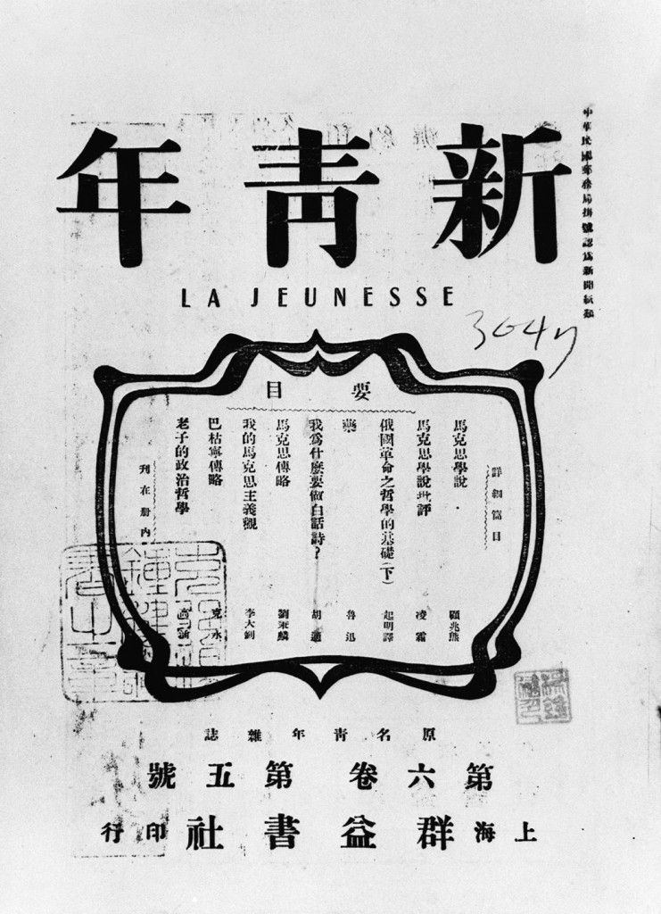
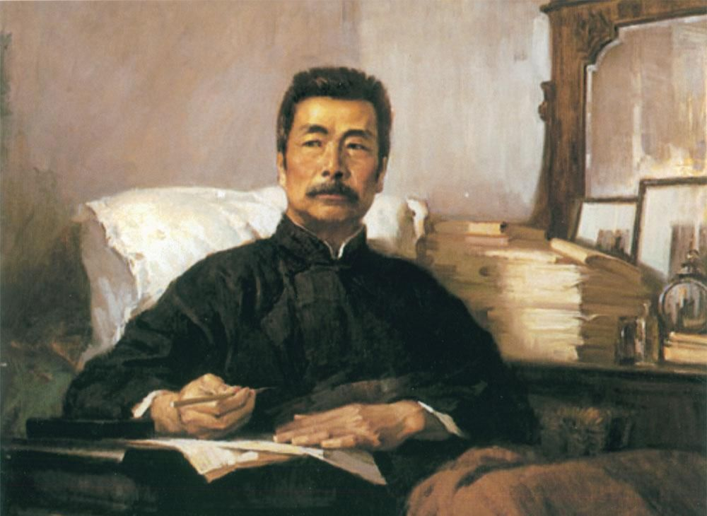

# ＜天枢＞五四新文化运动的伪胜利

**我们只看到陈独秀蔡元培振臂一呼应者云集，只看到林纾学衡派甲寅派被骂得落花流水，只看到白话文运动轰轰烈烈如火如荼，却看不到当时大部分中国人还在为免于饥饿而苦苦挣扎，看不到五四诸学人提出的政治理想、社会理想，百余年后仍然是美好的理想。** 

# 五四新文化运动的伪胜利

## 文 / 沐风（山东大学）

  单看这个题目，似乎本文又是一篇对五四新文化运动的棒喝。其实我恰恰是个充满五四情结的人，对那个年代和那批知识分子，有着一种粉丝式的迷恋。然而，真正了解了那场思想狂飙运动的前前后后，我在理性上却不得不面对这一事实：五四的轰轰烈烈，只是假象。 说来说去，在史册上写着灿烂一页的五四新文化运动，最终不过是一场精英狂欢而已。即便陈独秀胡适暴得大名，即便鲁迅等人声名煊赫，但未必对四万万民众有太大的启蒙作用。为何？一言以蔽之——文盲太多！ 

 谈到五四，首先映入我们脑海的，自然是走上街头群情激昂的大学生。每当我在影视剧里看到这一场景时，我都好奇一个问题：民国年间到底有多少大学生？来到图书馆查阅《民国史料丛刊》，果然发现了一些颇有价值的档案与数据。 民国二十年（1931年），当时的教育部高等教育司编了一本《全国高等教育统计》，记载着十九年（1930年）的专科以上学生总数为42230人，其中还有25名外籍留学生。是的，当时只有4万余名大学生，这其中还包括10038名专科生，即便是总数，也不如此刻笔者所在的山东大学本科生数！表中记载当时全国总人口为474787386人，合每百万人中只有89名大学生！而此刻，已是五四新文化运动被送入历史荣誉纪念堂多年后的1930年！ 那么民国建立初期是什么光景呢？这份报告中亦有记录，不过数据未必可靠，之所以这么说，一是因为当时的北洋军阀政府忙于内战，统计数据未必确切，二是因为这些数据实在
