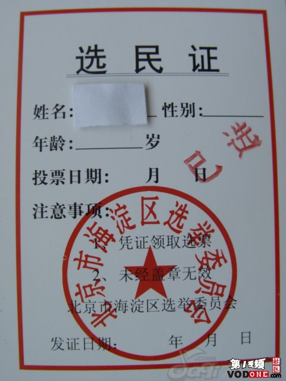
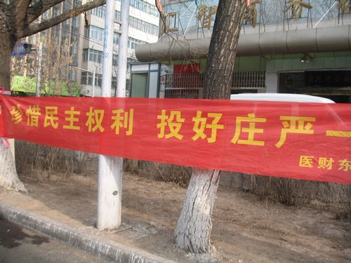

# ＜天枢＞亲，放开那张选票

**也许要让我们这一代人真正的去面对流血，直接去面对暴力，直接去面对伤害时，我们已经缺少了这种勇气，但至少我们可以放开那张选票，明知道这张选票没有任何意义，明知道这个制度有无数漏洞，我们无法去改变多少，但至少我们可以不用去顺从这个制度，不去做这个制度的帮凶。那么，亲，请放开那张选票。**  

# 亲，放开那张选票

## 文 /徐海星（西安科技大学）

 

活了好歹二十多年，第一次看见选民证的时候内心那个激动还是无法抑制。五年前，我距离选票最近时只有0.01公分，但因为年龄不满十八而不能有投票资格，看着同学们纷纷前往大礼堂去投票了，那一刻他们是不能理解我落寞的身影有着几多的酸楚，也许是因为那次提名有高中时候的校长吧，而此校长一贯的和颜悦色、艰苦朴素、踏实做事，完全一副学者超脱的样子，在很大范围内都是有口皆碑，因此很大程度上我觉得我能为他投一票当人大代表甚至是无上光荣的事情，那时候，我天真的以为人大代表可以代表人民，人大代表都是如同我们校长一样闪着人性的光辉。

当我今年第一次见到那粉红色的选民证的时候，感情是五味杂陈呀，原来我也是这个国家所默许的人民之一，但同时这选票又来的如此突然，让我一点准备都没有，没有竞选海报，没有宣传，没有见到任何候选人，甚至连选举时间我都不知道。所以最后我战战兢兢的拿起选票，高高的供了起来。也许以后连见到选民证的机会都少了，也许以后发生什么突发事件我还可以依靠这个证明我是这个国家的一份子，我是这个国家的主人之一，以此来证明我的立场和清白。

而岁月这把杀猪刀不光摧毁了我的青春岁月，还连我那纯真的想法都毫不留情的扼杀了。时间让我知道了每届人大会议都会有各种雷人提案，难不成这些人都是被圈养起来的，他们丝毫不知道中国真实的情况，丝毫不知道百姓真正所需要的提案。时间也让我知道了每次代表进京都会排练如何整齐的举手。时间也让我知道了总有一群优秀的代表从不给国家添堵，从来都是投赞成票。时间也让我知道了这群我压根都不认识的人原来是代表我去行使权利的。时间也让我知道了更多的内幕，太多的人大代表依靠人大代表这个身份去谋取私利，去为了自身的利益争得头破血流。不知道我要感怀岁月让我看清了这些，还是要憎恨岁月让我破灭了理想。

此次人大换届选举，因为有了另选他人的出现，有了众多理想主义者的坚定行动，本来让我有了些许的兴趣。而听闻众多独立候选人相继失利之后，我的热情一下就没了。在这一次作秀中，本来我还想至少投“好庄严”一票，但最后面对这粉红色的选民证的时候，我还是选择了把它珍藏起来，也许以后没有机会再参加了不是么。所以真是对不起“好庄严”同志，我虽然如此的想支持你，但最后还是没有。

最近听闻有学院辅导员追查投票情况，把投票这件事当做政治任务来完成，没有参加投票的取消预备党员资格之类的处罚，听完此消息，我立马震惊了，对于公民行使自身权利这种事情要当政治任务去监督贯彻，辅导员们都是肿么了，他们最好别忘了主席只有一个，并不是每一个辅导员都能到那个位置的。

这群人我连认识都不认识，我怎么知道我应该选谁，搞不好选出个二愣子只会举手，而不会说话，这不给国家添堵了么。我本着不打无准备的仗，还没达到知己知彼的情况，我果断的放弃了我的权利，但如果我放弃了这个权利还有人追究的话，那敢情好，是不是意味着以后哪天我神奇般的消失之后你们还会尽职尽责的去找我，追究我去了哪里，那我的安全感顿时呈几何数的上涨。

我不明白为什么这个执政党变得如此小心翼翼，变得好像脆弱不堪。不保障号称是这个国家主人的人民的权利也就罢了，连人民放弃自己的权利都还受到追究，不要耍流氓好不好。而让我无法理解的是，为什么这个执政党会害怕几个独立候选人的出现，千方百计的阻挠他们成为另选他人。这个政府为什么每年都有高昂的维稳费用，难不成几个上访的群众就能改天换地么。这个国家为什么能举办让世人震惊的奥运会、世博会、世园会，却担负不起一个打工子弟学校的运营，却担负不起一个地区的校车和教育开支。既然我都不知道我会不会某一天变成这个国家事故统计中的那个数字一，我还选什么代表，我还要做什么主人，我还要什么国家。

肯定有人要义正言辞的告诉我这个想法不对，我们应该理性，应该让这个国家慢慢来发展进步，我们应该要大力去支持国家的发展，政治体制改革虽然有不完善的地方，但我们还应该有信心，饭要一口一口吃，路要一步一步的走，政治体制会逐步改革的。那么我想问问我们还要等多久呢，改革开放都三十多年了，中国共产党都从一大召开到成为执政党了，我们还要等多久才能有保障个体的制度出现，而这三十多年之中，本来我们有过机会，但因为各种缘由我们错过了。

我们曾经有过机会去改变这种权力的高度集中，我们也曾经拥有过好的领导，只是我们没有珍惜，抑或是这个政党没有珍惜。权力是毒药，权力是春药。权力的诱惑实在是太大了，在八十年代所进行的改革中，只是单纯的进行经济体制的改革，而对政治体制改革讳莫如深。邓一再强调我们不能实行三权分立，不能实行宪政民主，一旦这样，权力就会掣肘，就不能集中力量办大事。归结到一点，是如果权力有了制约，权力有了监督，就不可能为所欲为，就不可能产生老人政治，就不能体会到权力的快感。本来八十年代的这一批老人，邓小平、陈云、薄一波、李先念等都是经历过毛时代晚年政治的荒唐，他们也知道权力的高度集中会产生各种弊端，但当这一批老人真正有了权力之后，他们才不会甘心去放手这种独大的权力。所以政治体制的改革一再滞后，远远的落后于经济体制的改革，甚至是还遥遥无期，丝毫看不出继续改革的方案。所以人大选举这种事，无非是一场代表们的狂欢，于我等屁民有半毛钱的关系。这个国家压根都没想要你有这种权力，你何必还在不停的幻想。

在共产主义理想逐步破灭之后，这个执政党开始寻找这个党执政的合法性，最后选取用发展经济来获取合理性。不管白猫黑猫，能抓老鼠就是好猫。换块路标，就能理所当然的打上右转向灯往左边开了。但经济发展所培养出来的富人，感谢的不应该是这个制度，而应该是这个市场给了他们更多的机会。但当经济发展了三十多年之后，各种矛盾越来越尖锐，贫富差距，人均收入，CPI指数等等，让经济都开始被人怀疑了。而爱国主义往往是政党最后一块遮羞布，高唱爱国主义歌曲，大谈国家利益，强国梦想，大国崛起，用这些空洞的东西来掩盖人民的质疑，最后的结果我们不得而知。这个国家的发展总是要把自己置身于一个个的框框之中，每走一步都小心翼翼，步履蹒跚，这个国家还能走多远，我们不得而知。

当生存成了最大的现实，手段如何已无多大异议，当我们开始默认这个社会重新遵循丛林法则的时候，为了房价、为了油价、为了婚姻疲于奔命的时候，我们可曾想过这一切的原因不是因为我们不努力，不是因为我们自身的原因，而是这个制度没有给我们更多的机会，更多上升的空间，权力，金钱已经被固有阶层所持有，这一切体制之困。

制度没有好坏之分，对于国家而言，没有最好的制度存在，只有最适合的制度。而衡量制度是否合适的标准我觉得应该包括是否能保证这个制度之下的人民的权利和义务。每一个个体对于制度而言都是同样的，如同那句高高挂起的“法律面前一律平等”，制度面前也应如此，每一个个体不应该是被当做集体之中的一个组成部分而言，每一个人体都是单独的个人，是一个人加上一个人才组成这个社会。制度是一种契约，目的就在于保护这一个一个的人能够更好的生活下去。因为其制度的局限性，所以代表都不知道是怎样就被选出来了，不知道怎样就代表了我们的利益去行使权力了。所以一切归根结底都是制度之困。

扯远了，也许觉得把一切都归结于制度之上有些空洞，也许又会有很多人跳出来告诉我，现实就是如此，我们无法改变，那么就去学会适应。Balabalabala我不知道这种逻辑来源是如何，愚公尚且会移山，陈胜吴广尚且还知道“王侯将相，宁有种乎”。为什么我们现在就学会这种强盗逻辑还一再肯定呢。

也许要让我们这一代人真正的去面对流血，直接去面对暴力，直接去面对伤害时，我们已经缺少了这种勇气，但至少我们可以放开那张选票，明知道这张选票没有任何意义，明知道这个制度有无数漏洞，我们无法去改变多少，但至少我们可以不用去顺从这个制度，不去做这个制度的帮凶。

那么，亲，请放开那张选票吧。

 

（采编：黄理罡；责编：黄理罡）

 
