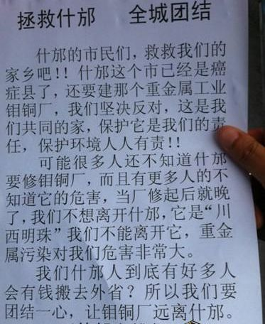

# ＜天枢＞今天，我只是一个什邡人

**偏安一隅、贪图安逸，这是对生活在天府之国的人们生活的真实写照，下班之后喝口茶，打个牌，就能满足，和家人看个电视，就能其乐融融。很难想象，这样一个西南地方的小城市，勤劳朴实的人们，却纷纷放暂停了手中的工作，走上了大街小巷，举着标语，喊着口号。很难想象，经受着物价飞涨、失业率增加都能忍气吞声的人们，今天却不再沉默。**  

# 今天，我只是一个什邡人

## 文/海心（首都医科大学）

我写这篇文章的时候，游行正在进行。虽然香港也在游行，但我说的却是我的家乡——什邡。

偏安一隅、贪图安逸，这是对生活在天府之国的人们生活的真实写照，下班之后喝口茶，打个牌，就能满足，和家人看个电视，就能其乐融融。很难想象，这样一个西南地方的小城市，勤劳朴实的人们，却纷纷放暂停了手中的工作，走上了大街小巷，举着标语，喊着口号。很难想象，经受着物价飞涨、失业率增加都能忍气吞声的人们，今天却不再沉默。

事情并不复杂：一个党委书记，一个企业老板，一个工厂。当然，如果深究下去，是这个书记下面各级官员丧失的良心与判断力；是上面发改委审批人员的贪图与麻木。

这个工厂，提炼一种钼铜矿。过程中的污染我们老百姓都不懂，但我们只知道这个工厂——在非洲某穷国购买原矿——非洲当地政府怕污染不让建；云南某地怕污染也不让建；就算是在我市开建前不久，附近的县市还在和市政当局打官司，怕污染蔓延过去。

和大连PX不同，他们污染的是空气，我们污染的是水源。就算空气是可以飘走的，也容易稀释，当地百姓尚不能容忍；盆地的水源会长期囤积在地下，危害的不是一代人的健康，我们世世代代生活在这片土地上，岂能容忍他们肆无忌惮地践踏？

他们贪污援建资金、强卖援建商铺，我们没有做声；他们哄抬铺面租价，把什邡物价搞得比大城市还高，我们也忍受着。今天，他们终于直接把刀口对向了我们所有的人，甚至是我们的子孙后代。

他们杀过一次人了。他们杀人用的不是刀，而是对身为父母官责任感的摒弃，是512地震时黄金抢救时间的不作为。他们还想杀一次人，这次用的是他们对金钱的贪婪，用的是想提升GDP和政绩的欲望。

感谢李成金和刘沧龙，他们让那些天天叫嚣着南占台湾，东灭日本，西打欧美的人恍然大悟——他妈的！原来老子连家乡都保不住了啊！

感谢李成金与刘沧龙，他们给我们解释了什么叫“养兵千日，用兵一时”——我们纳税所养的武警，到头来是来对付我们自己的。

感谢李成金与刘沧龙，他们让什邡人明白了，什么神九上天、世博奥运，都与我屁相干（关我屁事），我们只要我们的家乡平安，我们的家人幸福。

感谢李成金和刘沧龙，他们逼我们走上了街头，逼我们学会了面强权不妥协，逼我们学会了为争取权利而斗争。

感谢李成金和刘沧龙，他们让什邡的人民明白，原来我们的真正的敌人，就在我们身边！

此时此刻，和预料的一样，一切都没有变：催泪弹放了，声音震耳欲聋，部队还在继续调往市区。一个老大爷胳膊伤了，一个学生被送上了救护车……

同样，另一边也是熟悉的景象：官方开始发微薄、发文章，移动开始发短信，说这个厂绝对是技术先进，绝对是零污染，市民不要造谣信谣，不要参与非法暴动……今天，政府还向学校施压，通知家长，抓到闹事的学生，开除学籍……

在遥远的南边，港人的游行也在继续，我看到一条标语，“权力下面，是人民血肉”，我不知道用什么来形容我的心情，港人的血性，也流在每一个炎黄子孙的血脉之中，今天，蜀人与港人同在。

一直佩服港人的骨气，而今天我却为身为一个什邡人而自豪，因为我的家乡，也有一群为了自己的权力而敢于与强权斗争的人，什邡人不是懦夫！

不管过程多么艰难，我相信正义始终能战胜邪恶的，就算有受伤，甚至有牺牲，我们最终能让这个工厂在这片土地上彻底消失！

今天，40万颗心都在一起。

今天，我只是一个什邡人。

2012.7.2

海心

（采编：黄理罡；责编：黄理罡）

 
