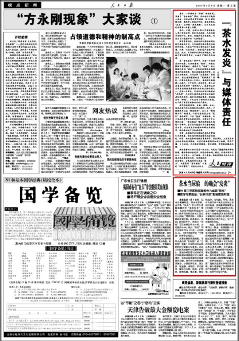
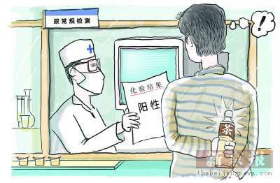

# ＜天枢＞从“茶水发炎”的真相说起——浅论媒体的医患报道

**媒体存在的意义不是为了伤害谁，媒体的抨击不是为了毁灭与加深误解，而恰恰相反，是监督，是宣传与普及，是让更多的人知道真相，至少是一个没有被导引的事实，或者经过严密的逻辑推理后的结论，而不该是妄想，是揣测，是恶意攻击。**  

# 从茶水发炎”的真相说起

# ——浅论媒体的医患报道

## 文/秦篆（北京中医药大学）

 

本报北京2007年4月8日讯 记者白剑峰报道：

茶水当尿验，会不会“发炎”？针对不久前媒体曝光的“茶水发炎”事件，北京协和医院等全国92家三级甲等医院的医务人员近日分别做了同样实验：用茶水做尿常规化验。结果显示：在136份化验单中，未检出“阳性”项目的报告单为9份，占总数的6.6%；检出“阳性”项目的报告单为127份，占总数93.4%。（所有检验单见“丁香园”医学专业网站）。

用茶水做尿常规检验，为什么会出现“红细胞”或“白细胞”现象？中国医师协会检验医师分会副主任委员、北京天坛医院检验科主任康熙雄指出，尿液分析仪器与试剂的设计和检测原理都是针对人体尿液的，没有区别尿液和其他液体的功能。茶叶水中的物质极其复杂，主要包括有水、蛋白质、氨基酸、咖啡因、多元酚类、碳水化合物、脂质、矿物质、植物色素、维生素、挥发性成分、有机酸，等等。茶水中只要有参与氧化还原反应的相关物质，就能影响尿液潜血（红细胞）分析试纸的指示剂，从而可能产生假阳性反应。而茶水中的酚类及其他有机物，只要能与白细胞分析试纸中的重氮盐发生偶合反应，也可产生假阳性反应。

他说，尿常规检测的注意事项之一就是，检测前数小时内避免饮茶、咖啡等饮料，以免导致结果的假阳性。当患者送检的尿液呈阳性时，医院一般还要对尿样进行显微镜下检测。但是，尿液中的红细胞、白细胞形态与血液中的不同，其形态多不完整，也不典型，有的仅留下细胞的碎片或残形。茶水里的微粒、尘埃、茶碱结晶、茶叶碎屑等成分，会极大地干扰检验人员的判断和鉴别。

医学专家指出，“以茶代尿”是缺乏基本医学常识的表现，极大地影响了医学诊断和治疗的准确性，影响了医患和谐，这种行为很不严肃。

《人民日报》 ( 2007-04-09 第05版 )

如上，这是《人民日报》07年的报道。

这个时候贴出来《人民日报》五年前的报道，辟谣的功效倒不是首要的。主要是想借此探讨一下，为什么现在关于医疗的报道导向性是这样的强烈，以及这样到底应不应该。

其实对于茶水发炎事件我真的很好奇，我以为但凡有一定常识，哪怕只是高中的生物跟化学常识，就不难知道茶水里含有的氨基酸、酚类等成分跟白细胞红细胞的含量检测是有相关性的。再者就算这些知识不算常识过于专业，但是倘若记者存有敬业精神，以及科学态度，能够在下笔前查阅一下资料，我相信这篇我百度出来的人民日报的新闻稿，媒体工作者应当更容易查阅得到。然而我还是看到记者们乐此不疲地报道这件事，一遍又一遍诉说在茶水发炎事件中体现出医方的贪婪险恶，完全对于五年前就已出现的权威媒体解说视而不见。

而更重要的是，借此质疑机器检验尿液的水平，乃至怀疑医院别有用心趁机赚钱，我就更不明白了——的确，机器的漏洞在于没有办法判断送检过去的人是不是恶意送去成分相近的尿液替代品——但是机器的功效本来就不在于验证送去的是否系患者的尿液，到底是被故意送去的非患者本人的尿液又或是绿茶饮料。毕竟，机器没有思维，我相信即使有也不需要在医院当中动用阴谋论去做这样的筛选。那么，倘若送过去的确实是尿液，按照其检验方法，氧化还原、元素含量测定又或者是特异性反应等等鉴定方法，得出的白细胞的数量红细胞的数量乃至其中细菌的数量，都应该是丝毫没有问题的，医生在此基础上进行诊疗是非常严谨的。

就像测量奶粉当中的蛋白质含量，是利用不同元素的特异性进行的特异反应，以此测定氮元素N的含量，然后再根据分子式、分子质量等计算，换算出蛋白质的含量。无论送检的奶粉含有的有效N成分是来自于蛋白质还是三聚氰胺，测量手段计算方法不变，得出的就是其中的蛋白质含量。类似的，在理解尿检的整个过程中只需要用到基本化学常识，根本不需要医学知识。医院没有必要假设患者会如同奶粉企业把奶粉中的蛋白质偷天换日成N元素百分比极高的三聚氰胺一样把尿液替换成其他成分，仪器自然不需要检测这到底是不是尿液。如果没有进行确定送检液体是否系病患尿液是因为医院的尿检仪器不够严谨，那么难道我们在设计检测仪器的时候就要让其把地球上含有跟白细胞、红细胞相同元素的几十亿种物质都排除一遍？这不是不可行，但是这样一次尿常规的检测成本只怕就不是区区三四十元，而是所有患者负担不起的天价了吧。那么这个钱谁来出？进行改革性实验并怀疑医院的记者们吗？

可是我看到的报道清一色都是嘲讽，鄙夷，是对医院严谨性的怀疑，是认定医生为赚钱不择手段而后的讥讽。我不知道做出这样报道的那些媒体人是否相信自己做出的报道。不知他们把绿茶倒进试管之后有没有看见还有堆积满满的试管等着送检，其中是不是就有等着手术的患者因此而被耽搁了宝贵的几分钟，但我宁愿相信这个试验这个结论是因为他们缺乏足够的常识却又没有严谨考证——虽然这听上去不够敬业，但是至少相较于阴谋论的构想，这个可能性就显得可爱多了。倘若这些媒体人真是为了吸引眼球，为了商业利益，而违背自身的认知与良心，故意去以这样的立场跟角度写，那么真的是太令人寒心了。

媒体存在的意义不是为了伤害谁，媒体的抨击不是为了毁灭与加深误解，而恰恰相反，是监督，是宣传与普及，是让更多的人知道真相，至少是一个没有被导引的事实，或者经过严密的逻辑推理后的结论，而不该是妄想，是揣测，是恶意攻击。

然而我不知道还有多少媒体人在今天还认为这是他们应当承担的义务。但至少在看到“茶水发炎”、“天价手术五八毛钱药治好”、“B超男医生性骚扰女患者”、“老人下半身受伤 女医生因害羞拒绝治疗致其死亡”等若干报导的用词与结论之后，真的难免得出这样一个结论，太多新闻工作者现今做出的报道偏离事实太远了。

既然写到这里那么就顺便辟谣一下吧，茶水发炎事件的辟谣可以直接看本文开头的《人民日报》节选部分。

八毛钱案的真相则是，患儿在原医院被诊断为先天性巨结肠，需手术治疗。而转院后的医院则怀疑而尚未确诊，只是暂时给予保守治疗即八毛钱的开塞露外用，这只是暂时缓解症状而并未治愈病情，实际上患儿最后又出现病情反复，最后确诊要彻底根治还是必须进行手术。

至于B超男医生的行为，到底是乳房触诊还是恶意摸胸，我不得而知。但是单就子宫彩超需将裤子褪至何处这个问题，该名记者并没有以科学的态度考证。因为是子宫彩超，而子宫在盆腔不在腹腔，探查时必然要将裤子褪得稍微低些才能到位，在耻骨附近即使已经露出阴毛也是正常的，不算褪得太多。而记者仅因为患者说裤子已经褪至腹部医生还让往下褪就理所当然地认为医生在耍流氓，我以为并不够认真。

还有女医生害羞，这个就更匪夷所思了。老人没有得到有效救治，是医院认为老人没有手术指征加上医院本身医疗条件所限故而未进行手术，而并非因为没有彩超。而给异性进行类似检查的时候也确有规定须有第三人在场，害羞两字着实不妥，而将害羞与死亡进行因果联系更是不符合事实与逻辑。

以上是对几条比较热门的新闻稿中记者的观点态度的简单辟谣。况且，新闻稿即便未作评价只进行叙述，但是题目的导向性太强，也实在是误导人。

诚然我承认，因为知识不对等，可能在医患之间，患方更多地处于劣势，他们无从了解医生做出的诊断与治疗方案是不是正确，如果不够正确，那么是不是恶意，是医学科技不够发达不能够确诊导致，还是医生的医学水平不够故而意外误诊误治，又或者是医方为赚钱而故意为之。

但很多医疗报道并不够真实准确，希望那些认为自己是弱势的患方在面对医疗报道时能够冷静客观，理性地分析与考证，切莫轻信结论，也不要被用词误导。正如上面几个例子，多数简单分析一下还是可以发现其中不合理的地方的。

当然，更希望媒体人能够认真负责，实事求是地进行报道。正如专业知识方面的翻译要求译者有一定的专业知识，记者也应该对于自己报导的事件中涉及的知识有一定学习了解，这应该是基本的职业道德要求。而若是为博眼球，而在报道中用词不当结论、草率甚至捏造事实的行为，就离媒体的操守与初衷更远了。

衷心希望媒体能够起到一个正确的监督与导向作用。

 

（采编：董一儒；责编：马特）

 
