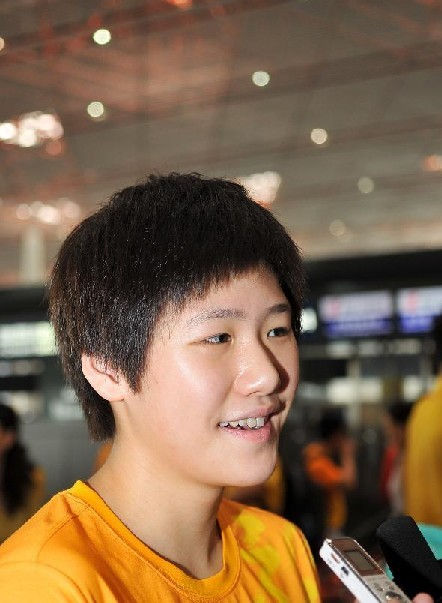
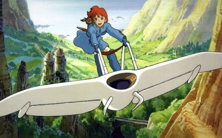

# ＜天枢＞你是只会比赛的机器人吗？

**这一指控暗示存在一种不对等、甚至不公平的竞争——某种程度上就像一个孩子斥责班上那些比自己成绩更好的同学不过是僵化、刻板的应试教育的产物，是只知道考试的机器人，而他自己则更重视“素质教育”。言下之意，那不仅胜之不武，而且如果自己也那样拼命的话甚至能做得更好，只是那不值得，因为那几乎就像是为达目的而出卖了自己灵魂、牺牲了自己生活。就像Daley的话中明确指出的，那些机器人一般的中国人是“没有生活”的，他们是“传输带”上生产出来的，更像机器而不是人。** 

# 你是只会比赛的机器人吗？

## 文/维舟

 

对许多中国运动员来说，在记者会上对付一堆记者可能要比他们在赛场上对付同样数量的对手难得多了。在气势凌厉地以破世界纪录的成绩夺得女子400米混合泳奥运金牌后，16岁的叶诗文在新闻发布会上似乎有点不善言谈，对记者提出的问题，她的回答概括起来不外是：“很激动、很兴奋、训练很苦。”最终有个国外记者发问：“除了像机器人一样日复一日地训练，你的运动生涯中有没有遇到与此不同的观点？”

这是很有趣的、中国选手经常会被问到的问题，几乎已演变成为一个神话。不久前英国跳水运动员Tom Daley在《卫报》上也曾抱怨他的中国对手“有一种不同的工作方式”——“他们不上学，也不和家人在一起。就是这么一条中国跳水运动员的传输带，有他们一直工作到损毁，然后下一个出来接着训练。因此这是完全不同的。我每天训练5个小时，每周6天，这已经很多了。但中国人可能训练7个小时，他们非常努力。但他们没有生活。而我有。我没有一直想跳水”。他毫不掩饰地称他的对手邱俊“就像个机器人。或者说他是出了名得像个机器人”。

这一指控暗示存在一种不对等、甚至不公平的竞争——某种程度上就像一个孩子斥责班上那些比自己成绩更好的同学不过是僵化、刻板的应试教育的产物，是只知道考试的机器人，而他自己则更重视“素质教育”。言下之意，那不仅胜之不武，而且如果自己也那样拼命的话甚至能做得更好，只是那不值得，因为那几乎就像是为达目的而出卖了自己灵魂、牺牲了自己生活。就像Daley的话中明确指出的，那些机器人一般的中国人是“没有生活”的，他们是“传输带”上生产出来的，更像机器而不是人。

一个有着人性弱点的普通人对抗一个没有感情、不可战胜的、巨人般的对手，这是通俗文化中一个经久不衰的主题。奇怪的是，这个对手没有感情的特点常常既是他强大的原因，又是他致命的弱点。不管是《终结者》还是《铁甲钢拳》，这类片子中的主角的对手都是强大到令人恐惧的、不会怜悯的机器人，然而最后总是人性必胜。缺乏人性最终被认为不仅是这些机器人令人厌恶的地方，也是他们的最大弱点。在这些故事中，几乎无一例外，结局要么是更富美德的人胜出，要么是最像人的那一方胜出。这一观点之所以如此流行，就在于它已经成为一种政治正确，像虎妈那样无情地驱使孩子获取更多成就，普遍被认为是残忍而反人性的做法。

从某种程度上说，这些“机器人选手”也是“道成肉身”，他们事实上被视为某种体制和文化的化身。长期以来，中国的体育制度饱受抨击，被认为是只顾夺取胜利的国家动员机制，它更多地让人联想到工厂或军事营地，参加比赛也更像是准备一次战争而不是参加游戏。很多人举证认为这一机制把运动员当成了实现“为国争光”目标的工具，而不注重他们个人的人格健全和全面发展。这又与中国本身的政治制度有关，人们很容易联想到列宁和毛的词典中经常出现的关于严厉控制、无情、铁的纪律之类的词。这一制度下人们的个性常常引起西方人的极大兴趣，李奇微在朝鲜停战时就曾说他的对手“突出的一点是几乎毫无幽默感。他们的脸上不露出一丝笑容，只是当他们在争论中占了便宜时有时才会发出几声轻蔑的冷笑”，只有一个常常难以抑制自己笑声的中国联络官给他好感。在他看来，红色中国的公开言论表明，“他们对待人类生命的态度，甚至对待他们自己人民生命的态度，与我们几乎毫无相似之处”。

不过，这种按照铁的纪律锻造出来的反人性的、无情的、压抑的、没有独立思考能力、缺乏幽默感的机器人，还有另一个原因：他们是东方人。按孟华在《比较文学形象学》中的观点，早在19世纪的欧洲文学中，缺少个性就被看作是中国人的一个重要性格特征：“通常人们说起‘中国人’时，把他当作一个密集的、不可数的、模糊的整体，或是‘中国人群’。人们通常用动物和他们作类比：‘蚂蚁’是最常见的比喻”，“人们已经认识到中国人特别缺少灵魂”。他们忙忙碌碌地工作个不停，拼命地创造物质，但没有个性、没有表情、没有灵魂，就像Jan Morris笔下的香港人：“他们像机器人一样工作，他们的婴儿数不胜数，他们的机器每天戚戚喳喳地响上25个小时。”在意大利的中国移民常被看作是一群能量激昂的蚂蚁般的劳动大军，“脸上毫无表情，搞不清楚是高兴还是沮丧。干活，干活，干活。如果我们对中国人一无所知，说到底是他们的过错：他们不说我们的语言，不喜欢我们的饮食，也不给英特、米兰或尤文图斯喝彩，只知道干活”；任何中国移民在意大利的成功，通常最终都被归结到他们“超常的、近乎病态极限的牺牲精神”（《不死的中国人》）。

如果这种浮士德式的精神是事实，那么它事实上很可能却是源自现代西方，而非东方文化。那种把生活看作是不断的斗争、征服和赢得胜利的过程的想法，在《西方的没落》中被视为是西方文化的基本特征。颇具讽刺意味的是：那种木偶般没有表情的、看上去像是弹簧装置一样驱动的、高度工具理性的现代人，曾被许多东方的观察家们看作是西方机器文明的真实写照。如今在人们看来，浮士德的努力完全用错了地方，因为普遍认可的观念是：努力成为一个真正的人，要比赢得胜利更重要，那会使人异化。Adlai Stevenson在战后不久曾说：“我们不再有成为奴隶的危险，但是有成为机器人的危险。”在这个对异化深深恐惧的时代，被人指责为是机器人，差不多就等于被骂“不是人”。

有时，人们的感情是颇为矛盾的。一方面，人们本能地喜欢更像普通人的，另一方面内心也往往承认要成就巅峰成绩需要非人的刻苦锻炼。韩国围棋国手李昌镐号称“石佛”，也以面无表情、言谈极简著称，但或许由于围棋的特征所致，人们通常更多地是称赞他极度冷静——但这种赞颂背后也隐含着一种“简直不像人”的可怕。面无表情可能被描述为没有人性，也可能被描述为“酷”，这一区别微妙但却十分重要。但不管如何，即便时或遭到“像机器人”的指责，很少人会主动承认自己的成功确实是由于机器人般的练习所致。在受记者发问后，叶诗文也反驳说自己的自己并非机器人，其成功是由于科学的训练所致——从某种程度上说，这恐怕也是事实，很难想像在如今这个时代，仅靠机器人般的蛮干就能获得那么高的成就。难怪最后100米被叶诗文超越的美国选手贝塞尔大方地说：“叶太强了，这样的结果我完全能够接受。”在冬奥会上，中国花样滑冰选手也一度被称为“面无表情的战士”，如今，很少人还如此嘲笑。

当然，很多选手本来就年纪尚小、涉世未深，平时如果埋头于训练，恐怕确实也不大会有什么沟通技巧——我们的教育本来也偏重对知识的掌握，而人际交流、演讲这些，通常只能靠自己天生的情商。运动员有时还受到家长式的体育官员的限制——他们总觉得好成绩比新闻发布会要重要得多。近几届奥运会上中国运动员的变化之一就是越来越多地展现自己的个性，这既是新一代的真实写照，一定程度上恐怕也是为了适应媒体的好奇心进化出来的结果。游泳选手李玄旭12岁就展现出很高的运动天赋，但她在记者眼里向来都是钉子户：常常在采访区躲着记者，被逮住追问后常常也都只是挤牙膏式地挤出三字经：“不知道”“还好吧”。但2010年广州亚运会上，她却有了很大变化，能在新闻发布会上流利、成熟地表达自己的看法，当记者惊讶地追问她何以有此巨变时，她报以一个使在场中外记者们都笑成一片的答案：“经验。”

原文地址：<ahref="http://www.douban.com/note/228311097/">http://www.douban.com/note/228311097/

 

(采编：佛冉 责编：佛冉）

 
