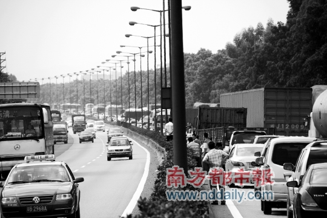
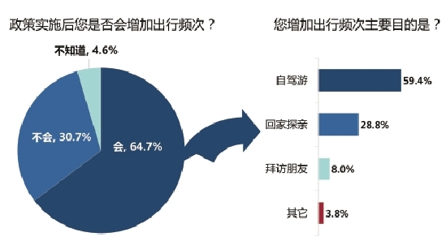

# ＜天枢＞假期高速免费政策有多贵

**节假日本是人员爆棚的时候，为什么还要用免费政策去推波助澜？若是真心为私家车主，岂非可以平常减费？若为国庆献礼，岂可仅此一项，后续财政如何结算？或者竟是拍脑袋的。如果通过系统性优化收费体系，而非运动式强抓狠推，则润物细无声，于假期车流调控的安全与顺畅、私家车主权益、路政部门心理与实际准备，都更为有益。**  

# 假期高速免费政策有多贵？

## 文/林尚玉 （《浙商》杂志新媒体执行主编、联商网特约评论员）

 

今年国庆黄金周首日堪称史上最堵，跟小型客车（以私家车为主）重大节假日免费使用高速的新政策有关。浏览媒体与网友报道可见，在部分拥堵情况严峻路段，如北京、成都、深圳相关路段，私家车司机纷纷下车活动，遛狗的遛狗，打网球的打网球。

网友吐槽，“不能占国家的便宜呀”。不少私家车主堵得发慌，其时间和油钱、情绪纠结大幅上升；大巴乘客更是急得团团转，遇上加班车没有车载卫生间又迟迟不到服务区的更加如此；运输部门车辆调度和“免费”提供服务的沿途路政人员又觉得特别辛苦。

问题是，谁得益了？以免费，惠民，拉动内需为名的相关政策，到底真正解决了什么问题，还是变相嫁接了什么资源，为何出台，怎样的逻辑和盘算？

早在交通运输部出台政策，等待各省出台免费细则时，媒体多观望甚至怀疑各省反应过度，还涉及发改委、交警、地方财政等。现在看，未必不是各省有关部门更实际些，无奈匆促出台细则，境内车更堵人更急、钱更少。

路政部门也喊穷了，“损失200亿元呀”，纷纷通过各种途径索要补贴。值得一提的是，部分高速路段，还是与民企共建的，这笔账如何算；高速服务上市公司发慌了，业绩增长预期有变。

所有的高速服务与运输考验，高潮启幕。大到路上的每一个人，不论是私家车主，还是快客大巴上的乘客，他们都期待拥有合理、恰当的“行路权”；小到每一个群体，每一个人，“他”的权益如何在新政策下得到保障。

9月30日，我有切身体会。我们第一次带孩子回家，坐上了由温州旅游公司临时提供的浙江高速加班车。从杭州去往瑞安，全程四百五十公里，汽车平常仅需四个半小时，那天走了八个多小时，中途停靠两次服务站（分别是诸暨和永嘉，而平时只在天台一站即够）。沿途不断从高速某路口出去，在边上的老国道行驶一段，又进高速，再在国道跑一段，如此反复，三个小时了还在诸暨段。令人措手不及。

节假日本是人员爆棚的时候，为什么还要用免费政策去推波助澜？若是真心为私家车主，岂非可以平常减费？若为国庆献礼，岂可仅此一项，后续财政如何结算？或者竟是拍脑袋的。如果通过系统性优化收费体系，而非运动式强抓狠推，则润物细无声，于假期车流调控的安全与顺畅、私家车主权益、路政部门心理与实际准备，都更为有益。

稍稍尝试联系“零供关系”，路政部门像拥有渠道的零售商，而中小供应商像私家车主，居然免费的简单粗暴的削减和根除“进场费”大概也是如此，乱就一个字。唯一关键区别是，路政部门的强势和政府部门产权拥有，它并不是市场主体，而零供关系则是久经考验的相对合适的市场关系。每念及有关部门调控零供关系，查处警告罚款中大型零售商，都心有戚戚。

更好的方式，其实大可在节假日优先保障通畅，鼓励大家乘坐公共交通，这便是最大程度上的公平了。相比之下，即使是平日，欧美发达国家解决交通问题和体现秩序文明的重要方案就是：私家车主因为缴纳各种进入市区和其他主干道的较高上路费用而“被迫”更多使用公共交通工具，而他们的洲际交通则基本上是不收费的。

这件事令我们思考：不合时宜的“免费”，正在付出昂贵成本？

原文链接：财新网博客 [http://yuexiaodao.blog.caixin.com/archives/46853](http://yuexiaodao.blog.caixin.com/archives/46853)

 

（采编：彭程；责编：马特）

 
