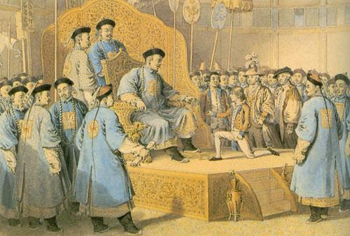
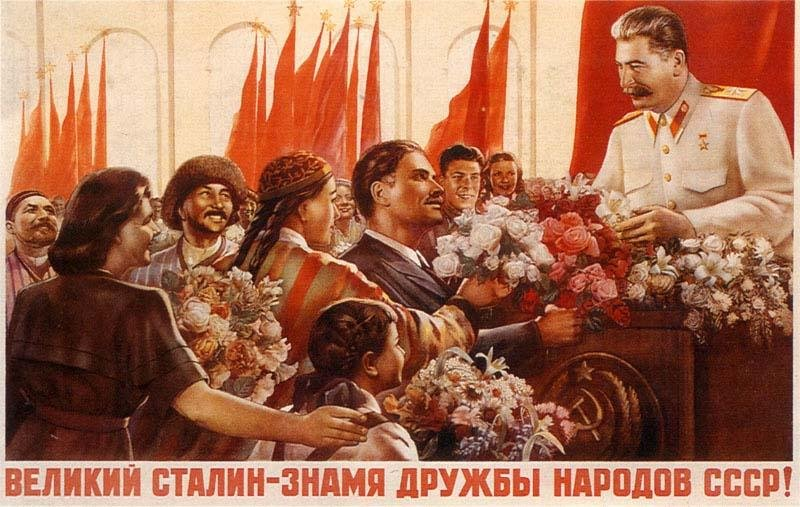

# ＜天枢＞光的棍

**也许我只能庆幸我还是光棍，还能过这个世纪之交的光棍节而不顾其他，也许我应该庆幸现在没车没房没事业，不怕被查偷税漏税，不会遭遇强拆，不会担忧孩子和老婆的安全。可当我一想到终有一天我也会拥有这些东西，但我终有一天也会无力去保护这些东西的时候，内心的迷茫就如同感受到宇宙洪荒的那种无力感和焦虑。**  

# 光的棍

## 文/徐海星（西安科技大学）

 

在光棍节降临之际，深圳发生了“杨武事件”，我一直不忍去看这些相关的新闻，害怕一波又一波的媒体去逼着这一对无力的底层屁民一次又一次地去回忆那不堪的一幕。这一切是多么的刺痛人心，是男人懦弱么，是妻子软弱么，生容易、活容易、生活却不容易，生活在社会最底层的人民只想有着基本的温饱，只想能平安地度过每一天，中国的臣民社会延续了千年，中国的百姓是最有忍耐力的民族，只要还有一口饭吃，他们以最大的容忍度来对待这个国家，对待这个他的国。

前一阵还有众多人探讨人权问题，我无意去看其中详细的内容，这个纷争由来已久，并且有一套固定的解题思路。人权不仅有自由和民主，还有生存权、发展权和安全权等。中国和西方人权问题的争议主要在于，中国的人权主要讲的是生存权和发展权，我们的历史告诉我们，只有国家发展了，只有国家笑傲江湖的时候，才能确保百姓的生存和安全，才能保障作为个体的人的权利。而中国目前处在社会主义建设初级阶段，生产力不发达，所以要以经济建设为中心。等国家的经济发展好了，自然能保障人民的生存和发展，人权也就得以保护和实现了，而作为个体的自由之类的权力只有等到经济极大发展，物质财富极大充裕之时才能谈。也许这套固有的思维是我们在汲取了近代史屈辱的历史，是对近代中国发展的一些反思，并且总结出来以后就觉得这个一定是对的。

我比较赞同社会契约的观点，社会和国家是一种契约关系，是能保护双方利益的一个契约，罗尔斯的无知之幕也是一个很好的假设。国家作为一个公意的集合体，首先它是由每个个体的人所组成的，一味地强调集体，忽略个人，只会让这个集体的组成部分越来越少，这个集团的成员会越来越少，那么到最后这个集体必然会变成代表某一个人的利益而存在。不要一味地抱怨某些国家总是拿人权来说事，因为事实就是如此。除了一批利益的既得者、除了那一批先富起来的人（这批人更多地在于他们的好运气）、除了食利阶层要坚定地维持这个社会结构，仍然一味强调国富民强，强调生存发展权优先考虑，完全忽视个人之外，我们听不到作为这个国家主人的人民的更多声音。这个特定的阶层害怕是因为变革就会伤害他们自身的利益，现在社会宣传的公平是体制内的公平，保障相同背景和资源下的公平，而这种公平我们又如何能企及。

我看很多学者为中国的人权辩护都是因为西方注重的是自由主义立国，注重个体的保护。而中国不同，中国是一个“乡土”中国，很久以前就是一个趋向于寻求集体保护，避免自身产生不安全感的社会，首先把我们每个人都假定在必须有一个组织来依靠，并且在历史中已经证明，站队是多么重要。那么我们的这个假定是不是对的，却很少有学者去探究这个问题，我们是不是没有这个党领导，我们的国家将不存在，爱党和爱国是同一回事么？集体的概念在我们心目中变得越来越强大，只到我们最后都忽视了个人。国家主义、集体主义也许已经深入了好多人的骨髓，变得万劫不复。

也许哈耶克《通往奴役之路》有着西方学者的偏见，但社会主义必然逃脱不了极权，必然走向奴役么？也许这更值得我们反思。如今来看，凡是写着人民的地方人民都进不去，人民作为一个政治概念只存在于我们大脑之中，存在于领导的报告之中，连选举票都没有的人民怎么感觉是如此的空洞。房子会被强拆，短信、邮件都会被监控，甚至连自己的家人的安全都无法保障，这个国家让我越来越认不清楚了。专政的敌人没有了，但为什么现在打压的都是我们的阶级兄弟，一定要有假想的敌人存在么，一定就有颠覆国家政权的假想敌存在么。这个制度如此的臃肿不堪，被养肥的这群食利阶层一定就是代表我们利益的人民么。

也许我只能庆幸我还是光棍，还能过这个世纪之交的光棍节而不顾其他，也许我应该庆幸现在没车没房没事业，不怕被查偷税漏税，不会遭遇强拆，不会担忧孩子和老婆的安全。可当我一想到终有一天我也会拥有这些东西，但我终有一天也会无力去保护这些东西的时候，内心的迷茫就如同感受到宇宙洪荒的那种无力感和焦虑。

光的棍，他的国，当我听到我老师慎重思考后告诉我现在革命的基础仍然还存在，如果这个制度仍然如此进行下去不思悔改，终有一天会发生变革的时候，我的内心稍稍有些悸动，或者更多的是一种渴望，一种对美好世界的憧憬。愿上帝保佑光棍们和光棍们的家人吧。

 

（采编：黄理罡；责编：黄理罡）

 
