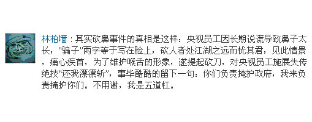
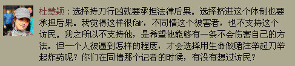
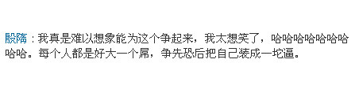

# ＜天枢＞割鼻，民粹与暴力的合理性探讨

**其实如果尊重生命，尊重游戏规则的观念能普及，草圈又如何会出现今晚这种莫名其妙的争论？中国未来走向正常国家，草圈的人是当仁不让的启蒙者。其实，亲们，话说如果真的有一天，我们的国家通过非暴力的道路最终实现了宪政，这其中的意义你们想过吗？如果能让中国数千年来暴政——暴民的循环在我们这一代人手中结束，推翻一个政权对我们来说还那么重要吗？**  

# 割鼻，民粹与暴力的合理性探讨

## 文/丰钊（华中科大）

  央视女员工遭割鼻这条新闻，其实并不是今天发生的。昨天就已经有人将这个新闻和利川等事件等消息同时播出。其实如果没有林柏墙的那两条状态，这个事件也不会像一枚炸弹一样引爆整个草圈。但既然现在已经成为了草圈的重要话题，那么对于林柏墙的这两条状态，和由此引发的大规模论战，还是有必要仔细检讨一番。 首先依旧贴出林柏墙的这两条状态： 

 对于任何争论，我的观点一向是先理清逻辑，弄清楚对方和自己的观点。这个如果不清楚，那么争论就会是一笔混账，演变到最后无非人身攻击和站队表态两种结果。 首先，围绕这个事件，草圈的各位至少对以下3个层面的问题进行了追问。  **1.这个央视女员工是否有罪；或者再抽象之，进入体制是否就有原罪？** **2.有罪是否需要受到惩罚？** **3.惩罚需要由谁来执行？这种惩罚的轻重又由谁，或者什么标准来衡量？**  对于第1个问题，我个人的观点是：凡是生活在这个体制内的人，都是有罪的。在这一点上，我和那些为割鼻叫好的人的观点一致。 然而，如果继续往深处思考。在这个国家，谁能说自己与体制毫无瓜葛？谁能说自己不是体制内的人？从小在北京长大的孩子，因为低升学压力，天生就能在高等教育资源上获得更大的起点优势。从小在城市长大的孩子，也可以天生受到城乡二元户籍制度的偏袒。你所在的学校如果是重点大学，那么你能接触到的老师，你能获得的教育资源，甚至你在做错事后所能得到的庇护，都会比非重点大学的学生来得要多。你们在考研，高考政治中，难道没有写过违心的话，这是否就表明你们已经向这个体制妥协，屈从于它的权威？ 你们哪一位在受到体制深深伤害的同时，又没有从体制中获得好处？ 《圣经》里耶稣对一群准备用乱石砸一个死行淫妇女的人们说：“你们中间谁是没有罪的，谁就可以先拿石头打她。”这句话，我想送给所有为央视女员工惨遭割鼻而高声叫好的人。因为如果你们的观点成为社会主流认知，那么迟早有一天，你们也会成为这种观点的受害者。 另外还有一点引申。在体制内，并非就只剩下作恶的可能。黄陀的一个状态对部分人有着异常奇妙的打脸效果： 

 所以说，认为体制等同于罪恶，又进一步认为一旦沾染罪恶就万劫不复，就无可救药，被报复了就是活该，这种观念，我觉得非常幼稚。  下面再探讨第2个问题。**有罪者是否需要受到惩罚？** 我的观点是：我认为有罪者必须受到惩罚，但是谁能做出有罪推定，这则是另外一个问题。我在苏君熾最新发表的那篇日志下，曾反复强调过我的这个观点。然而苏君就如同其他很多为割鼻叫好的人一样，对我的这个质疑置若罔闻。包括杜慧颖同学，在她的状态中也一直纠结于有罪者是否需要受到惩罚，而没有去回应其他人对谁才能做出有罪推定的疑问： 

 当然，也许有人会说，进入央视是她可以自由选择的，她进入了这个地方，就表明她自己已经主动选择和这个体制同流合污。有人进一步指出，这位被割鼻的女员工负责视频审核，是一位直接负责言论钳制的人。 然而这都仅仅只是证据。就连天朝那些不把法律当挡箭牌的家伙，也知道对于未定罪的人，也只能称为犯罪嫌疑人，非得走一遍程序，先给他安个罪名，之后才敢光明正大地进行迫害。你们就凭这几条信息，认为她是罪人，甚至对未定罪前就先执行的法律框架以外的惩罚叫好，莫非连你们常骂的那些人都不如？ 众口铄金，一帮人闹哄哄地进行有罪推定，这就是贺卫方所抵制的所谓“人民司法”。遥想当年举着中华人民共和国宪法的刘少奇，被一帮红卫兵肆意凌辱，和今晚我看到的场景何其相似。而区别，仅仅在于他们先审判再行刑，而你们则对已经发生的私刑，进行补救性的审判而已。  最后再来谈第3个问题：**惩罚由谁来执行？量刑的标准是什么？** 在成熟的宪政国家，涉及到人身伤害的惩罚，只能由具有执法资质的机构执行。这是一条文明世界的通则。李硕在那条状态下，将割鼻视作是“自然法”，进而肯定其合理性，我也只能说李硕的法律知识已经达到了中国最高法院院长的水平了。对他，我只好仰视。 当然，天朝是一朵奇葩，任何文明世界的通则在这里能否适用都要掂量再三。但是我仍然倾向于将惩罚权交给至少在名义上具有惩罚权力的机构，而不是一群暴民。在我看来，一个草寇成群、剥夺人身权利的执行权散落在各个草头王手里的世界，来得比一个专制但却稳固的世界，更加可怕。 这个道理很简单，如果谁都认为可以凭借自己认同的正义标准，对他人动用私刑，那么每个人的人身权利都无法得到保障。 至于量刑的标准，我同样认为除了法院，没有机构或个人能够对此进行任意裁定，哪怕你是个意见领袖，乃至国家领袖，都必须在程序的框架下行动。 其实从今晚的讨论，可以发现更多隐藏在身处的东西。这里我想先引用另一位同学的状态： 

 这才是我们这个时代最大的悲哀。我在黄陀的状态下说到，尽管这个国家已经糟糕到这种地步，但是我仍然对它充满了信心。然而今天看到林柏墙状态下那么多人为割鼻叫好，我却少有地陷入到了绝望之中。 与反贪、反对一党专制、要求民主相比，更重要的是先争取到对每个人生命和自由的尊重。这种尊重不仅是当局对其治下每个公民的尊重，也是公民对公民的尊重。对于前者，你可以道一句自己无能为力，但是对于后者，就真的那么难做到吗？李硕以前曾经写过一篇评论皮诺切特的日志，其实这篇日志传递出了一个重要的信息：对个人权利和自由尚未学会尊重的国家，即使实现了民选代议制度，最终也会陷入混乱。 那么对于每个公民，怎么样才能做到对他人的尊重呢？我认为最基本的一条，就是放弃用暴力解决问题的思路。 也许有的人会说，你认为暴力本身就是一种恶，可现阶段中国的法律也无法惩治坏人，那么不用暴力，我用什么？ 我的回答是，非暴力手段。 的确，在现在这个时代，听到一个人嘴里对当局喊出“非暴力”的口号，很多人的第一反应就是这个人真的太“乃义务”了。我相信肯定有人会拿冷静理性钱明奇来揶揄我，可别忘了，钱明奇失败了，换来的只是两个政府机关人员的死亡；而从九十年代开始无数独立候选人前仆后继地行驶自己参政议政的权利，最后则促成了《选举法》的修订，和当局对普通公民选举权利的重新审视。 以暴制暴只能让人获得一时的快感，于问题的解决，则没有任何意义。 中国的非暴力道路在世界上没有其它成功案例可供参考。南非和印度的非暴力运动得以成功，在于英国殖民者及其继任在这两块土地上继承了言论自由和结社自由的传统，并未对曼德拉和甘地的集会和发声加以限制，这也是南非和印度的运动每次都能迅速从一点蔓延到全国，对政局造成影响的根本原因。 中国则不然，当局一直没有放宽对言论自由和结社自由的限制，最典型的例子就是此次独立候选人的报道再次被上层行政命令压制。但我们回过头去看，我们的路仍然是越走越宽。2003年的那次独立参选浪潮，全国媒体一片噤声；而今年的这波热潮连党报都公开承认。尽管其论述让人贻笑大方，但当局不学鸵鸟，而是公开表态，相比以前本身就是很大的进步。不要急功近利，要学会“零敲牛皮糖”，一点一点地迫使当局让步，这个过程虽然缓慢，但却稳妥。中国近代以来欲速则不达的教训太多，当代的人们应该引以为戒。  最后，我想说，即是这个国家再糟糕，我也只会坚定地在非暴力的道路上走下去。而且情况越糟，我越警惕暴力。因为社会就像一根弹簧，上层绷得越紧，底层爆发时产生的破坏能量就越大。我希望未来的中国出现的是哈维尔，而不是朱元璋。 文末则是一点吐槽： 

 殷隋在她的状态里说自己难以想象草圈里的人能为这个事情争起来。其实如果尊重生命，尊重游戏规则的观念能普及，草圈又如何会出现今晚这种莫名其妙的争论？中国未来走向正常国家，草圈的人是当仁不让的启蒙者。 其实，亲们，话说如果真的有一天，我们的国家通过非暴力的道路最终实现了宪政，这其中的意义你们想过吗？如果能让中国数千年来暴政——暴民的循环在我们这一代人手中结束，推翻一个政权对我们来说还那么重要吗？  

（采编：佛冉 责编：黄理罡）

 
