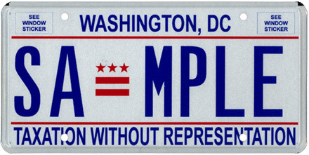
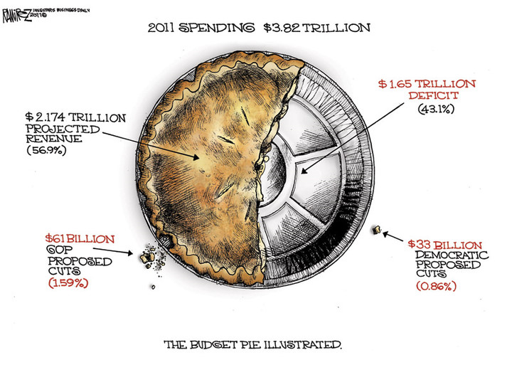

# ＜天枢＞华盛顿市长被逮捕不是简单的阻碍交通问题，而是一场精彩的政治博弈

****政府是靠不住的，即使你交再多的税，即使你再听话，即使你和领导人有着一样的政治理念，即使你的领导人是睿智和仁慈的，如果你缺少投票权这个可以限制政府的笼子，你依然会成为政治博弈中的牺牲品。****

### 

### 

** **

# 华盛顿市长被逮捕不是简单的阻碍交通问题，

# 而是一场精彩的政治博弈

### 

## 文 / 谢熊猫（新加坡南洋理工大学）

### 

### 

美国首都华盛顿的市长Vincent Gray被捕了，逮捕的理由是在街头游行的时候阻碍交通。这位市长所在的游行队伍往路中间一坐，搞得警察要来疏导交通，确实是阻碍交通了，但是如果把这个事情看做阻碍交通这么简单，那就是没能理会背后的政治博弈了。我来解释一下为什么。

当然了华盛顿作为美国国父的名字是很常见的一个东西，所以这边说到的华盛顿是华盛顿哥伦比亚特区（Washington, District of Columbia，以下简称DC），也就是联邦的首都。 这个事情的背景呢是联邦政府的债务上限快要到了，如果不提高债务上限的话联邦政府就要破产了，本来也不是个难事，立个法提高下债务上限就是了，但是共和党人不干。具体来说是刚刚取得了众议院多数席位的共和党人不干，因为这群靠着茶党上位一举推翻民主党在众议院多数派地位的共和党人是要找台阶下的，之前在竞选的时候保证了上任之后要削减联邦预算的，才没干多久就又提高债务上限的话脸往哪里放？所以就有了奥巴马和共和党人的协商。 而DC就被奥巴马作为协商的筹码成为了牺牲品。协商的部分我在后面再讲，这里先讲为什么DC会成为协商的筹码。 **没有特权的特区** 这个事情要从两百多年前说起。当年建立DC的时候，目的是建立一个由联邦政府直接管辖的联邦首都所在地。同时出于这个原因，DC不属于任何一个州。不属于任何一个州的最严重后果是DC在国会里面是没有实际投票权的。说没有实际投票权，是因为特区代表在众议院还是可以投票的，不过都是些程序问题的投票，以及在下属委员会的内部投票，真正和立法问题相关的投票是没有份的。 没有投票权的美国领地也不是只有DC，波多黎各啊、Samoa、Guam啊这些个岛也算美国领地，在国会也没有投票权，但是区别在于DC是要交联邦税的，其它小破岛是不需要交联邦税的，而且交的税还很高，按per capita来说比其它所有州都高。这不就反了么，又要归联邦政府管，又要交很高的税，又没有实际投票权，这是什么？你们懂的。 国父们搞独立时的口号就是No taxation without representation么。DC可好，又要给联邦交税，自己的本地预算还有种种限制。什么样的限制呢？比如说本地政府不能对非DC居民收个人所得税，“非DC居民”是什么概念呢，大概是DC劳动力的60%，这也很容易理解，首都的外来人口难免多些。但是就算这么些个限制之后，这个本地预算自己说了还不算，要国会批准才行。所以DC的人们对于他们在国会没有投票权是很有怨念的，比如最新的DC车牌都直接写了“Taxation without Representation” 

### 

### 

其实还不止预算这个上面有问题，DC本地政府的憋屈大了去了，怎么个憋屈法，这个要讲一下DC的home rule **Home Rule 和All Cases Whatsoever** 什么是Home Rule呢，就是说DC居民可以通过各种途径来管理DC。不过还没完，虽然他们可以管理自己脚下的这块地方，但是“最终解释权”归国会，为什么会这样呢？因为宪法说的，宪法第一条第八款： “The Congress shall have power... to exercise exclusive Legislation in all Cases whatsoever, over such District... ” 这里的District就是指包括DC和波多黎各之类的地方。这句话的关键词是“exclusive Legislation in all Cases whatsoever”，翻译成中文就是所有事情国会说了算。为什么要这么搞呢？因为联邦政府害怕。害怕什么呢？害怕造反。因为美国人可以合法持枪啊，而且军队不是政府的，更不是哪个政党的，他们当然怕。1783年的时候就有400个费城的士兵不满当时的政府，搞了兵变，1783年的费城是什么地方？联邦政府的所在地啊，《独立宣言》就是四年前在那个地方签署发布的。兵变之后费城是呆不下去了，于是辗转到过马里兰、新泽西、纽约，但是去到哪里联邦政府都管不了这些个邦国呀。想来想去后来就建了DC，如前文所说DC不属于任何一个州，而且“all Cases whatsoever”都是国会说了算。注意一下年份就可以看出来国父们建DC是多么无奈了，1783年兵变，之后政府撤出费城，辗转各地，1787年写成《宪法》特意在里面写了个“all Cases whatsoever”，1788年《宪法》正式生效，1790年就有了DC，从此联邦政府终于不用怕本地人造反了。 这么个流程下来看似没有问题，但是却缺少了十分重要的一个因素---互相制约。DC归国会管，但是DC在国会是没有投票权的，而这个投票权的缺失就是DC的悲剧。 **一票的重要性** 当然了，按照DC不到一百万的人口，就算有了投票权在国会里面也就一个人投票，其实DC在众议院本就有一个代表，这个代表有和其它众议院议员有几乎一样的权利和职能，都能参加众议院的会议，都能参加辩论，也能介绍新的立法法案，唯一的差别就是没有投票权。 有人可能会问，众议院有400多个人，DC就算有了那么一票又能有什么区别？告诉你，区别大了。不能被简单的数字所蒙骗，虽然400多票中的1票在数字上没什么效果，但是有没有投这一票的权利是能造成很大的差别的。 举个例子来说，一个公司的决策层有三个人，其中一个人占有49%的股份，一个有44%的股份，最后一个有7%的股份，这三个人里面决策权最大的无疑是49%那位，最小的是7%那位。但是如果规则规定任何决定都需要50%以上的股份才能生效，那么这三个人任何一个都不够50%，任何两个都够50%，这种情况下三个人的决策权就是几乎对等的，因为任何一个人说了都不算，大家都要按着规则来。在国会里面做事，同样要按着规则来。 想要在国会通过一份法案是非常复杂的，步骤相当繁多，但是简化来说有五步，一是介绍，二是考虑，三是辩论，四是投票，五是废除。其中第五步是总统的特权，总统可以否决国会通过的法案，国会也可以推翻总统的否决，其中有不少的乐趣，但是第五步和这里说的关系不大，我就不展开了。我们看前面四步： 介绍的话就是国会议员把一份法案提交上去，提交了之后这个议员就成了这个法案的倡议者(sponsor)，但是稍微重要一点的法案都会多找几个共同倡议者，一是显出其重要性，二是人多好办事，搞政治的，原则和人际关系都不能缺。再就是考虑，这个分好多步骤，简单来说就是法案提交上去了就要有专门的委员会来研究讨论，讨论完觉得可以就往上推，不可以就退下去。如果运气够好被委员会推上去了，就要辩论，讨论利弊作出修改等等。讨论完了就是投票。 仔细看这些个过程，就可以看出其中的决定性因素。投票需要支持者吧？一些模棱两可的法案，如果你和这个人关系好，说不定就支持，如果关系不好，那投反对票良心上也没什么过不去，况且这些政客讲良心的本就不多。辩论需要人吧？国会的辩论不是大专辩论赛，辩论的时候唇枪舌剑辩完了依然是好朋友，国会的辩论和吵架是很有相同之处的，除了用词文明之外其它都很类似，而且没人在旁边掐你的逻辑有没有问题，很多时候就是直接骂对方是傻逼的。这样的辩论费时、伤身、还得罪人，除去少数有良心的政治家外，如果不是自己倡议的法案或者自己朋友的法案，谁也不愿意吃力不讨好。再看委员会，每年那么多法案交上来，如果要每个都采取行动然后推上去那国会这帮人不睡觉也不够用，哪些推上去，哪些退回去，都要看这些议员组成的专业委员会的，决定因素还是人。最后看共同倡议者，共同倡议了之后就代表了责任，必须要和倡议者一起往上推，推成功了你还不是最风光的一个，所以共同倡议这个是礼尚往来，这次我帮你下次你帮我。 看完了这些个过程就很容易发现，最重要的就是人。从法案的提出到通过都少不了朋友帮忙，那么政客之间怎么交朋友？利益。具体到国会，利益就是我帮你倡议，我帮你把法案往上推，我帮你辩论，下次我需要你的时候你也得意思意思，帮我投个票什么的。这就是DC的国会代表的致命伤，他可以帮你倡议，可以帮你推，可以帮你辩论，但就是不能帮你投票，而这些过程中最重要的偏偏就是投票，因为前面说得再好，投票过不了就是过不了。所以说特区代表没有投票权，少掉的不只是一票这么简单，这少掉的一票使得特区非常的脆弱，没有了投票权就很容易沦为政治筹码，这次的事情中DC就沦为了奥巴马的政治筹码。 **预算的博弈** 其实在这次的预算协商奥巴马把DC作为筹码让我对其有点刮目相看，看来奥巴马不只是一个口才优良的演说家，也是一个懂得权衡利弊的政治家。这次的预算协商说到底是三个男人的博弈，这三个人如下： 奥巴马，民主党人，美国总统； John Boehner，共和党人，众议院发言人； Harry Reid，民主党人，参议院多数派领导人。 Harry Reid是这三个人中处境最惨的一个，作为参议院多数派领导人，他眼见着民主党从奥巴马上任时的绝对强势慢慢萎缩，办事处处受阻，民主党支持率不断下滑。这次预算协商中的软弱，不能说是Reid不努力，只能说是局势所迫，而且民主党人中的一号并不是他，而是同样参与这场博弈的奥巴马，在这场博弈中Reid只是一个配角。 同样被局势所迫的还有John Boehner。开头我就提到了靠着茶党上位一举推翻民主党在众议院多数派地位的共和党人在竞选时是有承诺的，这个承诺就是他们会从奥巴马的2011预算中削减1000亿美元。这个是众议院的共和党新人们的脸面问题，而作为众议院共和党领袖的John Boehner就要负责达到这个目标。但是Boehner很清楚这个事情没有可能，虽然众议院里共和党人占多数，但是即使这个1000亿美元的削减方案通过了众议院，它还是会毫无悬念地被参议院刷下来----参议院里还是民主党占多数。Boehner不能给共和党议员们挣来面子，他们也不会给Boehner面子，失去了群众基础，众议院发言人这个位置可就难做了，所以说参与到这场博弈中来的Boehner也是形势所逼。 奥巴马也不容易啊。政府债务的烂摊子是谁留下来的？小布什和他手下的共和党人，奥巴马接手的时候是一笔烂账加上两场战争，还雪上加霜来个金融危机，而且党派矛盾严重。经过两年的努力，进步是有的，但是不抵事，全因为小布什破坏的实在太彻底，要缓回来没那么容易。债务这个东西奥巴马也不是不知道，但是知道有什么用，撤军吧，条件还不成熟；社保金吧，不发会被人骂死；医保吧，你不给别人跟你拼命，反正横竖是死。但是这几个预算指出的大头不能削减，还是要表示点诚意的，所以民主党人的意思是奥巴马的预算中我们削减掉300亿美元。共和党人不干，死要脸皮的喊1000亿，商量之后算是降了点，但依然要600亿。要说不管是300亿，还是1000亿，其实都只是装样子的，为什么这么说，因为奥巴马的2011财政预算支出是3,8200亿，1000亿在里面连个零头都不是。 

### 

### 

但是装样子也不容易啊，美国的法定债务上限摆在那里，不立法提高的话政府就要破产，这个责任奥巴马是断然付不起的。但是共和党人死脑筋，你不给我面子我也不给你面子。怎么办，只能一起来博弈了。 **奥巴马的筹码** 财政预算中具体涉及DC并且导致市长Gray游行和被捕的其实是关于堕胎的事情。协商的结果是DC政府将不能花钱补助贫困妇女的堕胎费用。这个结果我是从媒体那里听说的，市长Gray也是从媒体那里听说的。在这点上我和Gray没什么不同，但是我是个完全的局外人，Gray是DC的市长，这个协商的结果关系到的是DC的钱，光这就说明了为什么DC会成为奥巴马的筹码----特区的人在这场协商中根本没有发言权。 说个题外话，禁止花钱补助贫困妇女的堕胎费用这个事情之前也是有的，而这个禁令曾经在2009年的时候被废除，现在这个禁令又被重新提出。而这和国会里面民主党人在2009年的绝对强势到现在的逐渐式微是相互呼应的，也算是春江水暖鸭先知了。当然这个不全是题外话，后面还会讲到。 回到协商中来，一次成功的协商必然要双方都满意，至少一方不能太不满意，大家都做出点让步，毕竟谁也不想美国政府真的破产。而奥巴马抛出DC堕胎问题这个筹码，很好的说明了奥巴马是个精明的政治家。 众所周知，堕胎的合法化以及政府的堕胎补助一直是美国政界的一个争议话题，这个话题由来已久，短时间内看来也不会有个结论，而且堕胎问题远不是处在一个平衡的状态，事实上双方都在暗暗使劲。在Boehner的日程中，堕胎问题就是重中之重。站在坚定反对堕胎的立场上对于一个共和党人来说是很好的政治资本。但是美国是由很多个州组成的，互相的立法不能干涉，所以要一口气把五十个州的堕胎全部推翻不太可能。上一次美国一口气把五十个州的一项立法全部推翻还是民权运动时期马丁路德金博士带头搞的，那次是占尽道德优势而且有很深厚的群众基础，还搞了很久、死了不少人才搞成的。禁止堕胎这种在道理上就很牵强的东西想学民权运动是不可能的，而且那些民主党传统强势的州也不会让你这么干。由此可见Boehner的策略肯定不是一口气推翻，而是慢慢来，先搞个先例，不让政府的钱落到堕胎诊所的补助里，从而减少堕胎数量，有了先例以后也好办事。再加上之前共和党议员们的削减1000亿选举承诺实在是不可能实现，这个时候搞个堕胎方面的小胜利转移一下共和党支持者的注意力还是很有好处的，所以综合一下，在这个协商中Boehner获得的好处是： 1.给自己赚取政治资本 2.在反对堕胎的政治路程上迈了一步 3.给共和党赚取脸面 4.给共和党人找个台阶下 而对于奥巴马来说，把DC的堕胎问题抛出去作为筹码也是很精明的一个打算。《华盛顿邮报》之前曾经披露奥巴马在和Boehner讨价还价的时候Boehner提出要在DC堕胎问题上更近一步，但是奥巴马坚定的拒绝了，这就是奥巴马的精明之处了：第一华盛顿特区历来就是亲民主党，所以这样的做法虽然会造成民主党支持率的下降，但是不会失去优势。第二，拿这个作为交换条件获得共和党在提高债务上限上的合作，达到了目的。第三，前面所说的，类似的禁令在2009年民主党绝对优势的时候曾经被废除，现在再禁一遍，以后得势了再废除也是可能的。第四，也就是最主要的，这么做不得罪人，或者说得罪的是无关紧要的人。无关紧要的人，说的就是Vincent Gray市长和DC的居民。这些人在国会是没有投票权的，不怕他们捣乱。虽然说DC在总统选举的时候有投票权，但是到时支持的依然会是民主党候选人。所以综合一下，这个协商结果对于民主党方的好处是： 1.不会失去党派优势 2.达到合作目的 3.为以后留下伏笔 4.得罪的是无关紧要的人 其实前面三条放在任何一个州多多少少都行的通，最终使得DC成为牺牲品的是第四条，而造成第四条的就是DC在国会没有投票权，所以罪魁祸首依然是taxation without representation 从另外一个角度看，即使是被逮捕的Vincent Gray也是有好处的，虽然不是计划之中，但是这个好处是很实在的。原本默默无闻的Vincent Gray这次在DC的居民面前大出风头，为连任攒下了政治资本。 **结论和中心思想** Gray市长在出狱后的发言中表示会继续向人们讲述这样的不公，但这也就是他所能做的了，归根到底，DC在国会就是没有投票权的。**政府是靠不住的，即使你交再多的税，即使你再听话，即使你和领导人有着一样的政治理念，即使你的领导人是睿智和仁慈的，如果你缺少投票权这个可以限制政府的笼子，你依然会成为政治博弈中的牺牲品。**

### 

### 

(采编: 乔淼 责编:乔淼)

### 
