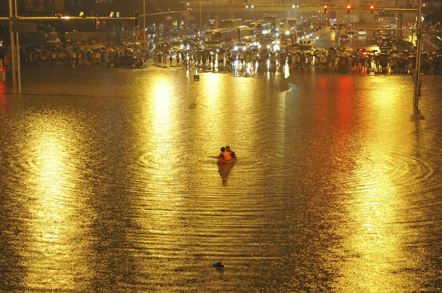

# ＜天枢＞大雨过后，怎样才是胜利

**我们能做的，就是逼问。别管你的文字是不是真的有当权者看到，他都能发挥它的能量；别管别人指责你只说不练，只会耍耍键盘，吃着官晌的人也未必都在冲锋打仗。也许短时期内多一个问责的文字不会让社会中少一分傲慢，但是长期来看，你的那份力量肯定让社会的合力发生改变。遇到机会用于实践和威权，有了位置推动下好制度的建设，把权利放进逼近笼子里，也许我们才会有比今天更好的公共服务。**  

# 大雨过后，怎样才是胜利

## 马军（国立台北大学）

 

面对着既成事实的灾难，面对着那么多失去亲人的痛苦和北京市民自发帮助人的义举，我们不免悲伤，也不免欣慰。然而，再悲伤，也不能失去对生活下去的动力，正如再欣慰，也不能将此场大雨归为全市的胜利。

然而在悲伤和欣慰之余，我们更要做的是，反思，看看这一场大雨过后，到底能给我们留下什么样的遗产。据说明天又要下雨，明年后年也肯定会下雨，六十年后我们大概还会遇上一场六十年一遇的大雨，那时候大雨退去，留下的到底还是不是一个冰冷的77，则取决于我们现在做什么。

灾难的到来不是体制问题，这点毋庸置疑。美国会有飓风、法国会有空难，德国也有不小心撞在一起的动车组，台湾也有碾平村子的土石流。但是这并不意味着对救灾行动背后的体制问题的探讨就是过分的，灾难不是体制问题，救灾则能体现出体制的问题，美国飓风过后，虽然布什赶去灾区的速度不如宝宝，但是不会美国不会有哪个作家写出“so happy even dead”这样的诗；法国空难过后，也许群众情绪不会迅速稳定，但是政府会花钱打捞飞机原件调查原因；德国动车相撞之后，也许短时期内德国的动车速度不会再有提高，但是德国的制造业并不会因此受到太大的打击，反思的结果是德国的动车依旧是世界上卖的最好的国家之一；台湾风灾之后，死者甚至无法被挖出就长眠地下，但是每次台风之前，铺天盖地的电视新闻和政府动员，总能让尽可能多的民众搬到安全的地方。没有任何人和任何制度能保证在接下来未知的灾难中战胜上帝和死人保证零伤亡，但是好的体制会让灾难过后，不至于在我们被自然撕开伤口之后，再被官员们泼上一脸冰水，或是再吃下一口喉舌里吐出的恶心的痰。

面对着这样的灾难，面对着这样的救灾，很多人在网上对政府的行为或痛骂或吐槽。很多人会感慨，这是官方和民间互不信任啊。再深一点，又会有很多国人劣根性和特有文化的说辞出现。我承认，在解释社会现象和公共事件，甚至经济行为的时候，有时候文化的解释力更让人清醒和明白，但是，倘若忽略制度而之谈文化，显然得出的结论是很片面，甚至是错误的。制度和文化，是解释社会现象的两大重要的流派，制度论者往往认为文化论者的结论缺乏科学性，而文化论者往往认为制度论者缺乏洞见和才气。然而一个不争的事实是，目前来说，制度论还是比文化论有着更深的历史，更全的体系以及更强的解释力。在研究具体问题的时候，文化解释更像是制度解释的补充，往往用制度解释不了的东西，才用文化来解释。即使是文化学派的福山，在《信任》一书中，也承认文化的解释力恐怕只占全部解释力的两成。所以，只谈文化不谈制度，恐怕是一种很偷懒的行为，也是一种很不负责的行为。

其实这场大雨给我们留下的东西可以总结出不少，我们现在知道了北京哪些地方容易积水，下次大雨就可以尽量躲避；我们现在知道了水下怎样打开窗户逃生；我们现在知道了双闪代表着免费的车可以搭乘；我们现在知道了北京的那么多的桥根本没有真正意义上的下水道。然而哪里有积水，交管部门没跟我们说，他们在忙着贴条；怎样逃生，安全部门没跟我们说，他们在忙着维稳；怎样搭车公路部门没跟我们说，他们在忙着收费；下水道怎么了官媒没跟我们说，他们在忙着正能量，忙着拍书记在吃泡面，忙着呼吁我们捐钱，他们，在忙着胜利。

至于他们是不是在忙着开会，讨论新修的六七八环是不是用更好的管道，讨论新修的CBD，住宅楼下头是不是建更大的下水道，我们就不知道了，我们只知道，不管中国人是不是都读过雨果，不管下水道里装的是污水还是兵士，下水道都应该是一个城市的良心。

我们能做的，就是逼问。别管你的文字是不是真的有当权者看到，他都能发挥它的能量；别管别人指责你只说不练，只会耍耍键盘，吃着官晌的人也未必都在冲锋打仗。也许短时期内多一个问责的文字不会让社会中少一分傲慢，但是长期来看，你的那份力量肯定让社会的合力发生改变。遇到机会用于实践和威权，有了位置推动下好制度的建设，把权利放进逼近笼子里，也许我们才会有比今天更好的公共服务。

到那个时候，当我们面对如今这77个名字的时候，才会稍稍减少一点内心的羞愧吧，这虽然算不上胜利，但不至于让我们回想投胎在这个国家开始人生的时候，会后悔当初选择是那么的失败。

 

(采编：黄理罡 责编：黄理罡)

 
