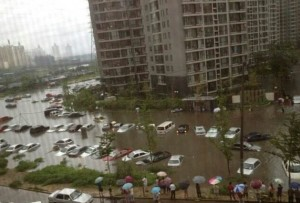

# ＜天枢＞失焦的槽点——写在北京的暴雨后

**于是，很多原本可以引发更深层次的社会思考的问题，就这样被地域优越感搅成了一滩浑水。就像这次的北京暴雨。我们真正应该思考的是，为什么灾难面前出现的总是小人物的史诗，功绩面前的就是帝王将相的家谱。小人物的突出恰恰反映了公共系统的无能。不要再让我看见什么“众志成城，人身铸成的钢铁长城”一类的字眼了。这不应该出现。说得难听点，是让个体的高尚为体制的无能买单。原本应该依赖制度化的建设解决的问题，反而要依赖民间的善良来缓解（之所以不用解决，是因为在突发性公共事件面前，这种不专业且不成规模的善举只能被称为杯水车薪），除了荒谬，我想不出别的词汇。** 

# 失焦的槽点

# ——写在北京的暴雨后

## 张诗卉（清华大学）

 

作为一个身在帝都的南方人，在帝都暴雨后我的人人微博上出现了以北京暴雨为关键词的两种截然不同的刷屏状态：众多北京同学疯转的小人物的史诗、北京坚强等等的煽情字眼；部分南方同学一脸不屑的口吻认为这次暴雨以南方的标准来看根本不算什么，北京人太矫情。于是一场骂战再次爆发，“傻逼”“支京”等等地图炮专有名词又一次占据了网络舆论的半壁江山。

首先澄清一点，我对昨天在暴雨中牺牲的死者并非抱有任何的不敬，相反，我认为他们是值得尊敬的英雄。但是，抱着绝对的“死者为大”的道德大棒强行要求所有人，尤其是并不了解情况的人和你们一样悲痛，哀伤。对不起，你们没有这个资格。“亲戚或余悲，他人亦已歌。”任何降临在个人身上的灾难注定都有一个影响力的界限，强求界限之外的人和自己感同身受，即便是在这个信息并不对称的所谓信息时代，依然显得太幼稚。因此，在昨天刚刚开始下暴雨，有人员伤亡的事实并未得到广泛知晓的时候，外地人一句“本地天气很好，帝都的童鞋小心”是否一定就是居心叵测的嘲笑？恐怕，更好的解释是悲伤所导致的神经过敏。而更为居心叵测的一种揣测是，让某些人迫不及待地骂出“外地逼”三个字的，绝不是悲伤，只是地域优越感的又一次集中发泄。

其次，对于部分南方童鞋的不屑，我只想提一件事：08年的南方雪灾。当时开始闹雪灾的时候，确实有部分北方人把南方人的惊恐看成是少见多怪。的确，从绝对值来讲，当时南方的雪灾在某些北方城市看来是在是不算什么。从某种程度上来说，今天南方某些人的不屑和当年的北方人，本质上没有任何区别。少见才会多怪，但是多见不代表你多优秀，更不代表嘲笑的资格。更何况，南方也不是没有出现过看海的壮景，只不过经过这样多次暴雨的洗礼，南方人早习以为常，不觉得这么大点事值得喊出“XX坚强”这样的字眼。可是，所谓此人之肉彼人之毒，自己觉得淡定的事情没必要强求别人淡定。风水轮流转，谁知道下一个倒霉的是谁。

经过以上分析，我们可以很清晰地看到，部分北京人和部分南方人对待这次帝都暴雨截然不同的态度，从本质上来说，是同源的：又是地域优越感在作怪。从豆腐脑是甜的还是咸的，到前鼻音后鼻音的发音再到今天的暴雨骂战，一切南北对垒的潜台词都是：我是对的，你是错的。可是，任何人都是自身环境的囚徒，换句话说，绝对的客观尺度是不存在的。从你一出生起，你的价值判断就不断地被周围的环境影响，久而久之形成了一些不可动摇的基本信仰。而这些信仰，只能说，你信，就信了，无从判断真假。正因为如此，对价值观的优劣正误判断，多数情况下，就成了流于表面的骂战。因为，参与其中的所有人，只知道“自己好”，但是无法从逻辑上证明“自己好”，于是，只能诉诸于两种形式：一、“我就是好我就是好”，具体表现为诸如“XX的女孩，就是这样……”充满着无限优越感的段子，但是很不幸这样的段子往往把地域的名称隐去，就完全分不清哪个是哪个了；二、“你就是不好你就是不好”，具体表现为诸如“真搞不懂世界上居然还有这样的人……”，但是事情往往是相对的，你搞不懂别人的时候，别人恰恰也搞不懂你，你也是你眼中的奇葩眼中的奇葩。

地域优越感本身不可怕，这在任何人群中都无法避免。只要人和人之间一天还有差别，地域优越感就一天不会消失。因为人毕竟是社会动物，需要一种对自身归属的认同感来实现自身认同，这种认同无可厚非。可怕的是排他式的优越感。但是很遗憾，至少目前来看，地域优越感的排他性几乎和地域优越感是高度并存的，古今中外皆如此。黄西曾经在一篇文章里就谈过“我在亚利桑那州（支持共和党为主）讲笑话，如果涉及到黄种人，他们能够理解，报以善意的笑；但是，当我讲起和佐治亚州（支持民主党为主）有关的笑话，观众就会报以嘘声”。也许这个例子有点不太恰当，但是，不能忽视的是，比起种族歧视，地域歧视有些时候只会有过之而不及。

尽管如此，地域优越感本身不应该过多地为网络骂战背黑锅。毕竟，既然排他性的地域优越感是普世性的存在，为什么在某些特定的地方（不只中国）地域优越感总是屡屡被拿出来说事？这个问题曾经困扰了我很久，后来某一天重读《阿Q正传》的时候想通了。里面有个情节说阿Q上过城，知道城里的煎鱼放的不是简单的大葱，而是切细的葱丝，于是很鄙薄城里人，觉得那是错的，但同时又非常自豪，因为未庄人没见过城里的煎鱼。地域优越感之所以会成为某些人精神生活（姑且让我称之为精神生活吧）不可或缺的一部分，是因为他们和阿Q一样，在自己本身找不到优越感。换句话说，自己不值得自己骄傲，那就让自己所在的地方让自己骄傲吧。于是，这样的骄傲很多时候显得非常的无理取闹也就不足为怪了。毕竟，和要起面子来的人谈理智无异于对牛弹琴。

于是，很多原本可以引发更深层次的社会思考的问题，就这样被地域优越感搅成了一滩浑水。就像这次的北京暴雨。我们真正应该思考的是，为什么灾难面前出现的总是小人物的史诗，功绩面前的就是帝王将相的家谱。小人物的突出恰恰反映了公共系统的无能。不要再让我看见什么“众志成城，人身铸成的钢铁长城”一类的字眼了。这不应该出现。说得难听点，是让个体的高尚为体制的无能买单。原本应该依赖制度化的建设解决的问题，反而要依赖民间的善良来缓解（之所以不用解决，是因为在突发性公共事件面前，这种不专业且不成规模的善举只能被称为杯水车薪），除了荒谬，我想不出别的词汇。

失焦的槽点，反映的是真正舆论监督的缺位，背后，也许巨大的国家机器正在庆幸又逃过了一劫。

（采编：黄理罡 责编：黄理罡）

 
