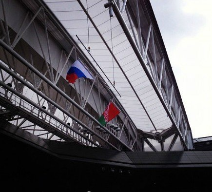
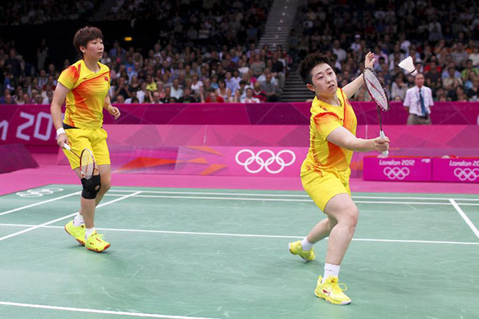
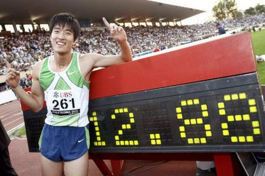

# ＜天枢＞奥林匹克的另一副面孔

**一个腿伤不足以完成比赛的人，为了十几亿人的期待，不得不站在赛场上，失败后还要经受谩骂。有一句话说得尖锐：“在这里，胜利属于全体人民，失败则只属于失败者自己”。** **奥运仅仅是一项体育竞技而已，没有运动员应该被当做这个国家的性药。**  

# 奥林匹克的另一副面孔

## 文/mlln

 

昨天，在伦敦奥运会体操比赛中，陈一冰完成了一套非常完美的吊环表演，却因为裁判的打分而屈居亚军。自然，这时候中国人需要回答一个问题：裁判的不公意味着什么？

赛后，“奥运微吧”用一条微博替我们进行了调查：“此刻，请给伦敦一句话！”

近十万转发、四万回复，凶猛如潮水袭来 。一位名为“你好、詹詹詹”的网友写到：“中国和英国现在有三笔账要算：鸦片战争、火烧圆明园、伦敦奥运会。”更多网友称英国为“大阴帝国”。几乎所有人都在愤愤不平地说：在这次奥运会上，西方列强对崛起的中国百般刁难。

且不对这些回答做出反馈。我们能不能换一个角度，回答另一个问题：如果在北京奥运会上，西方国家的选手因为打分不公没有得到金牌，是不是就意味着，中国在对西方国家刻意刁难？

如果回答是可以的话。让我们看看以下的两个来自2008年北京奥运会的例子，这些例子也许我们并不熟悉。

爱尔兰人帕蒂·巴尼斯（Paddy Barnes）在48公斤级男子拳击比赛半决赛中遭到失利。比赛回放证明，他的一些有效得分被算在了对手身上。比分被定格在0:15。他的对手最后获得了冠军，他来自中国，名叫邹市明。

中国一位射击运动员在双向飞碟比赛中打丢了一次，却被判定为全中，最终获得一枚铜牌。这名运动员叫胡斌渊。

只要我们使用google而不是百度，都能轻而易举的搜索到更多类似的争议。这些争议的有趣之处在于，它们完全被排除在国人的讨论之外。自然，我想，几乎没有人会认为，这些有趣的故事能够得出“中国阴谋论”的结论。故事的意义仅在于，奥运会的主办国总会得到裁判的照顾。这几乎是心照不宣的惯例。而其中的不公，并不应该被放大到体育竞技之外。

然而，中国人总会对奥运会寄托一份错杂的情感。在我们对于自己和他人的期待中，奥林匹克也会悄悄展露出两副面孔。

一方面，奥运会是承载着奥林匹克精神的运动盛会。另一方面，更为重要的是，奥运会成为了中国人完成崛起梦想的替代物。所以，一方面，我们期待自己的运动员得到全世界的朝拜。另一方面，我们总会将中国运动员所遭受的不公上升到不相匹配的高度，说这是对于“中国崛起”的刁难。

更有甚者，前几天，中国一对羽毛球双打选手为了避免提前与本国选手相遇，故意消极比赛。这一明显有违体育道德的举动竟然被很多知名人士热捧。白岩松说，这是比赛规则的问题，中国选手是受害者。实际上，全场的嘘声告诉我们，我们对于奥运会的急功近利，恰恰并没有“为国争光”。因为，金牌和国家形象，并不能划上等号。有时候呢，价值观的失败，远胜于一枚金牌。

另外，在追逐金牌的游戏中，我们也会将自己的运动员一分为二：胜利者承载着一个国家的胜利，有些失败者，则要承担一个民族的排斥。

孙杨在取得两枚金牌之后，中国人已经无法容忍任何有关他的质疑，如同八年前的刘翔。前天，章诒和女士在微博上转发《北京晚报》新闻，指出孙杨两年来的训练费用高达近千万人民币。换来的是这样的评价：“你这个臭女人，这个钱我们愿意花。你管得着么？”

失败者可没有这么幸运。今天下午，刘翔因伤未能完成比赛，网络上很多著名人士封他为“影帝”。刘翔不得不顺应人们对于他的批评，蹦着完成了整场比赛。一个腿伤不足以完成比赛的人，为了十几亿人的期待，不得不站在赛场上，失败后还要经受谩骂。有一句话说得尖锐：“在这里，胜利属于全体人民，失败则只属于失败者自己。”

我们因为一位成功的运动员，而拒绝任何对于体育制度的批判。也会因为一位运动员的失败，用所有不堪的言语将他埋没。奥运承载了中国的崛起，你的失败并不是中国的失败，你只是不属于这个想象中的崛起年代。

一位朋友的评价非常到位：刘翔本是110米栏史上最伟大的运动员之一，集财富名望于一身，但赢得金牌之后，他被媒体绑架、被政治摆布、被商业挟持、被整个国家全面包装，然而他失败了。于是我们说，看，这个影帝。之后，丝毫不出意外，宣传部不合时宜地下令，媒体不得负面报道刘翔，不得猜测任何商业阴谋。

我们对于奥运会的竞技成绩和社会的舆论如此在意，甚至不惜动用宣传机器。而面对社会、经济、文化等方面的落后却视而不见。奥运会这场媒介事件几乎拯救了期间所有的社会不公，所有的教育问题，所有的通货膨胀。所有所有，对于生活的不悦，都在其中被想象融化。我们可以轻而易举的掩盖各个方面的落后，因为奥运会可以带给我们最为及时的快感，甚至只需几分钟的时间，中国就能完成一次占领世界顶峰的动作，完成中国人充满快感的空乏想象，完成了四年一次，每次半个月的勃起。

然而，奥运仅仅是一项体育竞技而已，没有运动员应该被当做这个国家的性药。

是的，没有，无论是今天的刘翔、还是明天的孙杨。

原文链接：http://www.douban.com/note/229808466/

 

（采编：宋晓慧；责编：佛 冉）

 
