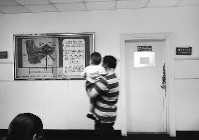
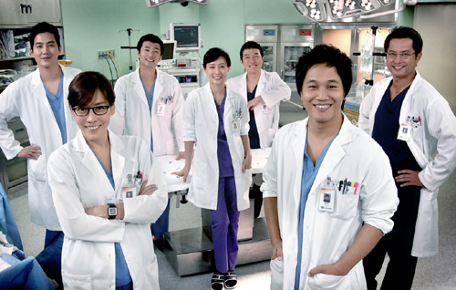

# ＜天枢＞徐文医生的乌托邦

**在医疗行业事实上不可避免的被逐步市场化的过程当中，无论是医疗行业的从业者，还是病人和家属，都无法意识到自己的地位相较于计划经济的时代已经发生了变化，在二十年的时间里，医生没有意识到自己实际上就是服务员，病人也没有意识到自己和坐在餐厅里吃饭的人没有什么两样。但即使是这样，他们的行为却实际上是市场化的人的行为。因此，每一个处于事件中的人，无论是属于哪一方，都感到无比的困惑，因为他的观念和他的行为实际上早就已经不合拍了。**

 

# 徐文医生的乌托邦

## 路加（上海交通大学）

 

首先对徐文医生的不幸遭遇表示同情，作为一个医学生，我尚且无法完全体会临床工作在这种环境中的凶险。但是，一个人受到暴力的侵害，这在我这样的自由主义者的伦理观中，是被认为应当给予同情的事情。

但是，把医患关系的紧张，以及医务人员和病人及病人家属，甚至是媒体对于医疗服务行为中的事实的认定所产生的偏差简单归咎于以上三者，都显然是不对的。

把医患关系归咎于医生普遍的职业道德的缺失，会不可避免的引发一个重大的问题，因为它显然否认了即使是医德丧尽的医生也面临着竞争的压力，因而其服务质量难以下降，不得不努力的基本事实，换句话说，认为是医生未能尽力的人，即使我同意了他们对人性最坏的猜测，但他们至少是低估了市场对人的行为的约束力。

把医患关系归咎于病人的蛮横无理，同样会令人产生巨大的困扰。这种困扰，主要是来源于人道主义伦理的拷问。对于一个身染疾病的人，我们不能要求他们在看病时对于自己所接受的服务的结果保持和医疗从业者一样的客观，因为无论如何疾病对他们而言是主观的事物。我们显然也无法将问题归咎于病人对事实的认定和提供医疗服务的医疗行业从业者之间认知的偏差，因为这种偏差不只是出现在医疗行业，在饭店用餐的消费者可能会认为饭店想尽办法要占自己的便宜，而饭店的管理人员有可能却在绞尽脑汁的想着办法讨好顾客。认知的偏差可能有程度的不同，但是，它绝对不是医疗行业中的个别现象。

至于归咎于媒体，这种看法可能是现在在医疗从业者里最为流行的，然而，却也站不住脚。媒体也许是煽风了，但是，点火的却不是媒体，如果我们仔细的去考虑的话，消费者对于医疗行业的从业者的成见（也许那时恰恰是事实）是在90年代初已经存在的，而彼时的消费者往往采取了忍让的态度，考虑到中国城市的市场化实际上是在92年的邓先生的讲话之后才步入正轨，这很好解释，当时的消费者的思维习惯依然是计划经济下的思维习惯，因此，当时的医生所享有的地位，会不由得让人想起当年趾高气昂的供销社职工。在消费者不是上帝的世界里，消费者只有忍让的份。这个事实告诉我们的另外一层含义是显而易见的：媒体并不是矛盾产生的根源，只是揭发了矛盾而已。在20年间，中国的媒体虽然在诸多领域依然颇受限制，但是，在每一个这样不会涉及政治不正确的领域里，他们实际上是充当了说出皇帝的新衣的真相的小孩子的角色：医患矛盾是在媒体煽风之前就已经存在的星火。

不过，对于媒体在医患矛盾逐步显露和增长的过程当中的作用的这种观察，并不是没有意义。所谓的医患矛盾的升级，不但不是一个负面的事情，相反的，它就是医疗服务逐渐市场化的过程。随着消费者的选择意识和权利意识逐步的增强，随着医疗产品供应量的增加，患者会对于自己所购买的服务越发的挑剔，对于产品的期望也会更高，这不能被理解为患者的不切实际，因为恰恰是这种“不切实际”会推动医疗行业的进步。我们绝不会因为驻足在西瓜摊前，甚至品尝过西瓜之后，却认为西瓜不够甜的家庭主妇这种在正常不过的行为而责备她，尽管她看起来有些蛮横无理。但是，在医疗行业当中，人们的逻辑却突然发生一种莫名的变异。

换句话说，医患关系的紧张从来就不是什么坏事情，它和市场化根本就是同一个事件，不允许医患关系的这种变化，那么我们就不得不拒绝市场化，退回到那个消灭一项传染病需要动用倾国之力的年代。但是，在医疗行业事实上不可避免的被逐步市场化的过程当中，无论是医疗行业的从业者，还是病人和家属，都无法意识到自己的地位相较于计划经济的时代已经发生了变化，在二十年的时间里，医生没有意识到自己实际上就是服务员，病人也没有意识到自己和坐在餐厅里吃饭的人没有什么两样。但即使是这样，他们的行为却实际上是市场化的人的行为。因此，每一个处于事件中的人，无论是属于哪一方，都感到无比的困惑，因为他的观念和他的行为实际上早就已经不合拍了。

这并不是说，发生徐文医生这样的悲剧，是不可以避免的，相反的，发生这样的事情，再一次让我们看到，政府和知识分子在医疗市场化的过程中扮演了非常不力的角色。市场化的过程如果想要以一种尽可能代价小的方式进行，市场中的人的权力界限就必须明确，并且，一旦这种法律上的界限明确下来，政府就必须抵御来自任何利益集团，哪怕这种利益集团给自己披上民主和弱势群体外衣的干扰，不偏不倚的保障这些权力。同样的，知识分子必须给市场人宣传自由主义之下的正义观，否则，观念落后于市场化的过程，不会造成观念的崩溃，却会导致市场化的失败和扭曲。

然而在20年里，政府主导的公立教育和舆论以一种计划经济时代的正义观来给市场人洗脑，人们对于免费的午餐趋之若鹜，对于医务人员提出了圣人一般的道德要求，并且将这种观念以行业标准（实际上是政府的强制力下的标准）付诸实践。在政府那里，所有的对市场的干预，甚至是法院的判决，要么是官僚的意志，要么是民粹舆论，而决定和决定，直接的观念和行为之间，甚至都不能融洽。医疗行业在市场化过程中的乱象，既不是医生的责任，也不是媒体的责任，也不是病人和家属的责任，根本的，其实就是政府在医疗市场化的过程中扮演了错误的角色所造成的混乱。

因此，徐文医生今天所遭受的这种对待，直接的当然是失去了理智的“医闹”的责任。但是，如果政府是以严格的法治的观念来处理这样的事件，而不是以所谓的民意或者保护弱势群体这样虚假的正义观来处理这样的事件，那么，这种悲剧早就已经不会是常态了。

那么，徐文医生的“乌托邦”在哪里？

在那个“乌托邦”里。

官僚不是为了升官也不是为了所谓的弱势群体管理医疗行业，卫生部门除了负责医疗机构的登记和医药生产的登记工作，并不需要负责所谓的准入制度。

市场中存在的众多的医疗服务评级机构，因为评级机构存在竞争，病人可以以极低的价格获取最可靠的评级信息，从而选择医疗市场中技术水平和服务的价格适合自己的医生。

没有公立医院，医疗补贴以医疗券形式存在，并且总是和市场中的自费医疗的最低购买力保持一定的比例。医院能够自由的决定医疗资源的价格，有权将不能支付的病人驱逐，也可以雇佣武装保安，甚至组织自己的纠察队，但是，医院不能够将这种自卫的力量用来强制消费者购买产品，而这需要政府强制力的监督。

媒体可以以自己的视角报道医疗纠纷，但是，媒体塑造的舆论不会成为法院处理医疗纠纷案件的依据，甚至，政府可以采取一定的措施，防止当庭的法官获取有关的新闻。

在这样的“乌托邦”里，医生必须努力工作，因为他们会因为业务水平过差而被淘汰，但是，他们的人身安全却会受到最大程度的保护，他们依旧可能遭到病人的责骂，但是，直接的人身损害却不会成为可能。

在这样的“乌托邦”里，病人可以随意的向医生抱怨，他们也可以依靠事先购买的廉价可靠的信息，事先最大程度的避免庸医误人的情形出现。而这在之前简直不可想象：特别是，它戳穿了所谓的患者和医生的信息极度不对等的神话。

在这样的“乌托邦”里，媒体记者可以选择“不实”的报道，而“不实”的报道是否受欢迎，完全只取决于新闻的购买者。记者不需要承受并不存在的“普遍道德”的压力，也不要担心政府的侵害，他们可以以自己的正义观，做出自己认为合适的且受到消费者欢迎的新闻报道。

而这个“乌托邦”有两个小小的问题，首先一个是，在它逐渐发展的过程中，有少量的病人可能既没有得到足够的医疗补贴也得不到及时的民间慈善的帮助，而不得不选择较差一点的医疗服务，但我们必须指出的是，这个问题其实不是这个“乌托邦”带来的，而是任何不同于这个乌托邦方案的其他方案同样无法解决的。第二点则是，在这个“乌托邦”当中，政府找不到任何的理由占用医疗资源，也不需要为这个“乌托邦”额外增加巨大的实际上是强制人民花掉的卫生开支。

最后，我必须用最通俗的话来总结一下：

如果你是一个医生，请你把自己当成海底捞的服务员，否则，请改行。

如果你是一个病人，你什么都不用做，该抱怨的请都抱怨。

如果你是一个法官，请秉公司法，你不是“青天大老爷”，而是一个市场经济下的法官。

如果你是一个记者，请努力的工作。

如果你是一个心存正义感的官僚，请让你私人的正义感靠边，请把市场化放在比实践你个人认同的正义观更重要的位置。

简而言之，“乌托邦”不需要任何人成为大圣人，但是，每个人都需要找准自己的角色，遵守和维护游戏的规则。

 

（采编：管思聪；责编：管思聪）

 
