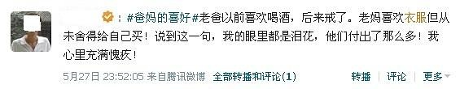
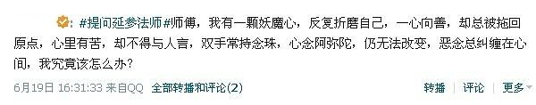

# ＜天枢＞心中的妖魔

**我并不愿意报以过多的同情。但不知道为什么，看到网络中的种种暴力与戏谑，我还是会为他感到难过。他的确难以原谅，但我也坚信他并非十恶不赦。所以，真希望互联网上的人们，可以在他的可耻背后，看到更多生活的细节，而不是简单而粗暴地转发、调侃。我也希望他能在履行自己的刑罚时，能多反思自己的过去，更能多考虑自己的未来。**  

# 心中的妖魔

## 文/mlln

让我来讲一个不怎么好听的故事。

有一位张先生。他是无数北漂中的一个，租住在北京龙泽附近，每天挤十三号线地铁上班。他喜欢看布袋戏，喝秋梨膏，每天都在思索着自己的职业规划，却总是找不到奋斗的方向。他很沮丧，因为他喜欢过好几个姑娘，但没有一个人最终成为自己的女朋友。他还对父母感到愧疚。因为家庭条件并不理想，父亲戒了酒，母亲舍不得给自己买件新衣裳。而他在北京的收入却仅仅能维持自己的生活。

在网上，他看到了一位心酸母亲的生活，于是掉下了眼泪；他一边看着电视里的新闻联播，一边拍桌子骂娘；他听说“医生因打工仔付不起医药费将已缝好伤口当场拆线”，评论了一句：畜生。

他念佛数年，试图靠深夜吟诵佛经来破除心中的恶念。几天之前，他在微博上询问延参法师：师傅，我有一颗妖魔心，反复折磨自己，一心向善，却总被拖回原点，心里有苦，却不得与人言，双手常持念珠，心念阿弥陀，仍无法改变，恶念总纠缠在心间，我究竟该怎么办？

然而，他并没有得到回复。

他叫张一（化名）。某网站的产品经理。今天，这位先生跑到人人网总部的女厕所中偷拍，被抓到了现行。于是，微博中风起云涌。网友们纷纷留言给当当网总裁，要求应聘同一职位。

网络通过戏谑将他捆绑示众，说他十恶不赦。在链接的视频中，他放声大哭，跪地求饶，身边的女性职员围成一圈，骂他不要脸，不是男人，臭流氓。

很抱歉，我只能到此为止，这是我知道的全部，因为我并不认识他。我所做的只是在决定嘲讽和转发之前，打开他的腾讯微博，阅读十五分钟。其实，这样一个被称为“十恶不赦”的男人，平凡的不可思议，就像在我们身边悄悄走过的所有人。

如今，他做出了道德上可耻的事情，接受了应有的惩罚。当然，在这之前，我们已经为他准备好了额外惩罚——我们给他五花大绑，我们将他游街示众，我们把他描述得十恶不赦，我们让他一辈子抬不起头。

但阅读了他的很多条微博，我更愿意认为，他是一个犯了严重错误的普通人。我当然不能为他开脱，但我同时拒绝“两分法”的评价标准。这个世界上，大多数恶魔都活在新浪微博中，大多数天使都活在新闻联播里。

回到现实中，他是一位普通人，心中怀着可贵的善念，也藏着不为人知的恶念。

多数人知道自己应该消灭这种妖魔，至少要约束它，我们应该读书、念佛、和朋友倾诉，或者咨询心理医生，而不是像张先生那样纵容它。正因为此，他犯下大错。

我并不愿意报以过多的同情。但不知道为什么，看到网络中的种种暴力与戏谑，我还是会为他感到难过。他的确不该被轻易原谅，但我也坚信他并非十恶不赦。所以，真希望互联网上的人们，可以在他的可耻背后，看到更多生活的细节，而不是简单而粗暴地转发、调侃。我也希望他能在履行自己的刑罚时，能多反思自己的过去，更能多考虑自己的未来。

我们不能失去道德的约束，不能失去信仰，当然，也不能对自己失去希望。

张先生，真希望你能看到。

（P.S.张先生的微博）

（采编：佛冉 责编：佛冉）

 
