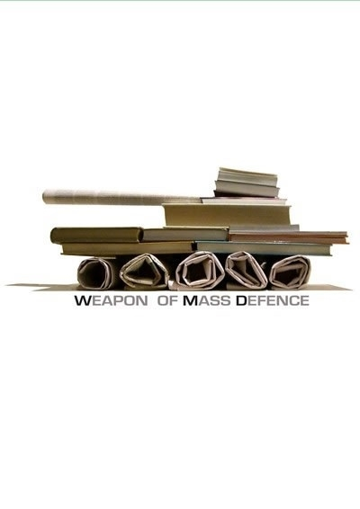

# ＜天枢＞我们为什么要参选人大

**编者按：** **一人一票，进步中国。**

### ** **

### 

# 我们为什么要参选人大

### 

## 文/元淦恭（中国人民大学）

### 

### 

这是中国大陆网络民意最活跃的几天，这是中国大陆政治生活中一个令人惊奇的变化。短短两三天，在网络上已经涌现出数十位自主投身本年度人大代表选举的公民，其中不乏网络上的意见领袖。 在今天这个群体性事件不断增加，既得利益对改革造成严重阻碍的时代，我们为什么还要参选人大代表？在今天这个人大早就被改造成“官员代表大会”，人民的声音在立法机构严重缺位的时代，我们为什么还要参选人大代表？在今天这个社会戾气已经高度发酵，“改革已死”的绝望情绪已经开始在许多人心中蔓延的时候，我们为什么还要参选人大代表？ 因为我们别无选择，因为我们责无旁贷。 有人说，你们参选人大代表能改变什么？我说，我们改变的是人心。 

 1979年中国开始推动地方人大的直接选举，三十年时间过去了，选民早已厌倦了那种走过场的钩钩画画，《宪法》和《选举法》所规定的原则，在简单的政治操弄下早就化为乌有。在这片土地上，民众已经政治冷漠如斯，十几年二十多年没有见过选票的人比比皆是。那些自立参选的人大代表之路走得孤独，竟然没有几个人知道他们的辛酸和苦楚。 当选举变成一幕预先已经有结局的戏剧，那么就不会再有人去围观与自己无关的蹩脚表演。而正是如此，他们自导自演，他们自娱自乐。今天，我们并不求当选，我们求的是表达，我们不求能成为剧院里的主角，但是至少要做一个成功的小丑。 我们不奢求什么，我们只希望在这片土地上，有更多的民众能意识到，他们生活在一个共和国，他们是手中握有选票的公民，不是只能卑躬屈膝下跪上访的臣民。 有人说，你们参选人大代表能推动什么？我说，我们推动的是理性。 我们不知道未来中国将去向何方，但是我们知道未来中国不能滑向哪里。1945年毛泽东和黄炎培的“窑洞对”，揭示的道理显而易见：“只有民主才是打破王朝循环的新路”。这个民族对激进已经崇拜得太久太列，而每一次推倒重来之后，都只能看到专制者和人民，最终都站在寸草不生的废墟之上。 所以我们不能认同“打扫干净屋子再请客”，所以我们不能再重复先破坏后建设的老路。每一个参选人大代表的公民，都不是执政者的敌人，而是执政者真诚的朋友。因为我们没有更多的要求，我们只是希望执政者能够和我们一道，真正让人民拥有表达的渠道，因为《人民日报》已经明确地告诉我们：“维权就是维稳，维权才能维稳。” 

 是的，诚如笑蜀先生所言：“我是演进论者，不是传统改良派或革命派。所谓演进，即通过日常生活中的较真，做实自己的公民权利，做大公民社会。以公民社会为转型底盘。” 有人说，你们参选人大代表是追求什么？我说，我们追求的是和谐。 我们不是天真的傻子，我们不是不知道那些有名的谚语。“党委说了算，政府算了说，人大说算了，政协算说了”。我们不是不知道，几十个代表、几百个代表，哪怕是几万个代表进入数以百万计的基层人大代表行列，也无异于是大海里的一滴水，无法改变今天人大弱势的地位。 但是我们知道，人大代表拥有表达的权利，拥有更大的发声的空间，更有着更多地与政府沟通的机会。中国几千年的民间社会，一直有士绅参与社会治理的传统，我们在今日参选人代，就是要弥合大政府底下政府和民众之间沟通纽带的丧失，来致力消除长久以来的体制内外的二元对立，只有如此，我们才能够拥有政治良性发展的动力。 试想，如果像刘萍这样的上访户能够和新钢厂的官员同在渝水区人大的会场，他们拥有同样的表达权利，也拥有温和的直接沟通渠道，那么像钱明奇这样的悲剧还会上演么？ 有人说，你们参选人大代表是为了宣传什么？我说，我们宣传的是自治精神。 许多人举1980年北大选举的例子，我想说，那是三十年前的事，我们不是要重复他们走过的老路。我们竞选的主题，不会是关于国家民族的宏大叙事，而会是关乎我们身边的每一件小事，一栋楼的注名，一条道路的绿化，一个公共设施的建设，一种社区服务的提供。因为我们已经不再生活在那个单位制一统天下的时代，我们已经不再生活在一个高度集中的社会，我们的社会多元化期待着更多元的利益表达，而这正是我们每个候选人深耕基层的关注所在。 张佛泉先生早在七十多年前就提出了他的“低调民主政治观”。他反对要先开民智再实行民主的观点，认为那种观点是把把目标悬得太高。因为标准高，所以忘掉了现实，忘掉了本可利用的条件，民主政治只寄望于未来，而且客观上沦为论证当下非民主政治的正当性的工具。 张先生主张民主政治应该被看为一种“气质”，其核心即是在已有条件下，尽可能实践民主政治。“社会里面有了一分民治力量，即要过一分民治的生活，有两分民治力量，便过两分民治生活”，因此，民主政治随时可以开始，“在起始也许范围很狭，规模很小，但只能做到有力便容它发挥的一步，便算养成了民治气质”。 是的，只要我们有一张选票，不管它是决定一个村长，一个县人大代表，还是决定国家主席或全国人大代表，我们都要同样地珍视它。如果当权者不给我们选票，那是当权者的过失。如果我们不使用我们的选票，那是我们的错误。 我们已经走到十字路口，我们已经面临抉择关头。在这个时候，我们期待着公民站起来，我们也希望政府更谦卑。只有公民站起来，政府才会更谦卑。只有我们更团结，政府才会更守法。 笑蜀先生这样回应那些暴戾的声音：鼓吹民粹鼓吹暴力，你不是对手，人家就靠那起家，比你强大无穷倍。但阳光地合法地走和平演进之路，走公民社会之路，则他们根本谈不上强大，因这里的强大取决于内心的力量，他们根本就没有内心的力量。 是的，我相信我们会遇到困难和阻碍，但是我相信我们也一定会收获更多的鲜花和掌声。一个刘萍被陪住，千万个刘萍站起来，或许当初新余和新钢，绝没有想到事情会变成这样。 所以，我们没有理由悲观，也没有资格悲观，我们只能义无反顾。 

### ** **

### ** **** **

 欢迎大家请关注 @公民选举关注[ http://weibo.com/2093460771]( http://weibo.com/2093460771) @选举观察[ http://weibo.com/chinaelection]( http://weibo.com/chinaelection)

### 

### 

（采编：黄理罡 责编：黄理罡）

### 

### 
