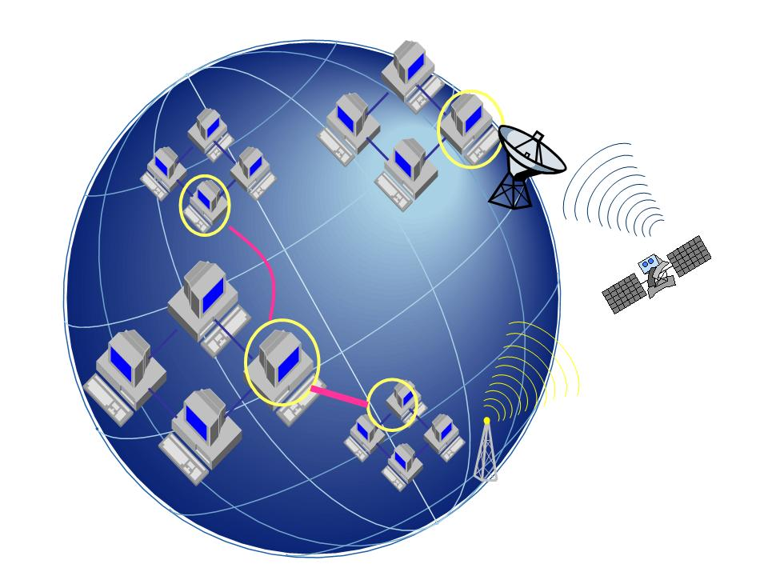

# ＜天枢＞新浪微博与拿破仑

**我的意思是，互联网带来的不仅仅是个人自由的可能。同时，新技术也让极权统治变得更加容易。当互联网成为你身体的延伸，极权就能轻而易举地通过控制互联网控制你的身体，让你屈服，给你洗脑。在未来的极权式大跃进里，你将不再死于饥荒，而很可能死于你在云中储存的所有东西，你赖以生存之物。**  

# 新浪微博与拿破仑

## 文/邵立（中国人民大学）

 

几周前，我有一个机会到英特尔总部参加一个美国华人半导体工程师协会的活动。其中一位演讲嘉宾是台湾的一位文学教授，本科学理科出身。他的观点是，虽然他是文科教授，但是理科才是人类进步的主要力量，而文科仅仅是辅助力量。

从某种程度上来说，我不得不承认他的观点是对的。但作为一个所谓的“文科生”，我对技术决定论始终保持难以磨灭的怀疑。例如，我一直都在关注微博，并把它作为自己毕业论文的写作对象。但作为一种技术的创新力量，微博，或者更先进的互联网产品，是否能够给人带来更多的自由和尊严，我并不确定。

今天我和友人聊天时也想到了这一点。我们常常说互联网意味着解放，意味着民主化，意味着强权已经不能再以过往的形式进行欺骗或者压迫，从而昭示着社会的进步。但另一方面，它又给控制者带来新的力量――当你把你的生活都放上微博的时候，他们就可以很轻易――比以往任何时候都更轻易地把你掌控在手中，全景监狱正逐渐从抽象的描述变成触手可及的现实。当然，你可以说你今天不上微博。但IT从业者正踌躇满志地描绘的云计算，云储存，却会在未来绑定了你和这个虚拟网络。你的私人空间将被这朵云一步步蚕食，但你却难以逃脱，因为你生活和工作的所有方面可能都要在这朵云下进行。因此，只要你的隐私存在于这朵云里，强权就会很容易地将它捕获并窥视，你将在最虚幻却最真实的世界里赤身裸体，无所遁形。正如社会分工专业化以后，你再难以脱离当地社会而成为现代鲁滨逊，而必须和市场发生联系一样。

我的意思是，互联网带来的不仅仅是个人自由的可能。同时，新技术也让极权统治变得更加容易。当互联网成为你身体的延伸，极权就能轻而易举地通过控制互联网控制你的身体，让你屈服，给你洗脑。在未来的极权式大跃进里，你将不再死于饥荒，而很可能死于你在云中储存的所有东西，你赖以生存之物。

其实，这是一个老旧的命题，在一个世纪以前，这个命题的表象可能是，工业革命带来了生产力的解放，却造成产业工人的贫穷和落后国家的凋敝。在四分之三个世纪以前，这个命题是，有效的经济管理提高了生产效率，也提高了纳粹屠杀犹太人的效率；在半个世纪以前，这个命题变成原子能拓展了人类利用自然资源的宽度，但却为地球（不仅仅是人类）带来了毁灭性打击的危险。

只是现在，这个命题的主体换成了互联网而已。

作为技术决定论的支持者，你可以学某报社论坚持“无论你们怎么不看好中国的模式，中国却是稳定了，强大了，也发展了”那样，辩驳一声“无论它们有多危险，但人类还是进步了，发展了”。

但这个观点的幼稚之处在于，认为“现在是这样，未来也一定是这样，所以它是可行的”。嘴硬的还会加一句，你们信不信，反正我是信了。仿佛在这个时候，我们便对一切进步造成的破坏和潜在的危险视而不见了。作为一个悲观主义者，我是反正不信的。我认为危险并没有走，它们正在人类过于自大而傲慢的视域的阴暗角落里滋滋生长，造成的损失可能远远比我们看到的多得多，甚至正在把我们引向毁灭之路。

自然科学的特点在于可重复性，这也是其无趣的地方。而社会科学的魅力则在于不确定性。因此我不喜欢那种把社会当成是自然那样的经验研究。因为没有人会争论光速、牛顿、时分秒这些自然科学的尺度，但对于社会科学的尺度，对于社会与国家、善与恶、文化与制度、民主与专制等概念的争论却无休无止地进行着。不同历史时期不同的人基于不同的尺度作出的不同选择，导致了社会和历史的不确定。

基于这种不确定性，我个人的选择是“不乐观”。每当一件事情有不同的可能性，我会选择相信最可怕的东西最有可能发生，并努力避免最可怕的情况出现。这在博弈论里称作Maximin Strategy。这种做法的好处是能给我自己一丝安慰，因为最糟糕的东西，即使发生了也在预料之中，而我会为比起最糟糕不那么糟的那一点“成就”感到幸福而对生活充满热爱。

至于互联网的进步，我也持有同样的看法。微博可以成为中国人突破官方信息封锁的有力工具，但也是英国人推动无政府暴乱的工具。它在整体上可能削弱了威权欺骗大众的权力，但却增强了威权监视具体个人的权力。

而新浪微博的一方独大，还让新浪，作为一个唯利是图（这是它的本份）的私营企业，拥有了影响乃至垄断公共平台的权力。它的微博的官方辟谣账号已经拥有了公权力的号召力。一个拥有公权力的私营公司是可怕的，因为它能受到的监督比公权力更少。因为它既可以和统治者合谋，将反抗的信息防得滴水不漏。又可以利用自己的权力打压弱小的个体。它的负面影响已经逐渐显现：它把明明是编辑删除的微博称为“原作者自己删除”，把批评新浪的帖子和账号封掉，把谷奥、宋石男赶出微博。我认为，新浪微博已经超越了和体制合谋这个阶段，它正在和体制融合，成为体制的一部分，甚至在形成一种新的极权体制。打一个蹩脚的比喻，它正在成为拿破仑，《动物庄园》里的那只领头猪。当动物们都为它能够带领大家把剥削动物的残暴人类庄园主赶出庄园而崇拜不已之时，它已经开始学习人类的直立行走，并和别的庄园的人类在庙堂之上举杯相庆。

我不是技术进步的反对派。但先进的技术没有良善的社会秩序去维持，就会成为没有底线的作恶工具。从这一点上说，我认为文科还是重要一点。因为没有先进的技术而有良善的道德（或者缺乏良善的道德），人类即便刀耕火种还能维持下去很长时间。但拥有先进的技术而忽略伦理和制度，却能让世界在短时间内彻底毁灭。

这也是为什么社会变革显得如此重要的原因。因为无论你修多少条高铁，建多少摩天大楼，还是把多少条航母拖出海，都换不来个人、公司和国家机器对于正义和善良的坚守。而建立抑恶扬善的社会机制，才是我们摆脱困境的希望所在。

 原文链接：[http://blog.renren.com/blog/148422447/749853952](http://blog.renren.com/blog/148422447/749853952)  

（采编：管思聪 责编：管思聪）

 
