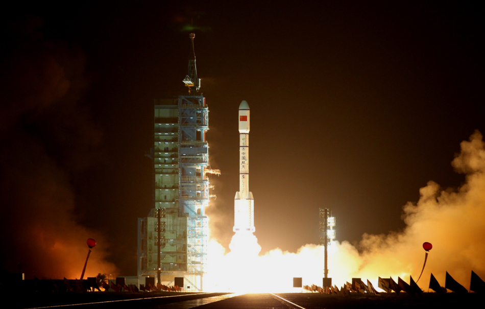
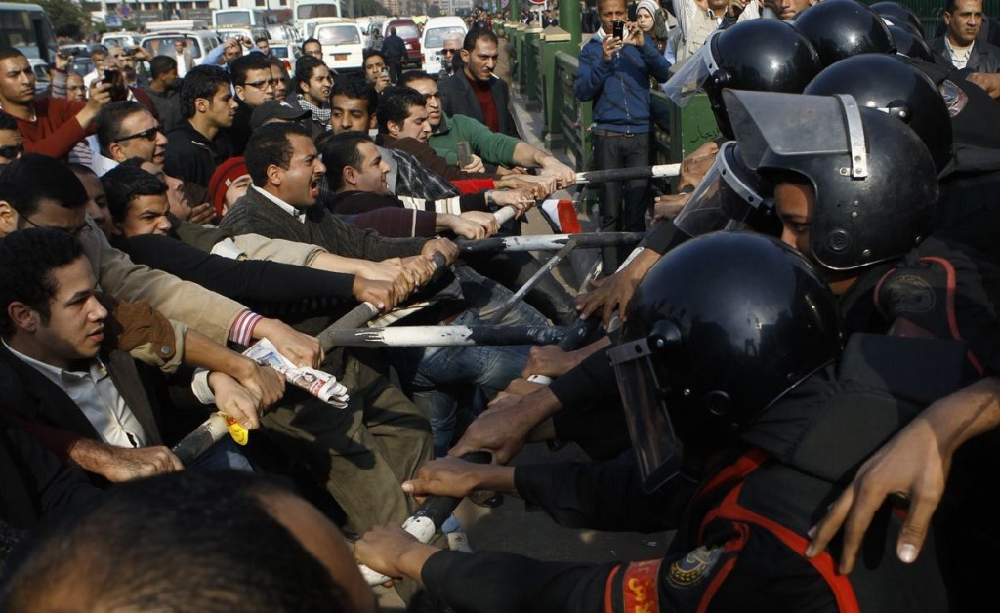
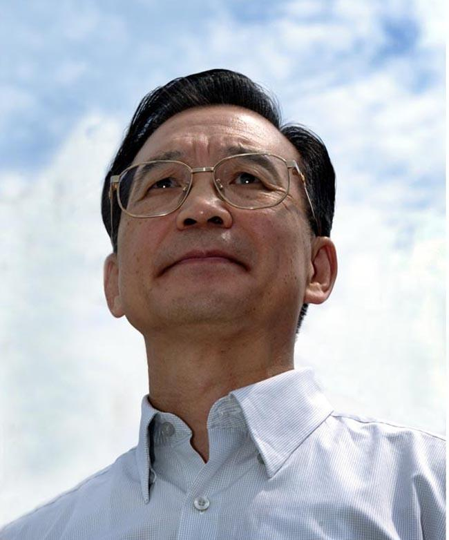

# ＜天枢＞时代的飞扬与落寞

**当时，在黑幕穹窿的映衬下，几节和谐号车厢碎落在大地上，一节车厢倒悬在几十米高的高架桥上，整列动车像被斩断的死蛇在骇人的铁轨上蜷缩着，奄奄一息，动弹不得。我相信，这个场面将会像美国世贸双子塔轰然倒塌的恐怖画面一样，成为一代中国人无法忘却的梦魇。** 

# 时代的飞扬与落寞：

# 从思想文化角度对2011年中国社会的观察与思考

## 文/黄帅（山东师范大学）

 

由于本次期末考试提前进行，我把每年在除夕前夜写年度观察思考的文章提前来写。

所以，此文可以算作我的2011年度总结。

2011年作为一个时间概念，只不过是新千年人类命运奔途中匆忙的一瞬，纵然各种事件层出不穷，各种人物登台退场，其间或绚彩多姿，或可歌可叹，或凝重邃远，或悠然飞扬，却终不过是历史长河中的恒河沙数，过眼烟云。然而，正是有了这样一些震撼人心的突发性新闻事件，正是有了这样一些脉脉缓流却影响深远的心灵渐变，才给今天这个时代明确了无法复制的生命特质。

在这一年里，我们看到了无数繁华与落寞，感受到了时代变化与个人成长的歌声与泪水，欢愉与艰难，甚至还包括很多现实惨淡的冷血与残酷。那么，我们该如何理解当下的时代呢？ 曾是时代号手的李泽厚在《美的历程》中冷静地向我们讲述：“历史从来都不是在田园牧歌中前行，而是踏着无数尸体与枯骨向前迈进的。”而一度爆得大名的余秋雨却在《笛声何处》中轻描淡写地说：“中国历史充斥着金戈铁马，但细细听去，也回荡着胡笳长笛。” 无疑的是，一个时代之所以值得我们进行思考，正是由于其中交织着的正义与邪恶、明媚与灰暗，在今人眼中，这一切不言自明。而当若干年后，我们再度回忆此间的往事之时，又会对今天的我们作出何种感想呢？更有胡适之先生早就一针见血地告诉我们：“历史只不过是个任人打扮的小姑娘。” 这或许便是及时进行年度总结思考的必要性吧。

### 凤凰台上谁歌升：热点回顾与思考

#### 热点1：革命PK改良

2011年开年第一炮由北非突尼斯革命打响。事件的起因和历史上任何一次革命事件一样，都是一件看起来微不足道的小事。而此小事却不可小视，一个青年小贩与城管的冲突最终酿成了推翻国家机器的茉莉花革命，那位兼有恐怖大亨本拉登与拳王阿里气质的突尼斯总统本•阿里出逃沙特。但革命的风暴却通过人们的口头传播、网络推动迅速席卷了整个北非与中东地区。1月25日，埃及人民走上街头，老穆巴拉克30年的统治摇摇欲坠。与此同时，阿尔及利亚、摩洛哥、毛里塔尼亚、阿曼、约旦、叙利亚等石油富国产生了不同程度的社会危机，整个地中海东岸与南岸陷入动荡不安甚至战乱的恐惧阴影下。其中最令人无法预想的战争发生在卡扎菲统治下的绿色利比亚，自今年3月中旬，利比亚动乱的消息开始大量充斥于新闻媒体上，英美联军在伊战还未全面结束时又发动了对利比亚的闪击战争，加上其国内自由主义思想驱使下的反政府势力的作用，卡扎菲政权在苦苦僵持7个月后竟被一举推翻，卡扎菲本人也在愤怒青年士兵的辱杀下命丧黄泉。而这场剧变似乎还没有停住疯狂的脚步，叙利亚阿萨德政权在与全国人民妥协无效后依然面临着战争的威胁，20年前苏东剧变的故事似乎要在此重演。

对于中东大变局，自由主义者说，这是独裁者走向灭亡的必然结果，是民众获取自由幸福的标志性胜利；民族主义者说，这是第三世界与民族斗士反西方入侵的悲剧失败，是美国霸权主义的又一次可耻的得逞。随着中国网路与青年思想影响力的抬升，前者的看法无疑占据了主流，而官方意识形态依然对国内形势风声的“茉莉花化”严加看防，对相关报道的态度也是守口如瓶，慎而又慎。

然而，事实证明，2011年可谓近十年来中国国内政治与经济形势最为复杂的一年。仅仅从最表面的群体性事件来看，从上年末的钱云会事件到今年年中的内蒙古草原冲突，再到此刻局势愈发不明朗的广东乌坎事件，都为时代繁华的表象上抹上了些许阴影。当然，此类冲突数量之多少有时并不能完全决定它们对社会的影响力大小，但在网络媒体的推动下，此类事件于近几年来呈现了“井喷现象”。在这个微博横行天下的时代，在这个人人都能做传媒人的社会中，我们应该对繁杂多样的各色信息有一定的鉴别能力。如果说08年的瓮安事件中官媒开启了主动辟谣的先河，那么今年最令国民气愤的7.23动车事件则愈发显示出官方媒体在“微博时代”的尴尬与无奈。

发生在7月23日傍晚的温州动车坠毁事件，一度成为网络媒体上热议的焦点。在我的印象里，自05来，似乎只有反日浪潮、汶川地震、北京奥运等个别事件能在网路上引起如此高密度与长期的议论。当时，在黑幕穹窿的映衬下，几节和谐号车厢碎落在大地上，一节车厢倒悬在几十米高的高架桥上，整列动车像被斩断的死蛇在骇人的铁轨上蜷缩着，奄奄一息，动弹不得。我相信，这个场面将会像美国世贸双子塔轰然倒塌的恐怖画面一样，成为一代中国人无法忘却的梦魇。在事件发生的一两周内，各种救援信息、悲观谣言、咒骂话语通过微博（twitter）、人人（facebook）等较为自由宽松的传媒疯狂播散，大众网民、各种论坛、贴吧、社区也对此事旁敲侧击，即使是言论控制较紧的纸质媒体也出现了个别不同于官方意识形态的评论。以至于当时有网友惊呼：“中国也要通过网络来革命了！” 当然，历史证明，既得利益者是从来不会主动放弃现行体制的，几乎所有的社会进步运动都是要由人民倒逼改革的。可问题的关键在于，为了达到社会进步的目的，Revolution or Reform，This is a Question！

在动车事件后，有人感叹：“从网上看，似乎中国明天就会发生革命，可到菜市场转一圈，却觉得中国一百年也不会革命。”此言有理，但似乎又全无道理。恰逢2011年又是辛亥革命百年，学术思想界不免会有很多对革命问题的讨论与反思争论焦点之一便是革命与改良道路问题，也就不免会出版一些高头讲章般地论著。在我对它们的阅读经验来看，这些纯学术中不乏真知灼见，但大多也是老生常谈，毕竟前人早就谈过这个老问题，而中国的问题必须根当前时代的特点结合起来谈才更有实效性。现在许多热爱哈耶克的自由主义青年们对极权主义的痛恨，正如同阿伦特在《论革命》中说起“革命唯一且向来的理由是自由”时对自由如此向往那么炽烈与疯狂。可革命的根源就在于追求自由吗？那么什么又是自由呢？

自由并不是可以随心所欲，而是能做想做的事情，但也能不做你不能做的事情。甚至后者更为重要，更容易为我们忽略。自由与责任同等重要，无政府主义与有秩序社会同等重要，而它们其实并不矛盾。显然，百年来的中国历史证明，我们并没有处理好自由与秩序的关系，自然也就不会出现任何一场真正成功的革命，反倒是后来的逐步改良成就了中国一次次的发展：1911年武昌首义后的中国依然贫弱无能，是实业救国的热潮将民国资本主义导向繁荣；1917年开始的新文化运动 “泼掉了脏水也泼掉了孩子”，以至于要今天的中国文化依然纠结于西化与国故的矛盾中；而弥漫于50—70年代的共产主义革命红雾更是在极权主义的裹挟下走上了畸形与绝路，到了80年代末最后一场理想主义革命运动的失败，这些都造成了百年中国革命的悲剧收场。李泽厚曾一针见血地提出过“启蒙与革命的双重变奏”的重大命题，诚然，中国人的骨子里感性革命思维多，理性启蒙的理念却少得可怜。而于我而言，革命与改良只不过是社会变化的形式而已，其根本在于有无启蒙理性的积淀。如果我们的社会没有任何理性可言，有私德而无公德，有激情而无理智，有感性而少智性，有技术而少思想，这样无论是革命还是改良都不会有太好的结果。

根据一年来的阅读与思考，我发现国内学界对这个令人纠结的问题也有争论，但依然坚持谈启蒙理性者也不乏少数至于其中的观点，或左或右，立场不同，但都值得思考。一方面，华东师大的许纪霖先生于今年的新著《启蒙如何起死回生》和《当代中国的启蒙与反启蒙》再次高举思想启蒙的大旗，资中筠也宝刀不老，《不尽之思》等新著也力挺启蒙；另一方面，梁文道、陈丹青、张鸣等人借助大众传媒与青年力量将与日俱增的”民国热“推上高潮，与之相关的各种各样的文化沙龙也在北京、上海、武汉等文化重镇渐渐生根发芽。这些最新动态都显示了我们的社会思想文化在一定意义上呈现出良性的发展趋向。然而，这些较为精英化的思考与探索对整个社会能有多大影响，我们谁都无法断论。本文专做年度总结，而不是转谈政治变革，对此也只能点到为止了。

#### 热点2：国学热PK社会学热PK灵修热

在我看来，“国学热”的大家众人有目共睹，后两种热潮也在逐渐升温，这三股文化热潮共同构成了2011年最突出的三种社会形势演变可能。如果我们回顾一下中国改革开放以来几次思想热潮的话，就会发现它们基本上可以再现三十年来风云巨变的中国历史。80年代的“美学热”显现了大动乱结束后人们对人的价值理想的渴求，其后期愈演愈烈的“西学热”无疑与当时所谓“资产阶级自由化”息息相关，以至于后来险些走了苏联剧变的路子；90年代开始的“文化热”“国学热”则显出人们向传统文化资源寻求变革的心理，当然，也可以理解为对敏感政治的规避，以及其背后政府对于意识形态的加强作用。

新世纪以来，加上大众传媒的推动，“国学热”愈演愈烈。而近年来“社会学热”无疑成了一个更大的亮点，甚至有取代国学热的可能。单说今年，杨继绳再版了《中国社会各阶层分析》，作家梁晓声也写书论社会阶层关系，熊培云《重新发现社会》《自由在高处》成为畅销书，仿照《江村经济》写的《一个村庄里的中国》《中国在梁庄》用细节之眼解读中国社会，徐贲通过《什么是好的公共生活》《人以什么理由来记忆》由纯学术向大众读者传递着思想，林达夫妇也通过域外旅行来讲述社会学，通过《民主的细节》《送你一颗子弹》而知名的政治学者刘瑜更加蜚声国内，中政法已故学者蔡定剑《走向宪政》等遗著再版……仅仅开书单的话，还可以列出一个很长的名单，这还仅仅是从我有限的阅读经验来说的。其实社会学本身就是一个西方概念，所谓“社会学热”或者说“政治学热”反应了中国读者的一种思想诉求。我感觉这其中便暗藏了一种“西学热”的潜在势头。所谓“三十年河西，三十年河东”，东边不亮西边亮，在大家都已经有目共睹的“国学热”背后出现了这种现象，是非常值得思考的。

在我看来，人们在现实中所缺乏的，往往在心灵上最希望得到。在中国这个“有天下无国家”“有政府无公民”“有体制无社会”的半现代化环境中，文化思想上的养料在一定意义上可以缓解国人的生存饥渴状况。正如林贤治在《一个人的爱与死》中评说中国社会“没有广场，只有荒野”，国人的现代公民意识还少之又少。2008年奥运之后，理论上讲，中国应该开启改革开放第二个“三十年”的旅程，但由于种种原因我们并没看到社会经济发生本质性的变化。但表面上的“线性发展”并不能掩盖时代规律的“暗潮涌动”，我认为“社会学热”及其背后潜在的第二轮“西学热”便是这其中的“暗潮”一支分流。至少，对于2011年包括动车事件在内的这些公共事件都可以用它们来作出合理的解释。

至于我所说的“灵修热”，更是今年最大的亮点。从自然原因上讲，自汶川大地震后，国内外自然灾害层出不穷，今年更是产生了震惊世界的东日本9.0级特大地震，各地洪水、地震、海啸异常灾害不断，甚至连一向太平的新西兰也出现了基督城大地震的惨剧。加上2012末日论甚嚣尘上，人们不得不对自然灾难频仍中的现实生活寻求自然灵性的解释。“灵修热”源于西方发达国家的生态主义，但在基督教的催化作用下便由简单的环保主义演变成管华人心灵与宇宙自然平衡的灵性主义，前不久风靡全球的《阿凡达》中对纳美人灵性世界的赞美就是很好的验证。随着这种思潮经由港台辗转进入中国大陆，便迅速形成了具有中国特色的“灵修热”。不过我们的“灵修热”特色在于与“国学热”搭顺风车，借助对传统文化的重新解释来宣扬这些貌似很玄乎但深得人心的理念。至于社会原因，今人生活压力之大不言自明，“灵修热”也不妨可被看做一种心灵救赎之道。同时在学术界内部，也有浙大王志成、人大刘小枫等一向对宗教哲学有较深研究的优秀学人对此问题作出一定的研究，但影响毕竟相当有限。目前“灵修热”显然没有像“国学热”那样成为完全意义上的主流（显然官方意识形态不会予以支持），但作为一种潜在的社会心理趋势，在我看来也是不得不提及的。

#### 热点3：主义之争：文化反映政治与经济的两种路线

面临2012年的中共十八大，2011年的“左右之争”已趋于白热化，即使在平面媒体上，经济路线问题上也有不同的声音。考虑到其中敏感词太多，我也只是个人思考的结果，为防止出现不必要的纠缠，此问题将不再赘述。

### 未来展望：跟2012抢时间

在很多方面看，目前的形势其实并不那么乐观，比如房地产，这个本不是实体经济成分的家伙，现在成了推动中国经济的一个“破发动机”，刚刚发生的温州房产商出逃、鄂尔多斯楼市崩盘更为明年的国家经济蒙上一层阴影。可以预想，中国的房市若出现80年代末日本那样的泡沫，或者07年美国那样严重的次贷危机，中国经济必然崩溃，过去积聚下来的多种社会矛盾会激化或爆发，真个社会也将山雨欲来风满楼。但话说回来，中国的经济一向不怎么符合市场经济规律，毕竟我们的宏观调控力量还是存在的，只是何时调控、如何调控的问题无法预料，未来的经济形势也就增加了危险。 

2011年的“公务员热”和“国企热”都显示了国家威权主义力量的抬升，这种“国进民退”的趋势并不符合市场经济的规律，而且今天来看在2012年这一趋势也并无改变的可能。更为可怕的是，“移民热”或者说“精英移民热”愈演愈烈，这给我一种非常不详的预感。当一个国家的精英争相获得外国国籍，当普通平民奋斗发家后就定要移居国外，这个国家怎么了？显然，这不仅仅是爱国不爱国这样简单的问题。

与此同时，中国社会体制化现象愈发严重。有人要呼吁什么人民平等，在我看来，人本来就是不平等的，搞平均主义无益于社会发展。社会不平等并不可怕，因为古今中外社会本来就是不平等的，要紧的是社会应该存在阶层流动的可能，才能保证更多的公平。自90年代以来，我们的社会体制愈发僵化，曾经的改革既得利益者们又有了“富二代”“官二代”，而曾经的劳苦大众也有了“穷二代”，当然中间还夹杂着随时可能被大浪打翻的中产阶级。柏杨曾谈到”改革瓶颈期“问题，唐德刚也说什么”历史三峡“，但中国社会还没有真正驶出狭隘脆弱的三峡关口，未来形势依然扑朔迷离。

从今年的形势来看，国内外局势愈发无法确定。前几日金正日的去世更给未未来一年的世界增添了许多变数。我的感觉是2012年很可能像2008年一样，是个历史上的”大年“。这个被”诅咒“的年度想必是会发生些事情的，但我希望无论是何种经济变化或者政治变动，都能想着良性的、理性的、更加具有开放性的方向进步，而不是开历史的倒车。期待向善的力量能成为一个个火种，继而成为社会主流，散播福音，团结族群。我希望我们过去一切的奋斗都会在2012年得到应有的回报，我们的努力也必不唐捐。

2012会更好吗？我们一同拭目以待！

2011年12月23日夜

 

（采编：佛冉；责编：黄理罡）

 
