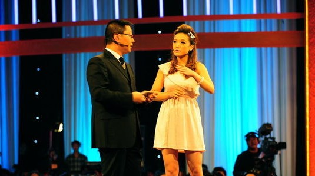
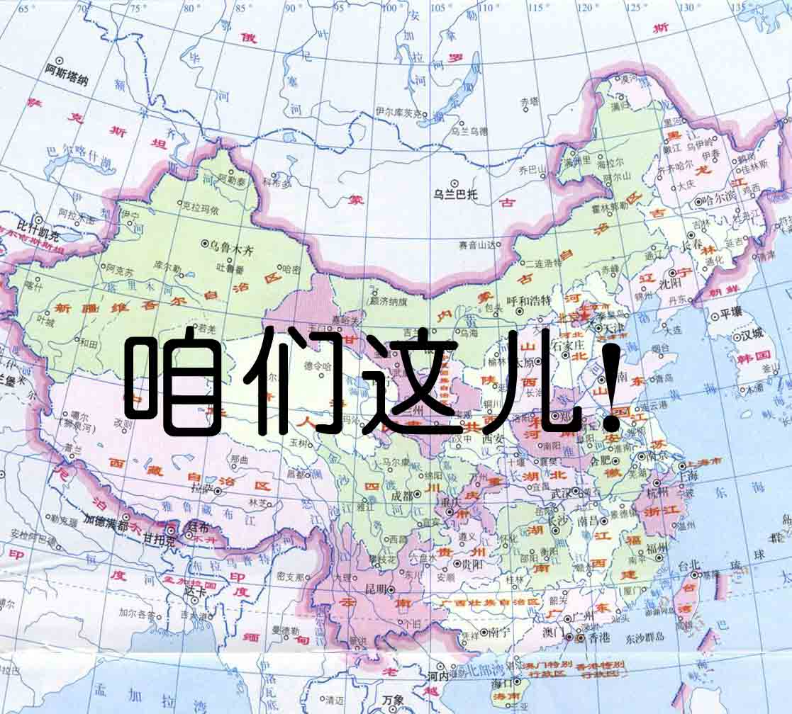

# ＜天枢＞是什么毁了一代中国人

**如果说文化大革命的时候毁掉的是一代人的知识、修养和文化，那么现在很有可能毁掉的是一代人的锐气、动力、和拥有梦想的能力及勇气。而如今的青年人多是将诸多问题都看透了，现实功利，从而没有了那种年轻人应有的冲动的狂想。而我觉得我们正需要正是这些，近几年来，可我发觉在特定的社会环境下要坚持自己最初的梦想很有可能需要付出很大的代价。所以现在的问题即是，到底还剩下多少敢这么去想的年轻人。**  

# 是什么毁了一代中国人

# —— 由“非你莫属”刘俐俐事件所引起的一切

## 文/花木兰（University of London）

 

由一个娱乐节目所引起的一场公愤让我一下子联想到了许多我一直在思考但是又时时想要去回避的问题。关于事情的来龙去脉，大家只要到微博上一找就能看到铺天盖地的视频和评论。网民的言论和当事人所做出的回应来自各个角度，有的有理，有的没理，有的比较文明，有的则过于粗鲁。已经被别人覆盖过的各种观点，还有一些非常经典的话题，例如由选手称呼 “我们这儿” 为“中国”而当众被张绍刚羞辱等等让人瞠目结舌的细节，我也不细说了。大家看过视频再看文章吧，光看刘俐俐的那一期还不行，因为我想论的已经远远不止这两方谁对谁错这么简单，而是这背后更加严重的一系列问题。建议大家也看一看有一集中有个叫吴铮真的女孩子。这两集一起看，非常有味道。相信如果你看过这两期，会对我下面想说的内容更有共鸣。也要注意控制情绪，因为很多人看完都会有一种想揍人的冲动。

看刘的时候，虽然心中有些气愤，但是因为刘的整体表现中也有失策和不对的地方，所以还能理智地说一句 “双方都有过错”， 那气也就忍下了。但是看完吴的那一期，我真是差点没把屏幕给砸了。如果说刘有的时候还会有些过分有些过于嚣张，但是吴这个小姑娘真的是非常非常诚恳地在说话，没有一点点攻击性，为什么她会有同样惨痛的经历？！说白了，这就是一档低档次低水准低眼界的节目，所以这整套节目的配件（主持人，boss团作为一个整体）也都是非常差的，非常不适合真正有才华有思想的年轻人。

我个人由这整件事情联想到了许多我们这个社会中存在的问题。

其一：枪打出头鸟，真正有能力有野心去改变这个社会或者拯救这个国家的人往往到最后会有点惨淡。在非你莫属这样的舞台上，只有委曲求全，低声下气，把自己弄得很谦虚很卑微，才能被认可，被支持。观众对这一点都看得真真切切。那些稍微有些个性的，稍微有些独立思考能力的，有激情，善于表现的人，却很容易遭到攻击。这样的节目，影射了我们国家在社会的各个阶层各种环境的一个通病，无论是一个有几十个学生的班级，还是一个有几百号人的公司集团，还是那个几千个人坐着开会、打瞌睡的人民大会堂。这个社会追求的是统一的标准，和谐结果，所以才会有这样的教育体制，所以才会缺少创新精神，才会更擅长于抄袭和伪造别人的产品而不是自己去创造品牌，所以全民参政永远都不可能实现。一排人站在一起，那个个子高的肯定要被剁掉两只脚，这就是问题。这是个几千年来不治的病。

其二：许多人缺少独立思考和判断的能力。很多人的评论都是在攻击主持人张绍刚，被情绪所控而忘记了他作为一个主持人的本职是最普遍的一个批评的角度。但是很多网友也注意到了现场boss团以及两位评论员没有能够及时地站出来挽救局面，说句理智一点的公道话。张的情绪，影响的不仅是他自己，更是一批人，这是整套节目策划的失败，也是所有参与者的失职。微博上出现的一个非常奇怪的现象就是在公众谩骂声一片的时候，这些CEO老板什么的才一个一个或直截了当或半遮半掩地出来说个抱歉，说是反复看了几次录像，才忽然觉得自己当时说的话有多愚蠢，问的问题有多不合适。说到底，他们在现场大多是糊涂的。如果说这么千千万万的观众一下子就能看到怒火冲天，他们再怎么蠢，好歹也是自己开个公司赚了点小钱的人，如果当真能清新地看着眼前发生的一切，怎么可能看不出来现场是一群自以为了不起的中年人集体在欺负小女孩。独立思考独立判断的能力的普遍匮乏，在一个小舞台上，能让一个小妹妹哭，在一个大社会环境下，能给一代人带来灾难。

其三：人与人之间没有最起码的尊重，倚老卖老太普遍。和西方相比，在中国，（也就是 “我们这儿”，你懂的）对长辈的尊敬向来是我们的优点。我觉得这是中国式教育下非常美好的一面。但是这里面有两个误区。一是：很多时候我们太轻易地会把一个人的年龄等同与TA的经验，等同于这个人说话的分量和相对的知识含量。我觉得这是错的。从一方面来说，我认为西方人应该学习我们东方人对比自己年龄大的人的那种礼貌和相让，但是从另一方面来说，我觉得我们在看到西方国家的一个爸爸蹲下来平视着只有3岁大的儿子，认真严肃地听他说话并一句一句地给予相应的回答的时候，也会觉得那是一个相当温馨的画面。只要你能发表出自己的意见，我就会和你很平等地交流下去，没有藐视，没有不屑一顾，没有 “我是过来人我肯定比你知道的多”，没有 “你个小孩子你能懂什么”。正是因为这样的一种态度，才更有可能青出于蓝甚于蓝，才更有可能后浪推前浪，我们才能进步得更快。第二个误区是，在中国，“顺从和谦虚的态度” 才是唯一被公认的对人表示尊重的方式，但是其实在很多适当的情况下专心听你的言论，在经过自己的独立的缜密的思考之后，诚恳地提出不同的意见，其实也是一种尊重，甚至是一种更加真诚的尊重。一味的同意是很简单就能做到的一件事，而如果我能讲出一些道理，才说明我是真正地在听你说话了，更重要的是我思考了，我费了脑力来衡量你说的每一个字。我认真对待了你的言论，这才是真正的尊重。

其四：中国的媒介尚未给自己定下一个最基本的道德指标，缺少对社会的责任心。媒体，从社会中吸取着素材，再把这些素材以各色的形式反转传播给社会，他们既是被动的接纳者，也是主动的引导者。媒体，会在无意间影响大众的思维。所以 “娱乐” 不应变成不讲究质量和水准的借口，因为你永远都不知道坐在电视机前的会是谁，这个谁又会在今后的社会中扮演怎样的角色。某些个媒介人以及媒介栏目的积极参与者，在如此公众的平台，怎能对自己的要求这么低，在如此公共的平台，不讲究其自身的质量？ 这其实就是一种不道德的表现，因为你真的不知道你的一句话，一个态度，一种言论，一份报道，一档节目，什么时候就会害了一群人。

其五：在中国，谁，才是真正的 “专家” ？！ 谁才是真正的权威？！我觉得整套节目的人物语言等等再可笑也没有放在那里的那12张龙椅来得可笑。某boss后来发微博居然说出了 “挑战权威” 这四个字当真不要脸，另一boss虽然是来道歉了，但是却把求职者形容为“弱势群体”，本想赎回点名声，结果又激起新一轮公愤。节目制作人把这么一排龙椅大张旗鼓地放在那里，必然认为这是非常能被观众认可甚至成为节目的卖点之一。很多其他国家也有许多的类似的含有思想交锋的娱乐性节目，但是如果你仔细地观察一下，就会发现这些节目当中很少有出现把评论员或者所谓 “专家” 的椅子做的那么夸张那么“奢华”，而且还放在比选手或者参与者海拔更高的位置从而刻意营造一种很有 “威信” 的感觉。“老师” 这两个字已经在中国被滥用了，什么人似乎都能被称做 “老师”，同样地，什么样的人都能被搁到一张龙椅上去，而电视上各种半斤八两的股票分析人正襟危坐大谈经济局势，各种卖这个药那个药的专家在那里放屁。真正有知识有能耐的人和那些装模作样的人，都被混合到了一起，所以才会有那么多的漏洞百出，那么多的啼笑皆非。中国的经济发展的速度，还有金钱作为这个社会对成功的唯一衡量标准，这两个因素放在一起，才会出现了那么多因为投机取巧，因为赶上了好时候把自己一下子拉到了社会高层的人士。但是这个国家需要的已经绝对不止 “发展经济” 这么简单的事情了，这个国家接下来20年要走的方向是过去的20年完全没有走过的。所以很多自封的专家根本就教不了这一代80后90后的年轻人他们到底应该怎样努力。我觉得在公平的环境下思辨过后呈现得出的有理的一方，才是权威，而从一个新的角度以新鲜的思想对这样的权威提出的合理的有价值的质疑，才能够称得上真正意义上的 “挑战权威”。在一个舞台上放几把漂亮的椅子，上面安上一批各种职业的中年人，然后叫上一个比他们小20岁左右的小朋友，一不小心这个小朋友提出了一些自己的想法不同于这些椅子上的人，这根本就不叫 “挑战权威”，因为这里面根本从一开始就没有 “权威”。

我觉得很多问题如果不快一点解决，很有可能会又耽误一代人。如果说文化大革命的时候毁掉的是一代人的知识、修养和文化，那么现在很有可能毁掉的是一代人的锐气、动力、和拥有梦想的能力及勇气。就好比台上那个一开始充满朝气和理想，自信而美好的吴同学，真心地叙说着自己想要报效祖国传递文化，结果却被主持人和boss团咄咄相逼，被一句 “你不要把什么都说得这么大，都是普通老百姓，小姑娘你扛不起”打压成了一个胆怯无比，再也不敢顶撞任何人，完全失去了自信哭哭啼啼的可怜的小女孩。我当时看了真的好愤怒啊，张绍刚你怎么就知道这个小女孩她和你一样会就变成一个‘普通老百姓该干嘛干嘛’呢？！你的平庸，根本不代表她也会和你一样平庸！说不定这个有梦想的小女孩就能做出一番大事业呢？ 如果我在现场我一定会冲上去大声告诉她说她没有做错任何事没有说错任何话，是这个舞台配不上她！我真希望节目的经历没有给她留下阴影，但她最后的那句“我现在觉得我还是回去做老师好了”听得我胆战心惊啊！张绍刚的疯言疯语和那帮乌合之众若当真把一个好端端的年轻人的梦想和志气给毁了，他们可还真的担当不起这样的责任！

有的时候会听周围的同龄人聊聊天，会惊诧于他们的现实，20多岁的年龄似乎已经把整个社会和它呈现出的诸多问题都看得那么透了，从而没有了那种年轻人应有的冲动的狂想。而我觉得，我们的社会，现在非常需要这样的冲动，这样的狂想。我自认为我还是个有些狂想的人，但我也不得不承认这几年来随着我分析能力的成熟，我也越来越意识到在特定的社会环境下要坚持自己最初的梦想很有可能需要付出很大的代价。我的感觉是周围有不少和我一样在这样困惑阶段的80后90后。不知道我的感觉对不对。

用乔布斯的一句话结尾吧，The people who are crazy enough to think they can change the world are the ones who do. 现在的问题是，到底还剩下多少敢这么去想的年轻人。

 

（采编：张希；责编：黄理罡）

 
