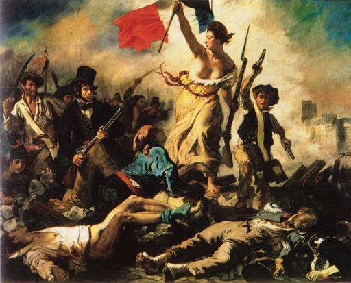
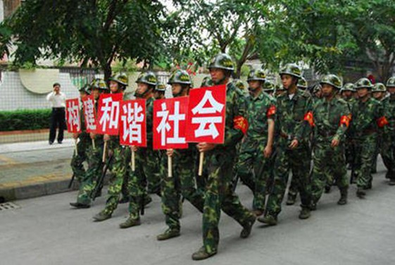
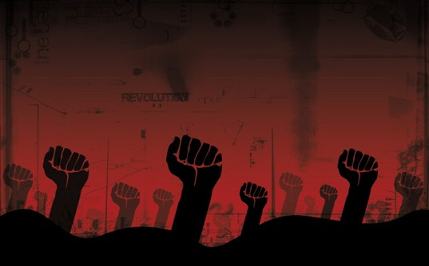

# ＜天枢＞暴不暴乱，可不是由知识分子说了算的

## 

据说，法国大革命前夜，听到远处喧闹的动乱声，路易十六惊异地问内臣：“亲，这是暴乱？”内臣回答到：“不，这是革命，亲。”

然而，我不认为这次增城的事情是革命，它也还是于建嵘所提及的群体性泄愤事件。不了解广东工业区情况的人不要意淫揣测放大上纲上线地将此事上升到革命的高度，更不要代表他人认为他们是在追求自由。他们可不是跟你们渴望自由的人是一道的。同时，左派的朋友也不要认为这是工人阶级反抗资本家和官方，本地人也不要认为这是外地人闹事组织起来报复，这只会让事态无法收场。

这个操蛋的体制和经济结构迟早会引发这类事件。我相信那个孕妇没死，甚至事件的起因的确是小事情，但之所以闹得这么大，就是这几十年来埋下的祸根。

你要是在广东广袤的制造业区待过就会马上意识到这次事件闹大是同乡会或者类似的社团的动员。事实上，工业区那边经常发生骚乱打群架集体斗殴，不同省份地区的帮派几百人规模打架的事情不过是家常便饭，零九年中，我一个工友家附近的集市就发生过两帮人几百人规模的斗殴。外地打工的一般都是同村同乡同县一起去的，互相之间都保持联系，这边有人说别欺负了消息立刻地传播出去传播过程中消息越传越玄于是便出现被打死人之类高度引爆情绪的歪曲信息，那么，短时间内动员几百人砸场子便出现了。

你要是在工业区生活过，就知道打工者对治安员多么深恶痛绝，他们就是穿制服的流氓，敲诈勒索横行欺市无所不及。由于警察编制有限和外来人口众多，所以镇村大量招募联防队等充当治安力量，但这群流氓不但维护不了治安反而不但与犯罪集团勾结更干起收保护费的勾当。在工业区的市场上，哪个商家没被勒索过？哪个企业主没孝敬过他们？正是因为他们平日里的为非作歹，这次才被借机泄愤大闹一场。

三十年的改革开放造就了一个混蛋的分配体制，经济发展的成果少部分人占了大头。在工业区，那个村委会不富得流油，一个主任能在澳门赌场上输掉上千万而面不改色，集体土地建厂房出租，个人盖楼以每间两百每月的价格出租给打工者，一般本地人一年轻松几十万上百万。可是，外来打工者一个月做六休一、一天十二小时的班封顶才两千五。巨大的贫富差距使得少数人铤而走险犯罪，特别是零八年经济危机为严重的时候，抢劫珠宝店抢劫汽车入室盗窃层出不穷，而安分守己的则将怨恨埋在心里，一有星火就引爆。

谁说中国没有贫民区？工业区广袤的出租屋就是。他们已经不可能回到故乡的农田里，要是户籍与分配体制不变，这次完了，他们的后代也会再闹。

而官方呢？一有事情就是高压态势。零八年末，很多工厂没单子了，老板直接跑路欠了工人薪水，工人准备散步，官方立刻出动人马殴打工人，在东莞某镇某工业区工人血洒大街。他妈的维稳就是不惜一切代价压下去不管人死活。这不是在制造暴乱的火种嘛。

打工者无依无靠忍受着屈辱多年，那么就像火山一样，就等着震动点燃了，这次事件是偶然引起的，但祸根早就埋下了。

不要一出事情就先验地认定一定是有人被城管或什么人打死，可怕的不是这个，可怕的是一点小事无论真相如何都引爆成大事，这说明仇恨已经到了何种地步，顺便有人喊一句打人了立刻就能动员成百上千人失去理智放弃平日里对制服的恐惧拼命发泄怨恨。更可怕的是，这种怨恨发泄得不到理性的控制和引导，必然变成一场打砸抢杀的“狂欢”，攻击目标从制服全面扩散到对无辜平民的无差别攻击，有些混蛋更是乘机抢劫打砸店铺，最终变成一场除了暴力弹压别无他法的大暴乱。而这不但得不到任何人的支持，反而深化了本地人与打工者的矛盾。原本不同工厂都有不招募不同省份人的潜规则，这些事件后，就会更加雪上加霜。

而这些人，有几个人听过知识分子的讲话？有几个人看南方周末？所以说革命也罢暴乱也罢，跟知识分子没个蛋关系。大家在校内蛋逼革命与改良切鼻什么表态纯属扯淡，就算大家达成共识，外面的世界该怎么还是怎么，因为他们不上校内也不读南方周末更不懂政治哲学也不知道革命和改良的后果是什么，他们只知道平日里的怨恨，有机会就发泄。而官方也不管你们要革命要改良扯来扯去有什么卵意义，只要出事就动手，就看动手及不及时手段够不够狠。

眼下就是双方比拼狠劲的时候，就是双方动员规模不断放大的时候，就是冲突规模不断升级的时候，没人听你们扯淡，你们也不要自作多情帮别人去想去表态，跟你们没个蛋关系，只能眼睁睁看着。

这个高压下原子化的社会下，理性的公共讨论空间不存在，体制下理性有良知的知识分子的声音最多传到校内，出了门，没人知道他们。不要以为你们的世界就等同于外面现实世界，外面世界，体制就是权力，民间就是由血缘同乡强人组成的网络，这样的局面，互相冲突就是迟早的事情。比如说利川事件，冉姓是大姓，族中受人尊敬的冉先生暴死官家，他的族人要是不大闹一场，他们的颜面何在？于是，动员起来的双方必然硬碰硬，跟革命与改良没有蛋关系，知识分子就根本只能是观众。

各位，不要自作多情了，撸撸睡吧，烽火遍地是迟早的事情，任何人都阻止不了的。完毕。

（采编：陈锴；责编：陈锴）

