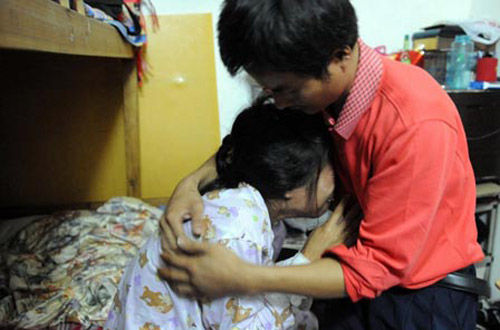
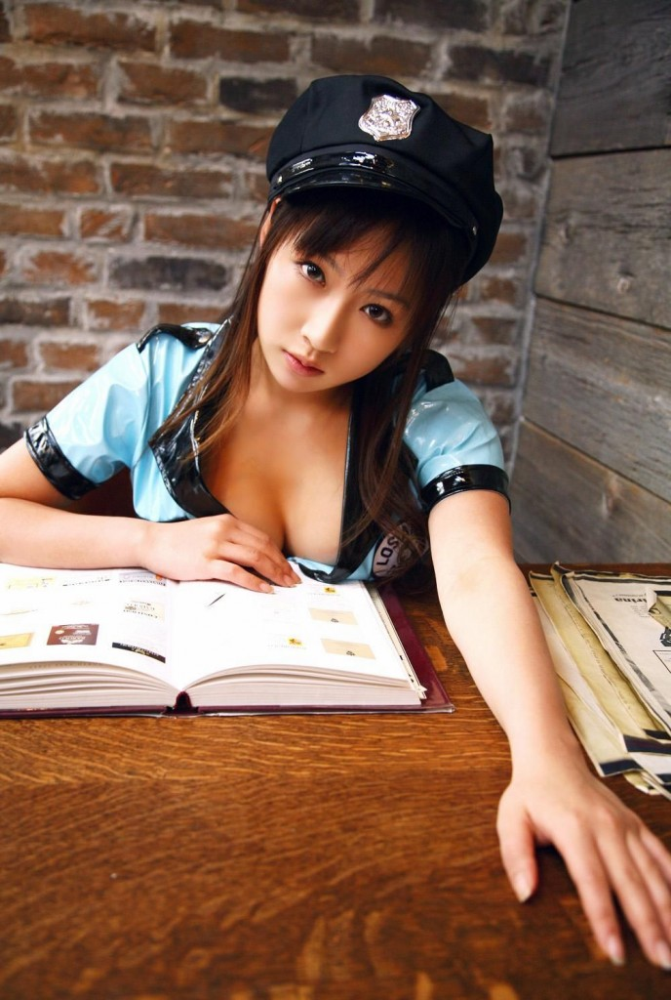
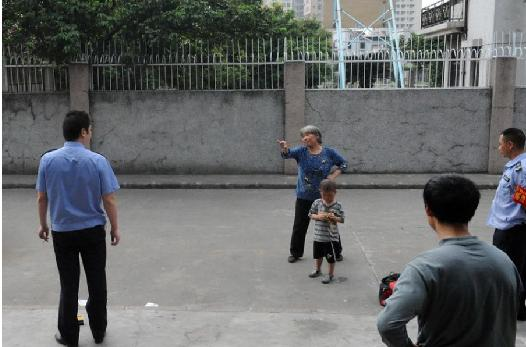

# ＜天枢＞曾经我也差点成为他

**我不是文字工作者，也不是思想家，实在没有能力负担这些思考，我只是想鼓起勇气告诉那些生活顺利、幸福的朋友们，有一些人，他们需要，但是从来没有得到过拯救，甚至他们的不幸，也成为被嘲笑和批判的谈资。这或许是比杀戮更残忍的事，这是折磨灵魂的地狱。**  

# 曾经我也差点成为他

## 文/[羊排.postgres](http://www.douban.com/people/March_Liu/)

 

我想你们都知道了深圳那个丈夫看着妻子当面被联防队员强奸的案子，不需要我再更多的复述。我只是想说一些你们有些人永远也不会有的体验的想法，一些我从来没有向任何人，包括我的妻子、父母和姐姐说过的话。

认识我的人都知道，我是一个有轻度残疾的人，长得不好看，也不强壮，也说不上有天份，那么，在一个远离大城市的，比较封闭的环境中长大时，不可避免的，我也被各种各样的“坏孩子”取笑过，欺负过。在漫长的成长过程中，我是一个弱小的，满怀不安全感的孩子。

虽然有时候跟小朋友打闹急了，会闹到父母或对方家长面前，但是真正被人欺负，例如面对坏孩子勒索的时候，很少有孩子会向自己的父母求援，特别是在十几岁，男孩子青春的灵魂开始懵懂地成长起来，能够自己解决自己的社交问题，似乎成了一个孩子起码的尊严底线。于是很多孩子都在面临同龄人的暴力和欺辱时，都选择了尽可能的沉默和忍受。我儿时有一个小几岁的朋友，他因为家里零用钱多，一度被敲诈和欺压到了很严重的程度，有一次我和他在一起时遇到有“坏孩子”找他，甚至还是我拉着他逃掉。据说他还有被拉进学校的厕所剥光了搜身，只是传言，但是这个传言我是在他同班同学的母亲那里听来，足够骇人听闻。

对于受害者本人，这是一种无法逃脱的处境，你躲得过一次，躲不过必然要去上学，要走进教室，要在一种不得不遵守的规范下暴露自己的危险，而大人是一种无法指望的力量。天知道，我那个朋友的父亲是厂区的书记，如果他真是一个时时会搬老爹出来的官二代倒好，恐怕那小屁孩的家长宁可打死混蛋儿子也不敢让他再去欺负长官的公子。

然而在那个别扭的年纪，我们决绝地将父母隔绝在了这场残酷的游戏之外，尽管这将我们置于绝望的境地，我自己也无法解释这种可笑的自尊和绝望。让父母去处理这样的事，似乎只面临有更可怕的羞辱和报复。

不知道我的那位朋友当年是怀着怎样的心情长大，他上大学之后我还见过他一次，那种结结巴巴，讲话不敢抬头看人的交往障碍，我想与那一段漫长可怕的成长不无关系。

想比之下，我倒真的不是被欺负得很严重，至少被“坏孩子”敲诈的次数寥寥无几，甚至一只手的手指都凑不全，像小说电影中那种残疾孩子被一群孩子围追取笑的境地，只有很小的时候遇过一次，邻居的哥哥见到，果断将我解救了出来。

然而我仍然成长为一个不善与人交际的孩子，在面临冲突甚至只是与人交际时，时常变得呆滞、胆怯或暴躁，不会正确地沟通。我不能说，与那个会在被子里偷偷流泪的成长岁月毫无关系。

是的，一个长期压抑的童年和少年时代，并不仅仅会导致极端的懦弱，还会有可能引发暴力倾向，我记得有一回有一个“坏”同学因为某事打骂了我以后，表面平静的我，在衣服里藏了一把螺丝刀，那是我当时能找到，并且不引人注意的带在身上的最危险的东西。

然而我最终没有使用它，再也没有过，尽管那之后我还遇到过被欺负，被敲诈，但是我内心中始终有一种信心和希望，我知道有一天我会靠自己的能力走出那个封闭偏僻的油田，会永远地告别这样的生活，成为一个完全不一样的人。我读的书，想的事，我感兴趣的东西，我的学习成绩，将我的内心和外面险恶的世界隔绝开，也在很大程度上保护了我。作为可以提供小抄的可靠来源，越到后来，班上的差生们越依赖我这种少数还有心念书的男孩子，我们不会像女生那种乖巧小气，而会主动地将少年们视为一个与师长对立的阵营，毫无愧疚地为他们提供作弊的机会。除了我这个情商低下、胆小又没有体育才能的残疾孩子，学习稍好一点的男生，都没有半点困难地和差生们——大多是所谓的“坏孩子”打成了一团，相对来说学习差又比较老实的男孩子，至少也能找到生存的空间。我们的青春，组成了一个与成人世界非常隔离的学校社会。

记得高中时有一次，恰恰是前面那个故事里的同学，将有学生敲诈我的事情告诉了我父亲，从此以后惹事的兄弟再也没有找过我——除了，有一次愁眉苦脸地向我抱怨我父亲知道了这件事，并且没有任何的威胁和敌意在里面。

是的，我父亲那时候是警察，在这样一个小社会里，警察还不是不良少年们胆敢冒犯的。但是，我像书记的儿子一样，从来没有想过要借助父亲的力量让自己过得安全一点。反而这样一个曾经被我视为敌人的人，用这样奇特的方式帮助了我。这件事，以及还有数次，他都非常主动地帮我从类似的困境中解脱，这让我现在以成人的智力来思考，也觉得有一点意外，当年如果我真的从压抑中爆发，或许除了给他造成人身上的伤害，更会让我走上一种完全不同的黑暗人生。或者少年时，我们，和他们之间的敌意，也多少有一些是学校和老师们用“好学生（乖的，学习好的）”和“坏学生”在无意中制造出来的。我不想责怪过去的师长，至少在这里不，那是另一个话题。

然而庆幸的是我终于选了一条至少不是最糟糕的人生道路，在远离童年的地方有了新的生活，用我自己的能力去创造属于自己的尊严。并且，努力克服成长的过程中那些不光明不正面的东西，虽然，我仍不满意自己的性格和交际能力，但至少我确实做到了童年时所期望的，远离那段可怕的岁月。当年视为莫大恐惧的孩子们，即使现在都是成年人的身份相遇，即使他们也成长为真正的坏人，我也足以用不屑和蔑视去面对。因为我的家人和我自己，这个广大的世界所开拓的生活，早不是那个圈子可以比拟的，不必在这里去讲一些空话，只说我现在，至少有充足的信心可以保护自己的生活，那个可怕的童年，已经彻底不会再来。

我更要庆幸有我的父母，在我们姐弟人生的起点，就引导我们走向一个与小伙伴们不同的道路，他们鼓励，甚至暗地里通过老师逼迫我去参加各种演讲、表演、写作和比赛活动，即使我是台上最可笑最笨拙的一个，至少在不断地强迫性地与人交际中，磨练出一付可以伪装和保护自己的外壳。让我认识到课本之外，还有真正的智慧、知识，有真理与美的世界，就算不能到达，至少可以走向一个完全不同的生活，而不是像我童年的伙伴们一样接过父辈的饭碗，在这个封闭的，我拼命想要逃离的小世界度过人生。

讲了这么多，我只是想说明，我没有成为你们都知道的那个故事的男主角，只是因为一些主动的努力和幸运，让我得到了足够的安全和信心。也因为自少年时，我就在那个未成年人的社会里，多少得到了自己的立足之地。

如果，我也像那个人一样，没有对未来的信心，没有成为“好学生”的本事，没有家庭的庇护，没有可以选择的道路，长大后没有一个有尊严的工作和社会，贫穷，绝望，仍然像童年一样处在任人欺负的绝望底层，甚至童年时欺负你的那些孩子长大了仍在你身边，像小时候抢走你的零用钱和尊严一样去掠夺你的生活。

那我会成为一个怎样的人？会像他一样只能在黑暗中哭泣吗？

如果没有那些对未来的期望和信心，我还会有勇气长大吗？我会走向一条暴力甚至毁灭的道路吗？

这一切没有发生，只是因为一些先天和后天的幸运。

面对他的惨事，我没有想要嘲笑或批判的心情，我没有那种优越感。

甚至我现在写这些东西的时候，都在犹豫这是否是一件正确的事，我没有勇气这样暴露自己的软弱，至少在我人生的前三十几年里，我不敢，为了这份胆怯，我，和其他很多孩子，甚至不敢向父母寻求保护。甚至现在看到自己的孩子成长，交际，玩耍，都在会担心他也成为被欺负的对象，担心他也养成任人欺负的软弱性格。我所庆幸的是，孩子比我开朗，比我胆大，他有一个男孩子应该拥有的内心，善良而不软弱，勇敢但不粗暴。虽然有时候担心他孩童式的胆小和羞怯来自我的遗传，但是我相信他会有比我好得多的人生。

那些最底层的弱者，他们有无力的童年，绝望的道路，即使成长起来，面对的是比儿时更残酷的人生，更黑暗更绝望的世界，我们是否有资格嘲笑他们的软弱？我们该维护一个怎样的世界，让孩子可以成长起来，让人可以健全、有尊严的生活？

我不是文字工作者，也不是思想家，实在没有能力负担这些思考，我只是想鼓起勇气告诉那些生活顺利、幸福的朋友们，有一些人，他们需要，但是从来没有得到过拯救，甚至他们的不幸，也成为被嘲笑和批判的谈资。这或许是比杀戮更残忍的事，这是折磨灵魂的地狱。

甚至在此刻，我仍在忐忑，我写这样的东西给你们看，会不会给我希望保护的家人和生活，带来破坏和伤害，希望你们理解一个成长并不健全的人，所抱有的忧虑和怯懦。这是我第一次向别人谈及我成长中的那些事，我不知道会带来什么。

 文章来源：http://www.douban.com/note/183402187/  

（采编：宋晓慧；责编：黄理罡）

 
